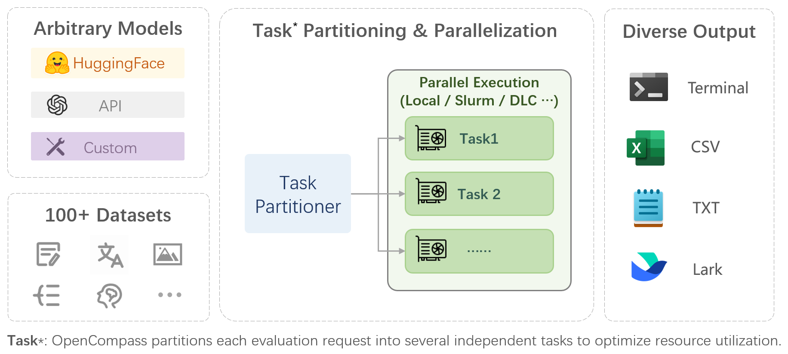

# OpenCompass Tutorial

Github Repo:

https://github.com/open-compass/opencompass/

## Introduction



OpenCompass is a one-stop platform for large model evaluation, aiming to provide a fair, open, and reproducible benchmark for large model evaluation. Its main features include:

- Comprehensive support for models and datasets: Pre-support for 20+ HuggingFace and API models, a model evaluation scheme of 70+ datasets with about 400,000 questions, comprehensively evaluating the capabilities of the models in five dimensions.

- Efficient distributed evaluation: One line command to implement task division and distributed evaluation, completing the full evaluation of billion-scale models in just a few hours.

- Diversified evaluation paradigms: Support for zero-shot, few-shot, and chain-of-thought evaluations, combined with standard or dialogue-type prompt templates, to easily stimulate the maximum performance of various models.

- Modular design with high extensibility: Want to add new models or datasets, customize an advanced task division strategy, or even support a new cluster management system? Everything about OpenCompass can be easily expanded!

- Experiment management and reporting mechanism: Use config files to fully record each experiment, and support real-time reporting of results.

In a nutshell, OpenCompass supports the evaluation of most mainstream large models on mainstream benchmarks, and it is very convenient to configure and run evaluations on multiple datasets across multiple models with just one click.

## QuickStart

The evaluation of OpenCompass depends on the configuration file, which includes the model section and the dataset (i.e., benchmark) section. Below, I will explain with an example.

In [`configs/eval_chat_demo.py`](https://github.com/open-compass/opencompass/blob/main/configs/eval_chat_demo.py), it shows:

```python
from mmengine.config import read_base

with read_base():
    from .datasets.demo.demo_gsm8k_chat_gen import gsm8k_datasets
    from .datasets.demo.demo_math_chat_gen import math_datasets
    from .models.qwen.hf_qwen2_1_5b_instruct import models as hf_qwen2_1_5b_instruct_models
    from .models.hf_internlm.hf_internlm2_chat_1_8b import models as hf_internlm2_chat_1_8b_models

datasets = gsm8k_datasets + math_datasets
models = hf_qwen2_1_5b_instruct_models + hf_internlm2_chat_1_8b_models
```

This means the BenchMarks are gsm8k_datasets and math_datasets, and the models are hf_qwen2_1_5b_instruct_models and hf_internlm2_chat_1_8b_models.

For the detailed configurations, you can look up in `configs/datasets` and `configs/models` for full information about this.

For example, in `configs/models/qwen/hf_qwen2_1_5b_instruct.py`:

```python
from opencompass.models import HuggingFacewithChatTemplate

models = [
    dict(
        type=HuggingFacewithChatTemplate,
        abbr='qwen2-1.5b-instruct-hf',
        path='Qwen/Qwen2-1.5B-Instruct',
        max_out_len=1024,
        batch_size=8,
        run_cfg=dict(num_gpus=1),
    )
]
```

It shows the model name, model path, max_out_len, inference batch size and gpu_nums.

You can modify the config as you want.

And you can run OpenCompass with only one command: `python run.py configs/eval_demo.py -w outputs/demo --debug`

This will run the `configs/eval_demo.py` config file, and the outputs will be put in `outputs/demo`

You can change the config to change the BenchMarks and the models. It is very simple to use.

For more detailed document, you can click [official doc](https://opencompass.readthedocs.io/).