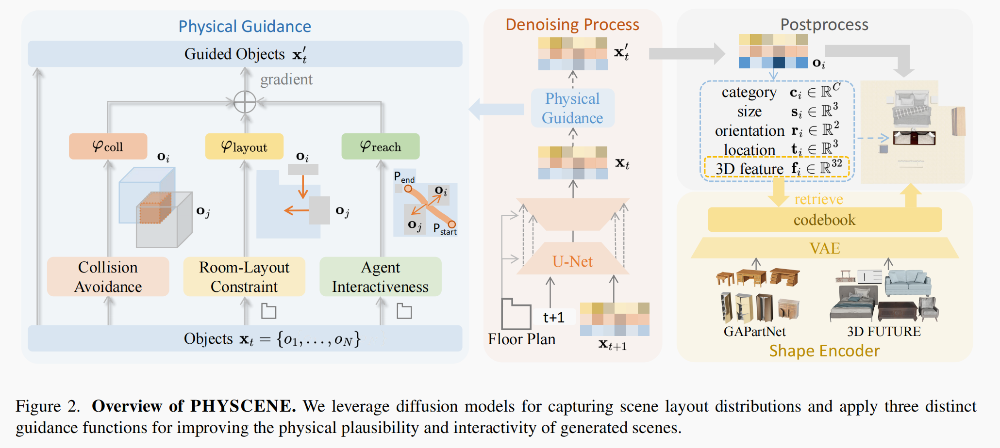
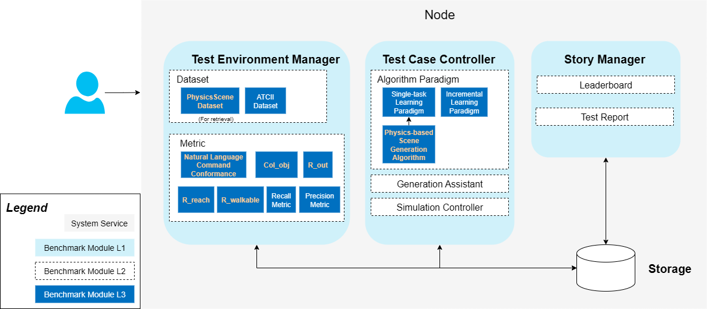

<<<<<<< HEAD
# Proposal: Physically Consistent and Interactable Indoor Simulation Scene Generation: Implementation Based on KubeEdge-Ianvs

## Introduction / Motivation

The advancement of Embodied AI is deeply intertwined with the quality and scale of simulation environments. Foundational works like ProcTHOR have addressed the need for large-scale, diverse datasets. However, a significant sim-to-real gap persists in physical fidelity. As pointed out by recent research like PhyScene, the physical plausibility and rich interactivity of scenes have been largely left unexplored by prior methods.

This gap becomes critical when training agents for complex manipulation tasks. For instance, when a robotic arm opens a cabinet, the door should rotate correctly around its hinge without passing through other objects, and there must be sufficient collision-free space for the interaction to occur. Modeling these physical interactions for articulated objects at scale remains a key challenge. This project aims to address this by proposing a novel pipeline for generating scenes that are not only visually diverse but are fundamentally physically consistent for interaction. We will leverage the KubeEdge-Ianvs framework to build a standardized benchmark for this new class of scene generation.

## Goals

This project is committed to building a comprehensive benchmarking solution for physics-based interactive scene generation within the KubeEdge-Ianvs framework. The primary goals are:

- Based on the Ianvs single-task learning paradigm, integrate an embodied intelligence model to implement a baseline algorithm for generating physically consistent simulation scenes. This baseline will support the annotation, feedback modeling, and interactive simulation of various physical attributes in indoor environments to meet the training needs of embodied AI.

- Develop a Data Format Compliance-check Algorithm: Implement an algorithm to validate the data format of the generated physical scenes, ensuring consistency and standardization.

- Provide a Standardized Test Suite: Deliver a standardized test suite for evaluating the physical consistency of simulations. This includes simulation datasets with articulated object annotations, evaluation metrics, and test scripts to support reproducible testing within the Ianvs framework.


## Proposal

To achieve the above goals, we propose an innovative two-stage generative framework that fuses ideas in language-guided and physics-guided synthesis. This framework is designed to be fully integrated and benchmarked within Ianvs.

- **Stage 1: HOLODECK-inspired Scene Planning and Definition:** We will first leverage a Large Language Model (LLM) for high-level creative and planning tasks. The LLM will interpret natural language prompts, generating a structured scene plan. This plan will include the room layout, a list of required objects, their spatial relationships, and, crucially, high-level tags for their physical properties. This stage is responsible for the "what" and "where" of the scene.

- **Stage 2: PhyScene-inspired Physical Realization and Optimization:** This stage takes the structured plan from Stage 1 as input and is responsible for the "how" of physical interaction. Drawing heavily from PhyScene's core principles, a physics-guided generative model will synthesize the final 3D scene. This model will not just place objects but will actively use guidance functions to enforce physical constraints. It will refine the initial layout to ensure collision avoidance, agent reachability, and, most importantly, that the interactive behaviors are physically plausible.

- Advanced Goals: While our primary focus is on articulated objects, this framework is designed with extensibility in mind. Future work could involve incorporating more complex physical phenomena such as soft-body deformation, haptic feedback, and thermal properties, with each representing a potential independent research direction.


## Design Details

### 1. Overall Architecture, Dataflow and Data Format

Our system is designed as a clear pipeline, passing data from the high-level planner to the low-level physics realizer. A user first provides a natural language prompt, which then flows through the two main stages:

------

**Stage 1 - LLM Planner (HOLODECK-inspired)**

- **Description:** The prompt is parsed into a structured Scene Plan. This plan is a preliminary JSON file containing not only the room's floor plan but also a list of requested objects with high-level physical tags. This stage defines both the environment and the entities within it.

  - **Example Input (Natural Language Prompt):**

    > "Design a kitchen with blue marble tile flooring. It should have a microwave and a refrigerator that can be opened."

  - **Example Output (Structured Scene Plan - JSON):**

    
    ```json
    {
      "floor_plan": {
        "room_type": "kitchen",
        "floor_material": "blue marble tile",
        "wall_material": "white plaster",
        "vertices": [[0,0], [0,5], [6,5], [6,0]]
      },
      "object_list": [
        {
          "class_name": "microwave",
          "tags": ["static"]
        },
        {
          "class_name": "refrigerator",
          "tags": ["articulated"]
        }
      ]
    }
    ```
    
------

**Stage 2 - Physics-Guided Generator (PhyScene-inspired)**

- **Description:** This module takes the **Structured Scene Plan** from Stage 1 as a condition. It iterates through the `object_list`, generating the detailed abstract representation `[ci, si, ri, ti, fi]` for each object.

  - **`cᵢ` (Category)**: A semantic label  `cᵢ ∈ ℝᶜ` representing the object's category out of C total classes.

  - **`sᵢ` (Size)**: The 3D size `sᵢ ∈ ℝ³` representing the dimensions of the object's bounding box.

  - **`rᵢ` (Orientation)**: The 2D orientation `rᵢ = (cosθᵢ, sinθᵢ) ∈ ℝ²` representing the object's rotation angle θi on the floor plan.

  - **`tᵢ` (Location)**: The 3D location `tᵢ ∈ ℝ³` representing the x, y, z coordinates of the object's center.

  - **`fᵢ` (Feature)**: A latent 3D shape feature `fᵢ ∈ ℝ³²` encoded from the object's geometry using a Variational Auto-Encoder. This key feature is used to retrieve the best-matching visual asset from libraries like GAPartNet or 3D-FUTURE, which is especially critical for finding appropriate articulated objects.

  The entire process of placing these retrieved objects is actively guided by physics-based constraints to optimize the final layout. The core of this stage is a guided diffusion model, whose architecture is inspired by the PhyScene framework as illustrated in the figure below.

  

  - **Example Input (Structured Scene Plan from Stage 1):**

    > The JSON output from Stage 1.

  - **Example Output (Final Scene Representation - JSON):**

    ```json
    {
      "scene_objects": [
        {
          "class_name": "microwave",
          "asset_url": "objaverse/models/microwave_24.obj",
          "position": [1.5, 0.9, 2.0],
          "rotation": [0, 0, 0, 1]
        },
        {
          "class_name": "refrigerator",
          "asset_url": "gapartnet/models/refrigerator_model_45.urdf",
          "position": [4.0, 0.0, 2.5],
          "rotation": [0, 0, 0, 1],
          "kinematic_properties": {
             "parts": [{"part_name": "door", "joint_type": "revolute", ...}]
          }
        }
      ]
    }
    ```

-----

The final scene, represented by this structured list of objects, is then ready for asset retrieval and rendering in a physics simulator. The entire pipeline is wrapped as a single algorithm within Ianvs for standardized benchmarking.

### 2. Benchmarking Objectives and Metrics for Ianvs

The direct object of this benchmark is the **comparative evaluation of different scene generation algorithms' performance**. The deliverable is both the benchmarking framework and the first data-driven analysis of how state-of-the-art models perform on the new task of generating physically consistent, interactable scenes.

To provide a holistic evaluation, we will implement a multi-faceted suite of metrics within Ianvs, assessing semantic correctness, physical plausibility, and visual quality.

**A) Semantic Conformance Metric**

- **`Natural Language Command Conformance`**: This metric will evaluate how faithfully the generated scene adheres to the user's initial natural language command. We will pioneer an automated approach by using a powerful Large Language Mode as an automated judge. The initial text prompt and a rendered top-down image of the generated scene will be fed to the LLM, which will be prompted to provide a score (e.g., 1-10) on how well the scene matches the description.

**B) Physical Plausibility Metrics**

These metrics, inspired by the evaluation framework in PhyScene, provide an objective, low-level assessment of the scene's physical correctness.

- **`Col_obj` (Object Collision Rate)**: The percentage of objects in the scene that collide or interpenetrate with at least one other object. A lower score is better.

- **`R_out` (Out-of-Bound Rate)**: The percentage of objects placed outside the boundaries of the specified floor plan. A lower score is better.

- **`R_reach` (Object Reachability Rate)**: The percentage of objects in the scene that are reachable by a standard-sized agent starting from a random valid position. A higher score is better.

- **`R_walkable` (Walkable Space Ratio)**: The ratio of the largest connected walkable area over all walkable areas in the room. This measures scene fragmentation. A higher score is better.


### 3. Integration with Ianvs Architecture

To realize the goals of this project, we will extend the Ianvs framework by introducing new, specialized modules.



- Test Environment Manager (Major Contribution Area): This is where the foundation of our benchmark will be built. In this L1 service, we will add new L3 modules:

  - **New L3 Dataset Module:** We will create a new type of Dataset module named `PhysicsSceneDataset`. This module will be responsible for the lifecycle management of our new dataset. Specifically, it will handle the automatic download, integrity verification, and local caching of the dataset from its official hosting location on the KubeEdge Kaggle profile.

  - **New L3 Metric Module:** We will implement the comprehensive suite of metrics defined in the previous section as new `Metric` modules. This includes the primary **`Natural Language Command Conformance`** metric, as well as the full suite of physical plausibility metrics such as **`Col_obj`**, **`R_out`**, **`R_reach`** and **`R_walkable`**. By encapsulating these evaluations as distinct L3 modules, we enable Ianvs to systematically and automatically assess the quality of generated scenes from both a semantic and a physical perspective.

- Test Case Controller: This is where our generative algorithm will reside. We will add a new L3 module to this L1 service:

  - **New L3 Algorithm Module:** Our entire two-stage generation pipeline (LLM Interpreter + Physics-Guided Generator) will be implemented as a new algorithm under the Single-task Learning paradigm. From the perspective of Ianvs, it is a single "black box" that takes a task definition and outputs a scene to be evaluated.

- Story Manager (No Direct Changes Needed): This module will automatically use our new components. It will be able to generate new kinds of test reports and leaderboards that rank scene generation algorithms based on their physical fidelity, showcasing the results of our new metrics.


### 4. Project Folder Structure

Our project contributions will be organized into the following folder structure.

```
ianvs/
└── examples/
    └── phys_scene_gen/
        └── singletask_learning_bench/
            ├── testalgorithms/
            │   └── scene_generation/
            │       ├── __init__.py
            │       └── two_stage_generator.py      # <-- Core L3 Algorithm Module
            │
            ├── testenv/
            │   ├── dataset/
            │   │   └── articulated_scene_dataset/  # <-- Scripts to download the full dataset
            │   │       └── ...
            │   └── metrics/
            │       ├── __init__.py
            │       ├── semantic_conformance.py     # <-- Semantic Conformance Metric
            │       └── physical_plausibility.py    # <-- Physical Plausibility Metrics
            │
            ├── benchmarkingjob.yaml                # <-- Core config file for the benchmark job
            └── README.md                           # <-- Detailed documentation for this example
```

## Roadmap

The project plan is structured to methodically follow the advised research and development process. The project is planned to be completed over three months, from July to September 2025.

- **July 2025: Literature Review and Framework Familiarization**

  - Task 1: Conduct an in-depth review of core literature (HOLODECK, PhyScene), focusing on the pipeline integration strategy.

  - Task 2: Gain proficiency with the Ianvs framework by reproducing an official single-task learning example.

- **August 2025: Prototyping and Core Module Development**
  
  - Task 1: Develop the Stage 1 MVP: An LLM-based planner that generates a structured scene plan with physical tags.
  - Task 2: Develop the Stage 2 MVP: A core physics-guided generator that takes the scene plan and synthesizes a simple scene, focusing on implementing the core guidance functions.
  - Task 3: Integrate the Stage 1 and Stage 2 modules into a seamless pipeline.
  
- **September 2025: Full Feature Integration and Final Delivery**
  - Task 1: Implement the full suite of physical consistency metrics as new modules within the Ianvs architecture.
  
  - Task 2: Conduct comprehensive benchmarking experiments using the complete test suite in Ianvs.
  
  - Task 3: Prepare, document, and publish the final `PhysicsSceneDataset` to the KubeEdge Kaggle profile.
  
  - Task 4: Prepare and submit the final project report, code, and Pull Request to the KubeEdge community.
=======
version https://git-lfs.github.com/spec/v1
oid sha256:0b445c3fea9e1684dbdc0d5d7e3c550058dc3a65c24ea9f03e309fba68bab471
size 14275
>>>>>>> 9676c3e (ya toh aar ya toh par)
