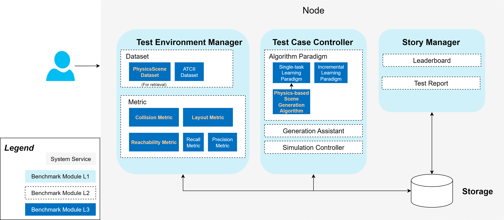

### **Proposal: Physically Consistent and Interactable Indoor Simulation Scene Generation: Implementation Based on KubeEdge-Ianvs**


#### **Introduction / Motivation**

The advancement of Embodied AI is deeply intertwined with the quality and scale of simulation environments. Foundational works like ProcTHOR have addressed the need for large-scale, diverse datasets. However, a significant sim-to-real gap persists in physical fidelity. As pointed out by recent research like PhyScene, the physical plausibility and rich interactivity of scenes have been largely left unexplored by prior methods.

This gap becomes critical when training agents for complex manipulation tasks. For instance, when a robotic arm opens a cabinet, the door should rotate correctly around its hinge without passing through other objects, and there must be sufficient collision-free space for the interaction to occur. Modeling these physical interactions for articulated objects at scale remains a key challenge. This project aims to address this by proposing a novel pipeline for generating scenes that are not only visually diverse but are fundamentally physically consistent for interaction. We will leverage the KubeEdge-Ianvs framework to build a standardized benchmark for this new class of scene generation.


#### **Goals**

This project is committed to building a comprehensive benchmarking solution for physics-based interactive scene generation within the KubeEdge-Ianvs framework. The primary goals are:

- Based on the Ianvs single-task learning paradigm, integrate an embodied intelligence model to implement a baseline algorithm for generating physically consistent simulation scenes. This baseline will support the annotation, feedback modeling, and interactive simulation of various physical attributes in indoor environments to meet the training needs of embodied AI.

- Develop a Data Format Compliance-check Algorithm: Implement an algorithm to validate the data format of the generated physical scenes, ensuring consistency and standardization.

- Provide a Standardized Test Suite: Deliver a standardized test suite for evaluating the physical consistency of simulations. This includes simulation datasets with articulated object annotations, evaluation metrics, and test scripts to support reproducible testing within the Ianvs framework.


#### **Proposal**

To achieve the above goals, we propose an innovative two-stage generative framework that fuses ideas in language-guided and physics-guided synthesis. This framework is designed to be fully integrated and benchmarked within Ianvs.

- **Stage 1: HOLODECK-inspired Scene Planning and Definition:** We will first leverage a Large Language Model (LLM) for high-level creative and planning tasks. The LLM will interpret natural language prompts, generating a structured scene plan. This plan will include the room layout, a list of required objects, their spatial relationships, and, crucially, high-level tags for their physical properties. This stage is responsible for the "what" and "where" of the scene.

- **Stage 2: PhyScene-inspired Physical Realization and Optimization:** This stage takes the structured plan from Stage 1 as input and is responsible for the "how" of physical interaction. Drawing heavily from PhyScene's core principles, a physics-guided generative model will synthesize the final 3D scene. This model will not just place objects but will actively use guidance functions to enforce physical constraints. It will refine the initial layout to ensure collision avoidance, agent reachability, and, most importantly, that the interactive behaviors are physically plausible.

- Advanced Goals: While our primary focus is on articulated objects, this framework is designed with extensibility in mind. Future work could involve incorporating more complex physical phenomena such as soft-body deformation, haptic feedback, and thermal properties, with each representing a potential independent research direction.


#### **Design Details**

##### **1. Overall Architecture, Dataflow and Data Format**

Our system is designed as a clear pipeline, passing data from the high-level planner to the low-level physics realizer. A user first provides a natural language prompt, which then flows through the two main stages:

------

**Stage 1 - LLM Planner (HOLODECK-inspired)**

- **Description:** The prompt is parsed into a structured **Scene Plan**. This plan is a preliminary JSON file containing not only the room's floor plan but also a **list of requested objects** with high-level physical tags. This stage defines both the environment and the entities within it.

  - **Example Input (Natural Language Prompt):**

    > "Design a kitchen with blue marble tile flooring. It should have a microwave and a refrigerator that can be opened."

  - **Example Output (Structured Scene Plan - JSON):**

    JSON

    ```
    {
      "floor_plan": {
        "room_type": "kitchen",
        "floor_material": "blue marble tile",
        "wall_material": "white plaster",
        "vertices": [[0,0], [0,5], [6,5], [6,0]]
      },
      "object_list": [
        {
          "class_name": "microwave",
          "tags": ["static"]
        },
        {
          "class_name": "refrigerator",
          "tags": ["articulated"]
        }
      ]
    }
    ```


------

**Stage 2 - Physics-Guided Generator (PhyScene-inspired)**

- **Description:** This module takes the structured **Scene Plan** from Stage 1 as a condition. It iterates through the `object_list`, generating the detailed abstract representation `[ci, si, ri, ti, fi]` for each object. It then uses the crucial 3D shape feature (`fi`) to retrieve the best-matching asset from a kinematic dataset (e.g., GAPartNet). The entire process of placing these retrieved objects is actively guided by physics-based constraints to optimize the final layout.

  - **Example Input (Structured Scene Plan from Stage 1):**

    > The richer JSON output from Stage 1, containing both `floor_plan` and `object_list`.

  - **Example Output (Final Scene Representation - JSON):**

    JSON

    ```
    {
      "scene_objects": [
        {
          "class_name": "microwave",
          "asset_url": "objaverse/models/microwave_24.obj",
          "position": [1.5, 0.9, 2.0],
          "rotation": [0, 0, 0, 1]
        },
        {
          "class_name": "refrigerator",
          "asset_url": "gapartnet/models/refrigerator_model_45.urdf",
          "position": [4.0, 0.0, 2.5],
          "rotation": [0, 0, 0, 1],
          "kinematic_properties": {
             "parts": [{"part_name": "door", "joint_type": "revolute", ...}]
          }
        }
      ]
    }
    ```

-----

The final scene, represented by this structured list of objects, is then ready for asset retrieval and rendering in a physics simulator. The entire pipeline is wrapped as a single **Algorithm** within Ianvs for standardized benchmarking.


##### **2. Physics-Guided Generation and Consistency Metrics**

Our generation model will be guided by functions (φ) that penalize physically implausible states, a technique proven effective by PhyScene. For articulated objects, this involves using expanded bounding boxes that account for the full range of motion of their parts.

To ensure the generated scenes are not just visually plausible but functionally viable, our model's generation process will be actively steered by three critical physics-based guidance functions.

- **Collision Avoidance (φ_coll):** At its core, this function prevents objects from occupying the same space. For static objects, this is a straightforward check of their bounding boxes. However, for interactive scenes, this is insufficient. Our critical expansion is to compute and use a "Dynamic Interaction Volume" for each object. This volume represents the full spatial footprint of an object throughout its entire range of motion or potential deformation. For an articulated object like a cabinet, this volume includes the space swept by its doors and drawers as they swing or slide to their maximum limit. For a deformable object like a cushion, this volume represents its shape under a standard simulated load. The guidance function will penalize any layout where these dynamic volumes intersect, thus preventing scenarios where a drawer cannot be fully opened because it hits a table, or a chair is placed so close to a sofa that the cushions would clip through each other when used.

- **Room-Layout Constraints (φ_layout):** This function ensures that all objects are contained within the geometric boundaries of the room. The standard approach simply prevents an object's base from being placed outside the floor plan. Our expansion applies this constraint to the object's entire Dynamic Interaction Volume. This is crucial for object placement near walls and corners. For example, a cabinet might be placed correctly within the room, but if it's too close to a perpendicular wall, its door might swing open and clip through that wall. Our guidance function will detect this future impossibility by checking if the door's "swept volume" stays within the room's boundaries, thus forcing the model to place the cabinet with enough clearance for its door to be fully functional.

- **Agent Reachability & Interaction Feasibility (φ_reach):** Standard reachability ensures there is a clear, navigable path for an AI agent to approach an object. We extend this concept to Interaction Feasibility. It's not enough to simply *get to* an object; the agent must have sufficient collision-free space to perform the interaction. Our expanded guidance will verify this by simulating a required "Interaction Zone". This zone is a compound volume that includes not only the space occupied by the agent itself but also the space required for its limbs to move and the space occupied by the object's moving parts. For instance, to open a refrigerator, the agent needs space to stand in front of it, and the refrigerator door needs space to swing open *without hitting the agent*. The φ_reach function will penalize layouts where the "Interaction Zone" is obstructed, ensuring that every interactive object is not just reachable, but genuinely and practically usable by an embodied agent.

  

**Consistency Metrics for Ianvs**

To evaluate the performance of our generative algorithm, we will implement a suite of metrics within the Ianvs framework. These metrics assess the final generated scene from a semantic perspective.

- **Natural Language Command Conformance:** This primary metric will evaluate how faithfully the generated scene adheres to the user's initial natural language command. It will holistically assess whether the scene's content, style, and object arrangement correctly reflect the user's intent. This serves as a top-level evaluation of the entire pipeline's effectiveness, especially the Stage 1 LLM planner.

  

##### **3. Integration with Ianvs Architecture

To realize the goals of this project, we will extend the Ianvs framework by introducing new, specialized modules.



- Test Environment Manager (Major Contribution Area): This is where the foundation of our benchmark will be built. In this L1 service, we will add new L3 modules:

  - New L3 Dataset Module: We will create a new type of Dataset module named PhysicsSceneDataset. This module will be designed to load and parse datasets containing articulated object information, such as GAPartNet.

  - New L3 Metric Module (Advanced Goals): We will implement our novel physical consistency metrics (e.g., JointStateAccuracy, InteractionSpaceFeasibility) as new Metric modules. This allows Ianvs to evaluate the physical realism of interactive scenes.

- Test Case Controller: This is where our generative algorithm will reside. We will add a new L3 module to this L1 service:

  - New L3 Algorithm Module: Our entire two-stage generation pipeline (LLM Interpreter + Physics-Guided Generator) will be implemented as a new algorithm under the Single-task Learning paradigm. From the perspective of Ianvs, it is a single "black box" that takes a task definition and outputs a scene to be evaluated.

- Story Manager (No Direct Changes Needed): This module will automatically use our new components. It will be able to generate new kinds of test reports and leaderboards that rank scene generation algorithms based on their physical fidelity, showcasing the results of our new metrics.


##### **4. Project Folder Structure**

Our project contributions will be organized into the following folder structure.

```
physically-consistent-and-interactable-indoor-simulation-scene-generation/
├── algorithms/
│   └── single_task/
│       └── scene_generation/
│           ├── __init__.py
│           └── physics_based_scene_generative_algorithm.py   # <-- Core L3 Algorithm Module
│
├── metrics/
│   ├── precision_recall.py                         # <-- Semantic Conformance Metrics
│   ├── collision_rate.py                           # <-- Physical Plausibility Metric
│   └── physical_stability.py                       # <-- Physical Plausibility Metric
│
└── examples/
    └── physics_scene_generation/
        ├── articulated_scene_dataset/              # <-- For test data
        │   └── ...
        └── testcase.yaml                           # <-- Defines the benchmark task
```


#### **Roadmap**

The project plan is structured to methodically follow the advised research and development process. The project is planned to be completed over three months, from July to September 2025.

- **July 2025: Literature Review and Framework Familiarization**

  - Task 1: Conduct an in-depth review of core literature (HOLODECK, PhyScene), focusing on the pipeline integration strategy.

  - Task 2: Gain proficiency with the Ianvs framework by reproducing an official single-task learning example.

- **August 2025: Prototyping and Core Module Development**

  - Task 1: Develop the Stage 1 MVP: An LLM-based planner that generates a structured scene plan with physical tags.

  - Task 2: Develop the Stage 2 MVP: A core physics-guided generator that takes the scene plan and synthesizes a simple scene, focusing on implementing the core guidance functions.

  - Task 3: Integrate the Stage 1 and Stage 2 modules into a seamless pipeline.

- **September 2025: Full Feature Integration and Final Delivery**

  - Task 1: Implement the full suite of physical consistency metrics as new modules within the Ianvs architecture.

  - Task 2: Conduct comprehensive benchmarking experiments using the complete test suite in Ianvs.

  - Task 3: Prepare and submit the final project report, code, and Pull Request to the KubeEdge community.
