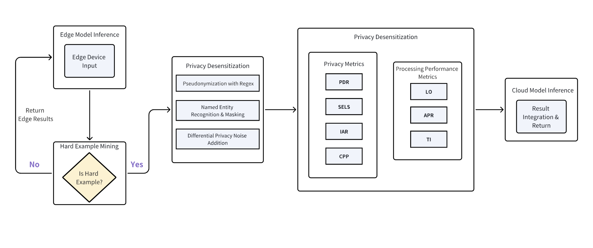
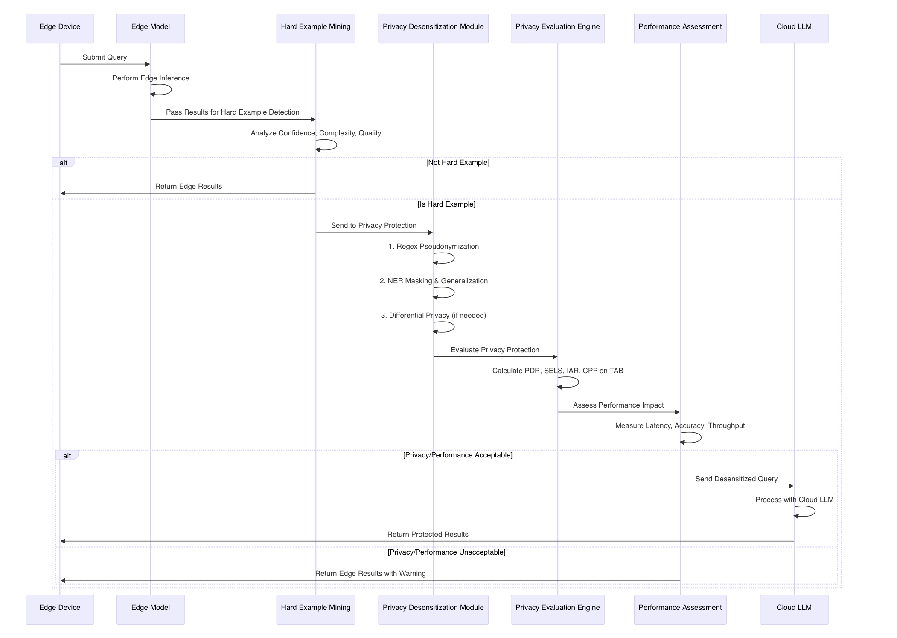

# Privacy-Aware Cloud-Edge Collaborative LLM Inference Framework with Adaptive Privacy Protection

## 1. Project Background

The deployment of Large Language Models (LLMs) across cloud-edge architectures presents critical privacy challenges that require systematic protection mechanisms. Current approaches lack comprehensive privacy evaluation and adaptive protection strategies:

- **Insufficient Edge-First Privacy Processing**: Existing frameworks lack intelligent decision mechanisms to determine when edge processing is sufficient versus when cloud assistance is necessary, missing opportunities for privacy-preserving local inference.
- **Limited Privacy Desensitization Methods**: Current systems employ basic anonymization techniques without a comprehensive evaluation of their effectiveness or impact on model utility and processing efficiency.
- **Absence of Multi-Dimensional Privacy Evaluation**: There is a lack of systematic metrics to assess both direct privacy leakage (explicit sensitive information) and indirect privacy inference risks across different desensitization methods.
- **Performance Impact Uncertainty**: Organizations often lack a quantitative understanding of how privacy protection mechanisms affect system performance, making it challenging to strike a balance between privacy and efficiency.
- **Inadequate Testing Frameworks**: There are limited standardized datasets and evaluation protocols for validating the effectiveness of privacy protection in real-world cloud-edge LLM scenarios.

This project addresses these gaps by developing a comprehensive privacy-first cloud-edge collaborative framework that prioritizes edge processing, implements adaptive privacy desensitization, and provides systematic privacy-utility evaluation.

## 2. Goals

- Develop a privacy-first cloud-edge collaborative LLM inference framework where edge devices initially attempt local processing and intelligently decide whether cloud assistance is necessary.
- Implement comprehensive privacy desensitization methods, including suppression, pseudonymization, noising, and generalization with adaptive selection based on content sensitivity.
- Design multi-dimensional privacy evaluation metrics that assess both direct privacy protection (e.g., PII detection rates) and indirect inference risks with literature-backed measurement standards.
- Quantify the performance impact of privacy protection mechanisms on processing speed, accuracy, and system throughput.
- Validate the framework using standardized datasets to demonstrate effective privacy protection across diverse real-world scenarios.

## 3. Proposals

### Project Scope

**Core Deliverables:**

- A privacy-first edge inference framework with intelligent cloud escalation decisions
- A comprehensive privacy desensitization toolkit with multiple protection methods
- A multi-dimensional privacy evaluation system with standardized metrics
- Performance impact analysis tools for privacy-utility tradeoff assessment
- Validation using industry-standard datasets with comprehensive benchmarking

**Out of Scope:**

- Development of new LLM architectures or fundamental privacy algorithms
- Hardware-level security implementations or secure enclave modifications

### Target Users

- **Privacy-Sensitive Organizations**: Healthcare, finance, and government entities requiring GDPR/HIPAA compliance
- **Edge AI Researchers**: Academics studying privacy-preserving distributed inference systems
- **Cloud Service Providers**: Companies offering privacy-compliant LLM services across edge-cloud infrastructures

## 4. Design Details

### 4.1 Dataset Overview: TAB (Text Anonymization Benchmark)

The framework will be validated using the TAB (Text Anonymization Benchmark) dataset, which is specifically designed for evaluating text anonymization methods. TAB comprises 1,268 text documents with comprehensive privacy annotations.

**TAB Dataset Structure**:

- **Document Types**: News articles, social media posts, medical records, legal documents, and personal narratives
- Annotation Format: Each document contains labeled PII entities with categories including:
  - Personal identifiers (names, phone numbers, email addresses, ID numbers)
  - Location information (addresses, postal codes, geographic locations)
  - Temporal information (dates, times, ages)
  - Professional information (job titles, organization names)
  - Financial information (account numbers, salary details)
- **Privacy Sensitivity Levels**: Each entity is annotated with sensitivity scores (1-5 scale)
- **Context Labels**: The Surrounding text context is labeled to evaluate contextual privacy preservation.
- **Ground Truth**: Original and anonymized versions for benchmarking different desensitization methods

### 4.2 Architecture Design

The system adopts a privacy-first edge-cloud architecture with hard example mining and comprehensive privacy protection:



### 4.3 Core Components 

#### 4.3.1 Edge Model Inference & Hard Example Mining

**Function**: First performs inference with the edge model, then uses the Hard Example Mining module to determine if results represent complex tasks requiring cloud processing.

**Implementation**:

#### 4.3.2 Privacy Desensitization Module (Simple to Complex)

**Function**: Applies privacy protection methods with increasing complexity when hard examples require cloud processing.

**Privacy Desensitization Methods (Ordered by Complexity)**:

**1. Pseudonymization with Regular Expressions** (Simple)

- Uses regex patterns to match and replace specific privacy data formats
- Fast processing with minimal computational overhead

```python
def regex_pseudonymization(text):
    # Phone number pattern
    text = re.sub(r'\b1[3-9]\d{9}\b', '[PHONE]', text)
    # ID number pattern  
    text = re.sub(r'\b\d{17}[\dXx]\b', '[ID_NUMBER]', text)
    # Email pattern
    text = re.sub(r'\b[A-Za-z0-9._%+-]+@[A-Za-z0-9.-]+\.[A-Z|a-z]{2,}\b', '[EMAIL]', text)
    return text
```

**2. Named Entity Recognition & Masking** (Medium)

- Uses NLP techniques to identify privacy entities (names, phones, IDs, addresses)
- Contextual generalization: specific information → broader categories

```python
def ner_masking_with_generalization(text):
    doc = nlp_model(text)
    for ent in doc.ents:
        if ent.label_ == 'PERSON':
            text = text.replace(ent.text, '[PERSON]')
        elif ent.label_ == 'ADDRESS':
            # Generalize to city level
            generalized = generalize_address(ent.text)
            text = text.replace(ent.text, generalized)
    return text
```

**3. Differential Privacy** (Complex)

- Adds calibrated noise to data/statistics to prevent individual inference
- Preserves overall statistical properties (mean, variance) while hiding individual information
- Balances privacy protection with data utility

```python
def apply_differential_privacy(embeddings, epsilon=1.0):
    sensitivity = 1.0  # L2 sensitivity
    noise_scale = sensitivity / epsilon
    noise = torch.normal(0, noise_scale, embeddings.shape)
    return embeddings + noise
```

#### 4.3.3 Privacy Evaluation Engine with TAB Dataset Integration

**Multi-Dimensional Privacy Metrics** (TAB Dataset Evaluation):

**1. PII Detection Rate (PDR)** - Evaluation on TAB Dataset

- **Input**: Original TAB document, desensitized text
- **TAB Evaluation**: Compares detected entities against TAB's ground truth annotations
- **Measurement**: Uses TAB's labeled entity positions and categories to calculate detection accuracy

```python
def calculate_pdr_on_tab(original_tab_doc, desensitized_text):
    # TAB provides ground truth entity annotations
    ground_truth_entities = original_tab_doc['entities']
    detected_pii = pii_detector.detect(desensitized_text)
    
    masked_entities = []
    for gt_entity in ground_truth_entities:
        if gt_entity['text'] not in desensitized_text:
            masked_entities.append(gt_entity)
    
    pdr = len(masked_entities) / len(ground_truth_entities) if ground_truth_entities else 1.0
    return pdr
```

**2. Sensitive Entity Leakage Score (SELS)** - TAB Dataset Measurement

- **Input**: Desensitized TAB document
- **TAB Evaluation**: Utilizes TAB's sensitivity scores (1-5 scale) for remaining entities
- **Measurement**: Weighted by TAB's pre-annotated sensitivity levels

```python
def calculate_sels_on_tab(tab_doc, desensitized_text):
    remaining_entities = []
    for entity in tab_doc['entities']:
        if entity['text'] in desensitized_text:
            remaining_entities.append(entity)
    
    if not remaining_entities:
        return 0.0
    
    # Use TAB's sensitivity scores
    weighted_leakage = sum(entity['sensitivity'] for entity in remaining_entities)
    max_possible_leakage = sum(entity['sensitivity'] for entity in tab_doc['entities'])
    
    sels = weighted_leakage / max_possible_leakage
    return sels
```

**3. Inference Attack Resistance (IAR)** - TAB Context Analysis

- **Input**: Desensitized TAB text, TAB context labels
- **TAB Evaluation**: Uses TAB's context annotations to simulate inference attacks
- **Measurement**: Tests whether auxiliary TAB context can reveal masked information

```python
def calculate_iar_on_tab(tab_doc, desensitized_text):
    # Use TAB context labels for inference simulation
    context_info = tab_doc.get('context_labels', [])
    masked_entities = get_masked_entities(tab_doc, desensitized_text)
    
    successful_inferences = 0
    for entity in masked_entities:
        # Simulate inference using TAB context
        inferred = attempt_inference_with_context(entity, context_info, desensitized_text)
        if inferred:
            successful_inferences += 1
    
    iar = 1 - (successful_inferences / len(masked_entities)) if masked_entities else 1.0
    return iar
```

**4. Contextual Privacy Preservation (CPP)** - TAB Semantic Evaluation

- **Input**: Original TAB text, desensitized TAB text
- **TAB Evaluation**: Measures semantic similarity changes using TAB's document structure
- **Measurement**: Compares sentence-level embeddings across TAB document sections

```python
def calculate_cpp_on_tab(tab_doc, desensitized_text):
    original_text = tab_doc['original_text']
    
    # Use sentence transformer for semantic similarity
    original_embedding = similarity_model.encode([original_text])
    desensitized_embedding = similarity_model.encode([desensitized_text])
    
    # Calculate contextual privacy preservation
    similarity = cosine_similarity(original_embedding, desensitized_embedding)[0][0]
    cpp = 1 - similarity  # Higher CPP means better privacy preservation
    
    return cpp
```

#### 4.3.4 Performance Impact Assessment

**Processing Performance Metrics**:

1. **Latency Overhead (LO)**
   - **Formula**: LO = (T_with_privacy - T_baseline) / T_baseline × 100%
   - **Meaning**: Percentage increase in processing time due to privacy protection
2. **Accuracy Preservation Rate (APR)**
   - **Formula**: APR = Accuracy_with_privacy / Accuracy_baseline
   - **Meaning**: Fraction of original model accuracy retained after privacy protection
3. **Throughput Impact (TI)**
   - **Formula**: TI = (Throughput_baseline - Throughput_with_privacy) / Throughput_baseline × 100%
   - **Meaning**: Percentage reduction in processing throughput

```python
class PerformanceAssessment:
    def __init__(self):
        self.baseline_metrics = {}
        
    def measure_latency_overhead(self, privacy_enabled=True):
        start_time = time.time()
        if privacy_enabled:
            # Process with privacy protection
            result = self.process_with_privacy(input_data)
        else:
            # Process without privacy protection
            result = self.process_baseline(input_data)
        end_time = time.time()
        
        return end_time - start_time
    
    def calculate_accuracy_preservation(self, privacy_results, baseline_results):
        privacy_accuracy = self.evaluate_accuracy(privacy_results)
        baseline_accuracy = self.evaluate_accuracy(baseline_results)
        return privacy_accuracy / baseline_accuracy if baseline_accuracy > 0 else 0
```

### Workflow Design



### File Directory Architecture

```
kubeedge/ianvs/
├── /examples/
│   └── /privacy-llm-collaboration/
│       ├── /testenv/
│       ├── /algorithms/
│       │   ├── /edge_inference/
│       │   ├── /privacy_desensitization/
│       │   │   ├── regex_pseudonymization.py
│       │   │   ├── ner_masking.py
│       │   │   ├── differential_privacy.py
│       │   │   ├── privacy_evaluator.py
│       │   │   └── __init__.py
│       │   ├── /cloud_processing/
│       │   └── /performance_assessment/
│       ├── /testcases/
│       ├── /dataset/
│       │   ├── /tab_corpus/
│       │   └── /synthetic_test_data/
│       ├── /benchmarking/
│       │   ├── /privacy_metrics/
│       │   ├── /performance_metrics/
│       │   └── /visualization/
│       ├── /docs/
│       └── /results/
├── /lib/
│   └── /paradigm/
│       └── /privacy_aware_collaboration/
├── /docs/
│   ├── /proposals/
│   │   └── /scenarios/
│   │       └── /privacy-llm-collaboration/
│               └── privacy-llm-collaboration.md
│   └── /guides/
├── requirements_privacy_llm.txt
├── setup_privacy_environment.py
└── config_privacy_llm_benchmark.yaml
```


## 5. Roadmap

### Phase 1 (Month 1: Weeks 1-4)

**Core Tasks**:

- Set up the KubeEdge-Ianvs environment and implement edge model inference engine.
- Develop a Hard Example Mining module with confidence, complexity, and quality assessment.
- Implement privacy desensitization methods (regex pseudonymization, NER masking, differential privacy)
- Prepare and analyze the TAB dataset structure and annotations.

**Deliverables**: Edge model with hard example mining, privacy desensitization toolkit, TAB dataset integration

### Phase 2 (Month 2: Weeks 5-8)

**Core Tasks**:

- Integrate privacy evaluation engine with TAB-specific metric calculations (PDR, SELS, IAR, CPP)
- Implement performance impact assessment for each desensitization method.
- Develop workflow integration connecting edge inference → hard mining → privacy protection → cloud processing.
- Create a TAB-based validation pipeline with comprehensive evaluation protocols.

**Deliverables**: Complete privacy evaluation system using TAB annotations, integrated workflow framework, TAB validation pipeline

### Phase 3 (Month 3: Weeks 9-12)

**Core Tasks**:

- Conduct comprehensive validation using the TAB dataset across all 1,268 documents.
- Optimize hard example mining thresholds and privacy-performance tradeoff parameters.
- Generate privacy-utility analysis reports with TAB-specific benchmarking results.
- Compile technical documentation and deployment guides for the complete framework.

**Deliverables**: Optimized privacy-aware collaborative framework, comprehensive TAB evaluation report with privacy-utility tradeoff analysis, complete system documentation

