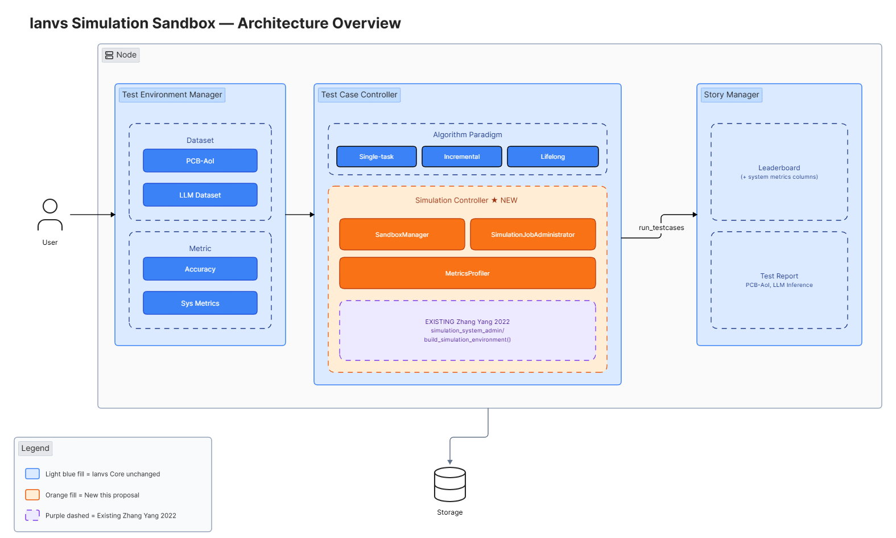
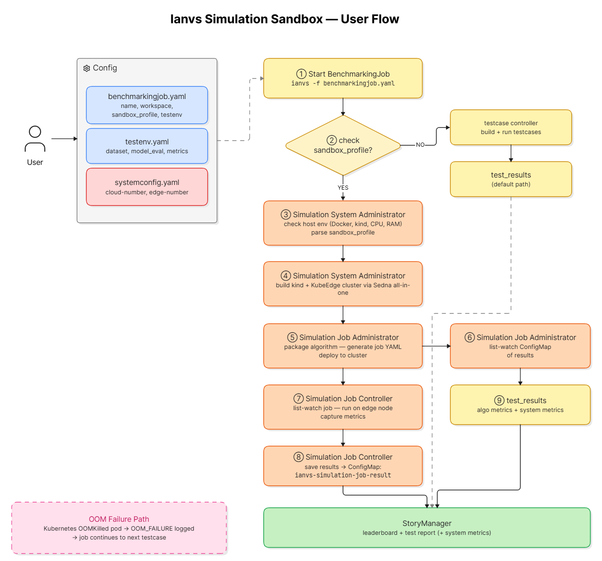
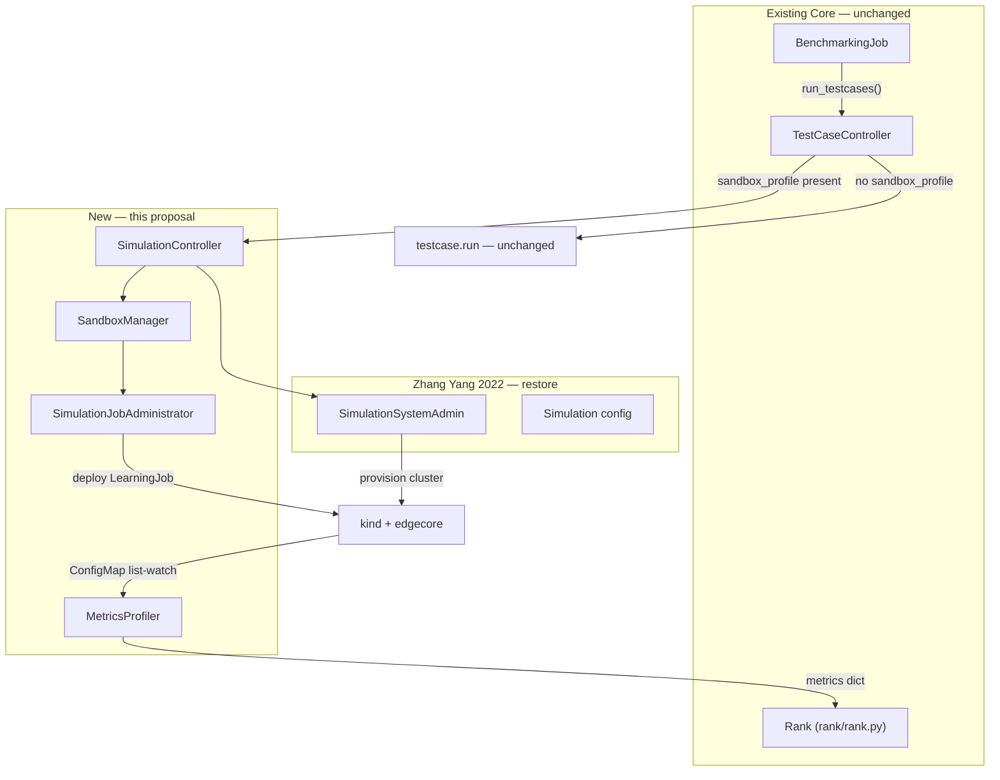
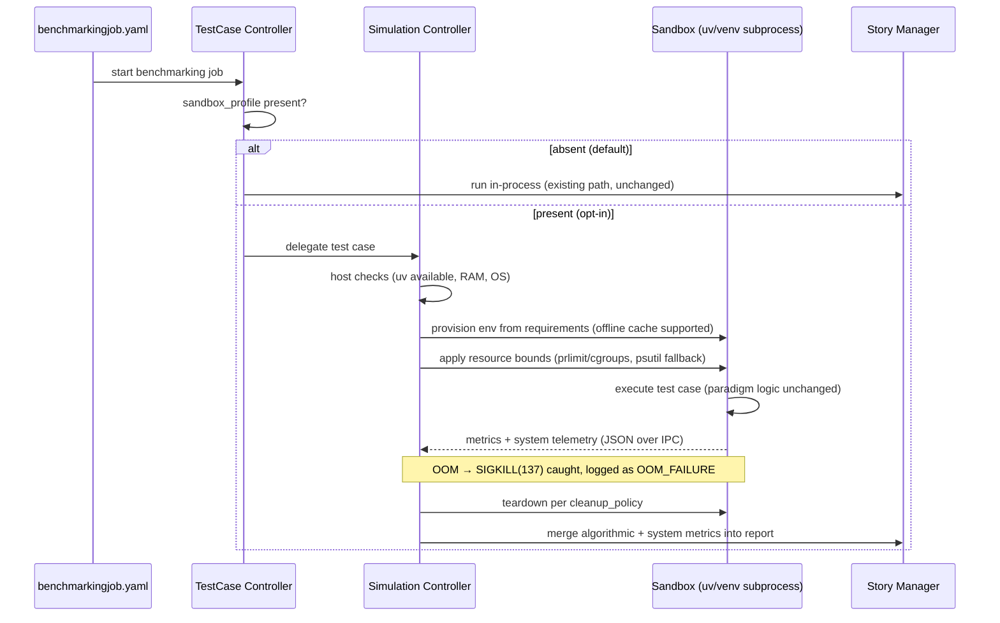

# Proposal: Ianvs Simulation Sandbox — Environment-Isolated Execution & System Metrics Profiling (Phase 1)

- **Tracking Issues:** [#8](https://github.com/kubeedge/ianvs/issues/8) (foundation for), [#307](https://github.com/kubeedge/ianvs/issues/307) (feature ledger), [#495](https://github.com/kubeedge/ianvs/issues/495) (core stability audit)
- **Related Prior Work:** PR [#308](https://github.com/kubeedge/ianvs/pull/308), PR [#419](https://github.com/kubeedge/ianvs/pull/419), and the merged community Simulation proposal ([docs/proposals/simulation/simulation.md](https://github.com/kubeedge/ianvs/blob/main/docs/proposals/simulation/simulation.md))
- **Status:** RFC / Design under SIG AI review
- **Scope note:** Per the SIG AI routine meeting discussion (June 2026), this proposal covers **only the Simulation Sandbox layer (Step 1)**. Parallel processing of test cases is explicitly **deferred to a future proposal (Step 2)** and is discussed here only as future work.

---

## 1. Background / Motivation

KubeEdge-Ianvs is a distributed synergy AI benchmarking framework for edge-cloud collaborative algorithms. The original Ianvs architecture already envisions a **Simulation Controller** — a component responsible for "the simulation process of edge-cloud synergy AI, including the instance generation and vanishment of simulation containers" ([Ianvs architecture](https://github.com/kubeedge/ianvs#architecture)). The merged community [Simulation proposal](https://github.com/kubeedge/ianvs/blob/main/docs/proposals/simulation/simulation.md) further designed an industrial distributed collaborative system simulation — a `Simulation System Administrator` and `Simulation Job Administrator` on the host side, plus an in-cluster `Simulation Job Controller` that runs simulation jobs and publishes results through a Kubernetes ConfigMap (`ianvs-simulation-job-result`) — built on `kind` and the [Sedna all-in-one deployment](https://github.com/kubeedge/sedna/blob/527c574a60d0ae87b0436f9a8b38cf84fb6dab21/docs/setup/all-in-one.md). However, this layer was never brought to completion, and today every test case still executes inside **one unified, global host process and Python environment**.

As benchmarking has scaled from classical CV (e.g., PCB-AoI defect detection) to foundation-model paradigms (LLM query routing, VLA models, privacy-preserving frameworks), this monolithic runtime has produced three recurring failure classes, observed in the core stability audit ([#495](https://github.com/kubeedge/ianvs/issues/495), PRs [#496](https://github.com/kubeedge/ianvs/pull/496)–[#500](https://github.com/kubeedge/ianvs/pull/500)) and across recent LFX/OSPP contributions:

1. **Core corruption.** To satisfy conflicting heavy dependencies, contributors invasively modify core files (`dataset.py`, paradigm modules), producing merge conflicts and regressions across the 30+ maintained examples.
2. **Dependency, path, and state collisions.** Algorithms run in the host process space, so hardcoded absolute paths, leaked environment variables, and incompatible package versions silently break cold-start reproducibility for other examples.
3. **Fatal resource cascades.** An out-of-memory event inside one heavy model crashes the entire benchmarking process — there is no fault boundary between a test case and the framework.

In addition, the SIG AI meeting identified a capability gap: **Ianvs measures algorithmic metrics (accuracy, F1, latency) but cannot measure system-level metrics** — CPU utilization, memory footprint, or behavior under constrained bandwidth — because algorithms are never executed inside a controlled, observable boundary. System metrics are "the other half of the Ianvs picture" for edge-cloud benchmarking.

Finally, the long-requested **parallel processing of test cases ([#8](https://github.com/kubeedge/ianvs/issues/8))** cannot be implemented safely on top of a shared global state: prior attempts (PRs [#308](https://github.com/kubeedge/ianvs/pull/308), [#419](https://github.com/kubeedge/ianvs/pull/419)) were paused by reviewers precisely because per-paradigm impact on the existing examples could not be guaranteed without an isolation foundation first.

**This proposal therefore implements the missing Simulation Sandbox layer — the agreed Step 1 — as a strictly opt-in feature, leaving every existing example and the default execution path untouched.**

## 2. Prior Implementation (Zhang Yang, OSPP 2022)

The Ianvs simulation layer is not starting from scratch. Zhang Yang ([@iszhyang](https://github.com/iszhyang)) designed and partially implemented this feature as an OSPP 2022 project, with the proposal merged in [PR #35](https://github.com/kubeedge/ianvs/pull/35) and the code merged in [PR #39](https://github.com/kubeedge/ianvs/pull/39) on October 31, 2022.

### What was built and verified

Zhang Yang's implementation is in `core/testcasecontroller/simulation/` and `core/testcasecontroller/simulation_system_admin/`, and includes:

- **`Simulation` config class** (`simulation.py`): parses `cloud_number`, `edge_number`, `cluster_name`, `kubeedge_version`, `sedna_version` from `benchmarkingjob.yaml` with type validation. Functional for valid input; four validation gaps identified and fixed in Stage 1 restoration: `isinstance(True, int)` accepts booleans as counts (confirmed by test), unknown YAML keys silently dropped (`edge_nodes: 5` instead of `edge_number: 5` produces `edge_number=0` with no error), required fields not enforced (`cloud_number=0`, `cluster_name=""` pass validation and generate a broken Sedna command), and `cluster_name` docstring incorrectly typed as `int` instead of `str`.
- **`SimulationSystemAdmin`** (`simulation_system_admin.py`): host environment checks (Docker, kind, CPU ≥4 cores, memory ≥4GB), `build_simulation_environment()` calling the [Sedna all-in-one script](https://github.com/kubeedge/sedna/blob/master/scripts/installation/all-in-one.sh) via curl with configurable cluster parameters, and `destroy_simulation_environment()` for cleanup.
- **`benchmarkingjob.py` integration**: `_parse_simulation_config()` method and hooks to call `build_simulation_environment()` before test case execution.
- **Verified working**: tested on Ubuntu 20.04 with KubeEdge v1.8.0, Sedna v0.4.3 (2022 test environment) using the `pcb-aoi/incremental_learning_bench` example — full cluster deployment confirmed with terminal output in `docs/guides/how-to-build-simulation-env.md`.

### What was never completed

The **Simulation Job Administrator** — the second half of the design described in PR #35 — was never implemented:

- Docker image building for algorithms under test
- Simulation job YAML generation from `testenv.yaml` and `algorithm.yaml`
- Job deployment to the kind cluster
- ConfigMap list-watch for collecting simulation results back to `StoryManager`

### Known breakages requiring restoration

Four years of Ianvs, KubeEdge, and Sedna API evolution have broken parts of Zhang Yang's code:

| Issue | Location | Fix needed |
|---|---|---|
| kind pinned to v0.17.0 | `simulation_system_admin.py` | Update to current stable (v0.32.0) |
| Sedna build URL uses `/master/` branch | `simulation_system_admin.py` | Change to `/main/` to match current Sedna repo (destroy already uses `/main/`) |
| KubeEdge v1.8.0 / Sedna v0.4.3 | `simulation_system_admin.py` | Update KubeEdge default to v1.23.0; Sedna resolves to latest via all-in-one script at runtime |
| `check_host_docker()` logic error | `simulation_system_admin.py` | Fix `check=True` + `returncode` conflict — install-docker branch unreachable |
| `check_host_kind()` same logic error | `simulation_system_admin.py` | Fix `check=True` + `returncode` conflict — install-kind branch unreachable |
| `get_host_number_of_cpus()` fragile parsing | `simulation_system_admin.py` | Use `os.cpu_count()` instead |
| `build_simulation_enviroment()` name typo | `simulation_system_admin.py` line 149 + `benchmarkingjob.py` line 87 | Rename to `build_simulation_environment()` (missing 'n' — same pattern as `destory` typo) |

### This proposal's approach

This proposal **restores and extends** Zhang Yang's skeleton rather than discarding it. The KubeEdge-native cluster simulation is not a new architecture — it is a continuation of the community-approved design that Zhang Yang began, updated for current dependency versions, completed with the missing Simulation Job Administrator, and extended with the system metrics profiling layer.

## 3. Goals

- **G1 — Environment isolation (Sandbox):** Execute a test case's algorithm inside a transient, isolated environment so that its dependencies, file paths, and process state cannot pollute the Ianvs core or other examples.
- **G2 — System metrics profiling:** Capture per-test-case system metrics — CPU utilization, peak memory, wall-clock phases, and (in cluster simulation) network conditions — and surface them through the existing `StoryManager` leaderboard/report pipeline alongside algorithmic metrics.
- **G3 — Resource constraint simulation:** Allow a test case to declare edge-like resource ceilings (memory / CPU) so algorithms can be benchmarked under simulated edge-node constraints.
- **G4 — KubeEdge-native alignment:** Implement the Kubernetes-native cluster simulation following the community-approved Simulation Controller design, using `kind` + KubeEdge `edgecore` to provision a cluster that serves as the primary deliverable and the foundation for the deferred lightweight local isolation approach (§9.4).
- **G5 — Absolute backward compatibility:** The sandbox is opt-in via configuration. With no sandbox block present, Ianvs behaves byte-for-byte as today. Zero changes to the behavior of the 30+ existing examples and 5 algorithm paradigms.

## 4. Non-Goals (explicitly out of scope for Phase 1)

- **Parallel execution of test cases** (Issue #8 implementation). This proposal builds the isolation foundation; the parallel scheduling design — including paradigm-specific schemes — is deferred to the Step 2 proposal (see §9 Future Work & Discussion).
- **Modifying any algorithm paradigm internals** (single-task, incremental, lifelong, federated, joint inference). The sandbox wraps execution; it does not change how a paradigm trains or infers.
- **Migrating existing examples.** Only 1–2 designated proof-of-concept examples will be validated in sandbox mode; all others remain on the default path.
- **Replacing Docker/Kubernetes.** The cluster simulation layer builds *on* them, following the community's Kubernetes-native direction.

## 5. Proposal Overview

We propose implementing the **Ianvs Simulation Sandbox** as a new, optional execution layer beneath the existing `TestCaseController`, using a Kubernetes-native cluster simulation approach with one configuration contract and one metrics schema:

| Mechanism | Target user | What it provides |
|---|---|---|
| Local K8s cluster via `kind` + KubeEdge `edgecore`, following the merged Simulation proposal (Simulation System/Job Administrator + in-cluster Simulation Job Controller with ConfigMap list-watch) and Sedna all-in-one scripts. Built on Zhang Yang's existing `simulation_system_admin` code (PR #39, merged Oct 2022) | Contributors benchmarking true edge-cloud topology | Multi-node cloud/edge simulation, network condition emulation, container-level metrics |

This proposal realizes the architecture's original Simulation Controller in a Kubernetes-native way, reusing the design lineage the community already reviewed and supported. The container-native isolation covers both local single-machine simulation and full cluster topology, providing richer system metrics than subprocess monitoring.

### 5.1 Research deliverable (first milestone)

In line with reviewer guidance that this feature requires comprehensive research before code, **the first deliverable of this project is a Sandbox Techniques Design Document**, comparing candidate isolation techniques against Ianvs requirements:

- `venv` / `uv` transient environments (speed, offline cache, cross-platform behavior)
- Subprocess isolation + `prlimit`/cgroups v2 resource bounding (Linux), with graceful degradation via `psutil` on macOS/Windows
- Container isolation (Docker) and `kind`-based K8s simulation with KubeEdge `edgecore`
- Analysis of why the prior container-in-container approach (root privileges required, large memory floor per container, difficult laptop setup) was not completed despite being proposed and partially designed — and how this proposal avoids those constraints via `kind`-based local simulation, with lightweight subprocess isolation deferred to future work (§9.4)
- Interaction analysis with all 5 algorithm paradigms: what state each paradigm reads/writes (datasets, model checkpoints, knowledge base for lifelong learning), confirming the sandbox boundary wraps a full test case and therefore requires **no paradigm modification**

This document will be submitted to SIG AI for review before implementation milestones begin.

## 6. Design Details

### 6.1 Architecture



*Figure 1: Architecture overview. Orange components are new (this proposal). Purple dashed components are Zhang Yang's existing OSPP 2022 implementation (simulation_system_admin/). Blue components are unchanged Ianvs core.*

The cluster simulation layer builds directly on Zhang Yang's existing implementation (PR #39, merged Oct 2022) rather than starting from scratch. The core cluster provisioning infrastructure (`SimulationSystemAdmin`, Sedna all-in-one integration, `benchmarkingjob.py` hooks) already exists in `core/testcasecontroller/simulation_system_admin/`. This proposal restores and extends it in two stages:

**Stage 1 — Restoration:** Fix the seven known breakages identified in §2 (kind version pin, Sedna script URL, KubeEdge/Sedna default versions, `check_host_docker()` logic error, `check_host_kind()` logic error, CPU parsing, `build_simulation_enviroment` name typo). Verify `build_simulation_environment()` deploys successfully on current Ubuntu LTS with current KubeEdge and Sedna versions.

**Stage 2 — Extension:** Implement the missing Simulation Job Administrator (Docker image building for algorithms, simulation job YAML generation, cluster deployment, ConfigMap list-watch for results) and integrate the System Metrics Profiler to report container-level CPU/memory stats through the StoryManager alongside algorithmic metrics.

A local `kind` cluster is provisioned, KubeEdge `edgecore` registers with `cloudcore` via the standard Kubernetes API using the Sedna all-in-one scripts, and algorithms run as actual KubeEdge workloads on simulated edge nodes. Results return through a Kubernetes ConfigMap — exactly the pattern Zhang Yang's proposal specified and that the community already approved.

> **Note:** The cluster simulation supports both **local single-machine simulation** (all components — `cloudcore`, `edgecore`, and worker pods — run inside a `kind` cluster on one laptop or CI host, simulating multi-node cloud-edge topology without requiring actual distributed hardware) and **full distributed cluster deployment** (real KubeEdge nodes on separate machines). The `kind`-based single-machine path is the primary PoC and development target for this proposal, making the worker-in-worker approach practical for any developer with a standard Linux host.

### 6.2 Execution Workflow

Execution follows the Simulation System/Job Administrator pattern established in Zhang Yang's merged proposal and detailed in §6.8B:

1. `BenchmarkingJob.run()` calls `build_simulation_environment()` to provision the `kind`+KubeEdge cluster via the Sedna all-in-one script.
2. For each test case, `SimulationController.run_sandboxed()` is called instead of `testcase.run()`.
3. The algorithm is packaged and deployed as a KubeEdge `LearningJob` workload on a simulated edge node.
4. `SimulationController` list-watches the job status via the Kubernetes API.
5. On completion, the result ConfigMap is read and deserialised back into the `StoryManager` record.
6. After all test cases, `destroy_simulation_environment()` tears down the cluster.

When `sandbox_profile` is absent, execution falls through to `testcase.run(workspace)` unchanged — the existing default path is untouched.

### 6.3 Configuration contract (opt-in)

The cluster simulation is configured under the existing `simulation:` key,
parsed by `BenchmarkingJob._parse_simulation_config()` into `self.simulation`.
The `sandbox_profile:` key (new, this proposal) coexists with it:

```yaml
benchmarkingjob:
  name: "llm-edge-evaluation"
  workspace: "./workspace"
  # NEW — entirely optional. Absent ⇒ today's behavior, unchanged.
  sandbox_profile:
    enabled: true
    system_metrics: ["cpu_utilization", "peak_memory_mb", "wall_time_s"]
  # EXISTING key — parsed by BenchmarkingJob._parse_simulation_config()
  # into self.simulation and consumed by build_simulation_environment().
  # Keys: cloud_number, edge_number, cluster_name, kubeedge_version, sedna_version.
  simulation:
    cloud_number: 1
    edge_number: 2
    cluster_name: "ianvs-simulation"
    kubeedge_version: "1.23.0"
    sedna_version: "latest"
```

### 6.4 System metrics in reports

The `System Metrics Profiler` samples container-level telemetry (container stats / node exporters) and emits a fixed schema merged into the `StoryManager` record for each test case:

| Metric | Source |
|---|---|
| `cpu_utilization_avg/max` | container runtime stats |
| `peak_memory_mb` | container memory stats |
| `wall_time_s` (per phase) | job timestamps |
| `oom_failure` | pod OOMKilled status |
| `network_profile` | emulated bandwidth/latency class |

This directly addresses the system-metrics gap raised in the SIG AI review and complements existing algorithmic metrics on the leaderboard.

### 6.5 Fault containment

If a sandboxed algorithm exceeds its memory bound, Kubernetes sends an OOMKill to the pod (`OOMKilled` pod status). `SimulationController` detects this via the Kubernetes API, records an explicit `OOM_FAILURE` state with the captured telemetry, and the benchmarking job continues to the next test case — converting today's fatal host crash into a reported result.

### 6.6 Host Requirements

A Linux host with Docker and `kind` available is required. The `check_host_enviroment()` step in `SimulationSystemAdmin` verifies Docker daemon reachability, `kind` availability, ≥4 CPU cores, and ≥4 GB free memory before cluster provisioning begins. The Sedna all-in-one script fetches images at cluster-build time; a network connection is required for the initial `build_simulation_environment()` call.

### 6.7 Backward compatibility & impact analysis

| Touched area | Change | Impact on existing examples |
|---|---|---|
| `core/cmd/obj/benchmarkingjob.py` | parse optional `sandbox_profile` block | none if block absent |
| `core/testcasecontroller/` | branch to Simulation Controller when opted in | default branch is a direct pass-through of current code |
| `core/storymanager/` | accept optional system-metric fields | fields absent ⇒ identical output |
| new `core/simulationcontroller/` | all new code, additive | none |
| 30+ existing examples | **no file changes** | continue on default path |

Validation plan: (1) full default-path regression on representative examples per paradigm to prove byte-identical behavior; (2) sandbox-mode PoC on **two designated examples** — `cloud-edge-collaborative-inference-for-llm` (joint inference paradigm; validates dependency isolation for heavy LLM workloads and produces performance-wise metrics including query latency and token throughput — the motivating case for the sandbox) and `pcb-aoi/incremental_learning_bench` (incremental learning paradigm; validates sandbox boundary preservation across sequential training rounds with per-round performance metrics). Default-path regression includes `pcb-aoi/singletask_learning_bench` to verify zero impact on existing examples.

### 6.8 Execution Contract

#### A. Entrypoint

The sandbox branch is inserted at `TestCaseController.run_testcases(workspace)` in `core/testcasecontroller/testcasecontroller.py` (line 46). Today, line 54 calls `testcase.run(workspace)` for every test case unconditionally. The `sandbox_profile` config is passed as an optional parameter to `run_testcases()`; if present, `SimulationController.run_sandboxed(testcase, workspace, sandbox_profile)` is called in place of `testcase.run(workspace)`. If absent, `testcase.run(workspace)` is called unchanged.

```
BenchmarkingJob.run()                           # core/cmd/obj/benchmarkingjob.py
  └── TestCaseController.run_testcases()        # core/testcasecontroller/testcasecontroller.py:46
        ├── [sandbox_profile absent — default]
        │     └── testcase.run(workspace)       # existing path, line 54, unchanged
        └── [sandbox_profile present — opt-in]
              └── SimulationController.run_sandboxed(testcase, workspace, sandbox_profile)
```

`BenchmarkingJob.__init__()` already holds `self.simulation` (Zhang Yang's cluster config, parsed from the `simulation:` YAML key by `_parse_simulation_config()`). The new `sandbox_profile` is a separate field parsed from the `sandbox_profile:` YAML key — the two configs coexist and serve different purposes.

Today `run_testcases()` raises `RuntimeError` on any testcase failure (line 56), crashing the whole job. The sandbox converts every failure class into a structured result returned to `Rank.save()`, so the job always continues to the next test case.

#### B. Execution Contract (cluster path)

When `sandbox_profile` is present, `SimulationController` delegates to the restored `SimulationSystemAdmin` rather than spawning a local subprocess. The contract is:

① `BenchmarkingJob.run()` detects `sandbox_profile` is present and calls `build_simulation_environment(self.simulation)` to bring up the kind+KubeEdge cluster (unchanged from Zhang Yang's path).

② `SimulationController.run_sandboxed(testcase, workspace, sandbox_profile)` is called instead of `testcase.run(workspace)`.

③ `SimulationController` packages the algorithm archive and test-env config into a Kubernetes ConfigMap on the edge node.

④ A Sedna `LearningJob` CR is applied; `SimulationController` list-watches the job status via the Kubernetes API.

⑤ The edge worker executes the algorithm inside the KubeEdge runtime and writes metric results back to a result ConfigMap.

⑥ `SimulationController` reads the result ConfigMap and deserialises the JSON payload:

```json
{
  "testcase_id": "pcb-aoi-sedna-v1",
  "status": "SUCCESS",
  "metrics": {
    "f1_score": 0.91,
    "precision": 0.93,
    "recall": 0.89,
    "peak_rss_mb": 312,
    "wall_time_s": 48.2
  }
}
```

⑦ On failure the ConfigMap carries `"status": "EXEC_FAILURE"` and a `stderr` field; `SimulationController` records the failure and continues to the next test case (same fault-containment semantics — job never crashes).

⑧ `destroy_simulation_environment(self.simulation)` (Zhang Yang's original function name contains a typo — `destory` — which will be corrected as part of the Stage 1 restoration work) tears down the cluster after all test cases finish.

⑨ The result dict is returned to `run_testcases()` and flows into `Rank.save()` unchanged — no leaderboard code needs to know about the sandbox.

> **Scope note:** Steps ③–⑤ (Simulation Job Administrator — job-YAML generation, ConfigMap list-watch) are the unfinished component from Zhang Yang's OSPP term and are a committed deliverable in Weeks 7–10 of this proposal.

### 6.9 User Flow



*Figure 2: End-to-end user flow. Steps ①–⑨ follow the simulation execution path established in the merged simulation proposal. The NO branch (right) shows the default execution path, unchanged for all existing examples. OOM failures are contained and reported — the job never crashes.*

**Step 1 — Add `sandbox_profile` to `benchmarkingjob.yaml`**

No other file changes are needed. The block is entirely optional — removing it restores today's behavior exactly.

```yaml
benchmarkingjob:
  name: "pcb-aoi-sandbox-eval"
  workspace: "./workspace"
  testenv: "./examples/pcb-aoi/testenv/testenv.yaml"
  # New optional block — remove to restore today's behavior unchanged
  sandbox_profile:
    enabled: true
    system_metrics: ["cpu_utilization", "peak_memory_mb", "wall_time_s"]
```

**Step 2 — Run Ianvs (same command as today)**

```
$ ianvs -f examples/pcb-aoi/benchmarkingjob.yaml
```

Terminal output when sandbox mode is active:

```
[ianvs] sandbox_profile detected — simulation mode enabled
[ianvs] checking host environment (docker, kind, cpu, memory) ... ok
[ianvs] provisioning kind+KubeEdge cluster (pcb-aoi-sandbox-eval) ... done (3m 14s)
[ianvs] deploying testcase fpn-algorithm-0 as KubeEdge LearningJob ...
[ianvs] testcase fpn-algorithm-0: SUCCESS (wall_time=142.3 s, peak_mem=1823 MB)
[ianvs] cluster teardown: pcb-aoi-sandbox-eval removed
```

**Step 3 — Leaderboard with system metrics**

`rank/selected_rank.csv` (printed to terminal via `print_table`):

| rank | algorithm | accuracy | f1_score | cpu_utilization_avg | peak_memory_mb | wall_time_s | paradigm |
|---|---|---|---|---|---|---|---|
| 1 | FPN | 0.9134 | 0.8892 | 0.43 | 1823.4 | 142.3 | singletask_learning |
| 2 | TwinLite | 0.8871 | 0.8510 | 0.61 | 2104.7 | 198.1 | singletask_learning |

System metric columns appear alongside existing algorithmic metrics when listed in `selected_dataitem.metrics` in the `rank:` block of `benchmarkingjob.yaml`.

**Step 4 — OOM failure**

When an algorithm exceeds its memory bound, Kubernetes OOMKills the pod. The leaderboard shows an explicit row — the job does not crash:

| rank | algorithm | accuracy | f1_score | cpu_utilization_avg | peak_memory_mb | wall_time_s | paradigm |
|---|---|---|---|---|---|---|---|
| 1 | FPN | 0.9134 | 0.8892 | 0.43 | 1823.4 | 142.3 | singletask_learning |
| — | HeavyModel | OOM_FAILURE | — | 0.89 | 4096.0 | 23.1 | singletask_learning |

Today, this event raises `RuntimeError` in `run_testcases()` and terminates the entire benchmarking job. Sandbox mode converts it into a reported row.

**Step 5 — Debugging**

Pod logs and output artifacts are retained in the workspace per-testcase directory:

```
$ ls workspace/pcb-aoi-sandbox-eval/sandbox_envs/heavymodel-algorithm-0/
output/    sandbox.log

$ tail -5 workspace/pcb-aoi-sandbox-eval/sandbox_envs/heavymodel-algorithm-0/sandbox.log
...
OOMKilled
```

### 6.10 Architecture & Code Structure

#### Component diagram



#### Directory structure

Files added or modified by this proposal. Existing paths verified against the current repo.

```
core/
├── simulationcontroller/               ← NEW
│   ├── __init__.py
│   ├── simulation_controller.py
│   ├── sandbox_manager.py
│   ├── simulation_job_administrator.py
│   └── metrics_profiler.py
├── testcasecontroller/
│   ├── testcasecontroller.py           ← MODIFIED (add sandbox branch at line 54)
│   ├── simulation/                     ← EXISTING (Zhang Yang, PR #39)
│   │   ├── __init__.py
│   │   └── simulation.py
│   └── simulation_system_admin/        ← EXISTING (Zhang Yang, restore 6 breakages)
│       ├── __init__.py
│       └── simulation_system_admin.py
├── cmd/obj/
│   └── benchmarkingjob.py              ← MODIFIED (parse sandbox_profile key)
└── storymanager/
    └── rank/                           ← no changes needed (see note below)

docs/proposals/simulation/
└── sandbox-engine/
    └── sandbox-engine.md               ← THIS FILE

docs/guides/
└── how-to-build-simulation-env.md      ← EXISTING (Zhang Yang simulation user guide, moved from examples/)
```

> **Note on `core/storymanager/rank/rank.py`:** No modification to the rank module is required. Inside `_get_all()` (line 147), the call `row_data.update(test_result)` at line 163 means any key present in the test result dict — including `peak_rss_mb`, `wall_time_s`, and `oom_failure` — automatically appears as a leaderboard column. To surface system metrics in the leaderboard, users simply add the metric names to `selected_dataitem.metrics` in their YAML config.

## 7. Roadmap (12 weeks)

| Weeks | Milestone | Deliverables |
|---|---|---|
| 1–2 | **Research & Design Doc** | Sandbox Techniques Design Document (§5.1): comparative study of isolation techniques, paradigm-interaction analysis, simulation sandbox interface spec; SIG AI review |
| 3–6 | **Stage 1 — Restoration** | Fix 7 breakages in `simulation_system_admin.py` (kind version pin, Sedna URL `/master/`→`/main/`, KubeEdge/Sedna default versions, `check_host_docker()` logic error, `check_host_kind()` logic error, CPU parser, `build_simulation_enviroment` name typo). Verify `build_simulation_environment()` deploys successfully on current KubeEdge v1.23.0 + Sedna. |
| 7–10 | **Stage 2 — Simulation Job Administrator** | Docker image building for algorithms under test; job YAML generation from `testenv.yaml` + `algorithm.yaml`; cluster deployment via `kubectl`; ConfigMap list-watch for results. |
| 11–12 | **System Metrics + PoC + Documentation** | System Metrics Profiler integration at container level. PoC validation: `pcb-aoi/incremental_learning_bench` running as KubeEdge workload on simulated cluster. User guide, configuration reference. |

## 8. Comparison with prior approaches

- **Container-in-container simulation (earlier exploration):** powerful but operationally heavy (root privileges, large memory floor, difficult laptop setup). This proposal's `kind`-based approach avoids these constraints — all components run inside standard containers on a single Linux host. Lightweight subprocess isolation is deferred to future work (§9.4) and may be reconsidered for environments where `kind` overhead is prohibitive.
- **Direct parallel execution proposals (PRs #308 / #419):** valuable analyses of Issue #8, but reviewers required per-paradigm impact guarantees that cannot be provided while all test cases share one global state. This proposal supplies the missing isolation substrate those efforts depend on.

## 9. Future Work & Discussion

### 9.1 Phase 2 — Paradigm-Aware Parallel Processing

With the Simulation Sandbox providing environment isolation and resource accounting (Phase 1, this proposal), Phase 2 will propose parallel scheduling of independent test cases (Issue #8). The scheduling design must be paradigm-specific — some paradigms are parallel-safe, others are inherently sequential. Phase 2 will be submitted as a separate proposal after this sandbox foundation is reviewed and merged.

### 9.2 Parallel Processing Scheme per Paradigm — Research Notes

The following analysis addresses the paradigm research gap identified in PR #308 (MooreZheng review, February 2026) and provides the community with the design foundation for Phase 2.

**Single-task learning**
Each test case is fully independent — no shared model state, no cross-task dependencies. Embarrassingly parallel. A standard worker pool (e.g. `ProcessPoolExecutor`) safely executes multiple single-task configurations concurrently with no design complexity.

**Joint inference**
One-model nature with cloud-edge split inference. Data partition and map-reduce applies at the test-case level — partition input samples across workers, combine inference results (e.g. accuracy aggregation). MooreZheng's review of PR #308 noted that tensor partition is also a candidate for future intra-test-case parallelism within a single joint inference job.

**Federated learning**
Distributed-learning nature with local training and global aggregation (e.g. FedAvg). Local training phases across different federated configurations are parallel-safe — each configuration trains its local model independently. Global aggregation is sequential. Parallelism applies cleanly at the test-case level (different federated hyperparameter configurations run concurrently); global aggregation within a single test case remains serial.

**Lifelong learning**
Multi-module, multi-model nature. The knowledge base (model checkpoints written after each task) is a **filesystem artifact**, not in-process state — it is written to the workspace directory and read back by the next task via shared path. The sandbox boundary does not break knowledge persistence because the workspace is mounted as a shared read-write directory across sandbox instances. MooreZheng noted that pipeline partition and model partition suit the multi-model structure well for future parallel schemes. Research needed: how to safely parallelize across tasks while preserving the sequential knowledge accumulation contract.

**Incremental learning**
Trains one global model sequentially across multiple rounds — this is its defining characteristic. MooreZheng explicitly noted in the PR #308 review that incremental learning "would be difficult" for parallelism: "how would the parameters be divided and combined during training in this proposal." This proposal does **not** parallelize incremental learning. The sandbox wraps one complete sequential training loop unchanged — the paradigm internals are untouched. Future research direction: gradient synchronization and distributed training approaches (PyTorch DDP, parameter server pattern, Horovod) for intra-model parallelism. This is out of scope for both Phase 1 and Phase 2 and is noted here as a longer-term open problem.

### 9.3 Dynamic Worker Sizing

Future parallel scheduling should include dynamic worker count adjustment based on real-time memory pressure. The System Metrics Profiler built in Phase 1 provides exactly the per-sandbox CPU and memory telemetry needed to drive this — average memory per sandbox from Phase 1 PoC runs can seed the default `optimal_workers = floor(available_RAM × 0.8 / memory_per_sandbox)` formula. Dynamic reduction under memory pressure is a Phase 2 implementation detail.

### 9.4 Mode A — Lightweight Local Isolation (Future Work)

A lightweight subprocess-based isolation mode using `uv`/`venv` transient environments with `prlimit`/cgroups resource bounding is deferred to future work. Following community discussion, Mode B's container-native isolation is preferred as it covers both local single-machine simulation and full cluster topology, providing richer system metrics (container CPU stats, OOMKilled pod status, memory limits) than subprocess monitoring. Mode A may be reconsidered for developer environments where Docker/`kind` overhead is prohibitive.

#### Mode A execution workflow (deferred)

When Mode A is implemented, `BenchmarkingJob.run()` would provision a per-test-case `uv`/`venv` isolated subprocess with OS-level resource bounds:



#### Mode A configuration keys (deferred)

```yaml
sandbox_profile:
  mode: "local"                  # Mode A — deferred to future work
  isolation_provider: "uv"       # "uv" | "venv"
  offline: true                  # resolve strictly from local cache (air-gapped edge)
  cleanup_policy: "purge_on_success"
```

#### Mode A cross-platform notes (deferred)

- **Linux:** strict resource bounding via `prlimit`/cgroups v2.
- **macOS / Windows:** graceful degradation — bounds are not hard-enforced; `psutil` still reports telemetry and a warning marks results as "unbounded."
- **Air-gapped / restricted networks:** `uv --offline` resolves environments exclusively from the pre-populated host cache via hard-links; no network calls occur inside the benchmarking loop.

## 10. References

1. Ianvs architecture — Simulation Controller component: https://github.com/kubeedge/ianvs#architecture
2. Issue #8 — Parallel processing of multiple use cases: https://github.com/kubeedge/ianvs/issues/8
3. Issue #307 — Feature tracking ledger: https://github.com/kubeedge/ianvs/issues/307
4. Issue #495 + PRs #496–#500 — Core framework stability audit: https://github.com/kubeedge/ianvs/issues/495
5. Prior parallel-processing proposals: https://github.com/kubeedge/ianvs/pull/308 , https://github.com/kubeedge/ianvs/pull/419
6. Merged community Simulation proposal: https://github.com/kubeedge/ianvs/blob/main/docs/proposals/simulation/simulation.md
7. Sedna all-in-one cluster scripts: https://github.com/kubeedge/sedna/blob/main/docs/setup/all-in-one.md
8. GovDoc2Poster proposal (format reference): https://github.com/kubeedge/ianvs/blob/main/docs/proposals/scenarios/GovDoc2Poster/GovDoc2Poster.md
9. phys-scene-gen proposal (format reference): https://github.com/kubeedge/ianvs/blob/main/docs/proposals/scenarios/phys-scene-gen/phys_scene_gen_proposal.md
10. PIPL framework proposal (format reference): https://github.com/kubeedge/ianvs/blob/main/docs/proposals/scenarios/PIPL-Compliant%20Cloud-Edge%20Collaborative%20Privacy-Preserving%20Prompt%20Processing%20Framework/optimizing-privacy-performance-equilibrium-cloud-edge-llm-systems_en_PR.md
11. Zhang Yang OSPP 2022 Simulation proposal (PR #35): https://github.com/kubeedge/ianvs/pull/35
12. Zhang Yang OSPP 2022 Simulation implementation (PR #39): https://github.com/kubeedge/ianvs/pull/39
