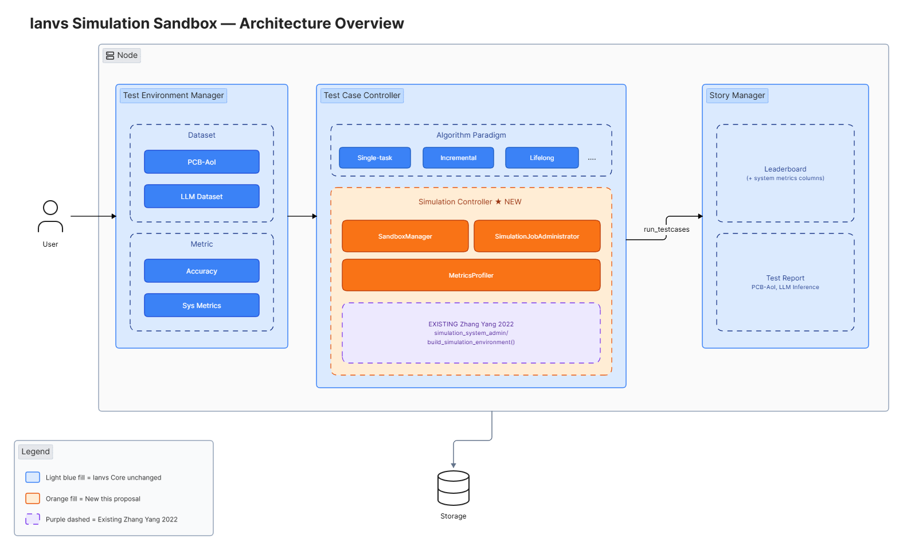
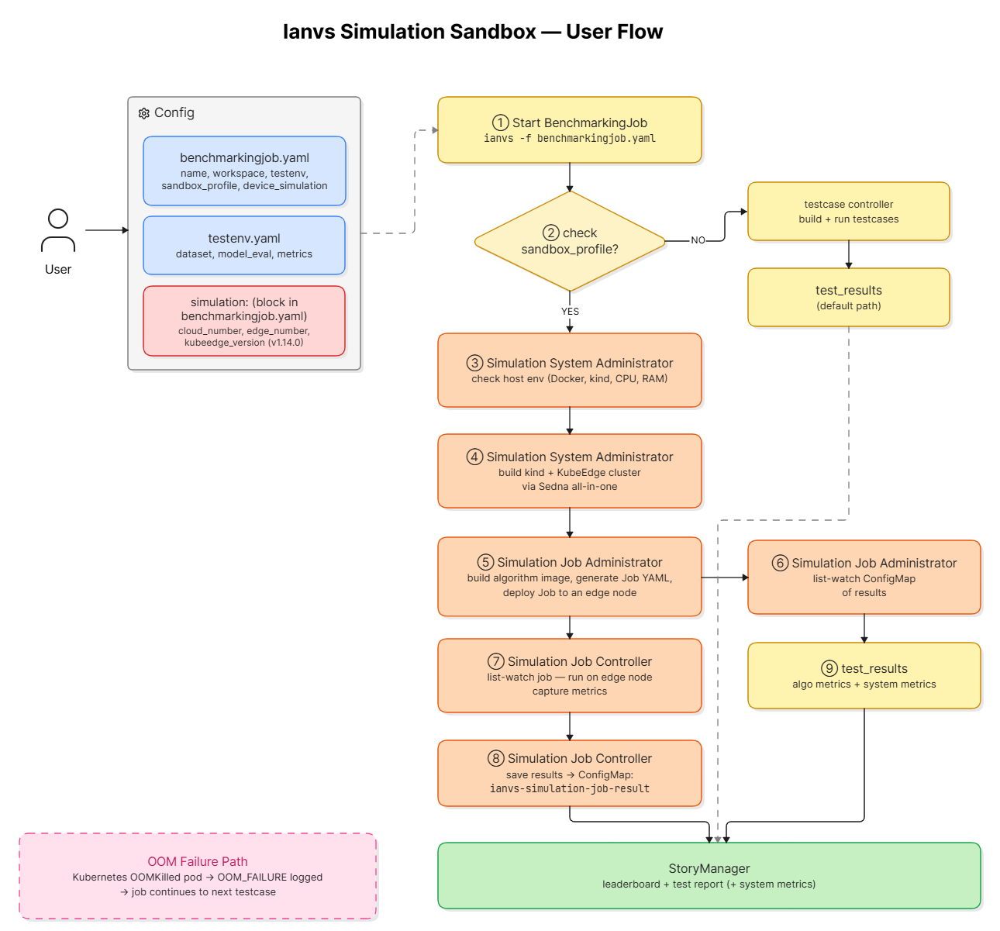
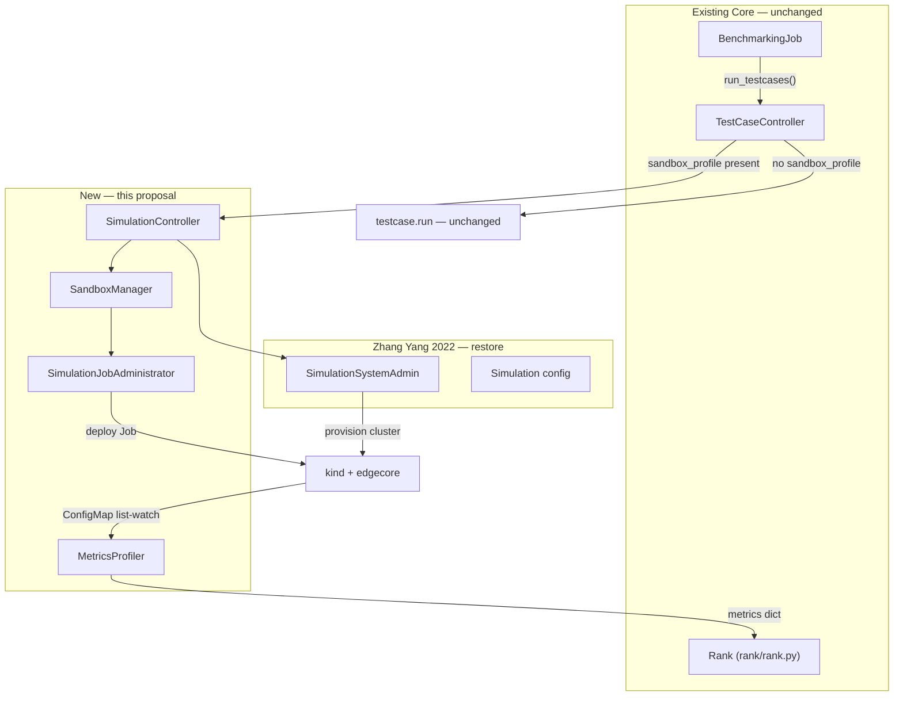
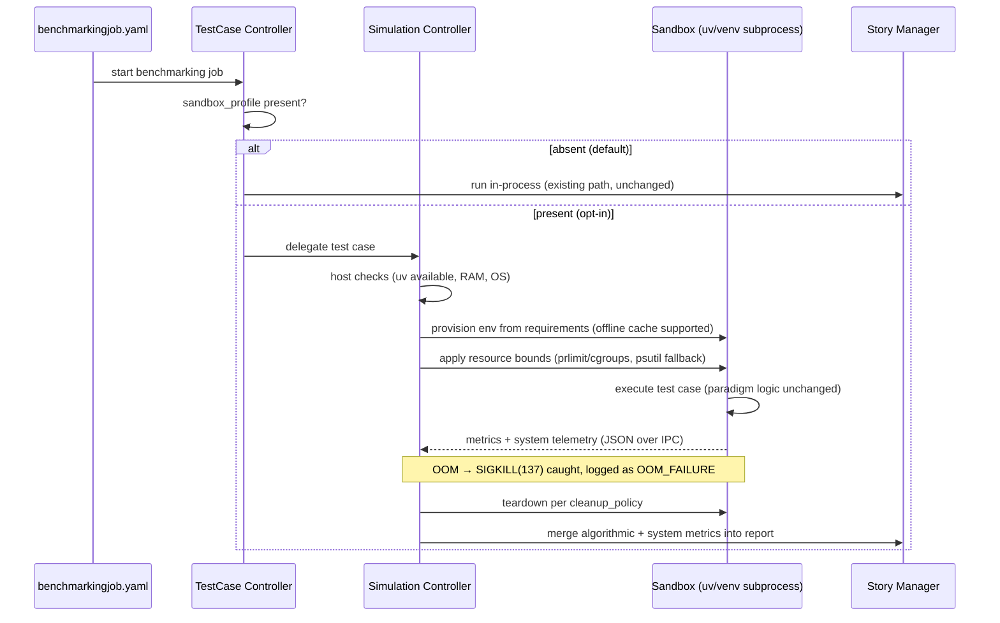

# Proposal: Ianvs Simulation Sandbox — Environment-Isolated Execution & System Metrics Profiling (Phase 1)

- **Tracking Issues:** [#8](https://github.com/kubeedge/ianvs/issues/8) (foundation for), [#307](https://github.com/kubeedge/ianvs/issues/307) (feature ledger), [#495](https://github.com/kubeedge/ianvs/issues/495) (core stability audit)
- **Related Prior Work:** PR [#308](https://github.com/kubeedge/ianvs/pull/308), PR [#419](https://github.com/kubeedge/ianvs/pull/419), and the merged community Simulation proposal ([docs/proposals/simulation/simulation.md](https://github.com/kubeedge/ianvs/blob/main/docs/proposals/simulation/simulation.md))
- **Status:** RFC / Design under SIG AI review
- **Scope note:** Per the SIG AI routine meeting discussion (June 2026), this proposal covers **only the Simulation Sandbox layer (Step 1)**. Parallel processing of test cases is explicitly **deferred to a future proposal (Step 2)** and is discussed here only as future work.

---

## 1. Background / Motivation

KubeEdge-Ianvs is a distributed synergy AI benchmarking framework for edge-cloud collaborative algorithms. The original Ianvs architecture already envisions a **Simulation Controller** — a component responsible for "the simulation process of edge-cloud synergy AI, including the instance generation and vanishment of simulation containers" ([Ianvs architecture](https://github.com/kubeedge/ianvs#architecture)). The merged community [Simulation proposal](https://github.com/kubeedge/ianvs/blob/main/docs/proposals/simulation/simulation.md) further designed an industrial distributed collaborative system simulation — a `Simulation System Administrator` and `Simulation Job Administrator` on the host side, plus an in-cluster `Simulation Job Controller` that runs simulation jobs and publishes results through a Kubernetes ConfigMap (`ianvs-simulation-job-result`) — built on `kind` and the [Sedna all-in-one deployment](https://github.com/kubeedge/sedna/blob/527c574a60d0ae87b0436f9a8b38cf84fb6dab21/docs/setup/all-in-one.md). However, this layer was never brought to completion, and today every test case still executes inside **one unified, global host process and Python environment**.

As benchmarking has scaled from classical CV (e.g., PCB-AoI defect detection) to foundation-model paradigms (LLM query routing, VLA models, privacy-preserving frameworks), this monolithic runtime has produced three recurring failure classes, observed in the core stability audit ([#495](https://github.com/kubeedge/ianvs/issues/495), PRs [#496](https://github.com/kubeedge/ianvs/pull/496)–[#500](https://github.com/kubeedge/ianvs/pull/500)) and across recent LFX/OSPP contributions:

1. **Core corruption.** To satisfy conflicting heavy dependencies, contributors invasively modify core files (`dataset.py`, paradigm modules), producing merge conflicts and regressions across the 30+ maintained examples.
2. **Dependency, path, and state collisions.** Algorithms run in the host process space, so hardcoded absolute paths, leaked environment variables, and incompatible package versions silently break cold-start reproducibility for other examples.
3. **Fatal resource cascades.** An out-of-memory event inside one heavy model crashes the entire benchmarking process — there is no fault boundary between a test case and the framework.

In addition, the SIG AI meeting identified a capability gap: **Ianvs measures algorithmic metrics (accuracy, F1, latency) but cannot measure system-level metrics** — CPU utilization, memory footprint, or behavior under constrained bandwidth — because algorithms are never executed inside a controlled, observable boundary. System metrics are "the other half of the Ianvs picture" for edge-cloud benchmarking.

Finally, the long-requested **parallel processing of test cases ([#8](https://github.com/kubeedge/ianvs/issues/8))** cannot be implemented safely on top of a shared global state: prior attempts (PRs [#308](https://github.com/kubeedge/ianvs/pull/308), [#419](https://github.com/kubeedge/ianvs/pull/419)) were paused by reviewers precisely because per-paradigm impact on the existing examples could not be guaranteed without an isolation foundation first.

**This proposal therefore implements the missing Simulation Sandbox layer — the agreed Step 1 — as a strictly opt-in feature, leaving every existing example and the default execution path untouched.**

## 2. Prior Implementation (Zhang Yang, OSPP 2022)

The Ianvs simulation layer is not starting from scratch. Zhang Yang ([@iszhyang](https://github.com/iszhyang)) designed and partially implemented this feature as an OSPP 2022 project, with the proposal merged in [PR #35](https://github.com/kubeedge/ianvs/pull/35) and the code merged in [PR #39](https://github.com/kubeedge/ianvs/pull/39) on October 31, 2022.

### What was built and verified

Zhang Yang's implementation is in `core/testcasecontroller/simulation/` and `core/testcasecontroller/simulation_system_admin/`, and includes:

- **`Simulation` config class** (`simulation.py`): parses `cloud_number`, `edge_number`, `cluster_name`, `kubeedge_version`, `sedna_version` from `benchmarkingjob.yaml` with type validation. Functional for valid input, but with validation gaps that the restoration in #1012 closes: booleans were accepted as node counts (`isinstance(True, int)` is true), unknown YAML keys were silently dropped (`edge_nodes: 5` instead of `edge_number: 5` left `edge_number=0` with no message; they now produce a warning), node counts were not checked against the installer's limits (now 0–2 cloud workers and 0–3 edge nodes), empty strings were accepted (now rejected), and the `cluster_name` docstring was typed `int` instead of `str`.
- **`SimulationSystemAdmin`** (`simulation_system_admin.py`): host environment checks (Docker, kind, CPU ≥4 cores, memory ≥4GB), `build_simulation_environment()` calling the [Sedna all-in-one script](https://github.com/kubeedge/sedna/blob/master/scripts/installation/all-in-one.sh) via curl with configurable cluster parameters, and `destroy_simulation_environment()` for cleanup.
- **`benchmarkingjob.py` integration**: `_parse_simulation_config()` method and hooks to call `build_simulation_environment()` before test case execution.
- **Verified working**: tested on Ubuntu 20.04 with KubeEdge v1.8.0, Sedna v0.4.3 (2022 test environment) using the `pcb-aoi/incremental_learning_bench` example — full cluster deployment confirmed with terminal output in `docs/guides/how-to-build-simulation-env.md`.

### What was never completed

The **Simulation Job Administrator** — the second half of the design described in PR #35 — was never implemented:

- Docker image building for algorithms under test
- Simulation job YAML generation from `testenv.yaml` and `algorithm.yaml`
- Job deployment to the kind cluster
- ConfigMap list-watch for collecting simulation results back to `StoryManager`

### Known breakages requiring restoration

Four years of Ianvs, KubeEdge, and Sedna API evolution have broken parts of Zhang Yang's code:

| Issue | Location | Fix (restored in #1012) |
|---|---|---|
| kind auto-install pinned to v0.17.0 | `simulation_system_admin.py` | Ianvs no longer downloads kind; it checks that kind is installed and stops with an installation link if not |
| Sedna build URL uses `/master/` branch | `simulation_system_admin.py` | Change to `/main/` to match current Sedna repo (destroy already uses `/main/`) |
| KubeEdge v1.8.0 / Sedna v0.4.3 | `simulation_system_admin.py` | Pin the KubeEdge default to v1.14.0, the newest version verified to deploy end-to-end. The Sedna all-in-one script installs KubeEdge with the `keadm` v1.9.1 built into its node image, which downloads `devices_v1alpha2_*` CRD files from the KubeEdge release branch; from release-1.16 on those files are replaced by `v1beta1` ones, so the download fails with a 404. The node image also runs Kubernetes 1.21, while recent KubeEdge releases such as v1.23 require Kubernetes 1.27 or later. Sedna resolves to latest via the all-in-one script at runtime |
| `check_host_docker()` logic error: `check=True` together with a `returncode` test made the install branch unreachable | `simulation_system_admin.py` | The auto-install was removed: Ianvs checks that Docker is installed and its daemon is reachable, and otherwise stops with a clear error and an installation link |
| `check_host_kind()` same logic error | `simulation_system_admin.py` | Same approach as Docker: check that kind is installed and runs, and otherwise stop with an installation link |
| `get_host_number_of_cpus()` fragile `lscpu` parsing | `simulation_system_admin.py` | Count the CPU cores the process may use (CPU affinity), capped by the container's CPU limit (cgroup); the memory check likewise reads `MemAvailable` and respects the container's memory limit |
| `build_simulation_enviroment()` name typo (same pattern as `destory`) | `simulation_system_admin.py` line 149 + `benchmarkingjob.py` line 87 | Add correctly spelled aliases (`build_simulation_environment`, `destroy_simulation_environment`) and use them in `benchmarkingjob.py`; the misspelled names are kept for backward compatibility |

#1012 also runs the installer without a shell (no `curl | bash`), removes a partially built cluster when the build fails, always tears the environment down when the job ends, and keeps the results of completed test cases when one test case fails.

### This proposal's approach

This proposal **restores and extends** Zhang Yang's skeleton rather than discarding it. The KubeEdge-native cluster simulation is not a new architecture — it is a continuation of the community-approved design that Zhang Yang began, updated for current dependency versions, completed with the missing Simulation Job Administrator, and extended with the system metrics profiling layer.

## 3. Goals

- **G1 — Environment isolation (Sandbox):** Execute a test case's algorithm inside a transient, isolated environment so that its dependencies, file paths, and process state cannot pollute the Ianvs core or other examples.
- **G2 — System metrics profiling:** Capture per-test-case system metrics — CPU, memory, GPU and storage use, wall-clock time, and (in cluster simulation) network conditions — and surface them through the existing `StoryManager` leaderboard/report pipeline alongside algorithmic metrics.
- **G3 — Resource constraint simulation:** Allow a test case to declare edge-like resource ceilings (memory / CPU) so algorithms can be benchmarked under simulated edge-node constraints.
- **G4 — KubeEdge-native alignment:** Implement the Kubernetes-native cluster simulation following the community-approved Simulation Controller design, using `kind` + KubeEdge `edgecore` to provision a cluster that serves as the primary deliverable and the foundation for the deferred lightweight local isolation approach (§9.4).
- **G5 — Absolute backward compatibility:** The sandbox is opt-in via configuration. With no sandbox block present, Ianvs behaves byte-for-byte as today. Zero changes to the behavior of the 30+ existing examples and the 7 algorithm paradigm types.

## 4. Non-Goals (explicitly out of scope for Phase 1)

- **Parallel execution of test cases** (Issue #8 implementation). This proposal builds the isolation foundation; the parallel scheduling design — including paradigm-specific schemes — is deferred to the Step 2 proposal (see §9 Future Work & Discussion).
- **Modifying any algorithm paradigm internals** (all seven paradigm types). The sandbox wraps execution; it does not change how a paradigm trains or infers.
- **Migrating existing examples.** Only 1–2 designated proof-of-concept examples will be validated in sandbox mode; all others remain on the default path.
- **Replacing Docker/Kubernetes.** The cluster simulation layer builds *on* them, following the community's Kubernetes-native direction.
- **Scalability** (simulating as many nodes as one host can hold, or spreading nodes across hosts). Deferred to a later term per mentor guidance; see §9.5.

## 5. Proposal Overview

We propose implementing the **Ianvs Simulation Sandbox** as a new, optional execution layer beneath the existing `TestCaseController`, using a Kubernetes-native cluster simulation approach with one configuration contract and one metrics schema:

| Mechanism | Target user | What it provides |
|---|---|---|
| Local K8s cluster via `kind` + KubeEdge `edgecore`, following the merged Simulation proposal (Simulation System/Job Administrator + in-cluster Simulation Job Controller with ConfigMap list-watch) and Sedna all-in-one scripts. Built on Zhang Yang's existing `simulation_system_admin` code (PR #39, merged Oct 2022) | Contributors benchmarking true edge-cloud topology | Multi-node cloud/edge simulation, network condition emulation, container-level metrics |

This proposal realizes the architecture's original Simulation Controller in a Kubernetes-native way, reusing the design lineage the community already reviewed and supported. The container-native isolation covers both local single-machine simulation and full cluster topology, providing richer system metrics than subprocess monitoring.

### 5.1 Research deliverable (first milestone)

In line with reviewer guidance that this feature requires comprehensive research before code, **the first deliverable of this project is a Sandbox Techniques Design Document**, comparing candidate isolation techniques against Ianvs requirements:

- `venv` / `uv` transient environments (speed, offline cache, cross-platform behavior)
- Subprocess isolation + `prlimit`/cgroups v2 resource bounding (Linux), with graceful degradation via `psutil` on macOS/Windows
- Container isolation (Docker) and `kind`-based K8s simulation with KubeEdge `edgecore`
- Analysis of why the prior container-in-container approach (root privileges required, large memory floor per container, difficult laptop setup) was not completed despite being proposed and partially designed — and how this proposal avoids those constraints via `kind`-based local simulation, with lightweight subprocess isolation deferred to future work (§9.4)
- Interaction analysis with all 7 algorithm paradigm types: what state each paradigm reads/writes (datasets, model checkpoints, knowledge base for lifelong learning), confirming the sandbox boundary wraps a full test case and therefore requires **no paradigm modification**

This document will be submitted to SIG AI for review before implementation milestones begin.

## 6. Design Details

### 6.1 Architecture



*Figure 1: Architecture overview. Orange components are new (this proposal). Purple dashed components are Zhang Yang's existing OSPP 2022 implementation (simulation_system_admin/). Blue components are unchanged Ianvs core.*

The cluster simulation layer builds directly on Zhang Yang's existing implementation (PR #39, merged Oct 2022) rather than starting from scratch. The core cluster provisioning infrastructure (`SimulationSystemAdmin`, Sedna all-in-one integration, `benchmarkingjob.py` hooks) already exists in `core/testcasecontroller/simulation_system_admin/`. This proposal restores and extends it in two stages:

**Stage 1 — Restoration (#1012):** Fix the seven known breakages identified in §2 and verify that `build_simulation_environment()` deploys and tears down successfully with KubeEdge v1.14.0, the newest version verified with the Sedna all-in-one installer (§2).

**Stage 2 — Extension:** Implement the missing Simulation Job Administrator (Docker image building for algorithms, simulation job YAML generation, cluster deployment, ConfigMap list-watch for results) and integrate the System Metrics Profiler to report container-level CPU/memory stats through the StoryManager alongside algorithmic metrics.

A local `kind` cluster is provisioned, KubeEdge `edgecore` registers with `cloudcore` via the standard Kubernetes API using the Sedna all-in-one scripts, and algorithms run as actual KubeEdge workloads on simulated edge nodes. Results return through a Kubernetes ConfigMap — exactly the pattern Zhang Yang's proposal specified and that the community already approved.

> **Note:** The cluster simulation supports **local single-machine simulation** (all components — `cloudcore`, `edgecore`, and worker pods — run inside a `kind` cluster on one laptop or CI host, simulating multi-node cloud-edge topology without requiring actual distributed hardware), and is designed to extend later to **full distributed cluster deployment** (real KubeEdge nodes on separate machines, §9.5). The `kind`-based single-machine path is the primary PoC and development target for this proposal, making the worker-in-worker approach practical for any developer with a standard Linux host.

### 6.2 Execution Workflow

Execution follows the Simulation System/Job Administrator pattern established in Zhang Yang's merged proposal and detailed in §6.8B:

1. `BenchmarkingJob.run()` calls `build_simulation_environment()` to provision the `kind`+KubeEdge cluster via the Sedna all-in-one script.
2. For each test case, `SimulationController.run_sandboxed()` is called instead of `testcase.run()`.
3. The test case is deployed as a Kubernetes Job scheduled onto a simulated edge node.
4. `SimulationController` list-watches the job status via the Kubernetes API.
5. On completion, the result ConfigMap is read and deserialised back into the `StoryManager` record.
6. After all test cases, `destroy_simulation_environment()` tears down the cluster.

When `sandbox_profile` is absent, execution falls through to `testcase.run(workspace)` unchanged — the existing default path is untouched.

### 6.3 Configuration contract (opt-in)

The cluster simulation is configured under the existing `simulation:` key,
parsed by `BenchmarkingJob._parse_simulation_config()` into `self.simulation`.
The `sandbox_profile:` key (new, this proposal) coexists with it:

```yaml
benchmarkingjob:
  name: "llm-edge-evaluation"
  workspace: "./workspace"
  # NEW — entirely optional. Absent ⇒ today's behavior, unchanged.
  sandbox_profile:
    enabled: true
    # "all" expands to the full metric set in §6.4 for the test case's
    # detected paradigm. An explicit list restricts to a subset.
    system_metrics: "all"
  # NEW — optional. Absent ⇒ paradigm-aware defaults applied (§6.11).
  device_simulation:
    max_memory_mb: 2048
    max_cpu_cores: 2
    network_bandwidth_mbps: 50
    network_latency_ms: 20
  # EXISTING key — parsed by BenchmarkingJob._parse_simulation_config()
  # into self.simulation and consumed by build_simulation_environment().
  # Keys: cloud_number, edge_number, cluster_name, kubeedge_version, sedna_version.
  simulation:
    cloud_number: 1
    edge_number: 2
    cluster_name: "ianvs-simulation"
    kubeedge_version: "v1.14.0"
    sedna_version: "latest"
```

`network_bandwidth_mbps` (Mbit/s) and `network_latency_ms` (added round-trip delay in milliseconds) set the emulated network condition for the test case, applied with `tc`/`netem`. The run records this condition as `network_profile`, a label built from the two effective values in the form `<bandwidth>mbps-<latency>ms` (for example `50mbps-20ms`), so results measured under different network conditions are never compared by mistake. When either key is absent, the default in §6.11 applies.

### 6.4 System metrics in reports

The `System Metrics Profiler` samples container-level telemetry (container stats / node exporters, with a `psutil`/cgroup-based fallback) and emits a fixed schema merged into the `StoryManager` record for each test case. The schema is defined **at the paradigm level, not per example**, and covers all seven paradigm types in `ParadigmType` (`core/common/constant.py`): single-task learning, incremental learning, lifelong learning, federated learning, federated class-incremental learning, joint inference and multi-edge inference. This closes a prior gap where only the joint-inference PoC produced system metrics. Where a metric applies to only some paradigms, its row says so.

**Relationship to existing metrics.** Ianvs already has paradigm-level `SystemMetricType` metrics (`samples_transfer_ratio`, `FWT`, `BWT`, `task_avg_acc`, `MATRIX`, `forget_rate`), which paradigms compute internally and return as `system_metric_info`. The metrics in this section are different: they are resource measurements taken from outside the paradigm, and they do not replace or change the existing ones. Because `TestCase.compute_metrics()` calls every metric listed under the test environment's `metrics:` with either `system_metric_info` or `(y, pred)`, these resource metrics must **not** be listed there. They are enabled by `sandbox_profile.system_metrics` and merged into the test result after `compute_metrics()` runs, which is how they reach the leaderboard. Metrics that individual examples define for themselves (such as an example's own latency or memory metric) are left unchanged.

Metrics are grouped by what they depend on to be collected, not by when they'll be built.

**Group A — needs only a per-test-case process or container boundary (no job-status list-watch or cluster network telemetry).** These are observed from outside the test-case process/container, through resource sampling, output folders or existing log lines. In this proposal that boundary is the test-case pod; on the default path all test cases share the Ianvs process, so per-test-case figures cannot be separated:

| Metric | Description | Source |
|---|---|---|
| `wall_time_s` (total) | total elapsed time for the test case, excluding environment build and teardown | monotonic clock read at test-case start and end |
| `cpu_utilization_avg` / `cpu_utilization_max` | mean and peak CPU utilization across the sandboxed process/container lifetime | container runtime stats; cgroup `cpu.stat` fallback |
| `peak_memory_mb` (memory high watermark) | maximum resident set size observed at any sampling tick, not an end-of-run snapshot — captures short OOM-adjacent spikes (e.g. LLM prefill, lifelong-learning knowledge-base reload) that an average would hide | cgroup `memory.peak` / container memory stats |
| `oom_failure` | pod/process OOMKilled status | pod status / SIGKILL(137) exit code |
| `gpu_utilization_avg` / `gpu_utilization_max` | mean and peak GPU compute utilization while the test case runs | NVML (`nvidia-smi` / `pynvml`) sampling around the test-case process |
| `gpu_memory_peak_mb` | highest GPU memory used by the test case at any sampling tick | NVML per-process memory query |
| `gpu_power_watts_avg` | average GPU power draw while the test case runs | NVML power sampling |
| `gpu_energy_joules` | total GPU energy used by the test case (`gpu_power_watts_avg` × `wall_time_s`) | derived |
| `disk_usage_peak_mb` | highest on-disk size of the test case's working directory (dataset copies, checkpoints, model artifacts) seen at any sampling tick. Applies to all paradigms; typically largest for lifelong learning (knowledge base) and incremental learning (per-round checkpoints) | periodic size sampling of the test-case workspace directory |
| `disk_read_bytes` / `disk_write_bytes` | total bytes the test case read from / wrote to block storage. Applies to all paradigms | cgroup v2 `io.stat` (`rbytes` / `wbytes`); `/proc/<pid>/io` fallback when the test case has no cgroup of its own |
| `disk_read_mb_s_avg` / `disk_write_mb_s_avg` | average disk read / write throughput over the test case, in megabytes per second (`disk_*_bytes` ÷ 2^20 ÷ `wall_time_s`). Applies to all paradigms | derived |
| `model_artifact_size_mb` | total size of the model files the test case saves to its output directory by the end of the run; lifelong and incremental learning count every saved task/round model. Applies to all paradigms | file sizes in the output directory after the run |
| `wall_time_s` (per phase) | elapsed time of each phase, for paradigms whose phases are already visible from outside the process: single-task learning (`train` / `inference`, from its `output/train/` and `output/inference/` folders), incremental learning (each round, from its per-round output folders), lifelong learning (each round, from its existing round log lines), federated class-incremental learning (each round within each task, from its existing `Round {r} task id: {task_id}` log line) and joint inference (dataset loading / inference, from its existing log lines). Timing is approximate, because it relies on folder creation times and log timestamps. Multi-edge inference has a single inference phase, so the total `wall_time_s` already covers it | output-folder timestamps and existing log lines |

GPU fields are reported as `N/A` on hosts without an NVIDIA GPU (including AMD/Intel GPUs, which NVML does not cover); `N/A` is a normal result, not an error, and does not fail the test case. Host-level sampling attributes GPU memory to the test-case process ID where the driver supports per-process queries; if it only exposes device-wide numbers, the result is marked `device_wide` so it isn't mistaken for a per-test-case figure when other processes share the GPU. NVML reports power only for the whole device, so `gpu_power_watts_avg` and `gpu_energy_joules` are always marked `device_wide`.

Storage readings have two known limits. `io.stat` counts only I/O that reaches the block device, so data served from the page cache is not counted; a second run over the same dataset can show far lower `disk_read_bytes` than the first. Directory-size sampling can miss a short-lived peak between ticks, such as temporary files written and deleted within one interval.

Per-round timing for federated learning is future work. That paradigm writes no per-round folder or log line, so timing its rounds would mean adding markers inside the paradigm, which this proposal does not do (§4).

**Group B — requires the Simulation Job Administrator plus container/K8s telemetry.** These need job-status list-watch and cluster-level network visibility that don't exist without that plumbing:

| Metric | Description | Source |
|---|---|---|
| `cpu_cores_used_avg` | average concurrently-occupied core count (federated learning's per-client trainers are aggregated here) | container runtime stats |
| `memory_utilization_avg` | average sampled memory as a fraction of the `max_memory_mb` quota enforced on the pod | derived from container memory samples and the pod memory limit |
| `network_bandwidth_mbps_avg` / `network_bandwidth_mbps_peak` | ingress+egress throughput observed on the sandbox's virtual interface, i.e. traffic that actually leaves the test-case pod, such as joint inference calls to a remote cloud model. Federated client↔aggregator exchange stays in-process and is covered by the federated block below | container network stats / `kind` node exporter |
| `network_latency_ms` | emulated round-trip delay applied for the run, set by `device_simulation.network_latency_ms` (§6.3) | `tc`/`netem` config echoed back |
| `network_profile` | label of the emulated network condition, `<bandwidth>mbps-<latency>ms` built from the effective `network_bandwidth_mbps` and `network_latency_ms` (§6.3) | derived from the applied `tc`/`netem` config |
| `gpu_utilization_per_container` | GPU utilization attributed to the test-case pod when the job runs inside the cluster | NVIDIA Kubernetes device plugin + DCGM exporter |

**Federated learning: data and exchange metrics.** These apply to federated learning and federated class-incremental learning only. Client data and model updates stay inside one Python process in both paradigms, including when the test case runs as a pod, so they are measured at the aggregation step and not from network traffic. The profiler wraps the aggregator module instance where `ParadigmBase._get_module_instances()` creates it, so no paradigm file is edited. The wrapper passes every attribute and call through unchanged, because federated class-incremental learning checks `hasattr(aggregator, "helper_function")` and a wrapper that hid it would silently change behaviour.

| Metric | Description | Source |
|---|---|---|
| `fl_client_partition_samples` | number of training samples assigned to each client, reported per client plus min / max / mean, so uneven (non-IID) splits are visible | `num_samples` of each client update seen at the aggregation step |
| `fl_round_update_payload_bytes` | bytes of model weights each client sends for aggregation in one round, plus bytes of the global weights sent back, reported per round | size of the client and global weights at the aggregation step |

When each group is built follows the roadmap in §7 and may change; the grouping is by technical dependency.

This directly addresses the system-metrics gap raised in the SIG AI review and complements existing algorithmic metrics on the leaderboard, for every paradigm rather than the previously-documented joint-inference/single-task-only PoC pair.

#### Metric glossary

This glossary explains every metric in the tables above for readers new to Ianvs, in the same order as the tables. How each metric is collected is given in the Source column of the tables above.

**Key terms**

- **Wall time:** elapsed real time for the test case, excluding environment build and teardown, measured with a monotonic clock (a clock that never jumps when the system time is changed). Per-phase times come from folder and log timestamps instead, which use the ordinary system clock; that is why they are marked approximate.
- **CPU time vs wall time:** wall time is what a stopwatch shows. CPU time is the time CPUs actually spent working for the test case, added up across cores. CPU time can exceed wall time when several cores work at once, and falls well below it when the test case is waiting on disk, network or GPU. CPU time is not reported as a separate metric; `cpu_utilization_avg` expresses it as CPU time ÷ (wall time × available cores).
- **Peak (high watermark) vs average:** the peak is the single highest reading during the run; the average is the mean over all readings. A memory limit is broken by the peak, not the average, so a short spike can cause an OOM kill even when average use is low. `peak_memory_mb` comes from the kernel's own continuous record (`memory.peak`), so it cannot miss a spike; other peaks here (GPU, disk usage) are sampled, so a spike shorter than the sampling interval can be missed.
- **OOM-killed:** OOM means "out of memory". When a test case uses more memory than its limit, the kernel stops it immediately, it exits with code 137 (signal 9, SIGKILL), and Kubernetes marks the pod `OOMKilled`.
- **Bandwidth vs latency:** bandwidth is how much data can move per second (the width of the pipe); latency is how long a message takes to get there and back (the length of the pipe). A link can have high bandwidth and still high latency, and each slows down different workloads: large model transfers suffer from low bandwidth, many small requests suffer from high latency.
- **Units:** MB means 2^20 bytes. Network rates are in Mbit/s (10^6 bits per second, the usual network convention); disk rates are in MB/s. Fractions run from 0 to 1, where 1 means 100%. GPU fields are `N/A` on hosts without an NVIDIA GPU.

| Metric | Meaning | Unit |
|---|---|---|
| `wall_time_s` (total) | How long the test case took from start to finish, in real time. | seconds |
| `cpu_utilization_avg` / `cpu_utilization_max` | How busy the CPUs available to the test case were, on average and at the busiest reading. | fraction 0–1 of the CPU available to the test case (its `max_cpu_cores` quota, or all host cores when no quota is set) |
| `peak_memory_mb` (memory high watermark) | The most RAM the test case used at any moment. | MB |
| `oom_failure` | Whether the test case was killed for exceeding its memory limit. | true / false |
| `gpu_utilization_avg` / `gpu_utilization_max` | How busy the GPU was, on average and at the busiest reading. | fraction 0–1 |
| `gpu_memory_peak_mb` | The most GPU memory the test case used at any reading. | MB |
| `gpu_power_watts_avg` | Average electrical power drawn by the GPU during the test case. | W |
| `gpu_energy_joules` | Total GPU energy used for the test case. | J |
| `disk_usage_peak_mb` | The largest size the test case's working folder reached. | MB |
| `disk_read_bytes` / `disk_write_bytes` | Total data the test case read from and wrote to disk. | bytes |
| `disk_read_mb_s_avg` / `disk_write_mb_s_avg` | Average disk read and write speed over the test case. | MB/s |
| `model_artifact_size_mb` | Total size of the model files the test case saved. | MB |
| `wall_time_s` (per phase) | How long each phase took, such as training vs inference, or each round. Applies to single-task, incremental, lifelong and federated class-incremental learning and joint inference; multi-edge inference is covered by the total, and federated learning is future work. | seconds |
| `cpu_cores_used_avg` | Average number of CPU cores in use at the same time. | cores |
| `memory_utilization_avg` | Average memory used, as a share of the memory quota. | fraction 0–1 |
| `network_bandwidth_mbps_avg` / `network_bandwidth_mbps_peak` | Network traffic per second into and out of the test-case pod, on average and at the peak. | Mbit/s |
| `network_latency_ms` | The round-trip delay added to the test case's network by emulation, as set by `device_simulation.network_latency_ms`. This is a configured value, not a measurement. | ms |
| `network_profile` | A label naming the emulated network condition, built from the bandwidth and latency actually applied. | text label |
| `gpu_utilization_per_container` | GPU busyness attributed to the test case's own pod inside the cluster. | fraction 0–1 |
| `fl_client_partition_samples` | How many training samples each client received, plus the min, max and mean. Federated learning and federated class-incremental learning only. | samples |
| `fl_round_update_payload_bytes` | Size of the model updates clients send each round, and of the global model sent back. Federated learning and federated class-incremental learning only. | bytes |

**Worked examples**

- **`wall_time_s` (total):** a test case that starts at 10:00:00 and finishes at 10:02:30 gives 150; the 3 minutes of cluster build beforehand are not counted.
- **`cpu_utilization_avg` / `cpu_utilization_max`:** with `max_cpu_cores: 2`, one core busy for the whole run gives an average of 0.5; both cores busy for a moment give a max of 1.0.
- **`peak_memory_mb` and `oom_failure`:** memory around 800 MB with a brief 1,900 MB spike gives `peak_memory_mb` = 1900, and that spike alone would break a 1,536 MB quota. A lifelong-learning test case that reaches 3,100 MB under `max_memory_mb: 3072` is killed: `oom_failure` = true, and the job moves on.
- **Bandwidth vs latency, and `network_profile`:** 150 queries of 8 Mbit over 150 seconds give an average of 8 Mbit/s, and 5 overlapping in the busiest second give a peak of 40 Mbit/s. `network_latency_ms: 20` turns a 30 ms cloud query into about 50 ms. With `network_bandwidth_mbps: 50` the label is `50mbps-20ms`; the defaults give `100mbps-0ms`.
- **`cpu_cores_used_avg`:** four federated clients on `max_cpu_cores: 4` that all wait for aggregation half of the time give 2.0.
- **`fl_client_partition_samples`:** 10,000 samples split 4,000 / 3,000 / 2,000 / 1,000 across 4 clients give min 1,000, max 4,000 and mean 2,500.
- **`fl_round_update_payload_bytes`:** a 25 MB model and 4 clients give 4 × 25 = 100 MB sent and 100 MB received, so 200 MB (209,715,200 bytes) per round.

Worked examples for every metric will be included in the simulation README (§10.1).

### 6.5 Fault containment

If a sandboxed algorithm exceeds its memory bound, Kubernetes sends an OOMKill to the pod (`OOMKilled` pod status). `SimulationController` detects this via the Kubernetes API, records an explicit `OOM_FAILURE` state with the captured telemetry, and the benchmarking job continues to the next test case — converting today's fatal host crash into a reported result.

### 6.6 Host Requirements

A Linux host with Docker and `kind` available is required. The `check_host_enviroment()` step in `SimulationSystemAdmin` verifies Docker daemon reachability, `kind` availability, ≥4 CPU cores, and ≥4 GB of available memory before cluster provisioning begins; the CPU and memory checks respect container limits. The Sedna all-in-one script fetches images at cluster-build time; a network connection is required for the initial `build_simulation_environment()` call.

### 6.7 Backward compatibility & impact analysis

| Touched area | Change | Impact on existing examples |
|---|---|---|
| `core/cmd/obj/benchmarkingjob.py` | parse optional `sandbox_profile` block | none if block absent |
| `core/testcasecontroller/` | branch to Simulation Controller when opted in | default branch is a direct pass-through of current code |
| `core/storymanager/` | accept optional system-metric fields | fields absent ⇒ identical output |
| new `core/simulationcontroller/` | all new code, additive | none |
| 30+ existing examples | **no file changes** | continue on default path |

Validation plan: (1) full default-path regression on representative examples per paradigm to prove byte-identical behavior; (2) sandbox-mode PoC on **two designated examples** — `cloud-edge-collaborative-inference-for-llm` (joint inference paradigm; validates dependency isolation for heavy LLM workloads and produces performance-wise metrics including query latency and token throughput — the motivating case for the sandbox) and `pcb-aoi/incremental_learning_bench` (incremental learning paradigm; validates sandbox boundary preservation across sequential training rounds with per-round performance metrics). Default-path regression includes `pcb-aoi/singletask_learning_bench` to verify zero impact on existing examples.

### 6.8 Execution Contract

#### A. Entrypoint

The sandbox branch is inserted at `TestCaseController.run_testcases(workspace)` in `core/testcasecontroller/testcasecontroller.py` (line 46). Today, line 54 calls `testcase.run(workspace)` for every test case unconditionally. The `sandbox_profile` config is passed as an optional parameter to `run_testcases()`; if present, `SimulationController.run_sandboxed(testcase, workspace, sandbox_profile)` is called in place of `testcase.run(workspace)`. If absent, `testcase.run(workspace)` is called unchanged.

```
BenchmarkingJob.run()                           # core/cmd/obj/benchmarkingjob.py
  └── TestCaseController.run_testcases()        # core/testcasecontroller/testcasecontroller.py:46
        ├── [sandbox_profile absent — default]
        │     └── testcase.run(workspace)       # existing path, line 54, unchanged
        └── [sandbox_profile present — opt-in]
              └── SimulationController.run_sandboxed(testcase, workspace, sandbox_profile)
```

`BenchmarkingJob.__init__()` already holds `self.simulation` (Zhang Yang's cluster config, parsed from the `simulation:` YAML key by `_parse_simulation_config()`). The new `sandbox_profile` is a separate field parsed from the `sandbox_profile:` YAML key — the two configs coexist and serve different purposes.

On `main`, `run_testcases()` raises `RuntimeError` on any testcase failure (line 56), stopping the whole job. #1012 already contains Python exceptions so the remaining test cases still run, but an out-of-memory kill still stops the whole job, because all test cases share one process. The sandbox converts every failure class, including OOM kills, into a structured result returned to `Rank.save()`, so the job always continues to the next test case.

#### B. Execution Contract (cluster path)

When `sandbox_profile` is present, `SimulationController` delegates to the restored `SimulationSystemAdmin` rather than spawning a local subprocess. The contract is:

① `BenchmarkingJob.run()` detects `sandbox_profile` is present and calls `build_simulation_environment(self.simulation)` to bring up the kind+KubeEdge cluster (unchanged from Zhang Yang's path).

② `SimulationController.run_sandboxed(testcase, workspace, sandbox_profile)` is called instead of `testcase.run(workspace)`.

③ The algorithm under test is built into a container image (Stage 2, §7). Its test-env and algorithm configs are passed in a Kubernetes ConfigMap; because a ConfigMap is limited to 1 MiB, datasets and model files are not put in it, and how they and the workspace are mounted into the simulated edge nodes is part of the Stage 2 design.

④ A Kubernetes Job is created with a node selector for a simulated edge node; `SimulationController` list-watches the Job's status via the Kubernetes API.

⑤ The Job's pod runs the test case on the edge node and writes its metric results to a result ConfigMap.

⑥ `SimulationController` reads the result ConfigMap and deserialises the JSON payload:

```json
{
  "testcase_id": "pcb-aoi-sedna-v1",
  "status": "SUCCESS",
  "metrics": {
    "f1_score": 0.91,
    "precision": 0.93,
    "recall": 0.89,
    "peak_memory_mb": 312,
    "wall_time_s": 48.2
  }
}
```

⑦ On failure the ConfigMap carries `"status": "EXEC_FAILURE"` and a `stderr` field; `SimulationController` records the failure and continues to the next test case (same fault-containment semantics — job never crashes).

⑧ `destroy_simulation_environment(self.simulation)` (the correctly spelled alias that #1012 adds for Zhang Yang's original `destory_simulation_enviroment`) tears down the cluster after all test cases finish.

⑨ The result dict is returned to `run_testcases()` and flows into `Rank.save()` unchanged — no leaderboard code needs to know about the sandbox.

> **Scope note:** Steps ③–⑤ (Simulation Job Administrator — job-YAML generation, ConfigMap list-watch) are the unfinished component from Zhang Yang's OSPP term and are a committed deliverable in Weeks 7–10 of this proposal.

### 6.9 User Flow



*Figure 2: End-to-end user flow. Steps ①–⑨ follow the simulation execution path established in the merged simulation proposal. The NO branch (right) shows the default execution path, unchanged for all existing examples. OOM failures are contained and reported — the job never crashes.*

**Step 1 — Add `sandbox_profile` and `simulation` to `benchmarkingjob.yaml`**

No other file changes are needed. Both blocks are optional — removing them restores today's behavior exactly. The example below uses `examples/pcb-aoi/incremental_learning_bench/fault_detection/`; the output and leaderboard values that follow are illustrative.

```yaml
benchmarkingjob:
  name: "pcb-aoi-sandbox-eval"
  workspace: "./workspace"
  testenv: "./examples/pcb-aoi/incremental_learning_bench/fault_detection/testenv/testenv.yaml"
  # New optional block — remove to restore today's behavior unchanged
  sandbox_profile:
    enabled: true
    system_metrics: "all"
  # Existing block — builds the kind + KubeEdge cluster
  simulation:
    cloud_number: 1
    edge_number: 2
    cluster_name: "pcb-aoi-sandbox-eval"
    kubeedge_version: "v1.14.0"
    sedna_version: "latest"
```

**Step 2 — Run Ianvs (same command as today)**

```
$ ianvs -f examples/pcb-aoi/incremental_learning_bench/fault_detection/benchmarkingjob.yaml
```

Terminal output when sandbox mode is active:

```
[ianvs] sandbox_profile detected — simulation mode enabled
[ianvs] checking host environment (docker, kind, cpu, memory) ... ok
[ianvs] provisioning kind+KubeEdge cluster (pcb-aoi-sandbox-eval) ... done (3m 14s)
[ianvs] deploying testcase fpn_incremental_learning-0 as a Kubernetes Job on a simulated edge node ...
[ianvs] testcase fpn_incremental_learning-0: SUCCESS (wall_time=142.3 s, peak_mem=1823 MB)
[ianvs] cluster teardown: pcb-aoi-sandbox-eval removed
```

**Step 3 — Leaderboard with system metrics**

`rank/selected_rank.csv` (printed to terminal via `print_table`):

| rank | algorithm | f1_score | samples_transfer_ratio | cpu_utilization_avg | peak_memory_mb | wall_time_s | paradigm |
|---|---|---|---|---|---|---|---|
| 1 | fpn_incremental_learning | 0.8892 | 0.24 | 0.43 | 1823.4 | 142.3 | incrementallearning |

System metric columns appear alongside existing algorithmic metrics when listed in `selected_dataitem.metrics` in the `rank:` block of `benchmarkingjob.yaml`.

**Step 4 — OOM failure**

When an algorithm exceeds its memory bound, Kubernetes OOMKills the pod. The leaderboard shows an explicit row — the job does not crash:

| rank | algorithm | f1_score | samples_transfer_ratio | cpu_utilization_avg | peak_memory_mb | wall_time_s | paradigm |
|---|---|---|---|---|---|---|---|
| 1 | fpn_incremental_learning | 0.8892 | 0.24 | 0.43 | 1823.4 | 142.3 | incrementallearning |
| — | heavy_model (hypothetical) | OOM_FAILURE | — | 0.89 | 4096.0 | 23.1 | incrementallearning |

Today an out-of-memory kill terminates the entire benchmarking job, because every test case runs in the same process; #1012 only contains Python exceptions. Sandbox mode converts it into a reported row.

**Step 5 — Debugging**

Pod logs and output artifacts are retained in the workspace per-testcase directory:

```
$ ls workspace/pcb-aoi-sandbox-eval/sandbox_envs/heavy_model-0/
output/    sandbox.log

$ tail -5 workspace/pcb-aoi-sandbox-eval/sandbox_envs/heavy_model-0/sandbox.log
...
OOMKilled
```

### 6.10 Architecture & Code Structure

#### Component diagram


```mermaid
flowchart TB
    subgraph EXIST["Existing Core — unchanged"]
        BJ["BenchmarkingJob"]
        TCC["TestCaseController"]
        RK["Rank (rank/rank.py)"]
    end

    subgraph ZY["Zhang Yang 2022 — restore"]
        SSA["SimulationSystemAdmin"]
        SIMCFG["Simulation config"]
    end

    subgraph NEW["New — this proposal"]
        SC["SimulationController"]
        SBM["SandboxManager"]
        SJA["SimulationJobAdministrator"]
        MP["MetricsProfiler"]
    end

    BJ -- "run_testcases()" --> TCC
    TCC -- "no sandbox_profile" --> DIRECT["testcase.run — unchanged"]
    TCC -- "sandbox_profile present" --> SC
    SC --> SSA
    SC --> SBM
    SSA -- "provision cluster" --> MB["kind + edgecore"]
    SBM --> SJA
    SJA -- "deploy Job" --> MB
    MB -- "ConfigMap list-watch" --> MP
    MP -- "metrics dict" --> RK
```

#### Directory structure

Files added or modified by this proposal. Existing paths verified against the current repo.

```
core/
├── simulationcontroller/               ← NEW
│   ├── __init__.py
│   ├── simulation_controller.py
│   ├── sandbox_manager.py
│   ├── simulation_job_administrator.py
│   └── metrics_profiler.py
├── testcasecontroller/
│   ├── testcasecontroller.py           ← MODIFIED (add sandbox branch at line 54)
│   ├── simulation/                     ← EXISTING (Zhang Yang, PR #39)
│   │   ├── __init__.py
│   │   └── simulation.py
│   └── simulation_system_admin/        ← EXISTING (Zhang Yang, restored in #1012)
│       ├── __init__.py
│       └── simulation_system_admin.py
├── cmd/obj/
│   └── benchmarkingjob.py              ← MODIFIED (parse sandbox_profile key)
└── storymanager/
    └── rank/                           ← no changes needed (see note below)

docs/proposals/simulation/
└── sandbox-engine/
    └── sandbox-engine.md               ← THIS FILE

docs/guides/
└── how-to-build-simulation-env.md      ← EXISTING (Zhang Yang simulation user guide, moved from examples/)
```

> **Note on `core/storymanager/rank/rank.py`:** No modification to the rank module is required. Inside `_get_all()` (line 147), the call `row_data.update(test_result)` at line 163 means any key present in the test result dict — including `peak_memory_mb`, `wall_time_s`, and `oom_failure` — automatically appears as a leaderboard column. To surface system metrics in the leaderboard, users simply add the metric names to `selected_dataitem.metrics` in their YAML config.

### 6.11 Resource Quota Simulation per Paradigm

Each of the seven paradigm types has distinct resource characteristics, so a single fixed default for `device_simulation` would either starve heavy paradigms or waste quota on light ones. When a test case's `sandbox_profile` is present but its `device_simulation` block is absent, the `SandboxManager` applies a **paradigm-aware default**, detected from the test case's `algorithm.paradigm_type` (already read by `TestCaseController` today — no new detection logic required):

| Paradigm | Characteristic | Default `max_memory_mb` | Default `max_cpu_cores` |
|---|---|---|---|
| Single-task learning | Memory-light; one model, one training/inference pass | 1024 | 1 |
| Incremental learning | Memory-moderate; one model retained across rounds, plus a small replay/history buffer | 1536 | 2 |
| Lifelong learning | Memory-heavy; multiple task models plus a persistent knowledge base loaded per round | 3072 | 2 |
| Federated learning | CPU-bound; multiple simulated clients train concurrently within one sandbox, aggregation is comparatively memory-light | 2048 | 4 |
| Federated class-incremental learning | CPU-bound like federated learning, plus a growing set of classes and memory of earlier tasks | 2560 | 4 |
| Joint inference (incl. LLM) | Memory-heavy; large foundation-model weights resident for inference | 4096 | 2 |
| Multi-edge inference | Inference split across several edge devices; memory per edge depends on how the model is partitioned | 2048 | 2 |

These defaults are starting estimates, not measured values. Once the profiler runs, its observed `peak_memory_mb` and CPU figures per paradigm are the evidence for adjusting them.

Defaults are applied field-by-field, not block-by-block: a user may specify only `max_cpu_cores` and still receive the paradigm default for `max_memory_mb`. An explicit `device_simulation` block always takes precedence over the paradigm default, and the network keys use flat defaults across all paradigms unless overridden — `network_bandwidth_mbps` 100 Mbit/s and `network_latency_ms` 0 ms (no added delay), giving `network_profile` `100mbps-0ms` — since network constraints are a deliberate test condition rather than a paradigm-intrinsic property.

If quota is exceeded, the same fault-containment path in §6.5 applies (`OOM_FAILURE` for memory; CPU quota is enforced as a soft throttle via cgroups `cpu.max`, not a kill, since CPU starvation degrades wall-clock time rather than crashing the process).

## 7. Roadmap (12 weeks)

| Weeks | Milestone | Deliverables |
|---|---|---|
| 1–2 | **Research & Design Doc** | Sandbox Techniques Design Document (§5.1): comparative study of isolation techniques, paradigm-interaction analysis, simulation sandbox interface spec; SIG AI review |
| 3–6 | **Stage 1 — Restoration** | Fix the 7 breakages listed in §2 (#1012). Verify `build_simulation_environment()` deploys and tears down successfully on KubeEdge v1.14.0 (the newest version verified end-to-end; see §2) + Sedna. |
| 7–10 | **Stage 2 — Simulation Job Administrator** | Docker image building for algorithms under test; job YAML generation from `testenv.yaml` + `algorithm.yaml`; cluster deployment via `kubectl`; ConfigMap list-watch for results. |
| 11–12 | **System Metrics + PoC + Documentation** | System Metrics Profiler integration at container level. PoC validation: `pcb-aoi/incremental_learning_bench` running as KubeEdge workload on simulated cluster. User guide, configuration reference. |

## 8. Comparison with prior approaches

- **Container-in-container simulation (earlier exploration):** powerful but operationally heavy (root privileges, large memory floor, difficult laptop setup). This proposal's `kind`-based approach avoids these constraints — all components run inside standard containers on a single Linux host. Lightweight subprocess isolation is deferred to future work (§9.4) and may be reconsidered for environments where `kind` overhead is prohibitive.
- **Direct parallel execution proposals (PRs #308 / #419):** valuable analyses of Issue #8, but reviewers required per-paradigm impact guarantees that cannot be provided while all test cases share one global state. This proposal supplies the missing isolation substrate those efforts depend on.

## 9. Future Work & Discussion

### 9.1 Phase 2 — Paradigm-Aware Parallel Processing

With the Simulation Sandbox providing environment isolation and resource accounting (Phase 1, this proposal), Phase 2 will propose parallel scheduling of independent test cases (Issue #8). The scheduling design must be paradigm-specific — some paradigms are parallel-safe, others are inherently sequential. Phase 2 will be submitted as a separate proposal after this sandbox foundation is reviewed and merged.

### 9.2 Parallel Processing Scheme per Paradigm — Research Notes

The following analysis addresses the paradigm research gap identified in PR #308 (MooreZheng review, February 2026) and provides the community with the design foundation for Phase 2.

**Single-task learning**
Each test case is fully independent — no shared model state, no cross-task dependencies. Embarrassingly parallel. A standard worker pool (e.g. `ProcessPoolExecutor`) safely executes multiple single-task configurations concurrently with no design complexity.

**Joint inference**
One-model nature with cloud-edge split inference. Data partition and map-reduce applies at the test-case level — partition input samples across workers, combine inference results (e.g. accuracy aggregation). MooreZheng's review of PR #308 noted that tensor partition is also a candidate for future intra-test-case parallelism within a single joint inference job.

**Federated learning**
Distributed-learning nature with local training and global aggregation (e.g. FedAvg). Local training phases across different federated configurations are parallel-safe — each configuration trains its local model independently. Global aggregation is sequential. Parallelism applies cleanly at the test-case level (different federated hyperparameter configurations run concurrently); global aggregation within a single test case remains serial.

**Lifelong learning**
Multi-module, multi-model nature. The knowledge base (model checkpoints written after each task) is a **filesystem artifact**, not in-process state — it is written to the workspace directory and read back by the next task via shared path. The sandbox boundary does not break knowledge persistence because the workspace is mounted as a shared read-write directory across sandbox instances. MooreZheng noted that pipeline partition and model partition suit the multi-model structure well for future parallel schemes. Research needed: how to safely parallelize across tasks while preserving the sequential knowledge accumulation contract.

**Incremental learning**
Trains one global model sequentially across multiple rounds — this is its defining characteristic. MooreZheng explicitly noted in the PR #308 review that incremental learning "would be difficult" for parallelism: "how would the parameters be divided and combined during training in this proposal." This proposal does **not** parallelize incremental learning. The sandbox wraps one complete sequential training loop unchanged — the paradigm internals are untouched. Future research direction: gradient synchronization and distributed training approaches (PyTorch DDP, parameter server pattern, Horovod) for intra-model parallelism. This is out of scope for both Phase 1 and Phase 2 and is noted here as a longer-term open problem.

**Federated class-incremental learning**
Combines federated learning's client/aggregator structure with class-incremental tasks. The run is a nested loop: for each task, several federated rounds, and after each task the global model is evaluated on every class seen so far and a forget rate is recorded (`federated_class_incremental_learning.py`, lines 159–175). Within a round, clients already train concurrently in threads inherited from federated learning, and the aggregator's optional `helper_function` performs a server→client step (e.g. data generation) that acts as a synchronisation point. Tasks and rounds are strictly sequential: each task starts from the global model left by the previous one, and the forget rate compares against per-task accuracy history held in memory. Parallelism therefore applies only at the test-case level — different configurations (client counts, task splits, aggregation methods) can run concurrently in separate sandboxes, while the task/round sequence inside one test case stays serial, as with incremental learning.

**Multi-edge inference**
Inference-only, with no training state carried between steps, so test cases are independent in principle. Two shared-state hazards in the current code must be isolated before they can run concurrently. First, the paradigm sets the process-wide environment variables `BASE_MODEL_URL` and `RESULT_SAVED_URL` (`multiedge_inference.py`, lines 84, 87, 95), so two test cases in one process would overwrite each other's values; separate sandbox processes remove this hazard. Second, in model-parallel mode the default partition path writes `sub_model_<n>.onnx` files next to the shared initial model instead of into the test case's workspace (lines 77, 106), so two test cases partitioning the same model with different partition points would overwrite each other's sub-models — even across sandboxes, if the model directory is a shared mount. Scheduling must therefore give each sandbox its own copy of the model directory; moving sub-models into the workspace would be a paradigm change and is out of scope. Within one test case, model-parallel mode already spreads sub-models across edge devices through its device mapping (line 112); partitioning input samples across workers, as for joint inference, is a further candidate.

### 9.3 Dynamic Worker Sizing

Future parallel scheduling should include dynamic worker count adjustment based on real-time memory pressure. The System Metrics Profiler built in Phase 1 provides exactly the per-sandbox CPU and memory telemetry needed to drive this — average memory per sandbox from Phase 1 PoC runs can seed the default `optimal_workers = floor(available_RAM × 0.8 / memory_per_sandbox)` formula. Dynamic reduction under memory pressure is a Phase 2 implementation detail.

### 9.4 Mode A — Lightweight Local Isolation (Future Work)

A lightweight subprocess-based isolation mode using `uv`/`venv` transient environments with `prlimit`/cgroups resource bounding is deferred to future work. Following community discussion, this proposal's container-native isolation (the kind + KubeEdge cluster path) is preferred as it covers both local single-machine simulation and full cluster topology, providing richer system metrics (container CPU stats, OOMKilled pod status, memory limits) than subprocess monitoring. Mode A may be reconsidered for developer environments where Docker/`kind` overhead is prohibitive.

#### Mode A execution workflow (deferred)

When Mode A is implemented, `BenchmarkingJob.run()` would provision a per-test-case `uv`/`venv` isolated subprocess with OS-level resource bounds:


```mermaid
sequenceDiagram
    participant U as benchmarkingjob.yaml
    participant TCC as TestCase Controller
    participant SC as Simulation Controller
    participant SB as Sandbox (uv/venv subprocess)
    participant SM as Story Manager

    U->>TCC: start benchmarking job
    TCC->>TCC: sandbox_profile present?
    alt absent (default)
        TCC->>SM: run in-process (existing path, unchanged)
    else present (opt-in)
        TCC->>SC: delegate test case
        SC->>SC: host checks (uv available, RAM, OS)
        SC->>SB: provision env from requirements (offline cache supported)
        SC->>SB: apply resource bounds (prlimit/cgroups, psutil fallback)
        SB->>SB: execute test case (paradigm logic unchanged)
        SB-->>SC: metrics + system telemetry (JSON over IPC)
        Note over SB,SC: OOM → SIGKILL(137) caught, logged as OOM_FAILURE
        SC->>SB: teardown per cleanup_policy
        SC->>SM: merge algorithmic + system metrics into report
    end
```

#### Mode A configuration keys (deferred)

```yaml
sandbox_profile:
  mode: "local"                  # Mode A — deferred to future work
  isolation_provider: "uv"       # "uv" | "venv"
  offline: true                  # resolve strictly from local cache (air-gapped edge)
  cleanup_policy: "purge_on_success"
```

#### Mode A cross-platform notes (deferred)

- **Linux:** strict resource bounding via `prlimit`/cgroups v2.
- **macOS / Windows:** graceful degradation — bounds are not hard-enforced; `psutil` still reports telemetry and a warning marks results as "unbounded."
- **Air-gapped / restricted networks:** `uv --offline` resolves environments exclusively from the pre-populated host cache via hard-links; no network calls occur inside the benchmarking loop.

### 9.5 Scalability: Simulating More Nodes per Host (Future Work)

Per mentor guidance in the SIG AI discussions, scalability is deferred to a later term. Today the number of simulated nodes is limited by the Sedna all-in-one installer, not by the host: it allows at most 2 cloud workers and 3 edge nodes (`MAX_CLOUD_WORKER_NODES` and `MAX_EDGE_WORKER_NODES` in `all-in-one.sh`), and Ianvs validates the same limits (§2). Each cloud worker is a `kind` node and each edge node is a privileged Docker container running `edgecore`, so every simulated node uses host CPU and memory.

A future scalability study would:

- lift the installer's node limits, either in the Sedna all-in-one script or with a cluster setup owned by Ianvs (the same choice as supporting newer KubeEdge versions, §2);
- add simulated edge nodes step by step on one host and record, with the System Metrics Profiler (§6.4), the host CPU and memory used per node, the cluster build time, and whether every node becomes ready;
- find the largest node count a given host supports reliably, and turn it into guidance for users, such as nodes per GB of host memory;
- look at spreading simulated nodes across several hosts for topologies larger than one machine can hold.

## 10. Documentation Plan

Three documents are planned. This section records the plan only: the documents are written later as the work progresses, using real results, and the order may change.

### 10.1 Simulation README

- **What:** a new README in the Ianvs repository that introduces the whole simulation feature to developers.
- **Contents:** what the simulator is and who it is for; what works today and what is planned; a quick start that links to the existing guide `docs/guides/how-to-build-simulation-env.md`; the `simulation:` configuration reference; the system metrics with the metric glossary (§6.4) and a worked example for every metric; troubleshooting; and the roadmap.
- **When:** within the mentorship term.

### 10.2 KubeEdge blog post

- **What:** a technical post on the KubeEdge blog (kubeedge.io/blog) about benchmarking AI on a simulated edge-cloud cluster with Ianvs, and the system metrics this proposal adds.
- **Status:** a work-in-progress pull request is open at kubeedge/website#890. It is filled in with real results, figures and screenshots as the work progresses.
- **Outline:** results and pictures first; why system-level metrics matter; the test environment; how the simulation works; what was restored and how; results; system metrics and resource budgets; a short "try it yourself" that links to the README; limitations and next steps.

### 10.3 Linux Foundation mentorship blog

- **What:** a post about the LFX mentorship journey, published through the Linux Foundation.
- **Contents:** how I got started; the project and why it matters; the problems met and how they were solved; what I learned; and what comes next.

The README comes first, because both posts link to it. The two posts follow once real results exist, and material for them is collected along the way.

## 11. References

1. Ianvs architecture — Simulation Controller component: https://github.com/kubeedge/ianvs#architecture
2. Issue #8 — Parallel processing of multiple use cases: https://github.com/kubeedge/ianvs/issues/8
3. Issue #307 — Feature tracking ledger: https://github.com/kubeedge/ianvs/issues/307
4. Issue #495 + PRs #496–#500 — Core framework stability audit: https://github.com/kubeedge/ianvs/issues/495
5. Prior parallel-processing proposals: https://github.com/kubeedge/ianvs/pull/308 , https://github.com/kubeedge/ianvs/pull/419
6. Merged community Simulation proposal: https://github.com/kubeedge/ianvs/blob/main/docs/proposals/simulation/simulation.md
7. Sedna all-in-one cluster scripts: https://github.com/kubeedge/sedna/blob/main/docs/setup/all-in-one.md
8. Zhang Yang OSPP 2022 Simulation proposal (PR #35): https://github.com/kubeedge/ianvs/pull/35
9. Zhang Yang OSPP 2022 Simulation implementation (PR #39): https://github.com/kubeedge/ianvs/pull/39
10. Simulation restoration (Stage 1): https://github.com/kubeedge/ianvs/pull/1012
