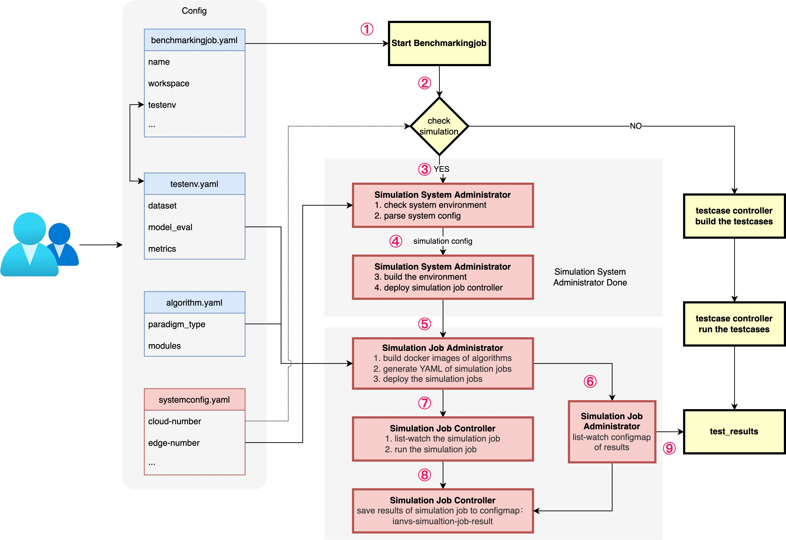

<<<<<<< HEAD
# Benchmarks for Edge-cloud Collaborative Lifelong Learning

Artificial intelligence technology has served us in all aspects of life, especially in image, video, voice, recommendation systems, etc. It has brought breakthrough results. AI Benchmark is designed to measure the performance and efficacy of AI models. There are already many authoritative AI Benchmark systems in the traditional AI field. As an emerging direction of edge AI, the corresponding Benchmark development is not perfect, and there are generally problems such as insufficient paradigm coverage, inactive communities, no edge/cloud side involved, and few test samples.
The specific research results of AI Benchmark for cloud-side-device collaboration can be found in this [document(in chinese)](https://github.com/iszhyang/AI-Benchmark-for-Cloud-Edge-Device).

As a very promising community in edge AI Benchmarking, ianvs still has the following problems to be solved

- The automatic dataset download and management features are missing, and users still need tedious operations to use the dataset.
- Repeated deployment of the edge-cloud collaboration environment is too heavy. The distributed collaborative system simulation feature of ianvs needs to be developed urgently.

This proposal provides features in datasets, edge-cloud collaborative AI system simulation, etc. for the current version of Ianvs

## Goals

The project is committed to building an edge-cloud collaborative AI Benchmark for edge-cloud collaborative lifelong detection in the Kubeedge open source community.

- Provide downloadable open source datasets and data processing scripts for the difficulty in obtaining datasets and supporting algorithms
- Provides industrial-grade distributed collaborative system simulation for the problem that the repeated deployment of edge-cloud collaboration is too heavy

## Proposal

### Edge-Cloud Collaborative AI Dataset and Corresponding Data Processing Script

It will provide an open-source edge-cloud collaborative AI dataset management module that is convenient for algorithm developers to use, which can be used as a plug-in for Sedna. The following functions will be supported:

- Dataset management of edge-cloud collaborative AI
- Quick download and use of datasets

### Industrial Distributed Collaborative System Simulation

It will provide Ianvs with docker in docker system emulation features.

## Design Details

### Dataset automatic download function

The current `testenv.yaml` file is as follows

```yaml
testenv:
  # dataset configuration
  dataset:
    # the url address of train dataset index; string type;
    train_url: "/ianvs/dataset/train_data/index.txt"
    # the url address of test dataset index; string type;
    test_url: "/ianvs/dataset/test_data/index.txt"

  # metrics configuration for test case's evaluation; list type;
  metrics:
      # metric name; string type;
    - name: "f1_score"
      # the url address of python file
      url: "./examples/pcb-aoi/singletask_learning_bench/testenv/f1_score.py"
```

For the convenience of developers, the expected testenv.yaml file is as follows:

- The user fills in the `dataset_url`, e.g. HUAWEI CLOUD OBS link.
- The user fills in `dataset_path`, where the dataset wants to be saved.

```yaml
testenv:
  # dataset configuration
  dataset:
    # the url address of dataset with zip file; string type;
    dataset_url: "https://kubeedge.obs.cn-north-1.myhuaweicloud.com:443/ianvs/pcb-aoi/dataset.zip"
    # the url address of saving dataset
    dataset_path: "./dataset/"

  # metrics configuration for test case's evaluation; list type;
  metrics:
      # metric name; string type;
    - name: "f1_score"
      # the url address of python file
      url: "./examples/pcb-aoi/singletask_learning_bench/testenv/f1_score.py"
```

The expected implementation method is to modify `dataset.py` in the `testenvmanager` module as follows:

1. Add `self.dataset_url`, `self.dataset_path`
2. Add `download_save()` function


### Semantic segmentation dataset and corresponding algorithm

dataset: [cityscapes](https://www.cityscapes-dataset.com)
Baseline algorithm: [RFNet](https://github.com/AHupuJR/RFNet)

We will provide the cityscapes dataset and corresponding methods for ianvs. The specific operation is as follows:

- dataset processing
  - generate the index file for train and test
- dataset download link
  - provide the download link of cityscapes dataset in HUAWEI Cloud OBS.
- Baseline algorithm
  

### Industrial Distributed Collaborative System Simulation

Provide ianvs with the feature of industrial distributed system simulation.

#### Framework


In the framwork of ianvs, the `simulation controller` is the core module of system simulation. The `simulation controller` has been supplemented, which build and deploy local edge-cloud simulation environment with K8s.


The models in `simulation controller` are as follows:

- The `Simulation System Administrator` is used to
  1. parse the system config(simulation)
  2. check the host enviroment, e.g. check if the host has installed docker, kind, and whether memory > 4GB
  3. build the simulation enviroment
  4. create and deploy the moudles needed in simulation enviroment
  5. close and delete the simulation enviroment
- The `Simulation Job Administrator` is the core module for manage the simulation job, and provides the following funcitons:
  1. build the docker images of algorithms to be tested
  2. generate the YAML file of `simulation job`
  3. deploy and delete the `simulation job` in K8s
  4. list-watch the results of `simulation job` in K8s

#### Flowchart



The `System Config` denotes the system config of the current benchmarkingjob, such as the `cloud number` and `edge number`.

In the flowchart diagram above, the expected flow is as follows:

1. start the benchmarkingjob
2. check whether to start emulation based on `system config`
3. `Simulation System Administrator` check environment and parse system config

  - check environment: e.g. check if the host has installed docker, kind, and whether the memory > 4GB
  - parse simulation config

4. `Simulation System Administrator` build the environment and create needed moudles.
  - build the environment: deploying a cluster including K8s and GM (global manager) locally through [all-in-one scripts of sedna](https://github.com/kubeedge/sedna/blob/527c574a60d0ae87b0436f9a8b38cf84fb6dab21/docs/setup/all-in-one.md)
  - create and deploy the `simulation job controller`

5. `Simulation Job Administrator` generate and deploy simulation jobs.
  - build the docker images of algorithms to be tested
  - generate the YAML of simulation job base on `testenv.yaml` and `algorithm.yaml`
  - deploy simulation job: access k8s API-server via `python-k8sclient` to deploy simulation jobs
6. `Simulation Job Administrator` list-watch the configmap of results: ianvs-simualtion-job-result
7. `Simulation Job Controller` run the simulation jobs
  - list-watch the simulation jobs in K8s
  - run the simulation jobs
8. `Simulation Job Controller` save results of simulation job to configmap: ianvs-simualtion-job-result
9. `Simulation Job Administrator` generates the test_results after watched the configmap of results.
## Roadmap

The roadmap would be as follows

### July

1. Community proposal.
2. Dataset Download and Use (OBS).
3. Research on AI Benchmark for cloud-edge-device collaboration.

### August

1. (0801-0814) Attempt to design the `simulation controller`.
2. (0815-0821) Adjust and modify the architecture diagram according to the opinions of the community.
3. (0822-0831) Clarify the flow chart according to the architecture diagram.

### September

1. (0901-0904) Start implementing the preliminary framework through code.
2. (0905-0911) Improve the code and verify the reliability.
3. (0912-0918) Prepare the final PR.
4. (0919-0930) Linkage integration with other projects
=======
version https://git-lfs.github.com/spec/v1
oid sha256:6567e50c07837cb0c57d86efc18d1448c9c70d2fbe13db790f0b0c0c4dc17b13
size 8063
>>>>>>> 9676c3e (ya toh aar ya toh par)
