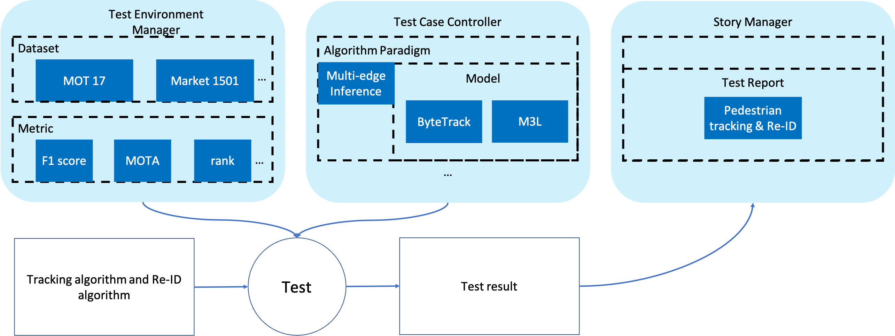

<<<<<<< HEAD
# Implement function of automatically algorithm performance tests for Sedna Edge-cloud Re-ID

## Motivation

Person Re-ID based on Cloud-edge collaborative architecture is a new example feature that Ianvs will soon support, which can continuously recognize, track and search the target person provided by the user in the source video, and push the video containing the search results to the streaming media server. Since each service module flexibly supports the AI model, it is necessary to provide users with the actual performance test of THE AI algorithm to provide a reference for the actual search effect of the system.

## Goals

1. This feature supports the existing capabilities and runtime of Ianvs and integrate into the Re-ID features;
2. This framework use open-source datasets to create test reports automatically, need to define metrics, related interface, preprocessing, and etc;
3. This framework have detailed guidance documents.

## Proposal

This project includes two tasks: pedestrian tracking and pedestrian re-identification. The performance metrics and datasets of these tasks are determined as follows.

## Design Details

### Metrics and Datasets

#### Pedestrian tracking

[MOT17](https://motchallenge.net/data/MOT17) is a benchmark datasets in the area of pedestrian tracking.

The following performance metrics are selected for pedestrian tracking.

1. **Accuracy**
2. **Precision**
3. **Recall**
4. **F1 score**

5. **MOTA**

   $MOTA=1-\frac{FN+FP+ID Sw}{G T} \in(-\infty, 1]$

6. **MOTP**

7. **IDF1**

   $IDF_{1}=\frac{2IDTP}{2IDTP+IDFP+IDFN}$

   $IDP=\frac{IDTP}{IDTP+IDFP}$

   $IDR=\frac{IDTP}{IDTP+IDFN}$

Reference

[1] P. Dollar, C. Wojek, B. Schiele and P. Perona, "Pedestrian Detection: An Evaluation of the State of the Art," in IEEE Transactions on Pattern Analysis and Machine Intelligence, vol. 34, no. 4, pp. 743-761, April 2012, doi: 10.1109/TPAMI.2011.155.

[2] Bernardin, K. & Stiefelhagen, R. Evaluating Multiple Object Tracking Performance: The CLEAR MOT Metrics. Image and Video Processing, 2008(1):1-10, 2008.
[3] Ristani, E., Solera, F., Zou, R., Cucchiara, R. & Tomasi, C. Performance Measures and a Data Set for Multi-Target, Multi-Camera Tracking. In ECCV workshop on Benchmarking Multi-Target Tracking, 2016.
[4] Jonathon Luiten, A.O. & Leibe, B. HOTA: A Higher Order Metric for Evaluating Multi-Object Tracking. International Journal of Computer Vision, 2020.
[5] Li, Y., Huang, C. & Nevatia, R. Learning to associate: HybridBoosted multi-target tracker for crowded scene. In Proceedings of the IEEE Computer Society Conference on Computer Vision and Pattern Recognition, 2009.

[6] Han, Xiaotian, et al. "MMPTRACK: Large-scale Densely Annotated Multi-camera Multiple People Tracking Benchmark." *arXiv preprint arXiv:2111.15157* (2021).

#### Pedestrian Re-identification

[Market-1501](https://openaccess.thecvf.com/content_iccv_2015/html/Zheng_Scalable_Person_Re-Identification_ICCV_2015_paper.html) is a benchmark datasets in the area of pedestrian tracking.

The following performance metrics are selected for re-identification.

1. **Accuracy**

2. **Precision**

3. **Recall**

4. **F1 score**

5. **Rank-1**: first hit rate

   $\operatorname{rank} 1=\frac{1}{\|Q\|} \sum_{q \in Q} \mathbb{1}\left(l_{q}, l_{1}^{q}\right)$

6. **Rank-5**: top 5 hit rate

7. **Rank-10**: top 10 hit rate

8. **Rank-20**: top 20 hit rate

Reference

[1] Liang Zheng, Liyue Shen, Lu Tian, Shengjin Wang, Jingdong Wang, Qi Tian; Proceedings of the IEEE International Conference on Computer Vision (ICCV), 2015, pp. 1116-1124

[2] Wei Li, Rui Zhao, Tong Xiao, Xiaogang Wang; Proceedings of the IEEE Conference on Computer Vision and Pattern Recognition (CVPR), 2014, pp. 152-159

### Framework


### Embedded in Ianvs

This proposal is planned to be added to Ianvs in the form of a example. We provide datasets for tracking and Re-ID. Then users upload tracking and Re-ID algorithms. Finally, the test report is generated.

Files added are as follows:

```
ianvs
|- core
    |- testcasecontroller
        |- algorithm
            |- paradigm
                |- multi-edge inference
                    |- multi-edge_inference.py
|- example
    |- pedestrian tracking
        |- multi-edge inference bench
            |- testalgorithm
                |- tracking
                |- reid
                |- bytetrack.yaml
                |- m3l.yaml
            |- testenv
                |- tracking
                    |- precision.py
                    |- recall.py
                    |- mota.py
                    |- motp.py
                    |- testenv.yaml
                |- reid
                    |- mAP.py
                    |- rank_1.py
                    |- rank_5.py
                    |- rank_10.py
                    |- rank_20.py
                    |- testenv.yaml
            |- benchmarkingjob.yaml
```
=======
version https://git-lfs.github.com/spec/v1
oid sha256:3591e91b94be227ba6be07d5c82c23c00c98ea335e119e1a954ee45d01e39ca7
size 4932
>>>>>>> 9676c3e (ya toh aar ya toh par)
