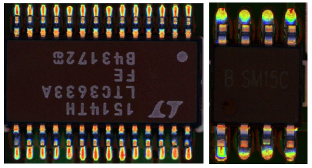

# Testing incremental learning in industrial defect detection

## About Industrial Defect Detection 

In recent years, the manufacturing process is moving towards a higher degree of automation and improved manufacturing efficiency. During this development, smart manufacturing increasingly employs computing technologies, for example, with a higher degree of automation, there is also a higher risk in product defects; thus, a number of machine learning models have been developed to detect defectives in the manufacturing process.  

Defects are an unwanted thing in manufacturing industry. There are many types of defect in manufacturing like blow holes, pinholes, burr, shrinkage defects, mould material defects, pouring metal defects, metallurgical defects, etc. For removing this defective product all industry have their defect detection department. But the main problem is this inspection process is carried out manually. It is a very time-consuming process and due to human accuracy, this is not 100\% accurate. This can because of the rejection of the whole order. So it creates a big loss in the company.

## About Dataset

The printed circuit board (PCB) industry is not different. Surface-mount technology (SMT) is a technology that automates PCB production in which components are mounted or placed onto the surface of printed circuit boards. Solder paste printing (SPP) is the most delicate stage in SMT. It prints solder paste on the pads of an electronic circuit panel. Thus, SPP is followed by a solder paste inspection (SPI) stage to detect defects. SPI scans the printed circuit board for missing/less paste, bridging between pads, miss alignments, and so forth. Boards with anomaly must be detected, and boards in good condition should not be disposed of. Thus SPI requires high precision and a high recall. 

As an example in this document, we are using [the PCB-AoI dataset](https://www.kaggle.com/datasets/kubeedgeianvs/pcb-aoi) released by KubeEdge SIG AI members on Kaggle. See [this link](../scenarios/industrial-defect-detection/pcb-aoi.md) for more information of this dataset. Below also shows two example figures in the dataset. 




## About Incremental Learning
Traditionally, the data is collected manually and periodically retrained on the cloud to improve the model effect. However, data is continuously generated on the edge side. Traditional method wastes a lot of human resources, and the model update frequency is slow.  

Incremental learning allows users to continuously monitor the newly generated data and by configuring some triggering rules to determine whether to start training, evaluation, and deployment automatically, and continuously improve the model performance.

Its goals include:
* Automatically retrains, evaluates, and updates models based on the data generated at the edge.
* Support time trigger, sample size trigger, and precision-based trigger.
* Support manual triggering of training, evaluation, and model update.
* Support hard example discovering of unlabeled data,  for reducing the manual labeling workload. 

This report is testing the basic incremental algorithm based on FPN and interested readers can refer to [the basicIL-fpn](../algorithms/incremental-learning/basicIL-fpn.md) for more details.

## Benchmark Setting

Key settings of the test environment to incremental learning are as follows:

``` yaml
# testenv.yaml
testenv:
  # dataset configuration
  dataset:
    # the url address of train dataset index; string type;
    train_url: "/ianvs/dataset/train_data/index.txt"
    # the url address of test dataset index; string type;
    test_url: "/ianvs/dataset/test_data/index.txt"

  # model eval configuration of incremental learning;
  model_eval:
    # metric used for model evaluation
    model_metric:
      # metric name; string type;
      name: "f1_score"
      # the url address of python file
      url: "./examples/pcb-aoi/incremental_learning_bench/testenv/f1_score.py"

    # condition of triggering inference model to update
    # threshold of the condition; types are float/int
    threshold: 0.01
    # operator of the condition; string type;
    # values are ">=", ">", "<=", "<" and "=";
    operator: ">="

  # metrics configuration for test case's evaluation; list type;
  metrics:
      # metric name; string type;
    - name: "f1_score"
      # the url address of python file
      url: "./examples/pcb-aoi/incremental_learning_bench/testenv/f1_score.py"
    - name: "samples_transfer_ratio"

  # incremental rounds setting for incremental learning paradigm.; int type; default value is 2;
  incremental_rounds: 2
```

Key settings of the algorithm to incremental learning are as follows:

```yaml
# algorithm.yaml
algorithm:
  # paradigm type; string type;
  # currently the options of value are as follows:
  #   1> "singletasklearning"
  #   2> "incrementallearning"
  paradigm_type: "incrementallearning"
  incremental_learning_data_setting:
    # ratio of training dataset; float type.
    # the default value is 0.8.
    train_ratio: 0.8
    # the method of splitting dataset; string type; optional;
    # currently the options of value are as follows:
    #   1> "default": the dataset is evenly divided based train_ratio;
    splitting_method: "default"
  # the url address of initial model for model pre-training; string url;
  initial_model_url: "/ianvs/initial_model/model.zip"

  # algorithm module configuration in the paradigm; list type;
  modules:
    # type of algorithm module; string type;
    # currently the options of value are as follows:
    #   1> "basemodel": contains important interfaces such as train¡¢ eval¡¢ predict and more; required module;
    - type: "basemodel"
      # name of python module; string type;
      # example: basemodel.py has BaseModel module that the alias is "FPN" for this benchmarking;
      name: "FPN"
      # the url address of python module; string type;
      url: "./examples/pcb-aoi/incremental_learning_bench/testalgorithms/fpn/basemodel.py"

      # hyperparameters configuration for the python module; list type;
      hyperparameters:
        # name of the hyperparameter; string type;
        - momentum:
            # values of the hyperparameter; list type;
            # types of the value are string/int/float/boolean/list/dictionary
            values:
              - 0.95
              - 0.5
          # hyperparameters configuration files; dictionary type;
        - other_hyperparameters:
            # the url addresses of hyperparameters configuration files; list type;
            # type of the value is string;
            values:
              - "./examples/pcb-aoi/incremental_learning_bench/testalgorithms/fpn/fpn_hyperparameter.yaml"
      #  2> "hard_example_mining": check hard example when predict ; optional module;
    - type: "hard_example_mining"
      # name of python module; string type;
      name: "IBT"
      # the url address of python module; string type;
      url: "./examples/pcb-aoi/incremental_learning_bench/testalgorithms/fpn/hard_example_mining.py"
      # hyperparameters configuration for the python module; list type;
      hyperparameters:
        # name of the hyperparameter; string type;
        # threshold of image; value is [0, 1]
        - threshold_img:
            values:
              - 0.9
        # predict box of image; value is [0, 1]
        - threshold_box:
            values:
              - 0.9

```

## Benchmark Result

We release the
leaderboard [here](../leaderboards/leaderboard-in-industrial-defect-detection-of-PCB-AoI/leaderboard-of-incremental-learning.md)
.

## Effect Display

The pcb image has 8 bad defects. See [label file](./images/20170316-SPI-AOI-19.xml) for details.

* Before incremental learning, `7` the bad defects have been detected.


* After incremental learning, `8` the bad defects have been detected.

