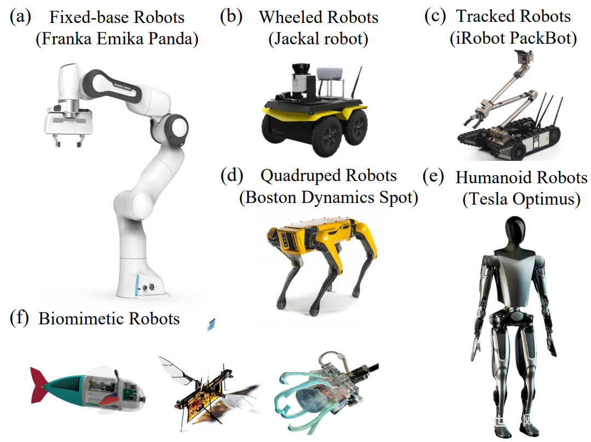
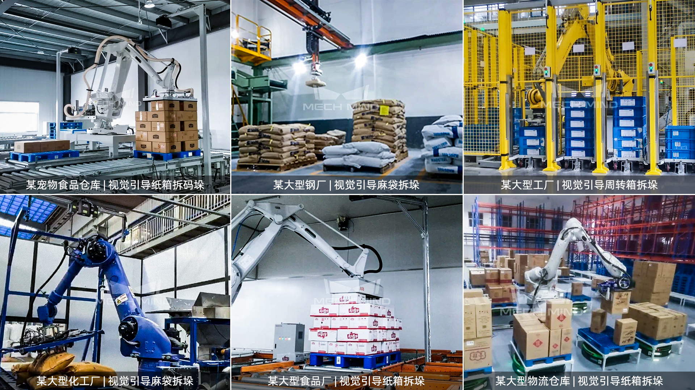
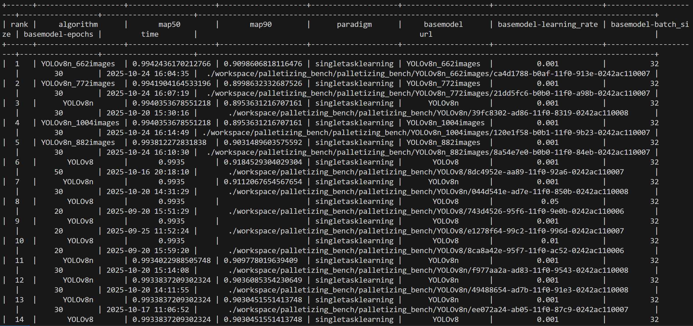

<<<<<<< HEAD
# Table of Contents

- [Embodied Intelligence Benchmarking Framework for Industrial Manufacturing with KubeEdge](#embodied-intelligence-benchmarking-framework-for-industrial-manufacturing-with-kubeEdge)
    - [Introduction](#introduction)
    - [Why we need Embodied Intelligence Benchmarking Framework for Industrial Manufacturing with KubeEdge](#why-we-need-embodied-intelligence-benchmarking-framework-for-industrial-manufacturing-with-kubeEdge)
    - [Business Value](#business-value)
      - [The Application Value in Industrial Palletizing Scenarios](#the-application-value-in-industrial-palletizing-scenarios)

- [Platform](#platform)
  - [RoboDK](#robodk)

- [Quick Start Guide](#quick-start-guide)
    - [Required Resources](#required-resources)
    - [Detailed Setup Guide](#detailed-setup-guide)
        - [Step 1. Ianvs Preparation](#step-1-ianvs-preparation)
        - [Step 2. Dataset and Model Preparation](#step-2-dataset-and-model-preparation)
            - [RoboDK Palletizing Dataset](#robodk-palletizing-dataset)
            - [Dataset Configuration](#dataset-configuration)
            - [Model Preparation](#model-preparation)
        - [Step 3. Run Ianvs](#step-3-run-ianvs)
            - [Run Example](#run-example)
        - [Results](#results)
          - [Discussion](#discussion)

- [Configuration File Explanation](#configuration-file-explanation)
    - [benchmarkingjob.yaml](#benchmarkingjobyaml)
    - [testenv.yaml](#testenvyaml)
    - [algorithm.yaml](#algorithmyaml)

- [Problems and Solutions](#problems-and-solutions)
  - [1. Selection of Scenario](#1-selection-of-scenario)
  - [2. Palletizing Dataset Adjustment](#2-palletizing-dataset-adjustment)
  - [3. Debugging of Code](#3-debugging-of-code)


- [Future](#future)
    - [1. Dataset Expansion](#1-dataset-expansion)
    - [2. Algorithm Diversification](#2-algorithm-diversification)
    - [3. Cloud-Edge Collaboration Optimization](#3-cloud-edge-collaboration-optimization)
    - [4. Deep Mining: New Applications of Robot Arm Information](#4-deep-mining-new-applications-of-robot-arm-information)
    
        
# Embodied Intelligence Benchmarking Framework for Industrial Manufacturing with KubeEdge

### Introduction

With the accelerated evolution of intelligent industrial manufacturing, industrial robots, flexible production lines, and intelligent testing equipment are continuously being innovated. **Cloud-edge collaboration technology** (e.g., KubeEdge) has become the core engine driving **embodied intelligence** systems in complex industrial scenarios, thanks to its efficient data processing and real-time response capabilities.

Based on the **KubeEdge Ianvs collaborative AI benchmarking framework**, this project aims to build a complete system including industrial scenario test datasets, simulation test environments, and multi-dimensional performance indicators. It targets professional, industry-specific intelligent testing capabilities for industrial manufacturing.

Notably, current industrial demands for embodied intelligent services are developing toward **high-precision perception and decision-making, dynamic real-time response, and cross-device collaborative control**.  

### Why we need Embodied Intelligence Benchmarking Framework for Industrial Manufacturing with KubeEdge

Existing universal embodied intelligence benchmarks fail to provide accurate assessments for industrial scenarios because they **lack targeted consideration of unique industrial needs and equipment characteristics**.

Industrial scenarios have stricter requirements than general scenarios: For example, robot palletizing requires ±1mm positioning accuracy, and dynamic production lines demand system responses within 50ms. General benchmarks do not cover these indicators, creating a bottleneck for industrial embodied intelligence development.

**KubeEdge’s cloud-edge collaboration capabilities** address key industrial demands such as real-time data processing and low-latency control—making it critical to build an industry-specific benchmarking framework on top of this technology to bridge the gap.

## Business Value



*Figure 1: Application Examples of Embodied Intelligence.*

Industrial embodied intelligence deeply integrates AI with physical devices through the closed-loop capability of "perception decision execution", bringing multidimensional business returns to enterprises, mainly reflected in the following three points:

- Significantly reduce operating costs: replace manual labor to complete high-risk, high-intensity, and repetitive work (such as heavy handling and high-temperature environment operations), reduce long-term costs such as labor recruitment, training, and social security, and at the same time reduce material loss or equipment failure costs caused by manual operation errors.

- Improve production efficiency and stability: It can achieve uninterrupted operation for 7 × 24 hours, with response speed (such as millisecond level action adjustment) far exceeding manual labor, and stable operation accuracy (such as millimeter level positioning), avoiding efficiency fluctuations caused by manual fatigue, and helping enterprises improve production capacity and product compliance.

- Promote the digital upgrading of the manufacturing industry: as the "execution terminal" of the industrial Internet, it can collect production data in real time (such as equipment operating parameters, material status), provide data support for enterprise production scheduling, process optimization, predictive maintenance, and accelerate the transformation from "automation" to "intelligence".

### The Application Value in Industrial Palletizing Scenarios



*Figure 2: Specific Application Cases of Industrial Palletizing Scenarios.*

Stacking is a core link in industries such as logistics, food, chemical, and building materials. Traditional manual or purely automated stacking has problems such as low efficiency and poor flexibility. The application of industrial embodied intelligence can address these pain points in a targeted manner, and the specific value is as follows:

- Addressing the pain point of "flexibility" and adapting to multi-category production: Traditional automated palletizing machines require customized fixtures for fixed materials (such as uniform sized cardboard boxes), and need to be stopped and adjusted when switching categories; Industrial embodied intelligence can recognize material size and shape through visual recognition, combined with flexible movements of robotic arms, quickly adapt to different specifications of materials (such as bagged, boxed, and barreled), without the need for manual intervention, especially suitable for multi-category and small batch production modes.

- Improving palletizing efficiency and safety: The manual palletizing efficiency is about 80-120 stacks per hour, and it is prone to efficiency decline due to physical exertion; Industrial intelligent equipment can achieve stable operation of 200-300 stacks per hour, while avoiding safety accidents such as lumbar muscle strain and material injuries caused by manual handling of heavy objects, and reducing the cost of enterprise safety management.

- Reduce dependence on manual skills and management difficulties: palletizing work requires high physical strength from manual labor and high personnel turnover, requiring companies to repeatedly train new employees; Industrial embodied intelligence can complete tasks through preset programs or remote debugging, requiring only a small number of technical personnel for maintenance, reducing reliance on frontline manual workers, and lowering personnel management complexity.

- Connecting upstream and downstream processes, optimizing supply chain collaboration: It can seamlessly integrate with upstream production lines (such as packaging machines) and downstream warehousing systems (such as AGVs, three-dimensional warehouses), receive material signals in real time, automatically complete palletizing, and then transfer the coded pallets to the warehousing area, achieving unmanned closed-loop of the "production palletizing warehousing" process and shortening material turnover time.


## Platform

### RoboDK

This project is developed and validated based on the RoboDK platform. As an integrated development environment for the field of industrial automation, RoboDK has low entry requirements and a rich open-source example library([Link](https://robodk.com.cn/cn/stations?RDK&Stations=1&utm_source=RoboDK&utm_medium=Software&PC_OS=WIN64&ProgName=RoboDK&ProgVer=5.8.0&ProgDate=2024-09-23&PCID=2d884cf6d40bd81610dea84e7e7e08ee&LNH=e4b88de58f97e99990e588b6&id_login=12105921)). It not only provides a clear entry path for novice developers, but also reduces technical verification costs through reusable modular cases. Developers can conduct secondary development and functional iteration on the basis of existing examples, quickly adapting to the actual needs of industrial grade embodied intelligence scenarios. ​

In the core scenario of this project, targeted optimization is required for the RoboDK example code: the focus is on improving the target detection accuracy and grasping pose calculation accuracy of the visual perception module (camera system). By optimizing the image preprocessing logic, improving the efficiency of target feature matching, and perfecting the grasping area positioning algorithm, high-precision recognition of the target object by the camera and precise output of grasping points are achieved. Ultimately, reliable visual guidance support is provided for the motion control, trajectory planning, and stable operation of the robotic arm, ensuring that the entire grasping process meets the core requirements of "high precision, high stability, and high adaptability" in industrial production.

## Quick Start Guide

Welcome to Ianvs! Ianvs tests the performance of distributed synergy AI solutions against recognized standards, facilitating efficient development. This guide helps implement benchmarks for embodied intelligence in cloud-edge collaborative industrial scenarios, reducing manual procedures to a few steps.

### Required Resources

Before using Ianvs, you might want to have the device ready:


*Figure 3: Required resources should be available on our computer or cloud server.*

In this example, we are using the Linux platform with Python 3.8. If you are using Windows, most steps should still apply but a few commands and package requirements might be different.

I suggest that everyone try to use Python 3.8 or above and install Ianvs on servers with GPUs as much as possible. If your laboratory cannot provide servers with GPUs, you can consider renting a GPU cloud server. In this case, I rented a cloud server in **autodl** for installing Ianvs.

### Detailed Setup Guide

#### Step 1. Ianvs Preparation

```bash
# Firstly, create a folder for Ianvs. 
# Please note that if you install Ianvs to a different location, 
# some of the path configurations in this tutorial will also need to be modified.
mkdir ianvs
cd ianvs # One might use another path preferred
mkdir project
cd project

# Then pull Ianvs from GitHub:
git clone https://github.com/kubeedge/ianvs.git

# Then we need to update some configurations:
sudo apt-get update
sudo apt-get install libgl1-mesa-glx -y # # Fix potential OpenCV dependencies
python -m pip install --upgrade pip

# Then install some third-party packages that Ianvs needs:
cd ianvs/project/ianvs
python -m pip install ./examples/resources/third_party/*
python -m pip install -r requirements.txt 
python setup.py install

# After installation is complete, enter the command:
ianvs -v
```

If the ianvs version can be displayed correctly as follows:


*Figure 4: Successful installation prompt showing Ianvs version (e.g., v0.1.0).*

It means you have successfully installed it.

#### Step 2. Dataset and Model Preparation

##### RoboDK Palletizing Dataset

Due to RoboDK's output format being more inclined towards "raw data records within the scene", while Ianvs requires "standardized, structured, and correlatable test data", there is a high probability of differences between the two native formats. Therefore, it is necessary to convert or adapt the data format according to Ianvs' specifications to ensure that the data is correctly parsed and used for algorithm testing.

For the motion information of the robot and the image information of the camera obtained later, we can use the algorithm in the above table to further process them.

##### Dataset Configuration

Firstly, we need to configure the RoboDK Palletizing Dataset and create a folder for the dataset. Please note that if you move the dataset to another location, some of the path configurations in this tutorial will also need to be modified.

The RoboDK Palletizing Dataset less than 100MB and is currently stored on Kaggle. You can download it locally and then upload it to the server.

*DatasetURL*: [RoboDK Palletizing Dataset](https://www.kaggle.com/datasets/kubeedgeianvs/the-robodk-palletizing-dataset/data) 

You can also use the Kaggle API to directly download it to the server. The command is as follows:

```bash
# Create a dataset folder (path can be adjusted, but update YAML files accordingly)
mkdir -p ~/data/datasets 
cd ~/data/datasets

# Download the dataset via Kaggle API (≤100MB)
python -m pip install kaggle

# Note: Place Kaggle API token (kaggle.json) in ~/.kaggle/ first (see Kaggle official guide)
kaggle datasets download kubeedgeianvs/the-robodk-palletizing-dataset

# Unzip the dataset
unzip RoboDK_Palletizing_Dataset.zip
```

##### Model Preparation

We use YOLOv8 for object detection in palletizing scenarios. Install it via:

```bash
pip install ultralytics
```

*YAML Configuration Notes*:

- benchmarkjob.yaml: The workspace field specifies where model training outputs are saved (adjust to your path).

- testenv.yaml: train_index and test_index must point to the dataset's train_index.txt and test_index.txt (update if dataset path differs).

#### Step 3. Run Ianvs

##### Run Example

Assuming the current directory is `ianvs/project` created in Step 1, execute the following relative path command.(adjust path to match your installation)

```bash
# Navigate to the single-task learning benchmark directory
cd ianvs/project/ianvs/example/RoboDK_Palletizing/singletask_learning_bench/singletasklearning

# Start benchmarking
ianvs -f benchmarkingjob.yaml 
```

### Results

If successful, the output will include metrics like map50 and map90 (example snippet):



*Figure 5: Successful run the example and the output.*

Result Interpretation:

- map50: Mean Average Precision at IoU=0.5 (critical for industrial detection; ≥0.85 is considered acceptable for palletizing).
- map90: Mean Average Precision at IoU=0.9 (strict metric for high-precision scenarios).
- If metrics are low: Check dataset path consistency, adjust hyperparameters (e.g., reduce batch_size to 16), or recheck data format adaptation and so on.

| rank | algorithm          | map50               | map90               | paradigm          | basemodel          | basemodel-learning_rate | basemodel-batch_size | basemodel-epochs | time                 | url                                                                                                   |
|------|--------------------|---------------------|---------------------|--------------------|--------------------|-------------------------|----------------------|------------------|----------------------|-------------------------------------------------------------------------------------------------------|
| 1    | YOLOv8n_662images  | 0.9942436170212766  | 0.9098606818116476  | singletasklearning | YOLOv8n_662images  | 0.001                   | 32                   | 30               | 2025-10-24 16:04:35  | ./workspace/palletizing_bench/palletizing_bench/YOLOv8n_662images/ca4d1788-b0af-11f0-913e-0242ac110007 |
| 2    | YOLOv8n_772images  | 0.9941904164533196  | 0.8998632332687526  | singletasklearning | YOLOv8n_772images  | 0.001                   | 32                   | 30               | 2025-10-24 16:07:19  | ./workspace/palletizing_bench/palletizing_bench/YOLOv8n_772images/21dd5fc6-b0b0-11f0-a98b-0242ac110007 |
| 3    | YOLOv8n            | 0.9940353678551218  | 0.8953631216707161  | singletasklearning | YOLOv8n            | 0.001                   | 32                   | 30               | 2025-10-20 15:30:16  | ./workspace/palletizing_bench/palletizing_bench/YOLOv8n/39fc8302-ad86-11f0-8319-0242ac110008          |
| 4    | YOLOv8n_1004images | 0.9940353678551218  | 0.8953631216707161  | singletasklearning | YOLOv8n_1004images | 0.001                   | 32                   | 30               | 2025-10-24 16:14:49  | ./workspace/palletizing_bench/palletizing_bench/YOLOv8n_1004images/120e1f58-b0b1-11f0-9b23-0242ac110007|
| 5    | YOLOv8n_882images  | 0.993812272831838   | 0.9031489603575592  | singletasklearning | YOLOv8n_882images  | 0.001                   | 32                   | 30               | 2025-10-24 16:10:30  | ./workspace/palletizing_bench/palletizing_bench/YOLOv8n_882images/8a54e7e0-b0b0-11f0-84eb-0242ac110007 |
| 6    | YOLOv8n_552images  | 0.9851768352168014   | 0.9028305327038256  | singletasklearning | YOLOv8n_552images  | 0.001                   | 32                   | 30               | 2025-10-24 16:01:52  | ./workspace/palletizing_bench/palletizing_bench/YOLOv8n_552images/72ae1a22-b0af-11f0-b50e-0242ac110007 |
| 7    | YOLOv8n_442images  | 0.988766891891892   | 0.8731341250573811  | singletasklearning | YOLOv8n_442images  | 0.001                   | 32                   | 30               | 2025-10-24 15:56:57  | ./workspace/palletizing_bench/palletizing_bench/YOLOv8n_442images/cb6d96fc-b0ae-11f0-bfd6-0242ac110007 |
| 8    | YOLOv8n_332images  | 0.9848021519257352   | 0.8640307670238345  | singletasklearning | YOLOv8n_332images  | 0.001                   | 32                   | 30               | 2025-10-24 15:53:04  | ./workspace/palletizing_bench/palletizing_bench/YOLOv8n_332images/4a9f7dce-b0ae-11f0-b327-0242ac110007 |
| 9    | YOLOv8n_221images  | 0.9854521970142234   | 0.8661734327231434  | singletasklearning | YOLOv8n_221images  | 0.001                   | 32                   | 30               | 2025-10-24 15:14:01  | ./workspace/palletizing_bench/palletizing_bench/YOLOv8n_221images/dfc1284a-b0a8-11f0-9595-0242ac110007 |
| 10    | YOLOv8n_121images  | 0.9784402472527473   | 0.9045682262077565  | singletasklearning | YOLOv8n_121images  | 0.001                   | 32                   | 30               | 2025-10-24 15:16:36  | ./workspace/palletizing_bench/palletizing_bench/YOLOv8n_121images/411e4280-b0a9-11f0-be96-0242ac110007 |
| 11    | YOLOv8n_0images  | 0.0   | 0.0  | singletasklearning | YOLOv8n_0images  | 0.001                   | 32                   | 30               | 2025-10-24 15:11:23  |  ./workspace/palletizing_bench/palletizing_bench/YOLOv8n_0images/9751a828-b0a8-11f0-a01a-0242ac110007 |
| 12    | YOLOv8s  | 0.9929186046511628   | 0.9019788142846497  | singletasklearning | YOLOv8s  | 0.001                   | 32                   | 30               | 2025-10-16 20:58:42  |  ./workspace/palletizing_bench/palletizing_bench/YOLOv8s/46bf58c0-aa8f-11f0-8de0-0242ac110007  |
| 13    | YOLOv10n  | 0.9830577468785686   | 0.9006151689841618  | singletasklearning | YOLOv10n  | 0.001                   | 32                   | 30               | 2025-10-21 10:08:25  |  ./workspace/palletizing_bench/palletizing_bench/YOLOv10n/531a6c22-ae22-11f0-a093-0242ac110006  |
| 14    | YOLO11n  | 0.9929186046511628   | 0.9097108359994436  | singletasklearning | YOLO11n  | 0.001                   | 32                   | 30               | 2025-10-17 10:18:56  |  ./workspace/palletizing_bench/palletizing_bench/YOLO11n/345690a2-aaff-11f0-bc65-0242ac110007  |
| 15    | YOLO12n  | 0.9907157387346394   | 0.9172008060765484  | singletasklearning | YOLO12n  | 0.001                   | 32                   | 30               | 2025-10-21 09:51:03  |  ./workspace/palletizing_bench/palletizing_bench/YOLO12n/dd3425ea-ae1f-11f0-9342-0242ac110006   |

#### Discussion

- In this **object detection task**, the model exhibits **extremely strong few sample convergence ability**. Even with only 121 samples, the YOLOv8n series can still achieve mAP50 of 0.978 and mAP90 of 0.905, which fully demonstrates the high learnability of this task and belongs to a **relatively simple object detection scenario**. The model can **quickly learn effective features and achieve performance convergence with a small number of sample inputs**. 

- Further observation shows that although the performance of different model variants with sample sizes ranging from 221 to 1004 fluctuates, the overall performance remains at a high level, which once again confirms that the task requires a low threshold for sample size. **A small number of samples can support the model to complete effective training and achieve performance**. Based on this, in the future, we can focus on the direction of **Few Shot object detection**, explore the generalization boundary of the model in a very small number of samples, and introduce complex scene variables (such as multi class confusion and dense target distribution) to comprehensively verify the performance **resilience and scalability** of the algorithm when transferring from simple tasks to complex scenes.

## Configuration File Explanation

This section explains key configuration files to clarify the single-task learning workflow in Ianvs.

### benchmarkingjob.yaml

The core configuration file for running Ianvs, specifying the test environment, algorithms, and evaluation criteria:

```yaml
benchmarkingjob:
  name: "palletizing_bench"
  workspace: "./workspace/palletizing_bench"

  testenv: "/root/ianvs/project/ianvs-0.3.0/examples/Palletizing/singletask_learning_bench/testenv/testenv.yaml"

  test_object:
    type: "algorithms"
    algorithms:
      - name: "YOLOv8n"
        url: "/root/ianvs/project/ianvs-0.3.0/examples/Palletizing/singletask_learning_bench/testalgorithms/algorithm.yaml"

  rank:
    sort_by:
      - { "map50": "descend" }
      - { "map90": "descend" }

    visualization:
      mode: "selected_only"
      method: "print_table"

    selected_dataitem:
      paradigms: [ "all" ]
      modules: [ "all" ]
      hyperparameters: [ "all" ]
      metrics: [ "map50", "map90"]

    save_mode: "selected_and_all"

```

*Note*: Replace all `/root/ianvs/...` paths with your actual installation path (use `pwd` to check current directory).

### testenv.yaml

Configures the test environment, including dataset paths and evaluation metrics:

```yaml
testenv:
  # dataset configuration
  dataset:
    # the url address of train dataset index; string type;
    train_index: "/root/ianvs/project/data/dataset/RoboDK_Palletizing_Dataset/train_index.txt"
    # the url address of val dataset index; string type;
    test_index: "/root/ianvs/project/data/dataset/RoboDK_Palletizing_Dataset/test_index.txt"

  # metrics configuration for test case's evaluation; list type;
  metrics:
      # metric name; string type;
    - name: "map50"
      # the url address of python file
      url: "/root/ianvs/project/ianvs-0.3.0/examples/Palletizing/singletask_learning_bench/testenv/map50.py"
    - name: "map90"
      # the url address of python file
      url: "/root/ianvs/project/ianvs-0.3.0/examples/Palletizing/singletask_learning_bench/testenv/map90.py"

```

### algorithm.yaml

Defines the algorithm and hyperparameters for single-task learning:

```yaml
algorithm:
  paradigm_type: "singletasklearning"

  modules:
    - type: "basemodel"
      name: "YOLOv8n"
      url: "/root/ianvs/project/ianvs-0.3.0/examples/Palletizing/singletask_learning_bench/testalgorithms/basemodel.py"
      
      hyperparameters:
        - learning_rate:
           values: 
            - 0.001
        - batch_size:
           values: 
            - 32
        - epochs:
           values: 
            - 30

```

## Problems and Solutions

### 1. Selection of Scenario

- The initial plan was to choose the industrial assembly scene, but considering the high difficulty of building from scratch and the fact that the Pybullet platform is not user-friendly for beginners, as well as the need to design components through CAD, the implementation threshold was high, so the direction was adjusted. After consultation with the mentor, the palletizing scenario was ultimately selected: RoboDK simulator is easy to operate, beginner friendly, and more suitable for expanding and practicing functions on this basis.

### 2. Palletizing Dataset Adjustment

- The solution to the problem of insufficient fit of the original dataset and limited size of the training and testing sets is as follows: generate shader files for real color rendering through code in RoboDK to improve data authenticity; Synchronize the expansion of the dataset to ensure sufficient training of the model. The annotation work for the entire dataset takes about 2 days.

### 3. Debugging of Code

- During the code debugging phase, the ranking results could not be generated due to the code not conforming to the ianvs paradigm. Through discussions with mentors, weekly meetings, and starting from the ianvs core code, the internal logic and input/output specifications of StoryManager were analyzed layer by layer, and the paradigm incompatibility issue was finally corrected in a targeted manner. The ranking results were successfully displayed correctly, and the entire process was completed.

## Future

This framework provides a foundation for industrial embodied intelligence benchmarking but has limitations, such as a singular dataset that may not reflect real-world complexity. Future improvements include:

### **1. Dataset Expansion**
- **Add diverse scenarios**: varying lighting (glare/shadow), material types (metal/plastic), and dynamic interference (human workers in the scene).

- **Increase scale** to 5,000+ annotated images for more robust evaluation.

- **Introduce oriented bounding box annotations**: For objects with angular tilts, adopt rotated bounding boxes with angle features instead of traditional axis-aligned boxes. This reduces the inclusion of redundant background information, enabling models to focus on object-specific features and further improving detection precision.

### **2. Algorithm Diversification**
- **Integrate state-of-the-art models** (e.g., Faster R-CNN, DETR) and compare their performance on edge devices (focusing on inference speed ≤100ms and precision).

### **3. Cloud-Edge Collaboration Optimization**
- **Add metrics** for edge-device resource usage (CPU/GPU/memory) and latency, to evaluate real-world deployment feasibility.

### **4. Deep Mining: New Applications of Robot Arm Information**

- **Information utilization direction**
Combining Visual Language Action (VLA) and other technologies, utilizing the motion and joint information of the robotic arm for path planning, and planning a more reasonable robotic arm movement path based on joint angles and motion trends to improve operational accuracy and efficiency.

- **Optimization of control strategy**
Utilize this information to adjust the control strategy of the robotic arm in real-time, such as optimizing power output based on joint loads and motion states, enhancing the stability and adaptability of the robotic arm.

- **Intelligent task execution** 
By using Visual Language Action (VLA) to associate language instructions with robotic arm movements, the robotic arm can use its own motion and joint information to complete complex tasks based on language instructions, thereby enhancing its level of intelligence.
=======
version https://git-lfs.github.com/spec/v1
oid sha256:4c270fbd648b6837a0c89e9eb636882aec20d3a78d6cf1a3745f23f75d802d75
size 28038
>>>>>>> 9676c3e (ya toh aar ya toh par)
