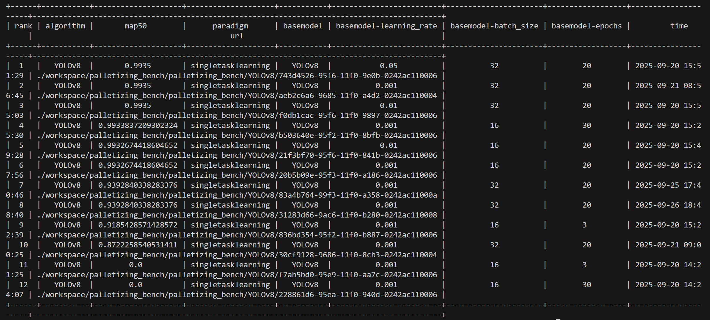

# Tabel of Contents

- [Embodied Intelligence Benchmarking Framework for Industrial Manufacturing with KubeEdge](#embodied-intelligence-benchmarking-framework-for-industrial-manufacturing-with-kubeEdge)
    - [Introduction](#introduction)
    - [Why we need Embodied Intelligence Benchmarking Framework for Industrial Manufacturing with KubeEdge](#why-we-need-embodied-intelligence-benchmarking-framework-for-industrial-manufacturing-with-kubeEdge)

- [Quick Start Guide](#quick-start-guide)
    - [Required Resources](#required-resources)
    - [Detailed Setup Guide](#detailed-setup-guide)
        - [Step 1. Ianvs Preparation](#step-1-ianvs-preparation)
        - [Step 2. Dataset and Model Preparation](#step-2-dataset-and-model-preparation)
            - [RoboDK Palletizing Dataset](#robodk-palletizing-dataset)
            - [Dataset Configuration](#dataset-configuration)
            - [Model Preparation](#model-preparation)
        - [Step 3. Run Ianvs](#step-3-run-ianvs)
            - [Run Example](#run-expample)
        - [Results](#results)

- [Configuration File Explanation](#configuration-file-explanation)
    - [benchmarkingjob.yaml](#benchmarkingjobyaml)
    - [testenv.yaml](#testenvyaml)
    - [algorithm.yaml](#algorithmyaml)

- [Future](#future)
    - [1. Dataset Expansion](#1-dataset-expansion)
    - [2. Algorithm Diversification](#2-algorithm-diversification)
    - [3. Cloud-Edge Collaboration Optimization](#3-cloud-edge-collaboration-optimization)
    
        
## Embodied Intelligence Benchmarking Framework for Industrial Manufacturing with KubeEdge

### Introduction

With the accelerated evolution of intelligent industrial manufacturing, industrial robots, flexible production lines, and intelligent testing equipment are continuously being innovated. **Cloud-edge collaboration technology** (e.g., KubeEdge) has become the core engine driving **embodied intelligence** systems in complex industrial scenarios, thanks to its efficient data processing and real-time response capabilities.

Based on the **KubeEdge Ianvs collaborative AI benchmarking framework**, this project aims to build a complete system including industrial scenario test datasets, simulation test environments, and multi-dimensional performance indicators. It targets professional, industry-specific intelligent testing capabilities for industrial manufacturing.

Notably, current industrial demands for embodied intelligent services are developing toward **high-precision perception and decision-making, dynamic real-time response, and cross-device collaborative control**.  

### Why we need Embodied Intelligence Benchmarking Framework for Industrial Manufacturing with KubeEdge

Existing universal embodied intelligence benchmarks fail to provide accurate assessments for industrial scenarios because they **lack targeted consideration of unique industrial needs and equipment characteristics**.

Industrial scenarios have stricter requirements than general scenarios: For example, robot palletizing requires ±1mm positioning accuracy, and dynamic production lines demand system responses within 50ms. General benchmarks do not cover these indicators, creating a bottleneck for industrial embodied intelligence development.

## Quick Start Guide

Welcome to Ianvs! Ianvs tests the performance of distributed synergy AI solutions against recognized standards, facilitating efficient development. This guide helps implement benchmarks for embodied intelligence in cloud-edge collaborative industrial scenarios, reducing manual procedures to a few steps.

### Required Resources

Before using Ianvs, you might want to have the device ready:


*Figure 1: Required resources should be available on our computer or cloud server.*

In this example, we are using the Linux platform with Python 3.8. If you are using Windows, most steps should still apply but a few commands and package requirements might be different.

I suggest that everyone try to use Python 3.8 or above and install Ianvs on servers with GPUs as much as possible. If your laboratory cannot provide servers with GPUs, you can consider renting a GPU cloud server. In this case, I rented a cloud server in **autodl** for installing Ianvs.

### Detailed Setup Guide

#### Step 1. Ianvs Preparation

```bash
# Firstly, create a folder for Ianvs. 
# Please note that if you install Ianvs to a different location, 
# some of the path configurations in this tutorial will also need to be modified.
mkdir ianvs
cd ianvs # One might use another path preferred
mkdir project
cd project

# Then pull Ianvs from GitHub:
git clone https://github.com/kubeedge/ianvs.git

# Then we need to update some configurations:
sudo apt-get update
sudo apt-get install libgl1-mesa-glx -y # # Fix potential OpenCV dependencies
python -m pip install --upgrade pip

# Then install some third-party packages that Ianvs needs:
cd ianvs/project/ianvs
python -m pip install ./examples/resources/third_party/*
python -m pip install -r requirements.txt 
python setup.py install

# After installation is complete, enter the command:
ianvs -v
```

If the ianvs version can be displayed correctly as follows:


*Figure 2: Successful installation prompt showing Ianvs version (e.g., v0.1.0).*

It means you have successfully installed it.

#### Step 2. Dataset and Model Preparation

##### RoboDK Palletizing Dataset

Due to RoboDK's output format being more inclined towards "raw data records within the scene", while Ianvs requires "standardized, structured, and correlatable test data", there is a high probability of differences between the two native formats. Therefore, it is necessary to convert or adapt the data format according to Ianvs' specifications to ensure that the data is correctly parsed and used for algorithm testing.

For the motion information of the robot and the image information of the camera obtained later, we can use the algorithm in the above table to further process them.

##### Dataset Configuration

Firstly, we need to configure the RoboDK Palletizing Dataset and create a folder for the dataset. Please note that if you move the dataset to another location, some of the path configurations in this tutorial will also need to be modified.

The RoboDK Palletizing Dataset less than 100MB and is currently stored on Kaggle. You can download it locally and then upload it to the server.

*DatasetURL*: [RoboDK Palletizing Dataset](https://www.kaggle.com/datasets/kubeedgeianvs/the-robodk-palletizing-dataset/data) 

You can also use the Kaggle API to directly download it to the server. The command is as follows:

```bash
# Create a dataset folder (path can be adjusted, but update YAML files accordingly)
mkdir -p ~/data/datasets 
cd ~/data/datasets

# Download the dataset via Kaggle API (≤100MB)
python -m pip install kaggle

# Note: Place Kaggle API token (kaggle.json) in ~/.kaggle/ first (see Kaggle official guide)
kaggle datasets download kubeedgeianvs/the-robodk-palletizing-dataset

# Unzip the dataset
unzip RoboDK_Palletizing_Dataset.zip
```

##### Model Preparation

We use YOLOv8 for object detection in palletizing scenarios. Install it via:

```bash
pip install ultralytics
```

*YAML Configuration Notes*:

- benchmarkjob.yaml: The workspace field specifies where model training outputs are saved (adjust to your path).

- testenv.yaml: train_index and test_index must point to the dataset's train_index.txt and test_index.txt (update if dataset path differs).

#### Step 3. Run Ianvs

##### Run Expample

Assuming the current directory is `ianvs/project` created in Step 1, execute the following relative path command.(adjust path to match your installation)

```bash
# Navigate to the single-task learning benchmark directory
cd ianvs/project/ianvs/example/RoboDK_Palletizing/singletask_learning_bench/singletasklearning

# Start benchmarking
ianvs -f benchmarkingjob.yaml 
```

### Results

If successful, the output will include metrics like map50 and map90 (example snippet):



*Figure 3: Successful run the example and the output.*

Result Interpretation:

- map50: Mean Average Precision at IoU=0.5 (critical for industrial detection; ≥0.85 is considered acceptable for palletizing).
- map90: Mean Average Precision at IoU=0.9 (strict metric for high-precision scenarios).
- If metrics are low: Check dataset path consistency, adjust hyperparameters (e.g., reduce batch_size to 16), or recheck data format adaptation and so on.

### Configuration File Explanation

This section explains key configuration files to clarify the single-task learning workflow in Ianvs.

#### benchmarkingjob.yaml

The core configuration file for running Ianvs, specifying the test environment, algorithms, and evaluation criteria:

```yaml
benchmarkingjob:
  name: "palletizing_bench"
  workspace: "./workspace/palletizing_bench"

  testenv: "/root/ianvs/project/ianvs-0.3.0/examples/Palletizing/singletask_learning_bench/testenv/testenv.yaml"

  test_object:
    type: "algorithms"
    algorithms:
      - name: "YOLOv8n"
        url: "/root/ianvs/project/ianvs-0.3.0/examples/Palletizing/singletask_learning_bench/testalgorithms/algorithm.yaml"

  rank:
    sort_by:
      - { "map50": "descend" }
      - { "map90": "descend" }

    visualization:
      mode: "selected_only"
      method: "print_table"

    selected_dataitem:
      paradigms: [ "all" ]
      modules: [ "all" ]
      hyperparameters: [ "all" ]
      metrics: [ "map50", "map90"]

    save_mode: "selected_and_all"

```

*Note*: Replace all `/root/ianvs/...` paths with your actual installation path (use `pwd` to check current directory).

#### testenv.yaml

Configures the test environment, including dataset paths and evaluation metrics:

```yaml
testenv:
  # dataset configuration
  dataset:
    # the url address of train dataset index; string type;
    train_index: "/root/ianvs/project/data/dataset/RoboDK_Palletizing_Dataset/train_index.txt"
    # the url address of val dataset index; string type;
    test_index: "/root/ianvs/project/data/dataset/RoboDK_Palletizing_Dataset/test_index.txt"

  # metrics configuration for test case's evaluation; list type;
  metrics:
      # metric name; string type;
    - name: "map50"
      # the url address of python file
      url: "/root/ianvs/project/ianvs-0.3.0/examples/Palletizing/singletask_learning_bench/testenv/map50.py"
    - name: "map90"
      # the url address of python file
      url: "/root/ianvs/project/ianvs-0.3.0/examples/Palletizing/singletask_learning_bench/testenv/map90.py"

```

#### algorithm.yaml

Defines the algorithm and hyperparameters for single-task learning:

```yaml
algorithm:
  paradigm_type: "singletasklearning"

  modules:
    - type: "basemodel"
      name: "YOLOv8n"
      url: "/root/ianvs/project/ianvs-0.3.0/examples/Palletizing/singletask_learning_bench/testalgorithms/basemodel.py"
      
      hyperparameters:
        - learning_rate:
           values: 
            - 0.001
        - batch_size:
           values: 
            - 32
        - epochs:
           values: 
            - 30

```

## Future

This framework provides a foundation for industrial embodied intelligence benchmarking but has limitations, such as a singular dataset that may not reflect real-world complexity. Future improvements include:

### **1. Dataset Expansion**
- Add diverse scenarios: varying lighting (glare/shadow), material types (metal/plastic), and dynamic interference (human workers in the scene).
- Increase scale to 5,000+ annotated images for more robust evaluation.

### **2. Algorithm Diversification**
- Integrate state-of-the-art models (e.g., Faster R-CNN, DETR) and compare their performance on edge devices (focusing on inference speed ≤100ms and precision).

### **3. Cloud-Edge Collaboration Optimization**
- Add metrics for edge-device resource usage (CPU/GPU/memory) and latency, to evaluate real-world deployment feasibility.