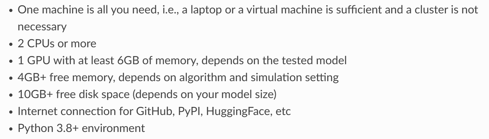
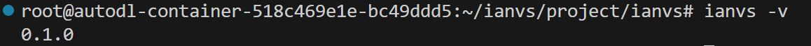

# Embodied Intelligence Benchmarking Framework for Industrial Manufacturing with KubeEdge

With the accelerated evolution of intelligent industrial manufacturing, industrial robots, flexible production lines, and intelligent testing equipment are continuously being innovated. With its efficient data processing and real-time response capabilities, **cloud-edge collaboration technology** has become the core technology engine driving the application of **embodied intelligence** systems in complex industrial scenarios.  

Based on the **kubeedge ianvs collaborative AI benchmarking framework**, this project plans to build a complete system including industrial scenario test datasets, simulation test environment and multi-dimensional performance indicators, aiming to build professional and industry-level specific intelligent testing capabilities suitable for the industrial manufacturing field.  

It is noteworthy that the current industrial demand for embodied intelligent services has developed in depth in the direction of **high-precision perception decision-making, dynamic real-time response, cross device collaborative control, etc**.   

**However**, existing universal embodied intelligence benchmarks struggle to provide accurate assessments because they **lack targeted consideration of the unique needs of industrial scenarios and equipment characteristics**. This has become a key bottleneck restricting the development of industrial embodied intelligence technology.

## Ianvs Installation
Welcome to Ianvs! Ianvs aims to test the performance of distributed synergy AI solutions following recognized standards, in order to facilitate more efficient and effective development. This quick start guide helps you to implement benchmarks for LLM in cloud-edge collaborative inference scenario. You can reduce manual procedures to just a few steps so that you can build and start your distributed synergy AI solution development within minutes.

Before using Ianvs, you might want to have the device ready:



In this example, we are using the Linux platform with Python 3.8. If you are using Windows, most steps should still apply but a few commands and package requirements might be different.

I suggest that everyone try to use Python 3.8 or above and install Ianvs on servers with GPUs as much as possible. If your laboratory cannot provide servers with GPUs, you can consider renting a GPU cloud server. In this case, I rented a cloud server in **autodl** for installing Ianvs.


### Installation Process

Firstly, create a folder for Ianvs. Please note that if you install Ianvs to a different location, some of the path configurations in this tutorial will also need to be modified.

```python
mkdir /ianvs
cd /ianvs #One might use another path preferred
mkdir project
cd project
```

Then pull Ianvs from GitHub:

```python
git clone https://github.com/kubeedge/ianvs.git
```

Then we need to update some configurations:

```python
sudo apt-get update
sudo apt-get install libgl1-mesa-glx -y
python -m pip install --upgrade pip
```

Then install some third-party packages that Ianvs needs:

```python
cd /ianvs/project/ianvs
python -m pip install ./examples/resources/third_party/*
python -m pip install -r requirements.txt 
python setup.py install
```

After installation is complete, enter the command:

```python
ianvs -v
```

If the ianvs version can be displayed correctly as follows:



It means you have successfully installed it.

## RoboDK Palletizing Sample Explanation and Operation

### RoboDK Palletizing Dataset Introduction

Due to RoboDK's output format being more inclined towards "raw data records within the scene", while Ianvs requires "standardized, structured, and correlatable test data", there is a high probability of differences between the two native formats. Therefore, it is necessary to convert or adapt the data format according to Ianvs' specifications to ensure that the data is correctly parsed and used for algorithm testing.

For the motion information of the robot and the image information of the camera obtained later, we can use the algorithm in the above table to further process them.

### Quick Start

Firstly, we need to configure the RoboDK Palletizing Dataset and create a folder for the dataset. Please note that if you move the dataset to another location, some of the path configurations in this tutorial will also need to be modified.

```python
mkdir ~/data
cd ~/data
mkdir datasets
cd datasets
```

The RoboDK Palletizing Dataset less than 100MB and is currently stored on Kaggle. You can download it locally and then upload it to the server.
This is the URL of the RoboDK Palletizing Dataset, you can view detailed information about the dataset.

[RoboDK Palletizing Dataset](https://www.kaggle.com/datasets/kubeedgeianvs/the-robodk-palletizing-dataset/data) 

You can also use the Kaggle API to directly download it to the server. The command is as follows:

```python
python -m pip install kaggle
kaggle datasets download kubeedgeianvs/the-robodk-palletizing-dataset
```

You can search online for tutorials on how to use the Kaggle API, and I won't go into detail here.

After downloading, unzip the dataset:

```python
unzip RoboDK_Palletizing_Dataset.zip
```

Then let's check the information in the YAML file:

The workplace in benchmarkjob.yaml is the path where the model training output is stored, which can be changed to the path you need.

Train_url and test_url are the paths to the dataset index in testenv.yaml. If your dataset is stored in a different location from the tutorial, you need to modify the paths to train_url and test_url.

There are currently no other configuration files that need to be adjusted. The specific content of the configuration files will be explained in the summary of "Configuration File Explanation".

Next, we should install the YOLOv8 algorithm:

```python
pip install ultralytics
```

Finally, we can run the example code:

```python
cd /ianvs/project/ianvs/example/RoboDK_Palletizing/singletask_learning_bench/singletasklearning
ianvs -f benchmarkingjob.yaml 
```

If there are no errors in between, you should see the following content after the model single task learning is completed:


So congratulations, you've already made it through!!

### Configuration file explanation

In this section, we will mainly explain the roles of each configuration file in the example to facilitate everyone's familiarity with the singletasklearning process of Ianvs.

#### benchmarkingjob.yaml

This file is a necessary configuration file for running Ianvs, which mainly requires filling in the configuration paths for testenv and testalgorithms. There is nothing else to say, but the comments are written in detail.

#### testenv.yaml

This file is the configuration file for the testing environment, and it is important to fill in the path of the dataset.

#### algorithm.yaml

The algorithm.YAML file is an algorithm configuration file that defines a **single task learning** scheme based on the YOLOv8 basic model, with "map50" as the core evaluation metric and the goal of maximizing it.  The basemodel is a fundamental model used for object detection. Hyperparameters can adjust the learning rate and number of training epochs for model training. 