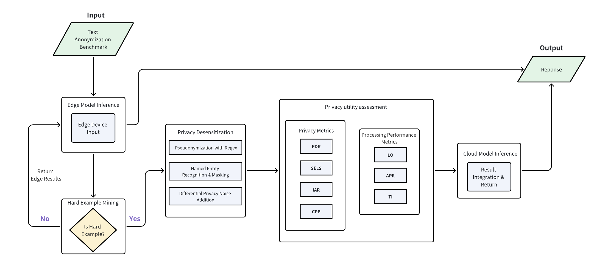

# Cloud-Edge Collaborative Inference Benchmark: A Privacy-Utility Evaluation Framework

[TOC]

## 1. Introduction

The rapid advancement of Large Language Models (LLMs) has driven their deployment across distributed cloud-edge architectures, enabling low-latency inference and efficient resource utilization. However, this distributed paradigm introduces critical privacy and performance challenges that remain unaddressed by existing frameworks:

- **Privacy-Utility Tradeoff Imbalance**: Current systems often prioritize either privacy protection (at the cost of inference accuracy) or performance (at the cost of data exposure), lacking adaptive mechanisms to balance both.
- **Inefficient Processing Routing**: Many frameworks default to cloud processing for complex tasks without first attempting edge inference, increasing latency and privacy risks through unnecessary data transmission.
- **Limited Privacy Protection Granularity**: Existing solutions typically apply a one-size-fits-all privacy method rather than selecting protection intensity based on data sensitivity.
- **Incomplete Evaluation Metrics**: There is a lack of comprehensive metrics that simultaneously assess privacy preservation, inference accuracy, and system performance in collaborative environments.
- **Absence of Standardized Benchmarking**: Few frameworks provide integrated tooling for systematic evaluation across diverse privacy scenarios using established datasets.

This project addresses these gaps through a privacy-first cloud-edge collaborative inference framework that implements adaptive processing routing, multi-level privacy protection, and comprehensive benchmarking capabilities validated with the Text Anonymization Benchmark (TAB) dataset.

## 2. Project Purpose

The Cloud-Edge Collaborative Inference Benchmark aims to:

- Enable **privacy-preserving distributed inference** by prioritizing edge processing while intelligently leveraging cloud resources for complex tasks.
- Provide **adaptive privacy protection** through multiple desensitization techniques, selecting appropriate methods based on data sensitivity.
- Establish **comprehensive evaluation metrics** that quantify both privacy preservation and system performance.
- Facilitate **systematic benchmarking** using standardized datasets to compare collaborative inference strategies.
- Offer a **flexible platform** for researchers and developers to experiment with privacy-performance tradeoffs in real-world cloud-edge environments.

## 3. Details of Design

### 3.1 Core Workflow



The framework's inference routing follows a structured sequential process with privacy as the core principle:

1. **Privacy Detection**: All input data first undergoes privacy detection to identify sensitive information (PII, sensitive entities, etc.).
2. **Non-Private Data Handling**: If no sensitive information is detected, the data is routed directly to cloud inference for processing.
3. **Private Data Handling**: If sensitive information is detected:
   - 3.1 **Edge Inference First**: Data is processed locally using the edge model.
   - 3.2 Result Evaluation: The edge model's output is evaluated against a confidence threshold:
     - 3.2.1 **Threshold Met**: If edge inference confidence meets or exceeds the threshold, the edge result is returned.
     - 3.2.2 **Threshold Not Met**: If confidence is insufficient, an appropriate privacy protection method is applied, and the sanitized data is sent to the cloud for further processing.

### 3.2 Key Components

#### 3.2.1 Privacy Detection Module

This module identifies sensitive information using a combination of:

- Pattern matching for structured PII (emails, phone numbers, IDs)
- NLP-based entity recognition (using spaCy models) for contextually sensitive entities
- Sensitivity scoring based on predefined and customizable entity categories

#### 3.2.2 Hard Sample Mining (Routing Logic)

The OracleRouter module determines processing destinations based on:

- Edge model confidence scores
- Data sensitivity levels
- Privacy requirements

#### 3.2.3 Privacy Protection Methods

Multi-level privacy desensitization techniques with varying complexity:

- **Regex Pseudonymization (Complexity 1)**: Rule-based masking of structured PII
- **NER Masking (Complexity 2)**: Context-aware masking using named entity recognition
- **Differential Privacy (Complexity 3)**: Adding mathematically controlled noise to sensitive data

#### 3.2.4 Evaluation Metrics

Comprehensive metrics for assessing both privacy preservation and system utility:

##### Privacy Metrics

- **PII Detection Rate (PDR)**:
  - Inputs: Entity annotations from original text and sanitized text from cloud model output 
  - Calculation: Compares detected sensitive entities in sanitized text with TAB benchmark annotations, using TAB's marked entity positions and categories to measure detection accuracy.
- **Sensitive Entity Leakage Score (SELS)**:
  - Inputs: Entity annotations from the original text and unsanitized entities in the cloud model output 
  - Calculation: Weighted score based on entity types that should be anonymized but remain exposed:
    - `DIRECT` identifiers (require anonymization): weight = 5
    - `QUASI` identifiers (require anonymization): weight = 3
    - `NO_MASK` entities (no anonymization needed): weight = 0
  - Computed using TAB's predefined classification weights.
- **Inference Attack Resistance (IAR)**:
  - Inputs: Sanitized text from cloud model output  and auxiliary information from cloud model results 
  - Calculation:
    1. Convert both sanitized text and auxiliary information to semantic vectors using a sentence embedding model
    2. Compute cosine similarity between vectors (higher similarity indicates greater inference vulnerability)
    3. Final IAR = 1 - cosine similarity
- **Contextual Privacy Preservation (CPP)**:
  - Inputs: Original text and sanitized text from cloud model output 
  - Calculation:
    1. Convert both texts to semantic vectors using `SentenceTransformer('all-MiniLM-L6-v2')`
    2. Cosine similarity between vectors  is used directly as CPP score

### 3.3 Utility Metrics

- **Latency Overhead (LO)**:
  - Measures total time elapsed from initial privacy processing through cloud inference completion
  - Unit: Seconds
- **Accuracy Preservation Rate (APR)**:
  - Inputs: Cloud model inference result and ground truth answer
  - Calculation: Similarity between cloud model result and constructed ground truth

## 4. Quick Start Guide

### 4.1 Required Resources

- Python >= 3.10 Conda or virtual environment
- Internet connection for GitHub, PyPI, HuggingFace, etc
- 1 GPU with at least 3GB of memory, depending on the tested model
- 5GB+ free disk space
- (Optional) GPU acceleration for edge model inference, depending on the tested model

### 4.2 Detailed Setup Guide

#### Step 1: Ianvs Preparation

```bash
# Clone the Ianvs repository
git clone https://github.com/kubeedge/ianvs.git
cd ianvs

# Create a new conda environment with Python>=3.10 and rust
conda create -n ianvs-experiment python=3.10 rust -c conda-forge

# Activate the environment
conda activate ianvs-experiment

# Install Sedna
pip install examples/resources/third_party/sedna-0.6.0.1-py3-none-any.whl

# Install dependencies for Ianvs Core
pip install -r requirements.txt

# Install dependencies for this example
pip install -r examples/TAB/cloud_edge_collaborative_inference_bench/requirements.txt

# Install ianvs
python setup.py install
```

#### Step 2: Dataset and Model Preparation

##### Dataset Configuration

1. Download the TAB dataset:

   ```bash
   git clone https://github.com/NorskRegnesentral/text-anonymization-benchmark
   ```

2. Rename the dataset files:

   - Rename `echr_train.json` to `data.json`
   - Rename `echr_test.json` to `metadata.json`

3. Place the renamed files in the root directory of the Ianvs project.

##### Metric Configuration

| Metric                        | Description (Brief)                                          | Unit       |
| ----------------------------- | ------------------------------------------------------------ | ---------- |
| ContextualPrivacyPreservation | Measures how well contextual meaning is preserved after privacy processing | Score      |
| LatencyOverhead               | Additional latency introduced by privacy protection mechanisms | Seconds    |
| SensitiveEntityLeakageScore   | Quantifies the amount of sensitive information remaining after protection | Score      |
| InferenceAttackResistance     | Evaluates resistance to privacy inference attacks using auxiliary information | Score      |
| AccuracyPreservationRate      | Percentage of original inference accuracy retained after privacy processing | Percentage |

##### Model Configuration

Need to set environment variables in advance：`OPENAI_API_URL`,`OPENAI_API_KEY`,`ST_MODEL_DIR`

###### Edge Model

```yaml
type: "edgemodel"
name: "EdgeModel"
url: "./examples/TAB/cloud_edge_collaborative_inference_bench/test_algorithms/edge_model/edge_model.py"
hyperparameters:
  - model:
      values:
        - "./examples/TAB/cloud_edge_collaborative_inference_bench/local_model"
  - backend:
      values:
        - "huggingface"
  - temperature:
      values:
        - 0.0000001
  - top_p:
      values:
        - 0.9
  - max_tokens:
      values:
        - 1024
  - repetition_penalty:
      values:
        - 1
  - use_cache:
      values:
        - true
  - confidence_threshold:
      values: [0.8]
```

###### Cloud Model

```yaml
type: "cloudmodel"
name: "CloudModelAPI"
url: "./examples/TAB/cloud_edge_collaborative_inference_bench/test_algorithms/cloud_model/cloud_model.py"
hyperparameters:
  - api_provider:
      values:
        - "openai"
  - model:
      values:
        - "deepseek-chat"
  - api_key_env:
      values:
        - "`OPENAI_API_KEY`"
  - api_base_url:
      values:
        - "`OPENAI_API_URL`"
  - temperature:
      values:
        - 0.9
  - top_p:
      values:
        - 0.9
  - max_tokens:
      values:
        - 1024
  - repetition_penalty:
      values:
        - 1.05
  - use_cache:
      values:
        - true
```

> Note: Download the `all-MiniLM-L6-v2`model from https://huggingface.co/sentence-transformers/all-MiniLM-L6-v2/tree/main and place it in the `ST_MODEL_DIR` directory.

#### Step 3: Run Ianvs

##### Run Joint Inference Example

Execute the following command to start the benchmarking process:

```bash
ianvs -f examples/TAB/cloud_edge_collaborative_inference_bench/benchmarkingjob.yaml
```

After the process completes, you will see console output indicating the benchmarking results, including privacy scores, performance metrics, and ranking information.

```
[2025-10-31 08:27:28,221] joint_inference.py(167) [INFO] - Inference Start
  0%|                                                                         | 0/1 [00:00<?, ?it/s]The following generation flags are not valid and may be ignored: ['temperature', 'top_p']. Set `TRANSFORMERS_VERBOSITY=info` for more details.
Setting `pad_token_id` to `eos_token_id`:151643 for open-end generation.
Batches: 100%|██████████████████████████████████████████████████████████████████████████| 1/1 [00:00<00:00, 17.56it/s]
Batches: 100%|██████████████████████████████████████████████████████████████████████████| 1/1 [00:00<00:00, 74.73it/s]
INFO:root:[HEM] edge confidence(similarity to answer) = 0.7433                                  | 0/1 [00:00<?, ?it/s]
INFO:root:privacy_method: dp
You seem to be using the pipelines sequentially on GPU. In order to maximize efficiency please use a dataset
100%|████████████████████████████████████████████████| 1/1 [01:24<00:00, 84.14s/it, Edge=0, Cloud=1]
[2025-10-31 08:28:52,361] joint_inference.py(191) [INFO] - Inference Finished
[2025-10-31 08:28:52,362] joint_inference.py(136) [INFO] - Release models
INFO:r
```

#### Results

The benchmarking results are generated as CSV files:

- `all_rank.csv`: Comprehensive ranking of all evaluated strategies
- `selected_rank.csv`: Ranked results of selected optimal strategies

These files are located in the `.workspace/benchmarkingjob/rank` directory. 

| rank | algorithm                   | ContextualPrivacyPreservation | PIIDetectionRate     | SensitiveEntityLeakageScore | InferenceAttackResistance | AccuracyPreservationRate | LatencyOverhead    | paradigm       | dataset_processor | edgemodel | cloudmodel    | hard_example_mining | edgemodel-model                                              | edgemodel-backend | edgemodel-temperature | edgemodel-top_p | edgemodel-max_tokens | edgemodel-repetition_penalty | edgemodel-use_cache | edgemodel-confidence_threshold | cloudmodel-api_provider | cloudmodel-model |
| ---- | --------------------------- | ----------------------------- | -------------------- | --------------------------- | ------------------------- | ------------------------ | ------------------ | -------------- | ----------------- | --------- | ------------- | ------------------- | ------------------------------------------------------------ | ----------------- | --------------------- | --------------- | -------------------- | ---------------------------- | ------------------- | ------------------------------ | ----------------------- | ---------------- |
| 1    | privacy-aware-query-routing | 0.9742568135261536            | 0.0                  | 1.0                         | 0.9518058374524117        | 0.9450633525848388       | 20.7413341999054   | jointinference | ECHRDataProcessor | EdgeModel | CloudModelAPI | OracleRouter        | ./examples/TAB/cloud_edge_collaborative_inference_bench/local_model | huggingface       | 1e-07                 | 0.9             | 1024                 | 1                            | True                | 0.8                            | openai                  | deepseek-chat    |
| 2    | privacy-aware-query-routing | 0.9747062921524048            | 0.027906976744186    | 0.9756427604871448          | 0.9922107234597206        | 0.8494936227798462       | 29.072315454483032 | jointinference | ECHRDataProcessor | EdgeModel | CloudModelAPI | OracleRouter        | ./examples/TAB/cloud_edge_collaborative_inference_bench/local_model | huggingface       | 1e-07                 | 0.9             | 1024                 | 1                            | True                | 0.8                            | openai                  | deepseek-chat    |
| 3    | privacy-aware-query-routing | 0.9539092779159546            | 0.0588235294117647   | 0.9454545454545454          | 0.9530627205967904        | 0.9433706998825072       | 18.821454524993896 | jointinference | ECHRDataProcessor | EdgeModel | CloudModelAPI | OracleRouter        | ./examples/TAB/cloud_edge_collaborative_inference_bench/local_model | huggingface       | 1e-07                 | 0.9             | 1024                 | 1                            | True                | 0.8                            | openai                  | deepseek-chat    |
| 4    | privacy-aware-query-routing | 0.9747982621192932            | 0.0                  | 1.0                         | 0.9076447784900664        | 0.9441471099853516       | 23.58801794052124  | jointinference | ECHRDataProcessor | EdgeModel | CloudModelAPI | OracleRouter        | ./examples/TAB/cloud_edge_collaborative_inference_bench/local_model | huggingface       | 1e-07                 | 0.9             | 1024                 | 1                            | True                | 0.8                            | openai                  | deepseek-chat    |
| 5    | privacy-aware-query-routing | 0.9700681567192078            | 0.044585987261146494 | 0.9567010309278351          | 0.9368005767464638        | 0.8194546699523926       | 28.663337469100952 | jointinference | ECHRDataProcessor | EdgeModel | CloudModelAPI | OracleRouter        | ./examples/TAB/cloud_edge_collaborative_inference_bench/local_model | huggingface       | 1e-07                 | 0.9             | 1024                 | 1                            | True                | 0.8                            | openai                  | deepseek-chat    |

## 5. Discussion

#### PII Detection Rate
This metric measures the accuracy of detecting personally identifiable information. Regex Pseudonymization's variable rate shows its struggle with non-standard PII despite handling common formats well. NER Masking generally detects context-sensitive PII well but depends on model quality. Differential Privacy, focused on noise, doesn't directly detect but affects the perceived PII. This variance reflects different detection approaches and limitations.

#### Sensitive Entity Leakage Score
Regex Pseudonymization has leakage due to its rigid rules for complex entities. NER Masking likely has less leakage for context-sensitive items, but can err. Differential Privacy's noise makes leakage hard to quantify. Scores show different protection effectiveness. It quantifies the amount of sensitive information that remains unprotected after the privacy protection process. 

#### Inference Attack Resistance
This metric evaluates the ability of the anonymized data to resist inference attacks. Differential Privacy offers strong resistance with noise addition. Regex Pseudonymization provides moderate protection by masking but may have exploitable patterns. NER Masking also helps, but isn't as robust. 

#### Contextual Privacy Preservation
Regex Pseudonymization disrupts context with its rigid masking. NER Masking, context-aware, performs better but can be affected by errors. Differential Privacy's noise impacts context, too. It measures how well the contextual meaning of the data is preserved during the privacy protection process. 

#### Latency Overhead
Regex Pseudonymization has variable latency based on pattern complexity. NER Masking is slower due to semantic analysis. Differential Privacy incurs latency from noise computation. 

#### Accuracy Preservation Rate 

It calculates the similarity between the inference result and the standard answer, reflecting the impact of the privacy protection process on the accuracy of the model. Regex Pseudonymization can have a significant impact on accuracy, with variable rates depending on how masking affects the data for model processing. NER Masking may preserve accuracy well if the NER model is accurate, but can reduce it if there are errors. 

### Overall Performance Summary
Regex Pseudonymization is simple for structured PII but falters with complexity, offers moderate privacy and variable latency. NER Masking is good for context-sensitive PII but relies on model quality and has high latency. Differential Privacy excels at inference resistance but affects data accuracy and incurs computational cost. Each method has its own strengths and weaknesses for different privacy needs. 

## 6. Future Work

- Expand privacy desensitization methods to include advanced techniques such as federated learning-based privacy preservation

- Introduce more granular privacy detection metrics covering emerging sensitive data categories

- Enhance cross-framework compatibility for seamless integration with diverse cloud and edge platforms

- Develop automated tuning mechanisms for optimal privacy-performance tradeoff configurations

  