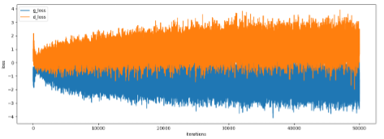
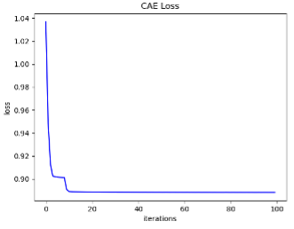
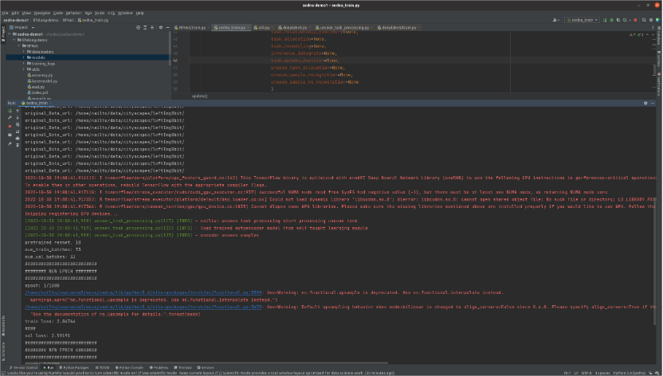

# Integrating GAN and Self-taught Learning into Ianvs Lifelong Learning

Our algorithm is dedicated to solving the `small sample` and `heterogeneous data` issues in the Ianvs lifelong learning process via `Generative Adversarial Networks (GANs)` ans `Self-taught Learning (STL)`. Here we focus on how to deploy the algorithm in Ianvs. For the principle and algorithm details, please refer to [Unknown Task Processing Algorithm based on Lifelong Learning of Ianvs](../../../../docs/proposals/algorithms/lifelong-learning/Unknown_Task_Processing_Algorithm_based_on_Lifelong_Learning_of_Ianvs.md).  

## Device Requirements and Ianvs Preparation

For device requirements and Ianvs preparation, please refer to [lifelong_learning_bench](../../../cityscapes-synthia/lifelong_learning_bench/curb-detection/README.md).
  
## Development Notes 

Our algorithm for solving the `small sample` and `heterogeneous data` issues in the Ianvs lifelong learning process is in the folder `GANwithSelf-taughtLearning`. We show the details of `GANwithSelf-taughtLearning` below.

```bash
GANwithSelf-taughtLearning # root path of the project
	- config.yaml # the config of input path (dataset and model to be trained) as well as hyperparameter of GAN and Self-taught Learning
	- GAN # GAN module
		- models.py # define discriminator and generator
		- train.py # train GAN here
		- ./train_results # training outputs, like GAN model, training loss and evaluation of GAN
	- self-taught-learning # self-taught learning module
		- models.py # Define AutoEncoder. Here we use Convolutional AutoEncoder (CAE).
		- train.py # train GAN here
		- ./train_results # training outputs, like encoder model and training loss
	- model-to-be-trained # model to be trained module
		- train.py # train model
		- model.py # define model
		- ./train_results # training results of the model to be trained
	- util.py # util module
```
For the trained weights and models, please click [here](https://drive.google.com/drive/folders/1IOQCQ3sntxrbt7RtJIsSlBo0PFrR7Ets?usp=drive_link) to download.    

There are two ways to use it. You can use the module on its own or as an integration into Ianvs.

###  Use the Module on Its Own
For using the module on its own, config the `config.yaml` to let `GANwithSelf-taughtLearning` know where the **dataset** is, what **model** you want to train and what the **hyperparameters** are.

Then a common process can be shown below:

1. run `python ./GAN/train.py`   
The GAN module starts training over the dataset configured. Figure shows a training result with an NVIDIA RTX 3060 (12GB) graphics card.   


2. run `python ./self-taught-learning/train.py`   
The process first uses the trained GAN model to generate certain data (fake data) and then trains STL over fake data. The training process of Convolutional AutoEncoder of Self-taught Learning can be shown below.


3. run `./train.py`   
The trained STL first extracts the labeled data to data representations and then the we use data representations and labels to train the unseen task which is configured in the `config.yaml`.


### Use the Module as an Integration into Ianvs
For using the module as an integration into Ianvs, please first compile this version of [Sedna](https://github.com/nailtu30/sedna/tree/ospp-final), where we integrate  `GANwithSelf-taughtLearning` into folder `lib/sedna/algorithms/unseen_task_processing`.    

Then please personalize your own `config.yaml` as explained in [Use the Module on Its Own](###Use%20the%20Module%20on%20Its%20Own).

Last but not least, just start Ivans normally, where our algorithm has been integrated into the main process, and you can simulate unseen task via setting `model to be trained` in the `config.yaml`. We show a successful deployment below.


