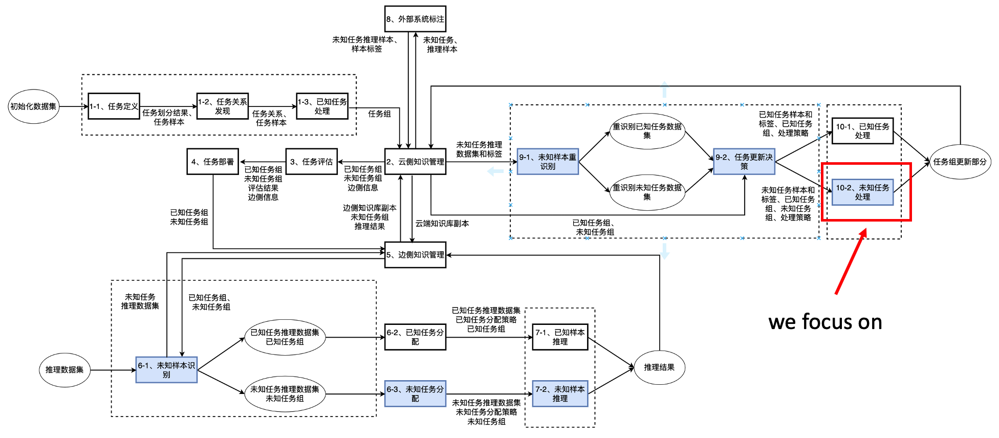
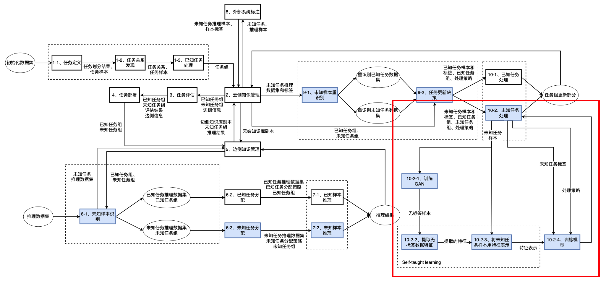
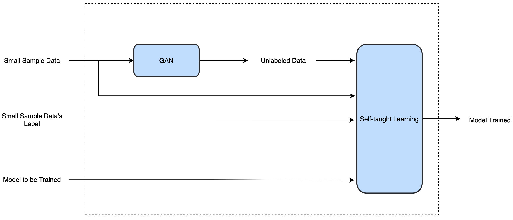
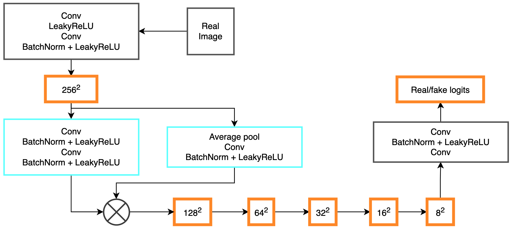
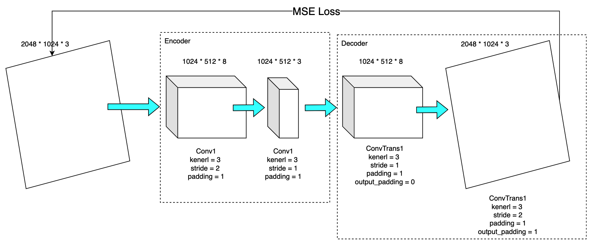

# Integrating GAN and Self-taught Learning into Ianvs Lifelong Learning

## Overview

We proposal an approach of combining [GAN](https://en.wikipedia.org/wiki/Generative_adversarial_network) and [Self-taught Learning](https://ai.stanford.edu/~hllee/icml07-selftaughtlearning.pdf) to solve small sample problem in Ianvs lifelong learning, as shown in the figure below, corresponding to the [pull request](https://github.com/kubeedge/sedna/pull/378).

For quick start, just jump directly to [Developer Notes](##Developer%20Notes).



We describe the arichtecture and the process. More details can be seen in [Architecture](##Architecture).



1. Train GAN with orginal small sample data
2. GAN generates more data according to the probability distribution
3. Train Autoencoder (which is consist of encoder and decoder) with the data generated by GAN
4. Use encoder to get data representation of original small sample data
5. Use data representation and orignal labels to train model that the unseen task model needs
6. Ouput a well trained model

## Architecture

- Overview

  

- GAN (we refer to [Towards Faster and Stabilized GAN Training for High-fidelity Few-shot Image Synthesis](https://openreview.net/forum?id=1Fqg133qRaI))

  Discriminator

  

  Generator

  

- Convolutional AutoEncoder of Self-taught Learning

  

## Developer Notes

```bash
GANwithSelf-taughtLearning # root path of the project
	- config.yaml # the config of input path (dataset and model to be trained) as well as hyperparameter of GAN and Self-taught Learning
	- GAN # GAN module
		- models.py # define discriminator and generator
		- train.py # train GAN here
		- ./train_results # training outputs, like GAN model, training loss and evaluation of GAN
	- self-taught-learning # self-taught learning module
		- models.py # Define AutoEncoder. Here we use Convolutional AutoEncoder (CAE).
		- train.py # train GAN here
		- ./train_results # training outputs, like encoder model and training loss
	- model-to-be-trained # model to be trained module
		- train.py # train model
		- model.py # define model
		- ./train_results # training results of the model to be trained
	- util.py # util module
```
For the trained weights and models, please refer to [Google drive](https://drive.google.com/drive/folders/1IOQCQ3sntxrbt7RtJIsSlBo0PFrR7Ets?usp=drive_link).    

There are two ways to use it. You can use the module on its own or as an integration into Ianvs.

For using the module on its own, config the `config.yaml` to let `GANwithSelf-taughtLearning` know where the **dataset** is, what **model** you want to train and what the **hyperparameters** are.

Then a common use process can be shown below:

1. run `python ./GAN/train.py`
2. run `python ./self-taught-learning/train.py`
3. run `./train.py`

For using the module as an integration into Ianvs, please first compile this version of [Sedna](https://github.com/nailtu30/sedna/tree/ospp-final), where we integrate  `GANwithSelf-taughtLearning` into folder `lib/sedna/algorithms/unseen_task_processing`. Then just start Ivans normally, where our algorithm has been integrated into the main process, and you can simulate unseen task via setting `model to be trained` in the `config.yaml`.
