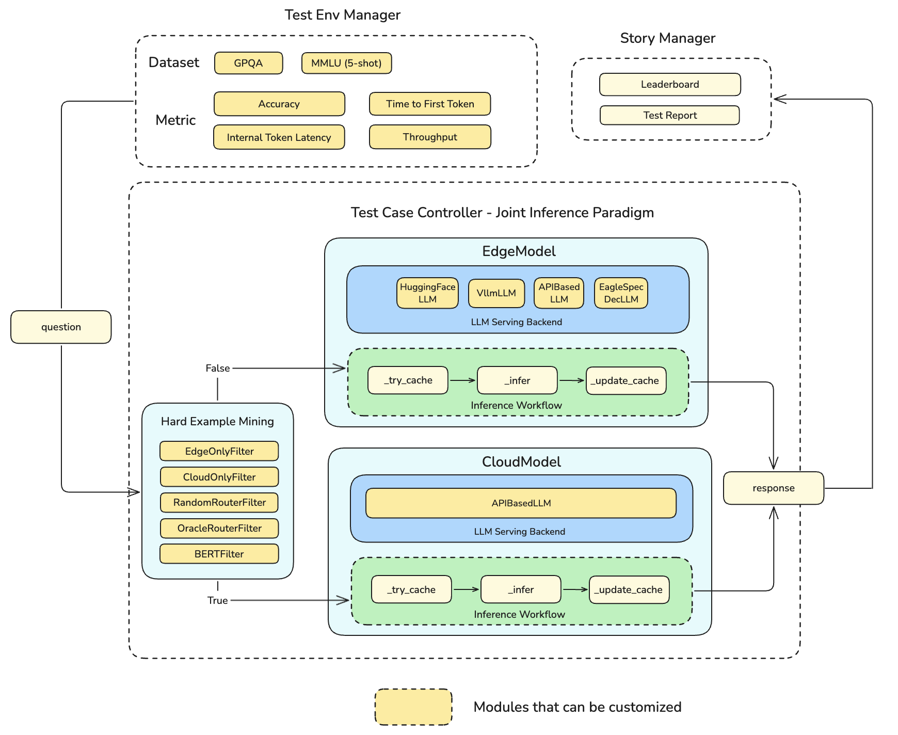

# Table of Contents

- [Details of Cloud Edge Collaborative Inference for LLM](#deatails-of-cloud-edge-collaborative-inference-for-llms)
  - [Introduction](#introduction)
  - [Why LLM Need Cloud-Edge Collaborative Inference?](#why-llm-need-cloud-edge-collaborative-inference)
  - [Possible Collaborative Inference Strategy](#possible-collaborative-inference-strategy)
  - [Details of Design](#details-of-design)
- [Quick Start Guide](#quick-start-guide)
  - [Required Resources](#required-resources)
  - [Methods for benchmarking with ianvs](#methods-for-benchmarking-with-ianvs)
  - [Docker-Based Setup](#docker-based-setup)
  - [Detailed Setup Guide](#detailed-setup-guide)
    - [Step 1: Ianvs Preparation](#step-1-ianvs-preparation)
    - [Step 2: Dataset and Model Preparation](#step-2-dataset-and-model-preparation)
      - [Dataset Configuration](#dataset-configuration)
      - [Metric Configuration](#metric-configuration)
      - [Model Configuration](#model-configuration)
      - [Router Configuration](#router-configuration)
      - [Data Processor Configuration](#data-processor-configuration)
    - [Step 3: Run Ianvs](#step-3-run-ianvs)
      - [Provided Response Cache](#provided-response-cache)
      - [Run Joint Inference Example](#run-joint-inference-example)
    - [Results](#results)
- [Discussion](#discussion)
  - [Query Routing's Application Scenario](#query-routings-application-scenario)
- [Future](#future)
- [References](#references)

## Deatails of Cloud Edge Collaborative Inference for LLMs

### Introduction

This example aims to implement benchmarks for **LLM in cloud-edge collaborative inference scenario**. 

### Why LLM need cloud-edge collaborative inference?

Currently, such LLMs have billions or even trillions of parameters, requiring massive computing power for training and deployment. Therefore, they are often deployed in cloud computing centers and serving via APIs. However, such service paradigm faces many drawbacks.

- Time to First Token(TTFT) is quite long, due to transmission delays from the distance to the data center.
- Uploading user data to the cloud may lead to additional privacy risks and retraining risks.
- Calling APIs of the most advanced models (GPT-4o *et.al*) is often very expensive.
- Not all tasks require high-performance models to complete.

These issues can be addressed by introducing Edge Computing, which is an architecture featured by low-latency, privacy security, energy-efficient. 

By deploying small-scale LLMs on edge devices like mobile phones, PCs and communication base station, users will have low-latency and privacy-secure services. Empirically, models with fewer than 3B parameters are possible to be deployed on the aforementioned edge devices. However, due to Scaling Law, smaller models perform worse than larger models, so they can only maintain good performance on certain tasks. 

Thus, smaller models on edge should collaborate with larger models on cloud to achieve better performance on other tasks.

### Possible Collaborative Inference Strategy 

There are several cloud-edge collaborative inference strategy, one of which is Query Routing $^{[1, 2]}$, which routes query to smaller-scale model on edge or larger-scale model on cloud based on its difficulty.

Additionally, Speculative Decoding $^{[3]}$ is another promising strategy to further improve the performance of collaborative inference, where smaller-scale models predicting future multiple words quickly during decoding followed by parallel validation via larger-scale models; if validation fails then re-generation by larger-scale occurs.


### Details of Design

The overall design is shown in the figure below.



When Ianvs starts the benchmarking job, the Test Env Manager will first pass the data of the user-specified Dataset to the Test Case Controller for Joint Inference one by one.

Joint Inference supports multiple modes, including `mining-then-inference`, `inference-then-mining`, and `self-design`. Among them, `mining-then-inference` is suitable for LLM scenarios, `inference-then-mining` is suitable for CV scenarios, and `self-design` allows you to implement more complex collaborative inference strategies on your own.

In this example, we will rely on Ianvs' Joint Inference Paradigm using the `inference-then-mining` mode to implement a Query Routing strategy. First, we call your custom Hard Example Mining module to determine if it is a hard case. If it is, we call the inference interface of the Edge Model to complete the inference; if not, we call the inference interface of the Cloud Model to complete it.

To save API calls during multi-round testing, this example has designed a result caching mechanism in both EdgeModel and Cloud Model. For questions that have already been tested, cached results will be read and returned.

After all tests are completed, the Test Env Manager will calculate relevant metrics based on selected Metrics and hand over to Story Manager for printing test reports and generating Leader Board.

## Quick Start Guide 

### Required Resources

Before using this example, you need to have the device ready:

- One machine is all you need, i.e., a laptop or a virtual machine is sufficient and a cluster is not necessary

- 2 CPUs or more

- 1 GPU with at least 6GB of memory, depends on the tested model

- 4GB+ free memory, depends on algorithm and simulation setting

- 10GB+ free disk space (depends on your model size)

- Internet connection for GitHub, PyPI,  HuggingFace, etc

- Python 3.8+ environment

### Methods for Benchmarking with Ianvs

- To quickly experience benchmarking with Ianvs, proceed with the [Docker-Based Setup](#docker-based-setup).
- For a detailed setup process, including creating a custom dataset, refer to the [Detailed Setup Guide](#detailed-setup-guide).

### Docker based setup

The Docker-based setup assumes you have Docker installed on your system and are using an Ubuntu-based Linux distribution.

**Note**: 
- If you don't have Docker installed, follow the Docker Engine installation guide [here](https://docs.docker.com/engine/install/ubuntu/). 
- To enable Docker to download datasets from Kaggle within your docker container, you need to configure the Kaggle CLI authentication token. Please follow the [official Kaggle API documentation](https://www.kaggle.com/docs/api#:~:text=is%20%24PYTHON_HOME/Scripts.-,Authentication,-In%20order%20to) to download your `kaggle.json` token. Once downloaded, move the file to the `~/ianvs/examples/cloud-edge-collaborative-inference-for-llm/` directory after doing step 1(cloning the ianvs repo):

```bash
mv /path/to/kaggle.json ~/ianvs/examples/cloud-edge-collaborative-inference-for-llm/
```

1. Clone Ianvs Repo
```
git clone https://github.com/kubeedge/ianvs.git
cd ianvs
```

2. From the root directory of Ianvs, build the `cloud-edge-collaborative-inference-for-llm` Docker image:

**Note**: If you have already build the image, then move on to the second step directly. 

```bash 
docker build -t ianvs-experiment-image ./examples/cloud-edge-collaborative-inference-for-llm/
```

3. Run the image in an interactive shell:
```bash 
docker run -it ianvs-experiment-image /bin/bash 
```

4. Activate the ianvs-experiment Conda environment:
```bash 
conda activate ianvs-experiment
```

5. Set the required environment variables for the API (use either OpenAI or GROQ credentials):
```bash 
export OPENAI_BASE_URL="https://api.openai.com/v1"
export OPENAI_API_KEY=sk_xxxxxxxx
```

`Alternatively, for GROQ, use GROQ_BASE_URL and GROQ_API_KEY.`

6. Run the Ianvs benchmark:
```bash 
ianvs -f examples/cloud-edge-collaborative-inference-for-llm/benchmarkingjob.yaml
```

*Note: To help you get results quickly, we have provided a workspace folder with cached results for `Qwen/Qwen2.5-1.5B-Instruct`, `Qwen/Qwen2.5-3B-Instruct`,`Qwen/Qwen2.5-7B-Instruct` and `gpt-4o-mini`.*

- If you want to create a custom dataset, proceed to the next section. 

### Detailed Setup Guide

#### Step 1. Ianvs Preparation

```bash

# Clone Ianvs Repo
git clone https://github.com/kubeedge/ianvs.git
cd ianvs

# Create a new conda environment with Python>=3.8 and rust(venv users can do it in their own way).
conda create -n ianvs-experiment python=3.8 rust -c conda-forge

# Activate our environment
conda activate ianvs-experiment

# Install Sedna
pip install examples/resources/third_party/sedna-0.6.0.1-py3-none-any.whl

# Install dependencies for Ianvs Core.
pip install -r requirements.txt

# Install dependencies for this example.
pip install -r examples/cloud-edge-collaborative-inference-for-llm/requirements.txt

# Install ianvs
python setup.py install
```

If you want to use speculative decoding models like [EAGLE](https://github.com/SafeAILab/EAGLE), refer to the original repository for setup instructions.

#### Step 2. Dataset and Model Preparation

##### Dataset Configuration

Here, we provide `MMLU-5-shot` dataset and `GPQA-diamond` dataset for testing. The following  instruction for dataset preparation for `MMLU-5-shot`, `GPQA-diamond` follows the same progress.

1. Download `mmlu-5-shot` in the root directory of ianvs from [Ianvs-MMLU-5-shot](https://www.kaggle.com/datasets/kubeedgeianvs/ianvs-mmlu-5shot), which is a transformed MMLU-5-shot dataset formatted to fit Ianvs's requirements.
**Note**: To enable Docker to download datasets from Kaggle within your docker container, you need to configure the Kaggle CLI authentication token. Please follow the [official Kaggle API documentation](https://www.kaggle.com/docs/api#:~:text=is%20%24PYTHON_HOME/Scripts.-,Authentication,-In%20order%20to) to download your `kaggle.json` token. 
```bash
kaggle datasets download -d kubeedgeianvs/ianvs-mmlu-5shot
unzip -o ianvs-mmlu-5shot.zip
rm -rf ianvs-mmlu-5shot.zip
```

2. Then, check the path of `train_data` and `test_data` in 
`examples/cloud-edge-collaborative-inference-for-llm/testenv/testenv.yaml`.

    - If you created the `dataset` folder inside `ianvs/` as mentioned earlier, then the relative path is correct and does not need to be modified.

    - If your `dataset` is created in a different location, please use an absolute path, and using `~` to represent the home directory is not supported.

###### Dataset Details

If you want to construct your own dataset, please see the details below and follow the instruction.

```
.
├── dataset
│   └── mmlu-5-shot
│       ├── test_data
│       │   ├── data.jsonl
│       │   └── metadata.json
│       └── train_data
│           └── data.json
```

Leave `train_data/data.jsonl` as empty.

The file `data.jsonl` stores the main content of the dataset. Each line contains must contain keys `query`, `response`, `explanation`,`level_1_dim`, `level_2_dim`, `level_3_dim`, `level_4_dim`

Here is an example:

```json
{"query": "Question: Find the degree for the given field extension Q(sqrt(2), sqrt(3), sqrt(18)) over Q.\nA. 0\nB. 4\nC. 2\nD. 6", "response": "B", "explanation": "", "level_1_dim": "single-modal", "level_2_dim": "text", "level_3_dim": "knowledge Q&A", "level_4_dim": "abstract_algebra"}
{"query": "Question: Let p = (1, 2, 5, 4)(2, 3) in S_5 . Find the index of <p> in S_5.\nA. 8\nB. 2\nC. 24\nD. 120", "response": "C", "explanation": "", "level_1_dim": "single-modal", "level_2_dim": "text", "level_3_dim": "knowledge Q&A", "level_4_dim": "abstract_algebra"}
``` 

The `metadata.jsonl` stores information about the data, including `dataset`, `description`, `level_1_dim`, `level_2_dim`, `level_3_dim`, `level_4_dim`. 

Here is an example:

```json
{
    "dataset": "MMLU",
    "description": "Measuring Massive Multitask Language Understanding by Dan Hendrycks, Collin Burns, Steven Basart, Andy Zou, Mantas Mazeika, Dawn Song, and Jacob Steinhardt (ICLR 2021).",
    "level_1_dim": "single-modal",
    "level_2_dim": "text", 
    "level_3_dim": "Q&A",
    "level_4_dim": "general"
}
```

##### Metric Configuration

*Note: If you just want to run this example quickly, you can skip this step.*

We have designed multiple metrics for edge-cloud collaborative inference, including:

| Metric                  | Description                                             | Unit    |
|  :---: | :---: | :---: |
| Accuracy                | Accuracy on the test Dataset                            | -       |
| Edge Ratio            | proportion of queries router to edge                    | -       |
| Time to First Token     | Time taken to generate the first token                  | s       |
| Internal Token Latency  | Time taken to generate each token                       | s       |
| Throughput              | Token generation speed                                  | token/s |
| Cloud Prompt Tokens     | Number of prompt tokens consumed by Cloud Model         | -       |
| Cloud Completion Tokens | Number of completion tokens generated by Cloud Model    | -       |
| Edge Prompt Tokens      | Number of prompt tokens consumed by the Edge Model      | -       |
| Edge Completion Tokens  | Number of completion tokens generated by the Edge Model | -       |

Each metric is calculated by a module in `examples/cloud-edge-collaborative-inference-for-llm/testenv`. For more details, please check the folder.

You can select multiple metrics in `examples/cloud-edge-collaborative-inference-for-llm/testenv/testenv.yaml`.

##### Model Configuration

*Note: If you just want to run this example quickly, you can skip this step.*

The models are configured in `examples/cloud-edge-collaborative-inference-for-llm/testalgorithms/query-routing/test_queryrouting.yaml`.

In the configuration file, there are two models available for configuration: `EdgeModel` and `CloudModel`.

##### EdgeModel Configuration

The `EdgeModel` is designed to be deployed on your local machine, offering support for multiple serving backends including `huggingface`, `vllm`, `EagleSpecDec`. Additionally, it provides the flexibility to integrate with API-based model services.

For both `EdgeModel`, the arguments are:

| Parameter Name         | Type  | Description                                                  | Defalut                  |
| :---: | :-----: | :---: | :---:|
| model                  | str   | model name                                                   | Qwen/Qwen2-1.5B-Instruct |
| backend                | str   | model serving framework                                      | huggingface              |
| temperature            | float | What sampling temperature to use, between 0 and 2            | 0.8                      |
| top_p                  | float | nucleus sampling parameter                                   | 0.8                      |
| max_tokens             | int   | The maximum number of tokens that can be generated in the chat completion | 512                      |
| repetition_penalty     | float | The parameter for repetition penalty                         | 1.05                     |
| tensor_parallel_size   | int   | The size of tensor parallelism (Used for vLLM)               | 1                        |
| gpu_memory_utilization | float | The percentage of GPU memory utilization (Used for vLLM)     | 0.9                      |
| draft_model | str | The draft model used for Speculative Decoding | - |

##### CloudModel Configuration


The `CloudModel` represents the model on cloud, it will call LLM API via OpenAI API format. You need to set your OPENAI_BASE_URL and OPENAI_API_KEY in the environment variables yourself, for example.

```bash
export OPENAI_BASE_URL="https://api.openai.com/v1"
export OPENAI_API_KEY=sk_xxxxxxxx
```

`Alternatively, for GROQ, use GROQ_BASE_URL and GROQ_API_KEY.`

For `CloudModel`, the open parameters are:

| Parameter Name     | Type | Description                                                  | Defalut     |
| :---: | :---: | :---: | :---: |
| model              | str  | model name                                                   | gpt-4o-mini |
| temperature        | float  | What sampling temperature to use, between 0 and 2            | 0.8         |
| top_p              | float  | nucleus sampling parameter                                   | 0.8         |
| max_tokens         | int  | The maximum number of tokens that can be generated in the chat completion | 512         |
| repetition_penalty | float  | The parameter for repetition penalty                         | 1.05        |

##### Router Configuration

Router is a component that routes the query to the edge or cloud model. The router is configured by `hard_example_mining` in `examples/cloud-edge-collaborative-inference-for-llm/testrouters/query-routing/test_queryrouting.yaml`.

Currently, supported routers include:

| Router Type  | Description                                                  | Parameters       |
|  :---: | :---: | :---: |
| EdgeOnly     | Route all queries to the edge model.                         | -                |
| CloudOnly    | Route all queries to the cloud model.                        | -                |
| OracleRouter | Optimal Router         |         |
| BERTRouter   | Use a BERT classifier to route the query to the edge or cloud model. | model, threshold |
| RandomRouter | Route the query to the edge or cloud model randomly.         | threshold        |

You can modify the `router` parameter in `test_queryrouting.yaml` to select the router you want to use.

For BERT router, you can use [routellm/bert](https://huggingface.co/routellm/bert) or [routellm/bert_mmlu_augmented](https://huggingface.co/routellm/bert_mmlu_augmented) or your own BERT model.

##### Data Processor Configuration
The Data Processor allows you to custom your own data format after the dataset loaded.

Currently, supported routers include:

| Data Processor  | Description                                                  | Parameters       |
|  :---: | :---: | :---: |
| OracleRouterDatasetProcessor     |  Expose `gold` label to OracleRouter                      |   -         |

#### Step 3. Run Ianvs

##### Provided Response Cache
The testing process may take much time, depending on the number of test cases and the inference speed of the model.

To enable you directly get the results, here we provide a workspace folder with cached results of `Qwen/Qwen2.5-1.5B-Instruct`, `Qwen/Qwen2.5-3B-Instruct`,`Qwen/Qwen2.5-7B-Instruct` and `gpt-4o-mini`.

You can download `workspace-mmlu` folder from [Ianvs-MMLU-5-shot](https://www.kaggle.com/datasets/kubeedgeianvs/ianvs-mmlu-5shot) and put it under your `ianvs` folder.
- Since we have already downloaded the `Ianvs-MMLU-5-shot` folder. There is no need to do this again.

##### Run Joint Inference example

Run the following command:

`ianvs -f examples/cloud-edge-collaborative-inference-for-llm/benchmarkingjob.yaml`

After the process finished, you will see output like this:

```bash
[2025-04-12 09:20:14,523] edge_model.py(43) [INFO] - {'model': 'Qwen/Qwen2.5-1.5B-Instruct', 'backend': 'vllm', 'temperature': 0, 'top_p': 0.8, 'max_tokens': 512, 'repetition_penalty': 1.05, 'tensor_parallel_size': 4, 'gpu_memory_utilization': 0.9, 'use_cache': True}
[2025-04-12 09:20:14,524] cloud_model.py(34) [INFO] - {'model': 'gpt-4o-mini', 'temperature': 0, 'top_p': 0.8, 'max_tokens': 512, 'repetition_penalty': 1.05, 'use_cache': True}
[2025-04-12 09:20:14,880] joint_inference.py(73) [INFO] - Loading dataset
[2025-04-12 09:20:15,943] hard_sample_mining.py(30) [INFO] - USING EdgeOnlyFilter
[2025-04-12 09:20:15,943] joint_inference.py(162) [INFO] - Inference Start
100%|██████████████████████████████████| 14042/14042 [00:03<00:00, 4418.66it/s, Edge=14042, Cloud=0]
[2025-04-12 09:20:19,122] joint_inference.py(186) [INFO] - Inference Finished
[2025-04-12 09:20:19,122] joint_inference.py(131) [INFO] - Release models
[2025-04-12 09:20:23,844] edge_model.py(43) [INFO] - {'model': 'Qwen/Qwen2.5-3B-Instruct', 'backend': 'vllm', 'temperature': 0, 'top_p': 0.8, 'max_tokens': 512, 'repetition_penalty': 1.05, 'tensor_parallel_size': 4, 'gpu_memory_utilization': 0.9, 'use_cache': True}
[2025-04-12 09:20:23,844] cloud_model.py(34) [INFO] - {'model': 'gpt-4o-mini', 'temperature': 0, 'top_p': 0.8, 'max_tokens': 512, 'repetition_penalty': 1.05, 'use_cache': True}
[2025-04-12 09:20:23,851] joint_inference.py(73) [INFO] - Loading dataset
[2025-04-12 09:20:24,845] hard_sample_mining.py(30) [INFO] - USING EdgeOnlyFilter
[2025-04-12 09:20:24,845] joint_inference.py(162) [INFO] - Inference Start
100%|██████████████████████████████████| 14042/14042 [00:03<00:00, 4413.68it/s, Edge=14042, Cloud=0]
[2025-04-12 09:20:28,027] joint_inference.py(186) [INFO] - Inference Finished
[2025-04-12 09:20:28,027] joint_inference.py(131) [INFO] - Release models
[2025-04-12 09:20:32,741] edge_model.py(43) [INFO] - {'model': 'Qwen/Qwen2.5-7B-Instruct', 'backend': 'vllm', 'temperature': 0, 'top_p': 0.8, 'max_tokens': 512, 'repetition_penalty': 1.05, 'tensor_parallel_size': 4, 'gpu_memory_utilization': 0.9, 'use_cache': True}
[2025-04-12 09:20:32,741] cloud_model.py(34) [INFO] - {'model': 'gpt-4o-mini', 'temperature': 0, 'top_p': 0.8, 'max_tokens': 512, 'repetition_penalty': 1.05, 'use_cache': True}
[2025-04-12 09:20:32,749] joint_inference.py(73) [INFO] - Loading dataset
[2025-04-12 09:20:33,738] hard_sample_mining.py(30) [INFO] - USING EdgeOnlyFilter
[2025-04-12 09:20:33,738] joint_inference.py(162) [INFO] - Inference Start
100%|██████████████████████████████████| 14042/14042 [00:03<00:00, 4456.34it/s, Edge=14042, Cloud=0]
[2025-04-12 09:20:36,890] joint_inference.py(186) [INFO] - Inference Finished
[2025-04-12 09:20:36,890] joint_inference.py(131) [INFO] - Release models
```

### Results

Change the Router type to `EdgeOnly`, `CloudOnly`, `OracleRouter` (or another router) will yield better results.

The recommend testing order is `EdgeOnly`, `CloudOnly`, `OracleRouter`, `BERTRouter`, `RandomRouter`.

By changing different models and Router parameters, you may see output like the following table tested on `MMLU-5-shot` dataset:

```bash
+------+---------------+----------+------------+---------------------+------------+------------------------+---------------------+-------------------------+--------------------+------------------------+----------------+---------------------+----------------------------+-------------------+------------------+---------------------+-------------------------------------------------------------------------------------+
| rank |   algorithm   | Accuracy | Edge Ratio | Time to First Token | Throughput | Internal Token Latency | Cloud Prompt Tokens | Cloud Completion Tokens | Edge Prompt Tokens | Edge Completion Tokens |    paradigm    | hard_example_mining |      edgemodel-model       | edgemodel-backend | cloudmodel-model |         time        |                                         url                                         |
+------+---------------+----------+------------+---------------------+------------+------------------------+---------------------+-------------------------+--------------------+------------------------+----------------+---------------------+----------------------------+-------------------+------------------+---------------------+-------------------------------------------------------------------------------------+
|  1   | query-routing |  84.22   |   87.62    |        0.347        |   179.28   |         0.006          |       1560307       |          20339          |      10695142      |         30104          | jointinference |     OracleRouter    |  Qwen/Qwen2.5-7B-Instruct  |        vllm       |   gpt-4o-mini    | 2024-10-28 16:58:30 | ./workspace-mmlu/benchmarkingjob/query-routing/b8eb2606-950a-11ef-8cbc-c97e05df5d14 |
|  2   | query-routing |  82.75   |   77.55    |        0.316        |   216.72   |         0.005          |       2727792       |          18177          |      9470276       |         291364         | jointinference |     OracleRouter    |  Qwen/Qwen2.5-3B-Instruct  |        vllm       |   gpt-4o-mini    | 2024-10-28 16:58:19 | ./workspace-mmlu/benchmarkingjob/query-routing/b8eb2605-950a-11ef-8cbc-c97e05df5d14 |
|  3   | query-routing |  82.22   |   76.12    |        0.256        |   320.39   |         0.003          |       2978026       |          23254          |      9209538       |         29126          | jointinference |     OracleRouter    | Qwen/Qwen2.5-1.5B-Instruct |        vllm       |   gpt-4o-mini    | 2024-10-28 16:58:09 | ./workspace-mmlu/benchmarkingjob/query-routing/b8eb2604-950a-11ef-8cbc-c97e05df5d14 |
|  4   | query-routing |  75.99   |    0.0     |        0.691        |   698.83   |         0.001          |       11739216      |          79115          |         0          |           0            | jointinference |      CloudOnly      | Qwen/Qwen2.5-1.5B-Instruct |        vllm       |   gpt-4o-mini    | 2024-10-28 16:57:43 | ./workspace-mmlu/benchmarkingjob/query-routing/abe4062e-950a-11ef-8cbc-c97e05df5d14 |
|  5   | query-routing |  71.84   |   100.0    |        0.301        |   164.34   |         0.006          |          0          |            0            |      12335559      |         34817          | jointinference |       EdgeOnly      |  Qwen/Qwen2.5-7B-Instruct  |        vllm       |   gpt-4o-mini    | 2024-10-28 16:57:30 | ./workspace-mmlu/benchmarkingjob/query-routing/9b726328-950a-11ef-8cbc-c97e05df5d14 |
|  6   | query-routing |   60.3   |   100.0    |        0.206        |   176.71   |         0.006          |          0          |            0            |      12335559      |         397386         | jointinference |       EdgeOnly      |  Qwen/Qwen2.5-3B-Instruct  |        vllm       |   gpt-4o-mini    | 2024-10-28 16:57:23 | ./workspace-mmlu/benchmarkingjob/query-routing/9b726327-950a-11ef-8cbc-c97e05df5d14 |
|  7   | query-routing |  58.35   |   100.0    |        0.123        |   271.81   |         0.004          |          0          |            0            |      12335559      |         38982          | jointinference |       EdgeOnly      | Qwen/Qwen2.5-1.5B-Instruct |        vllm       |   gpt-4o-mini    | 2024-10-28 16:57:16 | ./workspace-mmlu/benchmarkingjob/query-routing/9b726326-950a-11ef-8cbc-c97e05df5d14 |
+------+---------------+----------+------------+---------------------+------------+------------------------+---------------------+-------------------------+--------------------+------------------------+----------------+---------------------+----------------------------+-------------------+------------------+---------------------+-------------------------------------------------------------------------------------+
```

Ianvs will output a `rank.csv` and `selected_rank.csv` in `ianvs/workspace`, which will record the test results of each test.

You can modify the relevant model parameters in `examples/cloud-edge-collaborative-inference-for-llm/testalgorithms/query-routing/test_queryrouting.yaml`, conduct multiple tests, and compare the results of different configurations.

Since MMLU-5-shot has a large amount of data, we recommend using the GPQA dataset to test the latency and throughput performance under different inference frameworks and Oracle Router. Below are the test results for two inference frameworks `vllm` and `EAGLE` under Oracle Router:

```bash
+------+---------------+----------+------------+---------------------+------------+------------------------+---------------------+-------------------------+--------------------+------------------------+----------------+---------------------+---------------------------------+-------------------+------------------+---------------------+-------------------------------------------------------------------------------------+
| rank |   algorithm   | Accuracy | Edge Ratio | Time to First Token | Throughput | Internal Token Latency | Cloud Prompt Tokens | Cloud Completion Tokens | Edge Prompt Tokens | Edge Completion Tokens |    paradigm    | hard_example_mining |         edgemodel-model         | edgemodel-backend | cloudmodel-model |         time        |                                         url                                         |
+------+---------------+----------+------------+---------------------+------------+------------------------+---------------------+-------------------------+--------------------+------------------------+----------------+---------------------+---------------------------------+-------------------+------------------+---------------------+-------------------------------------------------------------------------------------+
|  1   | query-routing |  54.55   |   72.73    |         0.27        |   49.94    |          0.02          |        16777        |          30824          |       42823        |         66112          | jointinference |     OracleRouter    | NousResearch/Llama-2-7b-chat-hf |        vllm       |   gpt-4o-mini    | 2025-02-09 14:26:46 | ./workspace-gpqa/benchmarkingjob/query-routing/d393d334-e6ae-11ef-8ed1-0242ac110002 |
|  2   | query-routing |  53.54   |   74.24    |        0.301        |   89.44    |         0.011          |        16010        |          27859          |       43731        |         68341          | jointinference |     OracleRouter    | NousResearch/Llama-2-7b-chat-hf |    EagleSpecDec   |   gpt-4o-mini    | 2025-02-09 14:26:46 | ./workspace-gpqa/benchmarkingjob/query-routing/d393d0e6-e6ae-11ef-8ed1-0242ac110002 |
|  3   | query-routing |  40.91   |    0.0     |        0.762        |   62.57    |         0.016          |        52553        |          109922         |         0          |           0            | jointinference |      CloudOnly      | NousResearch/Llama-2-7b-chat-hf |        vllm       |   gpt-4o-mini    | 2025-02-09 14:26:33 | ./workspace-gpqa/benchmarkingjob/query-routing/cb8bae14-e6ae-11ef-bc17-0242ac110002 |
|  4   | query-routing |  27.78   |   100.0    |        0.121        |   110.61   |         0.009          |          0          |            0            |       62378        |         92109          | jointinference |       EdgeOnly      | NousResearch/Llama-2-7b-chat-hf |    EagleSpecDec   |   gpt-4o-mini    | 2025-02-09 14:26:16 | ./workspace-gpqa/benchmarkingjob/query-routing/c1afaa30-e6ae-11ef-8c1d-0242ac110002 |
|  5   | query-routing |  27.27   |   100.0    |         0.06        |   46.95    |         0.021          |          0          |            0            |       62378        |         92068          | jointinference |       EdgeOnly      | NousResearch/Llama-2-7b-chat-hf |        vllm       |   gpt-4o-mini    | 2025-02-09 14:26:16 | ./workspace-gpqa/benchmarkingjob/query-routing/c1afac74-e6ae-11ef-8c1d-0242ac110002 |
+------+---------------+----------+------------+---------------------+------------+------------------------+---------------------+-------------------------+--------------------+------------------------+----------------+---------------------+---------------------------------+-------------------+------------------+---------------------+-------------------------------------------------------------------------------------+
```


## Discussion

### Query Routing's Application Scenario

Query Routing is a very useful cloud-edge collaboration strategy based on two facts:

- Calling top-tier large language models is expensive: For GPT-4o, the pricing is \$5.00 / 1M input tokens and \$15.00 / 1M output tokens.

-  Not all tasks require calling top-tier models: For tasks like translation, organization, summarization, data formatting,and casual conversation, small models with 3B parameters or less can achieve satisfactory results.

These two facts suggest that if we can call different models based on the difficulty of the task, it will help save unnecessary API calls and thus reduce costs. Additionally, if edge device prformance is sufficient, locally deployed small models can also demonstrate excellent latency and throughput metrics, further enhancing user experience.

Our Oracle Router is the ideal router that can route problems where the actual performance of edge small models outperforms that of cloud large models to the edge. Experiments have shown that when Qwen2.5-7B-Instruct collaborates with gpt-4o-mini, the accuracy on the MMLU (5-shot) dataset is +12.38% compared to pure edge and +8.23% absolute accuracy compared to pure cloud, with 87.62% of queries routed to edge.


You can modify and run `performance-cost-plot.py` to get your Performance-Cost figure.

Some related research $^{[1]}$ has trained pratical routers that can save up to 40% of GPT-4 API calls while maintaining essentially unchanged accuracy on the test set.

## Future

This example builds an architecture for testing query routing strategies, but the provided dataset has some drawbacks such as being one-sided and singular, making it difficult to reflect effects in real-world scenarios. 

Besides, Speculative Decoding is another promising cloud-edge collaborative inference strategy, we should also implement it.

Thus, the future tasks of this example include:

- Build a more comprehensive dataset for better router evaluation
- Try to consider a native Speculative Decoding in cloud-edge collaborative inference scenario.

## References

[1] Ding, Dujian, et al. "Hybrid LLM: Cost-efficient and quality-aware query routing." *arXiv preprint arXiv:2404.14618* (2024).

[2] Ong, Isaac, et al. "Routellm: Learning to route llms with preference data." *arXiv preprint arXiv:2406.18665* (2024).

[3] Xia, Heming, et al. "Unlocking efficiency in large language model inference: A comprehensive survey of speculative decoding." *arXiv preprint arXiv:2401.07851* (2024).