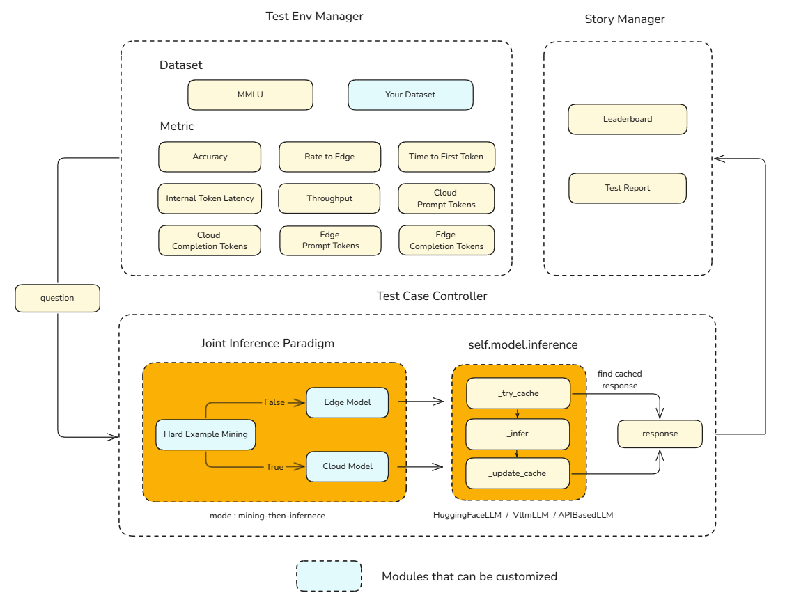

# Quick Start

## Introduction

This example aims to implement benchmarks for **LLM in cloud-edge collaborative inference scenario**. 

### Why LLM need cloud-edge collaborative inference?

Currently, such LLMs have billions or even trillions of parameters, requiring massive computing power for training and deployment. Therefore, they are often deployed in cloud computing centers and serving via APIs. However, such service paradigm faces many drawbacks.

- Time to First Token(TTFT) is quite long, due to transmission delays from the distance to the data center.
- Uploading user data to the cloud may lead to additional privacy risks and retraining risks.
- Calling APIs of the most advanced models (GPT-4o *et.al*) is often very expensive.
- Not all tasks require high-performance models to complete.

These issues can be addressed by introducing Edge Computing, which is an architecture featured by low-latency, privacy security, energy-efficient. 

By deploying small-scale LLMs on edge devices like mobile phones, PCs and communication base station, users will have low-latency and privacy-secure services. Empirically, models with fewer than 3B parameters are possible to be deployed on the aforementioned edge devices. However, due to Scaling Law, smaller models perform worse than larger models, so they can only maintain good performance on certain tasks. 

Thus, smaller models on edge should collaborate with larger models on cloud to achieve better performance on other tasks.

### Possible Collaborative Inference Strategy 

There are several cloud-edge collaborative inference strategy, including:

- Query Routing $^{[1, 2]}$ : route query to smaller-scale model on edge or larger-scale model on cloud based on its difficulty.
- Speculative Decoding $^{[3]}$ : smaller-scale models predicting future multiple words quickly during decoding followed by parallel validation via larger-scale models; if validation fails then re-generation by larger-scale occurs.
- Other possible ways. 

This example currently supports convenient benchmark testing for Query-Routing strategy. 

### Details of Design

The overall design is shown in the figure below.



When Ianvs starts the benchmarking job, the Test Env Manager will first pass the data of the user-specified Dataset to the Test Case Controller for Joint Inference one by one.

Joint Inference supports multiple modes, including `mining-then-inference`, `inference-then-mining`, and `self-design`. Among them, `mining-then-inference` is suitable for LLM scenarios, `inference-then-mining` is suitable for CV scenarios, and `self-design` allows you to implement more complex collaborative inference strategies on your own.

In this example, we will rely on Ianvs' Joint Inference Paradigm using the `inference-then-mining` mode to implement a Query Routing strategy. First, we call your custom Hard Example Mining module to determine if it is a hard case. If it is, we call the inference interface of the Edge Model to complete the inference; if not, we call the inference interface of the Cloud Model to complete it.

To save API calls during multi-round testing, this example has designed a result caching mechanism in both EdgeModel and Cloud Model. For questions that have already been tested, cached results will be read and returned.

After all tests are completed, the Test Env Manager will calculate relevant metrics based on selected Metrics and hand over to Story Manager for printing test reports and generating Leader Board.

## Required Resources

Before using this example, you need to have the device ready:

One machine is all you need, i.e., a laptop or a virtual machine is sufficient and a cluster is not necessary

- 2 CPUs or more

- 1 GPU with at least 6GB of memory, depends on the tested model

- 4GB+ free memory, depends on algorithm and simulation setting

- 10GB+ free disk space (depends on your model size)

- Internet connection for GitHub, PyPI,  HuggingFace, etc

- Python 3.8+ environment

## Step 1. Ianvs Preparation

```bash
# Create a new conda environment with Python>=3.8 (venv users can do it in their own way).
conda create -n ianvs-experiment python=3.8

# Activate our environment
conda activate ianvs-experiment

# Clone Ianvs Repo
git clone https://github.com/kubeedge/ianvs.git
cd ianvs

# Install a modified sedna wheel (a small bug and dependencies was fixed)
wget https://github.com/FuryMartin/sedna/releases/download/v0.4.1.1/sedna-0.4.1.1-py3-none-any.whl
pip install sedna-0.4.1.1-py3-none-any.whl

# Install dependencies for this example.
pip install examples/cloud-edge-collaborative-inference-for-llm/requirements.txt

# Install dependencies for Ianvs Core.
pip install requirements.txt

# Install ianvs
python setup.py install
```

## Step 2. Dataset and Model Preparation

### Dataset Configuration

Note: The currently supported dataset includes MMLU, and you can also construct the dataset you need for testing according to the format requirements of the dataset.

You need to create a dataset folder in`ianvs/` in the following structure.

```
.
├── dataset
│   └── mmlu
│       ├── test_data
│       │   ├── data_info.json
│       │   ├── data.jsonl
│       │   └── prompts.json
│       └── train_data
│           └── data.json
```

Leave `train_data/data.jsonl` as empty.

The file `data.jsonl` stores the main content of the dataset. Each line contains some keys.

Here is an example:

```json
{"question": "The metal surfaces for electrical resistance welding must be", "A": "rough.", "B": "clean.", "C": "moistened", "D": "coloured", "subject": "electrical_engineering", "answer": "B"}
{"question": "China and Vietnam's dispute over the Spratley Islands is", "A": "a positional dispute.", "B": "a territorial dispute.", "C": "a resource dispute.", "D": "a functional dispute.", "subject": "high_school_geography", "answer": "C"}
```

The `data_info.jsonl` stores information about the data, including `keys` and `answer_key`. The `keys` are the keys of the data, which can be used as placeholders in `prompts.json` to synthesize prompts, while the `answer_key` is the key for the answers. 

Here is an example:

```json
{
    "keys": ["question", "A", "B", "C", "D", "subject","answer"],
    "answer_key": "answer"
}
```

The `prompts.jsonl` stores the prompt information for testing, including `infer_system_prompt`, `infer_user_template`, and `infer_answer_template`. You can use the `keys` declared in `data_info.jsonl` as placeholders to fill in the data. 

Here is an example:

```json
{
    "infer_system_prompt": "You are a helpful assistant.",
    "infer_user_template": "There is a single choice question about {subject}. Answer the question by replying A, B, C or D.\nQuestion:{question}\nA:{A}\nB:{B}\nC:{C}\nD:{D}\n",
    "infer_answer_template": "Answer:{answer}\n"
}
```

Then, check the path of `train_data` and `test_dat` in 
`examples/cloud-edge-collaborative-inference-for-llm/testenv/testenv.yaml`.

- If you created the `dataset` folder inside `ianvs/` as mentioned earlier, then the relative path is correct and does not need to be modified.

- If your `dataset` is created in a different location, please use an absolute path, and using `~` to represent the home directory is not supported.

### Metric Configuration

*Note: If you just want to run this example quickly, you can skip this step.*

We have designed multiple metrics for edge-cloud collaborative inference, including:

| Metric                  | Description                                             | Unit    |
| :---------------------- | :------------------------------------------------------ | ------- |
| Accuracy                | Accuracy on the test Dataset                            | -       |
| Rate to Edge            | proportion of queries router to edge                    | -       |
| Time to First Token     | Time taken to generate the first token                  | s       |
| Internal Token Latency  | Time taken to generate each token                       | s       |
| Throughput              | Token generation speed                                  | token/s |
| Cloud Prompt Tokens     | Number of prompt tokens consumed by Cloud Model         | -       |
| Cloud Completion Tokens | Number of completion tokens generated by Cloud Model    | -       |
| Edge Prompt Tokens      | Number of prompt tokens consumed by the Edge Model      | -       |
| Edge Completion Tokens  | Number of completion tokens generated by the Edge Model | -       |

Each metric is calculated by a module in `examples/cloud-edge-collaborative-inference-for-llm/testenv`. For more details, please check the folder.

You can select multiple metrics in `examples/cloud-edge-collaborative-inference-for-llm/testenv/testenv.yaml`.

### Model Configuration

*Note: If you just want to run this example quickly, you can skip this step.*

The models are configured in `examples/cloud-edge-collaborative-inference-for-llm/testalgorithms/query-routing/test_queryrouting.yaml`.

In the configuration file, there are two models available for configuration: `EdgeModel` and `CloudModel`.

#### EdgeModel Configuration

The `EdgeModel` is the model that will be deployed on your local machine, supporting `huggingface` and `vllm` as serving backends.

For `EdgeModel`, the open parameters are:

| Parameter Name         | Type  | Description                                                  | Defalut                  |
| ---------------------- | ----- | ------------------------------------------------------------ | ------------------------ |
| model                  | str   | model name                                                   | Qwen/Qwen2-1.5B-Instruct |
| backend                | str   | model serving framework                                      | huggingface              |
| temperature            | float | What sampling temperature to use, between 0 and 2            | 0.8                      |
| top_p                  | float | nucleus sampling parameter                                   | 0.8                      |
| max_tokens             | int   | The maximum number of tokens that can be generated in the chat completion | 512                      |
| repetition_penalty     | float | The parameter for repetition penalty                         | 1.05                     |
| tensor_parallel_size   | int   | The size of tensor parallelism (Used for vLLM)               | 1                        |
| gpu_memory_utilization | float | The percentage of GPU memory utilization (Used for vLLM)     | 0.9                      |

#### CloudModel Configuration

The `CloudModel` represents the model on cloud, it will call LLM API via OpenAI API format. You need to set your OPENAI_BASE_URL and OPENAI_API_KEY in the environment variables yourself, for example.

```bash
export OPENAI_BASE_URL="https://api.openai.com/v1"
export OPENAI_API_KEY=sk_xxxxxxxx
```

For `CloudModel`, the open parameters are:

| Parameter Name     | Type | Description                                                  | Defalut     |
| ------------------ | ---- | ------------------------------------------------------------ | ----------- |
| model              | str  | model name                                                   | gpt-4o-mini |
| temperature        | float  | What sampling temperature to use, between 0 and 2            | 0.8         |
| top_p              | float  | nucleus sampling parameter                                   | 0.8         |
| max_tokens         | int  | The maximum number of tokens that can be generated in the chat completion | 512         |
| repetition_penalty | float  | The parameter for repetition penalty                         | 1.05        |

#### Router Configuration

Router is a component that routes the query to the edge or cloud model. The router is configured by `hard_example_mining` in `examples/cloud-edge-collaborative-inference-for-llm/testrouters/query-routing/test_queryrouting.yaml`.

Currently, supported routers include:

| Router Type  | Description                                                  | Parameters       |
| ------------ | ------------------------------------------------------------ | ---------------- |
| EdgeOnly     | Route all queries to the edge model.                         | -                |
| CloudOnly    | Route all queries to the cloud model.                        | -                |
| BERTRouter   | Use a BERT classifier to route the query to the edge or cloud model. | model, threshold |
| RandomRouter | Route the query to the edge or cloud model randomly.         | threshold        |

You can modify the `router` parameter in `test_queryrouting.yaml` to select the router you want to use.

For BERT router, you can use [routellm/bert](https://huggingface.co/routellm/bert) or [routellm/bert_mmlu_augmented](https://huggingface.co/routellm/bert_mmlu_augmented) or your own BERT model/

## Step 3. Run Ianvs

Run the following command:

`ianvs -f examples/llm/singletask_learning_bench/simple_qa/benchmarkingjob.yaml`

After the process finished, you will see output.

By changing different models and Router parameters, you may see output like:

```bash
+------+---------------+----------+--------------+---------------------+------------+------------------------+---------------------+-------------------------+--------------------+------------------------+----------------+---------------------+------------------------------------+-------------------+------------------+
| rank |   algorithm   | Accuracy | Rate to Edge | Time to First Token | Throughput | Internal Token Latency | Cloud Prompt Tokens | Cloud Completion Tokens | Edge Prompt Tokens | Edge Completion Tokens |    paradigm    | hard_example_mining |          edgemodel-model           | edgemodel-backend | cloudmodel-model |
+------+---------------+----------+--------------+---------------------+------------+------------------------+---------------------+-------------------------+--------------------+------------------------+----------------+---------------------+------------------------------------+-------------------+------------------+
|  1   | query-routing |  67.85   |     1.0      |        0.067        |   135.89   |         0.007          |          0          |            0            |      2103586       |         392448         | jointinference |       EdgeOnly      |      Qwen/Qwen2.5-7B-Instruct      |        vllm       |  deepseek-chat   |
|  2   | query-routing |  65.11   |     0.0      |        0.521        |   13.55    |         0.074          |       2035996       |          152806         |         0          |           0            | jointinference |      CloudOnly      | Qwen/Qwen2.5-3B-Instruct-GPTQ-Int8 |        vllm       |  deepseek-chat   |
|  3   | query-routing |  65.07   |     0.0      |        0.515        |   13.58    |         0.074          |       2028425       |          152393         |        7498        |          1213          | jointinference |      BERTRouter     | Qwen/Qwen2.5-3B-Instruct-GPTQ-Int8 |        vllm       |  deepseek-chat   |
|  4   | query-routing |  64.89   |     0.04     |        0.496        |   14.15    |         0.071          |       1865823       |          143046         |       170344       |          9997          | jointinference |      BERTRouter     | Qwen/Qwen2.5-3B-Instruct-GPTQ-Int8 |        vllm       |  deepseek-chat   |
|  5   | query-routing |  64.58   |     0.14     |        0.451        |   15.49    |         0.065          |       1502331       |          121653         |       536153       |         29820          | jointinference |      BERTRouter     | Qwen/Qwen2.5-3B-Instruct-GPTQ-Int8 |        vllm       |  deepseek-chat   |
|  6   | query-routing |  63.92   |     0.24     |        0.406        |   17.09    |         0.059          |       1191670       |          99516          |       850519       |         51685          | jointinference |      BERTRouter     | Qwen/Qwen2.5-3B-Instruct-GPTQ-Int8 |        vllm       |  deepseek-chat   |
|  7   | query-routing |  63.55   |     0.31     |         0.37        |   18.75    |         0.053          |       1030285       |          86470          |      1016798       |         62231          | jointinference |      BERTRouter     | Qwen/Qwen2.5-3B-Instruct-GPTQ-Int8 |        vllm       |  deepseek-chat   |
|  8   | query-routing |  62.26   |     0.42     |        0.318        |   21.81    |         0.046          |        840353       |          72551          |      1215723       |         75624          | jointinference |      BERTRouter     | Qwen/Qwen2.5-3B-Instruct-GPTQ-Int8 |        vllm       |  deepseek-chat   |
|  9   | query-routing |  61.76   |     0.52     |        0.275        |    25.4    |         0.039          |        701936       |          60792          |      1361799       |         82517          | jointinference |      BERTRouter     | Qwen/Qwen2.5-3B-Instruct-GPTQ-Int8 |        vllm       |  deepseek-chat   |
|  10  | query-routing |   60.9   |     0.65     |        0.215        |   33.21    |          0.03          |        509627       |          43354          |      1565065       |         90016          | jointinference |      BERTRouter     | Qwen/Qwen2.5-3B-Instruct-GPTQ-Int8 |        vllm       |  deepseek-chat   |
|  11  | query-routing |  60.48   |     0.84     |        0.123        |    59.4    |         0.017          |        232907       |          20583          |      1857170       |         98897          | jointinference |      BERTRouter     | Qwen/Qwen2.5-3B-Instruct-GPTQ-Int8 |        vllm       |  deepseek-chat   |
|  12  | query-routing |  60.43   |     1.0      |        0.045        |   185.51   |         0.005          |          0          |            0            |      2103586       |         104979         | jointinference |       EdgeOnly      | Qwen/Qwen2.5-3B-Instruct-GPTQ-Int8 |        vllm       |  deepseek-chat   |
|  13  | query-routing |  60.43   |     1.0      |        0.045        |   185.38   |         0.005          |         101         |            7            |      2103475       |         104977         | jointinference |      BERTRouter     | Qwen/Qwen2.5-3B-Instruct-GPTQ-Int8 |        vllm       |  deepseek-chat   |
|  14  | query-routing |  60.21   |     1.0      |        0.057        |   212.8    |         0.005          |          0          |            0            |      2103586       |         113141         | jointinference |       EdgeOnly      |      Qwen/Qwen2.5-3B-Instruct      |        vllm       |  deepseek-chat   |
|  15  | query-routing |  58.67   |     1.0      |        0.042        |   261.83   |         0.004          |          0          |            0            |      2103586       |         117313         | jointinference |       EdgeOnly      | Qwen/Qwen2.5-3B-Instruct-GPTQ-Int4 |        vllm       |  deepseek-chat   |
|  16  | query-routing |  57.57   |     1.0      |        0.053        |   166.88   |         0.006          |          0          |            0            |      2103586       |         153574         | jointinference |       EdgeOnly      |    Qwen/Qwen2.5-3B-Instruct-AWQ    |        vllm       |  deepseek-chat   |
|  17  | query-routing |   56.2   |     1.0      |        0.041        |   343.21   |         0.003          |          0          |            0            |      2103586       |         136572         | jointinference |       EdgeOnly      |     Qwen/Qwen2.5-1.5B-Instruct     |        vllm       |  deepseek-chat   |
+------+---------------+----------+--------------+---------------------+------------+------------------------+---------------------+-------------------------+--------------------+------------------------+----------------+---------------------+------------------------------------+-------------------+------------------+
```

Ianvs will output a `rank.csv` and `selected_rank.csv` in `ianvs/workspace`, which will record the test results of each test.

You can modify the relevant model parameters in `examples/cloud-edge-collaborative-inference-for-llm/testalgorithms/query-routing/test_queryrouting.yaml`, conduct multiple tests, and compare the results of different configurations.

## Discussion

### Query Routing's Application Scenario

Query Routing is a very useful cloud-edge collaboration strategy based on two facts:

- Calling top-tier large language models is expensive: For GPT-4o, the pricing is $5.00 / 1M input tokens and \$15.00 / 1M output tokens.

-  Not all tasks require calling top-tier models: For tasks like translation, organization, summarization, data formatting,and casual conversation, small models with 3B parameters or less can achieve satisfactory results.

These two facts suggest that if we can call different models based on the difficulty of the task, it will help save unnecessary API calls and thus reduce costs. Additionally, if edge device performance is sufficient, locally deployed small models can also demonstrate excellent latency and throughput metrics, further enhancing user experience.

Some related research $^{[1]}$ has trained routers that can save up to 40% of GPT-4 API calls while maintaining essentially unchanged accuracy on the test set.

## Future

This example builds an architecture for testing query routing strategies, but the provided dataset has some drawbacks such as being one-sided and singular, making it difficult to reflect effects in real-world scenarios. 

Besides, Speculative Decoding is another promising cloud-edge collaborative inference strategy, we should also implement it.

Thus, the future tasks of this example include:

- Build a more comprehensive dataset for better router evaluation
- Implement a Speculative Decoding example


**Reference**

[1] Ding, Dujian, et al. "Hybrid LLM: Cost-efficient and quality-aware query routing." *arXiv preprint arXiv:2404.14618* (2024).

[2] Ong, Isaac, et al. "Routellm: Learning to route llms with preference data." *arXiv preprint arXiv:2406.18665* (2024).

[3] Xia, Heming, et al. "Unlocking efficiency in large language model inference: A comprehensive survey of speculative decoding." *arXiv preprint arXiv:2401.07851* (2024).