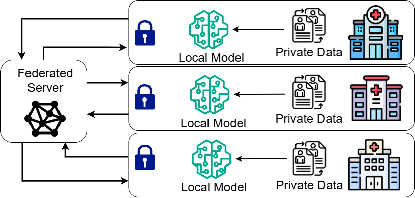

# Federated LLM Parameter-Efficient Fine-Tuning (FedLLM-PEFT)

## Overview

This directory contains the implementation of federated fine-tuning for Large Language Models using Parameter-Efficient Fine-Tuning (PEFT) methods within the Ianvs framework. The implementation supports federated learning with LoRA (Low-Rank Adaptation) and P-Tuning techniques, enabling privacy-preserving collaborative training of LLMs across distributed clients.

## Background and Motivation

With the growing demand for privacy-preserving AI and the increasing deployment of LLMs (Large Language Models) on edge and personal devices, fine-tuning LLMs in a federated setting has become a vital research topic. Traditional LLM training requires centralizing vast amounts of data, which is infeasible in privacy-sensitive or bandwidth-limited scenarios. Federated Learning (FL) provides a solution by enabling decentralized collaborative model training without raw data exchange.

### Real-World Use Case: Healthcare

Consider a consortium of hospitals aiming to develop a domain-specialized medical chatbot powered by large language models (LLMs). Clinicians at each site want the chatbot to handle specialty-specific clinical questions — for example, radiology interpretation hints, oncology treatment summaries, or ICU triage decision support. However, every conversation log, electronic health record (EHR) note, or clinical dialogue contains Protected Health Information (PHI). Under HIPAA (U.S.) and GDPR (EU) regulations, these sensitive data cannot be shared or exported across institutional or national boundaries. As a result, centralized model fine-tuning is infeasible and non-compliant with privacy laws.

With **FedLLM-PEFT**, each hospital participates in a privacy-preserving collaborative learning process:

1. Local Data Retention: Each hospital keeps its patient records and dialogue logs strictly on-premises, ensuring PHI never leaves its data center.

2. Parameter-Efficient Local Training: Instead of retraining the full LLM, each institution fine-tunes a LoRA adapter or other PEFT module using its private dataset. This drastically reduces computational cost and training footprint.

3. Secure Model Aggregation: Only the lightweight parameter updates (LoRA deltas)—which contain no patient identifiers or raw text—are encrypted and shared with a federated aggregator.

4. Global Model Enhancement: The aggregator merges these updates across sites to produce a collective, domain-expert model that benefits from all participants’ local knowledge, while no raw PHI ever crosses institutional firewalls.

The collective model gains domain expertise while never exposing a single name, lab value, or admission note outside institutional firewalls, fully preserving patient privacy without sacrificing language-model performance.

The approach ensures zero PHI leakage, as no patient name, note, or lab value ever leaves its originating hospital, thereby maintaining strict HIPAA/GDPR compliance. By enabling collaborative intelligence across multiple institutions without data pooling, FedLLM-PEFT allows hospitals to jointly enhance a shared medical LLM while preserving privacy. Its parameter-efficient design greatly reduces computational and communication overhead, ensuring scalability and efficiency, and the resulting global model achieves near–centralized fine-tuning performance without compromising security or data protection.



### Key Challenges Addressed

- **Large parameter size**: LLMs contain billions of parameters, making traditional federated learning impractical
- **High communication costs**: Transmitting full model weights across clients is bandwidth-intensive
- **Privacy requirements**: Sensitive data (e.g., medical records, personal information) cannot be centralized

### Solution: Parameter-Efficient Fine-Tuning

This implementation leverages PEFT methods to address these challenges:

- **LoRA (Low-Rank Adaptation)**: Inserts low-rank trainable adapters into weight matrices, requiring only a small fraction of parameters to be trained and shared
- **P-Tuning**: Learns continuous prompt vectors in the embedding layer, modifying only inputs while keeping the base model frozen

By combining federated learning with PEFT, this framework enables:
- Privacy-preserving collaborative LLM training without raw data exchange
- Reduced communication overhead (only adapter weights are shared)
- Efficient training with limited computational resources
- Scalable deployment across heterogeneous edge devices

## Architecture

The FedLLM-PEFT extends Ianvs's federated learning paradigm to support LLM fine-tuning with the following key features:

### Core Components

- **GPU-aware task scheduler**: Efficiently manages multiple clients across available GPUs to prevent out-of-memory (OOM) errors
- **Parameter-efficient methods**: Supports LoRA and P-Tuning for reduced memory footprint
- **Adaptive aggregation**: FedAvg and FedAvgM algorithms for PEFT parameter aggregation
- **Comprehensive metrics**: ROUGE-1, ROUGE-2, ROUGE-L, and BLEU-4 evaluation metrics

### Architecture Overview

The training process follows a standard federated learning workflow adapted for LLMs:

1. **Initialization**: Server distributes the global LLM adapter to sampled clients
2. **Local Training**: Each client performs Parameter-Efficient Fine-Tuning on local data
3. **Parameter Upload**: Clients upload learned adapter parameters to the server
4. **Aggregation**: Server aggregates client parameters using FedAvg or FedAvgM
5. **Iteration**: Process repeats for the specified number of communication rounds

### GPU-Aware Task Scheduler

Due to the computational constraints of LLM training, a **GPU-aware task scheduler** is employed to maximize throughput while preventing OOM errors. The scheduler:

- Places all client training jobs into a global task queue at the start of each round
- Launches a dedicated worker thread for every visible GPU
- Binds each thread to a specific GPU device
- Processes clients sequentially on each GPU (one at a time)
- Ensures peak memory usage equals the footprint of a single LoRA-augmented model

This design guarantees:
- Fixed memory ceiling regardless of the number of clients
- Balanced GPU utilization through FIFO scheduling
- Linear scalability with additional GPUs
- Reliable training of dozens of 7B-parameter LLM clients on Nvidia A100s

## Directory Structure

```
fedllm-peft/
├── algorithm/
│   ├── algorithm.yaml          # Algorithm configuration
│   ├── model.py               # Base model implementation
│   ├── FedAvg-PEFT.py        # FedAvg aggregation algorithm
│   └── FedAvgM-PEFT.py       # FedAvgM aggregation algorithm
├── testenv/
│   ├── testenv.yaml          # Test environment configuration
│   ├── rouge1_metric.py      # ROUGE-1 evaluation metric
│   ├── rouge2_metric.py      # ROUGE-2 evaluation metric
│   ├── rougel_metric.py      # ROUGE-L evaluation metric
│   └── bleu4_metric.py       # BLEU-4 evaluation metric
├── benchmarkingjob.yaml      # Benchmarking job configuration
└── README.md                 # This file
```

## Supported Models

### Base Models
- **ChatGLM-6B**: `THUDM/chatglm-6b`
- **LLaMA**: Various sizes supported
- **Other HuggingFace models**: Any transformer-based LLM with adapter support

### PEFT Methods
- **LoRA (Low-Rank Adaptation)**: Efficient fine-tuning through low-rank matrix decomposition; few extra parameters, no merge at inference
- **P-Tuning**: Continuous prompt learning in embedding space; modifies only inputs, flexible across tasks

### Aggregation Algorithms
- **FedAvg**: Weighted average of client models
- **FedAvgM**: FedAvg with server-side momentum for stabler convergence

## Example Dataset

The framework has been test on public dataset:

### MedQuad (English)
- **Task**: Medical question-answering
- **Language**: English
- **Source**: [HuggingFace - keivalya/MedQuad-MedicalQnADataset](https://huggingface.co/datasets/keivalya/MedQuad-MedicalQnADataset)

**Note**: After downloading raw JSONL files, users should create a test split for MedQuad and drop its redundant **qtype** field before integration.

## Configuration Parameters

### Algorithm Configuration (`algorithm.yaml`)

#### Paradigm Settings
- `paradigm_type`: Set to `"federatedlearning"` for federated learning paradigm
- `fl_data_setting`:
  - `train_ratio`: Proportion of data used for training (default: 1.0)
  - `splitting_method`: Data splitting strategy (default: "default")
  - `label_data_ratio`: Ratio of labeled data (default: 1.0)

#### Base Model Module
- `batch_size`: Training batch size per client (default: 1)
- `learning_rate`: Local learning rate (default: 1e-4)
- `local_epochs`: Number of local training epochs (default: 2)
- `model_name`: HuggingFace model identifier (e.g., "THUDM/chatglm-6b")
- `save_dir`: Directory to save trained models
- `initial_model_url`: Path to initial model weights
- `peft_method`: PEFT technique - "lora" or "ptuning"
- `aggregation`: Aggregation algorithm - "FedAvg-PEFT" or "FedAvgM-PEFT"

**Important**: Please change the path to `modules_url`, `initial_model_url`, `save_dir` and `aggregation` as per your setup.

#### Aggregation Module (FedAvgM-PEFT)
- `beta`: Momentum factor for server-side momentum (default: 0.7)
- `server_lr`: Server learning rate for aggregation (default: 1.0)

### Test Environment Configuration (`testenv.yaml`)

#### General Settings
- `backend`: Deep learning framework (set to "TORCH")
- `round`: Number of federated learning rounds
- `gpu_num`: Number of available GPUs
- `client_number`: Number of federated clients
- `if_mode_llm`: Enable LLM mode (must be true for FedLLM-PEFT)

#### Dataset Configuration
- `train_data`: Path to training dataset (JSONL format)
- `test_data`: Path to test dataset (JSONL format)

**Important**: Please change the path to datasets as per your setup. Datasets must be in JSONL format with two fields (question and answer, or similar instruction-response pairs).

#### Evaluation Metrics
- `rouge1_metric`: ROUGE-1 score for text generation quality (unigram overlap)
- `rouge2_metric`: ROUGE-2 score (bigram overlap)
- `rougel_metric`: ROUGE-L score (longest common subsequence)
- `bleu4_metric`: BLEU-4 score for translation quality

**Important**: Please change the path to model metrics as per your setup.

### Benchmarking Job Configuration (`benchmarkingjob.yaml`)

- `workspace`: Working directory for experiment outputs
- `testenv`: Path to test environment configuration
- `algorithm`: Path to algorithm configuration
- `test_object`: Specifies algorithms to benchmark
- `rank`: Ranking and visualization settings
  - `sort_by`: Metrics for leaderboard ranking
  - `visualization`: Output format and selected metrics

**Important**: Please change the path to `testenv.yaml` and `algorithm.yaml` as per your setup.

## Installation and Setup

### Prerequisites
- Python 3.8.18
- PyTorch 2.4.1+cu118
- CUDA-compatible GPU (tested on A100 80GB×4)
- 32GB RAM recommended

### Installation Steps

1. **Clone Ianvs Repository**
   ```bash
   cd ~
   git clone https://github.com/kubeedge/ianvs.git
   ```

2. **Install System Dependencies**
   ```bash
   sudo apt update
   sudo apt install libgl1-mesa-glx -y
   ```

3. **Install Ianvs Core Dependencies**
   ```bash
   cd ~/ianvs
   python -m pip install third_party/*
   python -m pip install -r requirements.txt
   ```

4. **Install Ianvs**
   ```bash
   python setup.py install
   ```

5. **Install Additional PEFT Dependencies**
   ```bash
   pip install peft transformers datasets rouge_score nltk
   ```

## Usage

### Data Preparation

Prepare your dataset in JSONL format with the following structure:
```json
{"question": "What are the treatments for Abdominal Adhesions?", "answer": "Abdominal adhesions that do not cause symptoms generally do not require treatment. Surgery is ..."}
```

Each line should be a valid JSON object with at least two fields representing the input (e.g., question, instruction) and output (e.g., answer, response).

### Running the Benchmark

Execute the federated LLM fine-tuning benchmark:

```bash
ianvs -f ./examples/federated-llm/fedllm-peft/benchmarkingjob.yaml
```

**Important**: Please change the path to `benchmarkingjob.yaml` as per your setup.

### Monitoring Progress

The framework provides detailed logging including:
- GPU assignment for each client
- Training progress per communication round
- Evaluation metrics on test data
- Final leaderboard and visualization reports

### Customization

1. **Adding New Models**: Update `model.py` with your model loading logic
   - Import your desired HuggingFace model
   - Configure PEFT parameters (rank, alpha, dropout, etc.)
   - Ensure compatibility with the training pipeline

2. **Custom PEFT Methods**: Extend the PEFT configuration in the model module
   - Modify LoRA configuration (target_modules, rank, alpha)
   - Adjust P-Tuning parameters (num_virtual_tokens, token_dim)

3. **New Aggregation Algorithms**: Implement custom aggregation methods following the existing pattern such as `FedAvg-PEFT.py`
   - Inherit from the base aggregation class
   - Implement the `aggregate()` method
   - Register your algorithm in `algorithm.yaml`

4. **Additional Metrics**: Add evaluation metrics in the `testenv/` directory
   - Follow the pattern in existing metric files
   - Update `testenv.yaml` to include your new metric

## Experimental Results
We conducted comprehensive benchmarking experiments to evaluate the performance of different combinations of aggregation methods and PEFT techniques. The experiments were performed on sub datasets of MedQuad (50 smaples) with the following setup:

   - Model: ChatGLM-6B
   - Number of Clients: 4
   - Communication Rounds: 5
   - Local Epochs: 2
   - Learning Rate: 1e-4

### Performance Comparison
The following rank table generated by ianvs shows the ranking of different algorithm combinations based on multiple evaluation metrics:
| rank | algorithm   | rouge1_metric | rouge2_metric | rougel_metric | bleu4_metric | paradigm          | basemodel   | aggregation  | basemodel-batch_size | basemodel-learning_rate | basemodel-local_epochs | basemodel-model_name | basemodel-save_dir                              | basemodel-initial_model_url           | basemodel-peft_method | time               | url                                                                                          |
|------|--------------|---------------|---------------|---------------|---------------|-------------------|-------------|--------------|----------------------|-------------------------|------------------------|----------------------|-----------------------------------------------|--------------------------------------|-----------------------|--------------------|----------------------------------------------------------------------------------------------|
| 1    | fedavg-peft | 0.3283        | 0.0965        | 0.1907        | 0.0525        | federatedlearning | fedllm-peft | FedAvg-PEFT  | 1                    | 1e-4                    | 2                      | THUDM/chatglm-6b     | ./project/save_model/fedllm/chatglm_lora      | ./project/init_model/fedllm/chatglm  | lora                  | 2025-10-10 00:08:45 | ./project/workspace/fedllm/benchmarkingjob/fedavgm-peft/d1f549a8-a527-11f0-b394-3cecefaf07e1 |
| 2    | fedavgm-peft | 0.2914        | 0.0745        | 0.1705        | 0.0454        | federatedlearning | fedllm-peft | FedAvgM-PEFT | 1                    | 0.0001                  | 2                      | THUDM/chatglm-6b     | ./project/save_model/fedllm/chatglm_ptuning2    | ./project/init_model/fedllm/chatglm  | ptuning               | 2025-10-09 22:59:00 | ./project/workspace/fedllm/benchmarkingjob/fedavgm-peft/9d9808d0-a51d-11f0-9559-3cecefaf07e1 |
| 3    | fedavgm-peft | 0.2911        | 0.0832        | 0.1691        | 0.0407        | federatedlearning | fedllm-peft | FedAvgM-PEFT | 1                    | 0.0001                  | 2                      | THUDM/chatglm-6b     | ./project/save_model/fedllm/chatglm_lora2       | ./project/init_model/fedllm/chatglm  | lora                  | 2025-10-09 22:33:53 | ./project/workspace/fedllm/benchmarkingjob/fedavgm-peft/ed4f831a-a51a-11f0-87de-3cecefaf07e1 |
| 4    | fedavg-peft  | 0.2892        | 0.0719        | 0.1669        | 0.0437        | federatedlearning | fedllm-peft | FedAvg-PEFT  | 1                    | 0.0001                  | 2                      | THUDM/chatglm-6b     | ./project/save_model/fedllm/chatglm_ptuning   | ./project/init_model/fedllm/chatglm  | ptuning               | 2025-10-09 23:26:09 | ./project/workspace/fedllm/benchmarkingjob/fedavg-peft/48d694de-a521-11f0-b42c-3cecefaf07e1  |

### Key Observations
The evaluation results demonstrate that FedAvg-PEFT with LoRA consistently outperforms other algorithmic configurations (including FedAvgM-PEFT and P-Tuning) across all metrics—ROUGE-1, ROUGE-2, ROUGE-L, and BLEU-4. This superiority stems from LoRA’s design, which injects low-rank adaptation matrices into the attention and feedforward layers, enabling the model to capture domain-specific knowledge efficiently without overfitting or destabilizing global updates. In this setup, LoRA transmits only about 3.67M trainable parameters out of 6.18B total, compared to P-Tuning’s 4.59M parameters, making it both parameter- and communication-efficient.

In contrast, P-Tuning relies on continuous prompt embeddings that primarily influence the model’s input representation rather than deeper layers, which can limit adaptation capacity in complex medical-language distributions. The larger number of trainable parameters and embedding-level updates may also introduce higher gradient variance across clients, leading to slower or less stable convergence under federated settings.

Furthermore, FedAvg-PEFT benefits from its simple averaging scheme that works well when client data distributions are moderately aligned, while FedAvgM’s momentum-based updates may only become advantageous under highly non-IID or heterogeneous conditions, where accumulated gradients help smooth out inter-client inconsistencies.

## Target Users

### Researchers
- Benchmark federated LLM learning methods
- Compare different PEFT techniques and aggregation strategies
- Conduct reproducible experiments with controlled parameters

### End Users
- View and compare federated AI capabilities of different solutions
- Evaluate privacy-preserving LLM fine-tuning for production deployment
- Access pre-configured benchmarks for common use cases

## References

1. McMahan, H. B., Moore, E., Ramage, D., Hampson, S., & Aguera y Arcas, B. *Communication-Efficient Learning of Deep Networks from Decentralized Data.* In **AISTATS**, 2017.
2. Hsu, T.-M. H., Qi, H., & Brown, M. *Measuring the Effects of Non-Identical Data Distribution for Federated Visual Classification.* arXiv:1909.06335, 2019.
3. Fan, T., Kang, Y., Ma, G., Chen, W., Wei, W., Fan, L., & Yang, Q. *FATE-LLM: A Industrial Grade Federated Learning Framework for Large Language Models.* In **Symposium on Advances and Open Problems in Large Language Models (LLM@IJCAI'23)**, 2023.
4. Liu, X., Ji, K., Fu, Y., *et al.* *P-Tuning v2: Prompt Tuning Can Be Comparable to Fine-tuning Universally Across Scales and Tasks.* arXiv:2110.07602, 2021.
5. KubeEdge. *Ianvs: Distributed Synergy AI Benchmarking Framework.* GitHub repository: [https://github.com/kubeedge/ianvs](https://github.com/kubeedge/ianvs)