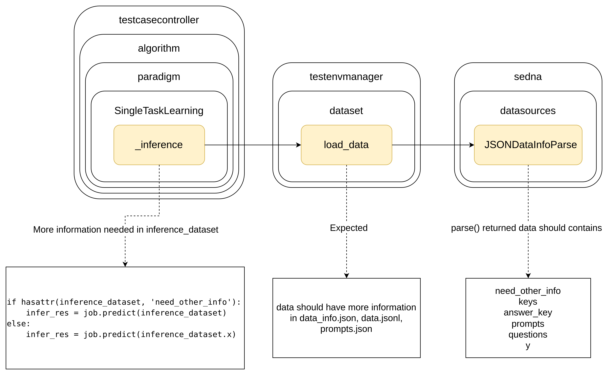

# Government BenchMark

## Introduction

This is the work for Domain-specific Large Model Benchmark:

Constructs a suite for the government sector, including test datasets, evaluation metrics, testing environments, and usage guidelines.

This Benchmark consists of two parts: subjective evaluation data and objective evaluation data.

## Design

### Metadata Format

| Name | Field Name | Option | Description |
| --- | --- | --- | --- |
| Data Name | dataset |  Required | Name of the dataset |
| Data Description | description | Optional | Dataset description, such as usage scope, sample size, etc. |
| First-level Dimension | level_1_dim | Required | Should fill in "Single Modal" or "Multi-Modal" |
| Second-level Dimension | level_2_dim | Required | For "Single Modal", fill in "Text", "Image", or "Audio". For "Multi-Modal", fill in "Text-Image", "Text-Audio", "Image-Audio", or "Text-Image-Audio" |
| Third-level Dimension | level_3_dim | Optional | Should be filled if all samples in the dataset have the same third-level dimension. If filled, content should be based on the standards shown in the normative reference document |
| Fourth-level Dimension | level_4_dim | Optional | Should be filled if all samples in the dataset have the same third-level dimension. If filled, content should be based on the standards shown in the normative reference document |

metadata example:

```json
{
    "dataset": "Medical BenchMark",
    "description": "xxx",
    "level_1_dim": "single-modal",
    "level_2_dim": "text",
    "level_3_dim": "Q&A",
    "level_4_dim": "medical"
}
```

### Data format:

|name|Option|information|
|---|---|---|
|prompt|Optional|the background of the LLM testing|
|query|Required|the testing question|
|response|Required|the answer of the question|
|explanation|Optional|the explanation of the answer|
|judge_prompt|Optional|the prompt of the judge model|
|level_1_dim|Optional|single-modal or multi-modal|
|level_2_dim|Optional|single-modal: text, image, video; multi-modal: text-image, text-video, text-image-video|
|level_3_dim|Required|details|
|level_4_dim|Required|details|

data example:

```json
{
    "prompt": "Please think step by step and answer the question.",
    "question": "Which one is the correct answer of xxx? A. xxx B. xxx C. xxx D. xxx",
    "response": "C",
    "explanation": "xxx",
    "level_1_dim": "single-modal",
    "level_2_dim": "text",
    "level_3_dim": "knowledge Q&A",
    "level_4_dim": "medical knowledge"
}
```


## Change to Core Code



## Prepare Datasets

You can download dataset in [kaggle](https://www.kaggle.com/datasets/kubeedgeianvs/the-government-affairs-dataset-govaff/data?select=government_benchmark)

```
dataset/government
├── objective
│   ├── test_data
│   │   ├── data.jsonl
│   │   └── metadata.json
│   └── train_data
└── subjective
    ├── test_data
    │   ├── data_full.jsonl
    │   ├── data.jsonl
    │   └── metadata.json
    └── train_data
```

## Prepare Environment

You should change your sedna package like this: [my sedna repo commit](https://github.com/IcyFeather233/sedna/commit/e13b82363c03dc771fca4922a24798554ca32a9f)

Or you can replace the file in `yourpath/anaconda3/envs/ianvs/lib/python3.x/site-packages/sedna` with `examples/resources/sedna-llm.zip`

## Run Ianvs

### Objective

`ianvs -f examples/government/singletask_learning_bench/objective/benchmarkingjob.yaml`

### Subjective

`ianvs -f examples/government/singletask_learning_bench/subjective/benchmarkingjob.yaml`