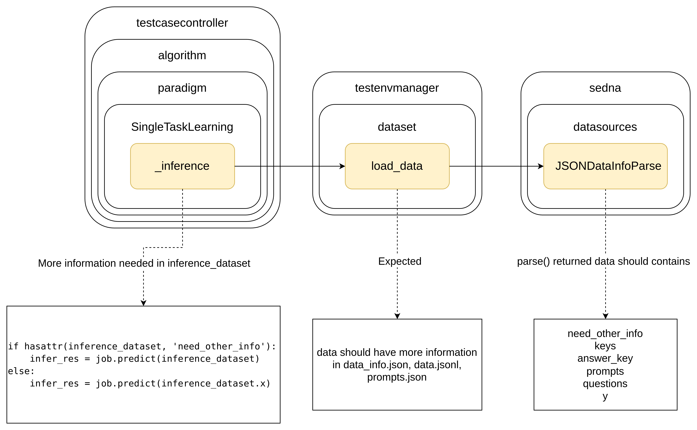

# Government BenchMark

## Introduction

This is the work for Domain-specific Large Model Benchmark:

Constructs a suite for the government sector, including test datasets, evaluation metrics, testing environments, and usage guidelines.

This Benchmark consists of two parts: subjective evaluation data and objective evaluation data.

## Design

Dataset format:

|name|optionality|information|
|---|---|---|
|prompt|optional|the background of the LLM testing|
|question|required|the testing question|
|response|required|the answer of the question|
|explanation|optional|the explanation of the answer|
|judge_prompt|optional|the prompt of the judge model|
|level_1_dim|optional|single-modal or multi-modal|
|level_2_dim|optional|single-modal: text, image, video; multi-modal: text-image, text-video, text-image-video|
|level_3_dim|required|details|
|level_4_dim|required|details|

data example:

```json
{
    "prompt": "Please think step by step and answer the question.",
    "question": "Which one is the correct answer of xxx? A. xxx B. xxx C. xxx D. xxx",
    "response": "C",
    "explanation": "xxx",
    "level_1_dim": "singel-modal",
    "level_2_dim": "text",
    "level_3_dim": "knowledge Q&A",
    "level_4_dim": "medical knowledge"
}
```


## Change to Core Code



## Prepare Datasets

You can download dataset in [kaggle](https://www.kaggle.com/datasets/hsj576/government-bench-master)

```
dataset/government
├── objective
│   ├── test_data
│   │   ├── data_info.json
│   │   ├── data.jsonl
│   │   └── prompts.json
│   └── train_data
└── subjective
    ├── test_data
    │   ├── data_full.jsonl
    │   ├── data_info.json
    │   ├── data.jsonl
    │   └── prompts.json
    └── train_data
```

## Prepare Environment

You need to install the changed-sedna package, which added `JSONDataInfoParse` in `sedna.datasources`

Replace the file in `yourpath/anaconda3/envs/ianvs/lib/python3.x/site-packages/sedna` with `examples/resources/sedna-jsondatainfo.zip`

## Run Ianvs

### Objective

`ianvs -f examples/government/singletask_learning_bench/objective/benchmarkingjob.yaml`

### Subjective

`ianvs -f examples/government/singletask_learning_bench/subjective/benchmarkingjob.yaml`