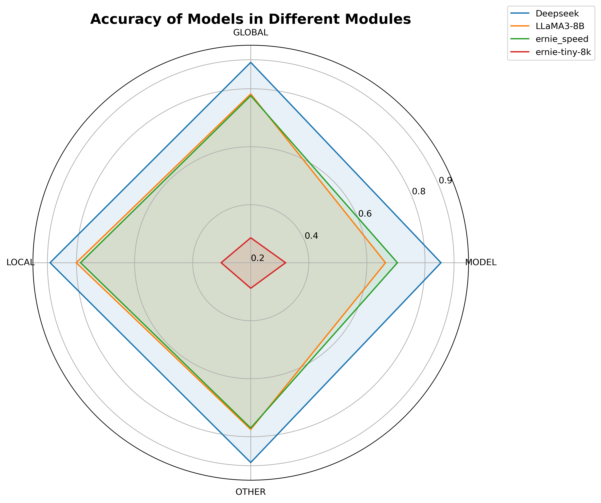
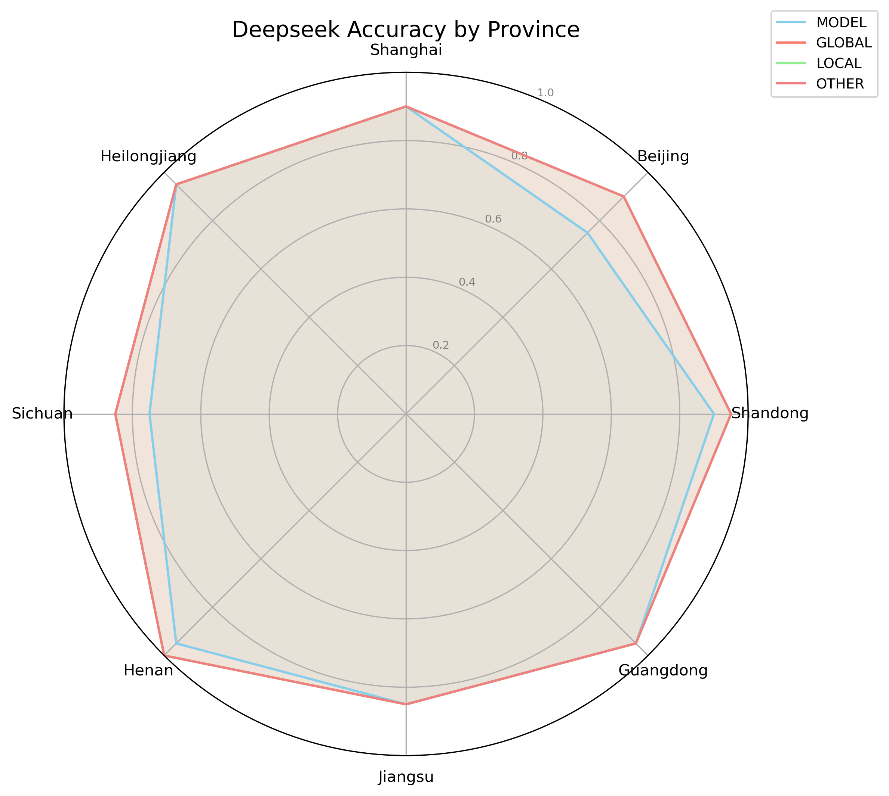
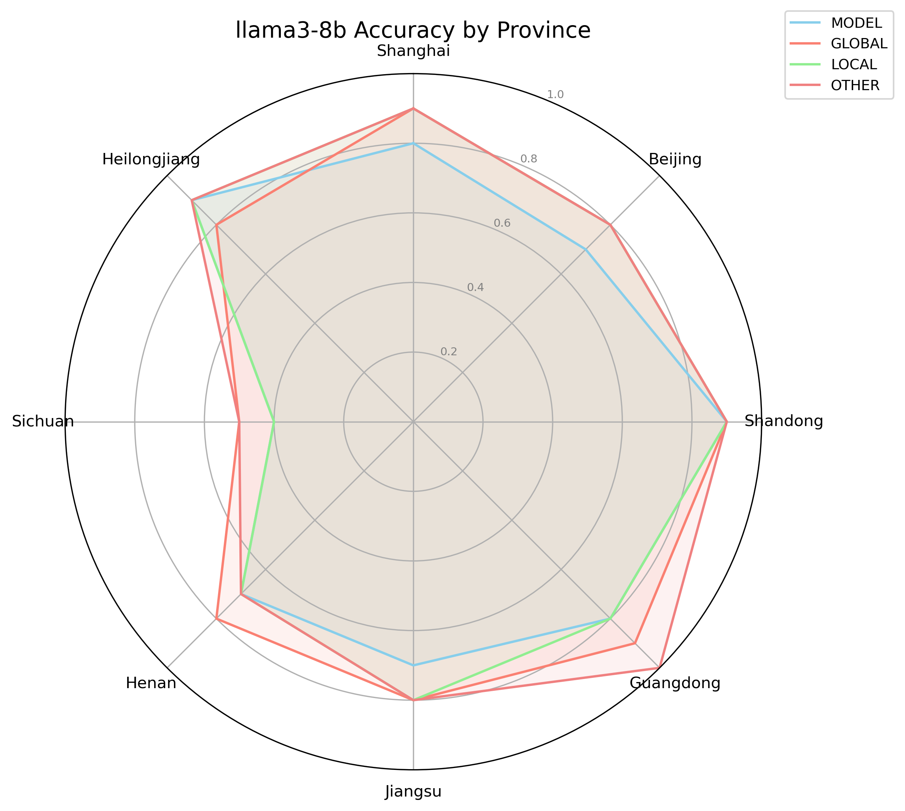
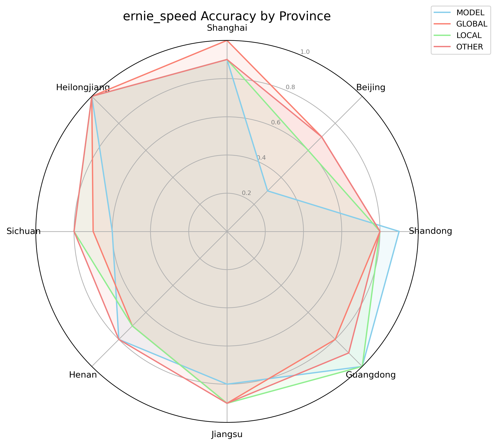
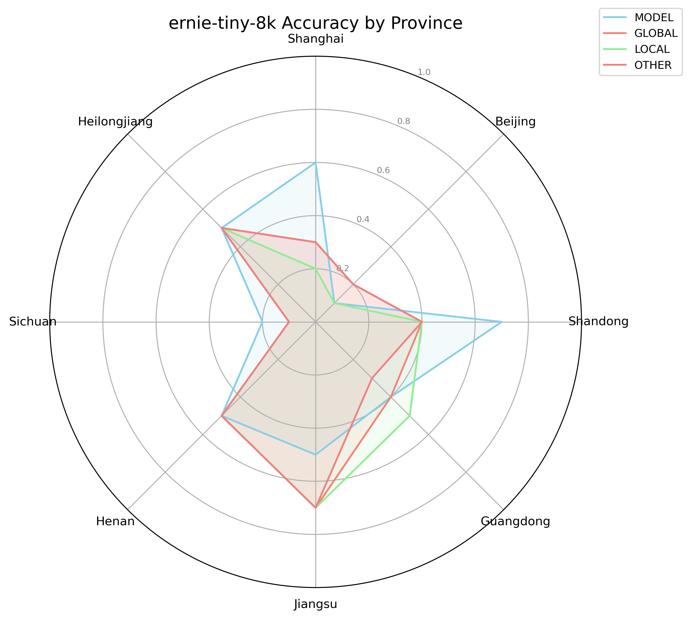

# Government RAG Example

This example demonstrates how to use Retrieval-Augmented Generation (RAG) technology in the government domain to enhance the performance of large language models.

## Features

1. Supports multiple document formats (txt, docx)
2. Uses LangChain for document processing and retrieval
3. Implements four test modes:
   - Type 1 - Model: No RAG mode
   - Type 2 - Global: Uses only data related to the tested edge node as the RAG knowledge base
   - Type 3 - Local: Uses data from all edge nodes as the RAG knowledge base
   - Type 4 - Other: Uses data unrelated to the tested edge node as the RAG knowledge base

## Test Methodology

In terms of experimental design, for evaluating the effectiveness of LLM + RAG solutions on Government data, we believe there should be three comparisons:

1. MODEL: LLM only
2. GLOBAL: LLM + RAG (only knowledge data relevant to edge question)
3. LOCAL: LLM + RAG (all knowledge data)
4. OTHER: LLM + RAG (all knowledge data not relevant to edge question)

Taking "Beijing" as an example of a tested provincial edge node, there are four experimental settings:

| Category | Tested Node | Knowledge Base | Representative Capability |
|----------|-------------|----------------|--------------------------|
| Type 1 (MODEL)   | Beijing     | No knowledge base, no RAG | Basic capability of large models without knowledge base |
| Type 2 (GLOBAL)   | Beijing     | Beijing's relevant knowledge base | Model's ability to learn from knowledge base |
| Type 3 (LOCAL)   | Beijing     | Knowledge base from all provinces and autonomous regions | Model's ability to search for relevant knowledge |
| Type 4 (OTHER)   | Beijing     | Knowledge base from all provinces except Beijing | Model's ability to generalize knowledge |

For evaluation metrics, we believe that due to the difficulty in controlling variables such as knowledge base quality across different provinces, metrics between different provinces (edge nodes) are not directly comparable.

For each region's evaluation, we have four experimental designs (Type 1, 2, 3, 4). We use Accuracy as the metric to calculate scores, and then take the average of the four experimental scores as the final government capability score for that region.

- Type 1 evaluates the LLM's basic capability without any knowledge base assistance.
- Type 2, using only knowledge base relevant to the edge node, evaluates the LLM's ability to learn from the knowledge base.
- Type 3, using the complete knowledge base, evaluates the LLM's ability to retrieve relevant knowledge.
- Type 4, using knowledge base unrelated to the edge node, evaluates the LLM's ability to generalize knowledge.

**Note: This benchmark design has limitations and can only partially reflect different large models' capabilities in handling government affairs across different provinces. The results are for reference only and cannot fully accurately reflect a model's government affairs capability.**

## Usage

1. Prepare data:

   The datasets are in [kaggle](https://www.kaggle.com/datasets/kubeedgeianvs/the-government-affairs-dataset-govaff?select=RAG-multi-edges-QA) now. The knowledge base (policy documents for each province), its vector store, and the benchmark (Question and Answer) are all in this link.

   Place the data in the `dataset/gov_rag` directory with the following structure:
   ```
   .
   ├── data.jsonl
   ├── dataset
   │   ├── Shanghai
   │   │   ├── Shanghai Data Trading Venue Management Implementation Measures.docx
   │   │   ├── Action Plan for Promoting Innovation and Development of the Data Elements Industry Based on the New Digital Economy Track.docx
   ...
   │   └── Heilongjiang
   │       ├── Heilongjiang Province Big Data Development and Application Promotion Regulations.docx
   │       ├── Heilongjiang Province Big Data Development and Application Promotion Regulations.txt
   │       └── Heilongjiang Province.docx
   └── metadata.json
   ```
   
   And you can put the knowledge base embedding directory in `./chroma_db` path to avoid re-generate the knowledge base embedding.
   
   Data example:
   ```json
   {"query": "In Shanghai's notice on data asset management, which approach is advocated to promote the compliant and efficient circulation of data assets?{\"A\": \"Rely entirely on government regulation\", \"B\": \"Combination of market leadership and government guidance\", \"C\": \"Enterprise-independent development\", \"D\": \"Unconditional data sharing\"}\nPlease answer directly with A/B/C/D, no explanation.", "response": "B", "level_1_dim": "single-modal", "level_2_dim": "text", "level_3_dim": "government", "level_4_dim": "Shanghai"}
   ```

2. Run the test:
   ```bash
   ianvs -f examples/government_rag/singletask_learning_bench/benchmarkingjob.yaml
   ```

## Test Results

Four models were selected for testing: Deepseek, LLaMA3-8B, ernie_speed, and ernie-tiny-8k. These models are representative, including strong language models, lightweight models, and models with varying amounts of Chinese corpus.

Test results are as follows:

| Model         | Experiment | Global Accuracy | Shanghai | Yunnan | National | Beijing | Nanjing | Jilin | Sichuan | Tianjin | Anhui | Shandong | Shanxi | Guangdong | Guangxi | Jiangsu | Jiangxi | Hebei | Henan | Zhejiang | Hainan | Hubei | Hunan | Gansu | Fujian | Guizhou | Liaoning | Chongqing | Shaanxi | Heilongjiang |
|---------------|------------|-----------------|----------|--------|----------|---------|---------|-------|---------|---------|-------|----------|--------|-----------|---------|---------|---------|-------|-------|----------|--------|-------|-------|-------|--------|---------|----------|-----------|---------|--------------|
| Deepseek      | MODEL      | 0.855357143     | 0.9      | 0.9    | 1        | 0.75    | 0.85    | 0.9   | 0.75    | 0.7     | 0.75  | 0.9      | 0.8    | 0.95      | 0.95    | 0.85    | 0.9     | 0.75  | 0.95  | 0.8      | 0.85   | 0.9   | 0.8   | 0.7   | 0.9    | 0.8     | 1        | 0.95      | 0.75    | 0.95         |
| Deepseek      | GLOBAL     | 0.891071429     | 0.9      | 0.9    | 0.95     | 0.9     | 0.95    | 0.85  | 0.85    | 0.75    | 0.85  | 0.95     | 0.8    | 0.95      | 0.95    | 0.85    | 0.85    | 0.85  | 1     | 0.95     | 0.95   | 0.95  | 0.8   | 0.8   | 0.9    | 0.8     | 1        | 0.95      | 0.8     | 0.95         |
| Deepseek      | LOCAL      | 0.891071429     | 0.9      | 0.95   | 0.95     | 0.9     | 0.95    | 0.85  | 0.85    | 0.75    | 0.9   | 0.95     | 0.75   | 0.95      | 0.95    | 0.85    | 0.85    | 0.85  | 1     | 0.95     | 0.9    | 0.95  | 0.8   | 0.75  | 0.9    | 0.8     | 1        | 0.95      | 0.85    | 0.95         |
| Deepseek      | OTHER      | 0.889285714     | 0.9      | 0.9    | 0.95     | 0.9     | 0.9     | 0.85  | 0.85    | 0.75    | 0.9   | 0.95     | 0.75   | 0.95      | 0.95    | 0.85    | 0.85    | 0.8   | 1     | 0.95     | 0.95   | 0.95  | 0.8   | 0.8   | 0.9    | 0.8     | 1        | 0.95      | 0.85    | 0.95         |
| llama3-8b     | MODEL      | 0.664285714     | 0.8      | 0.6    | 0.7      | 0.7     | 0.8     | 0.7   | 0.4     | 0.5     | 0.6   | 0.9      | 0.7    | 0.8       | 0.9     | 0.7     | 0.5     | 0.4   | 0.7   | 0.7      | 0.4    | 0.6   | 0.7   | 0.4   | 0.6    | 0.7     | 0.8      | 0.7       | 0.7     | 0.9          |
| llama3-8b     | GLOBAL     | 0.782142857     | 0.9      | 0.7    | 0.65     | 0.8     | 0.85    | 0.75  | 0.55    | 0.55    | 0.85  | 0.9      | 0.8    | 0.9       | 0.8     | 0.8     | 0.5     | 0.8   | 0.8   | 0.9      | 0.7    | 0.8   | 0.7   | 0.7   | 1      | 0.8     | 1        | 0.9       | 0.7     | 0.8          |
| llama3-8b     | LOCAL      | 0.801785714     | 0.9      | 0.7    | 0.65     | 0.85    | 0.85    | 0.75  | 0.45    | 0.75    | 0.8   | 0.95     | 0.85   | 0.85      | 0.7     | 0.85    | 0.6     | 0.85  | 0.7   | 0.85     | 0.7    | 0.95  | 0.7   | 0.75  | 1      | 0.85    | 1        | 0.9       | 0.75    | 0.95         |
| llama3-8b     | OTHER      | 0.775           | 0.9      | 0.7    | 0.6      | 0.8     | 0.8     | 0.8   | 0.5     | 0.7     | 0.8   | 0.9      | 0.7    | 1         | 0.7     | 0.8     | 0.6     | 0.8   | 0.7   | 0.9      | 0.7    | 0.9   | 0.7   | 0.6   | 0.9    | 0.7     | 1        | 0.9       | 0.7     | 0.9          |
| ernie-tiny-8k | MODEL      | 0.319642857     | 0.6      | 0.1    | 0.3      | 0.1     | 0.1     | 0.2   | 0.2     | 0.2     | 0.2   | 0.7      | 0.2    | 0.4       | 0.3     | 0.5     | 0.1     | 0.3   | 0.5   | 0.8      | 0.2    | 0.2   | 0.2   | 0.35  | 0.3    | 0.3     | 0.1      | 0.2       | 0.8     | 0.5          |
| ernie-tiny-8k | GLOBAL     | 0.285714286     | 0.3      | 0      | 0.3      | 0.2     | 0.1     | 0.25  | 0.1     | 0.2     | 0.1   | 0.4      | 0.2    | 0.4       | 0.2     | 0.7     | 0.15    | 0.2   | 0.5   | 0.8      | 0.2    | 0.2   | 0.1   | 0.3   | 0.2    | 0.3     | 0.1      | 0.3       | 0.7     | 0.5          |
| ernie-tiny-8k | LOCAL      | 0.301785714     | 0.2      | 0.1    | 0.15     | 0.1     | 0.1     | 0.25  | 0.15    | 0.25    | 0.15  | 0.4      | 0.25   | 0.5       | 0.25    | 0.75    | 0.15    | 0.2   | 0.55  | 0.8      | 0.15   | 0.25  | 0.25  | 0.3   | 0.25   | 0.35    | 0.1      | 0.3       | 0.7     | 0.5          |
| ernie-tiny-8k | OTHER      | 0.2875          | 0.3      | 0.1    | 0.2      | 0.2     | 0.1     | 0.2   | 0.1     | 0.2     | 0.1   | 0.4      | 0.2    | 0.3       | 0.2     | 0.7     | 0.1     | 0.2   | 0.5   | 0.8      | 0.2    | 0.2   | 0.2   | 0.35  | 0.2    | 0.3     | 0.1      | 0.4       | 0.7     | 0.5          |
| ernie_speed   | MODEL      | 0.705357143     | 0.9      | 0.5    | 0.8      | 0.3     | 0.8     | 0.7   | 0.6     | 0.6     | 0.6   | 0.9      | 0.7    | 1         | 0.9     | 0.8     | 0.9     | 0.4   | 0.75  | 0.7      | 0.3    | 0.7   | 0.7   | 0.5   | 0.4    | 0.8     | 0.8      | 0.9       | 0.8     | 1            |
| ernie_speed   | GLOBAL     | 0.776785714     | 1        | 0.6    | 0.8      | 0.75    | 0.8     | 0.9   | 0.7     | 0.65    | 0.8   | 0.8      | 0.8    | 0.8       | 0.7     | 0.9     | 0.7     | 0.6   | 0.7   | 0.8      | 0.7    | 0.95  | 0.6   | 0.7   | 0.8    | 0.8     | 1        | 0.9       | 0.5     | 1            |
| ernie_speed   | LOCAL      | 0.785714286     | 0.9      | 0.6    | 0.8      | 0.65    | 0.8     | 0.95  | 0.8     | 0.65    | 0.8   | 0.8      | 0.9    | 1         | 0.75    | 0.9     | 0.8     | 0.6   | 0.75  | 0.8      | 0.75   | 0.95  | 0.6   | 0.6   | 0.6    | 0.85    | 1        | 0.9       | 0.5     | 1            |
| ernie_speed   | OTHER      | 0.769642857     | 0.9      | 0.5    | 0.7      | 0.7     | 0.9     | 0.9   | 0.8     | 0.6     | 0.8   | 0.8      | 0.9    | 0.85      | 0.7     | 0.9     | 0.6     | 0.6   | 0.8   | 0.7      | 0.6    | 0.9   | 0.7   | 0.8   | 0.6    | 0.8     | 1        | 0.9       | 0.6     | 1            |

The visualization of the average scores for each edge node is as follows:

<table>
  <tr>
    <td></td>
    <td></td>
    <td></td>
    <td></td>
    <td></td>
  </tr>
</table>
It can be observed that, overall, Deepseek performs the best, followed by LLaMA3-8B and ernie_speed with similar performance, while ernie-tiny-8k performs the worst. Additionally, when the model itself is already strong (Deepseek), the effect of RAG is relatively weaker. When the model's performance is moderate, RAG has a more significant impact. For models with poor performance, the effect of RAG is unstable. The general trend is Local RAG > Global RAG > Other RAG > Model. Usually, using Other RAG can outperform the Model, indicating that policy documents from different edge nodes may have some correlation, leading to some performance gains. However, when the model performs bad, these gains are not consistent and can sometimes have a negative impact due to differences in policies across edge nodes.