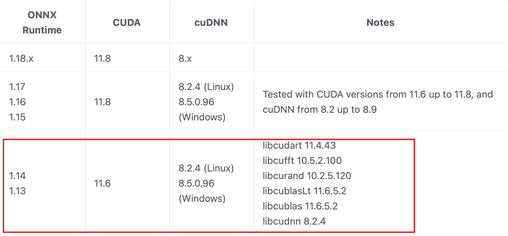
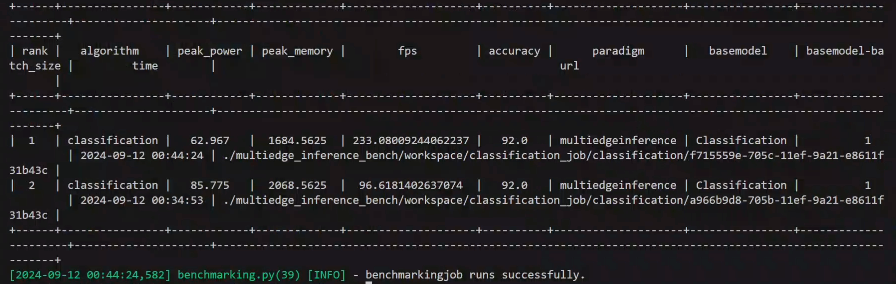
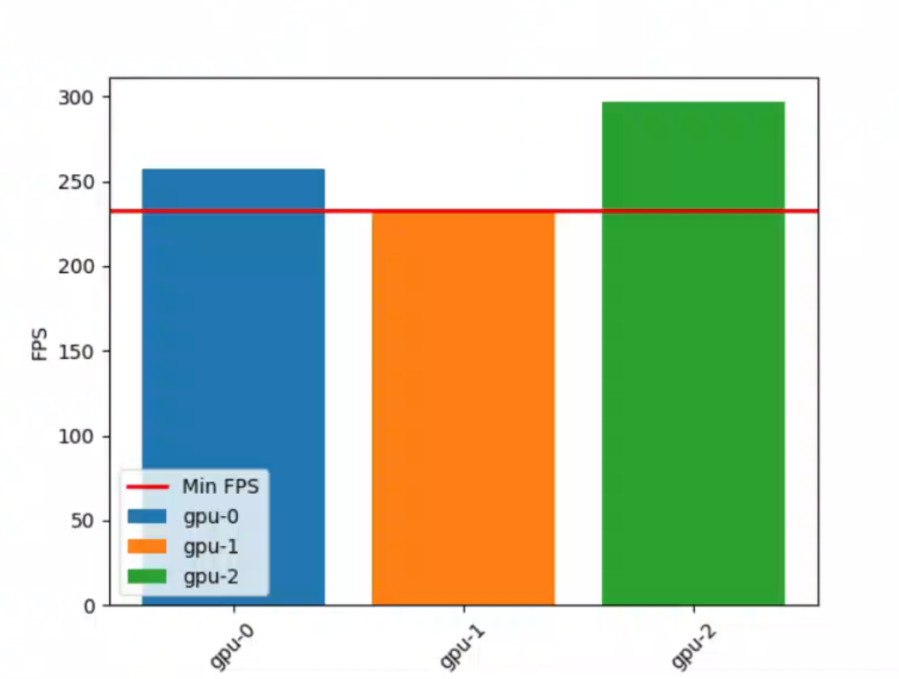

# Benchmarking of Image Clasification for High Mobility Scenarios

In high-mobility scenarios such as highways and high-speed railways, the connection between personal terminal devices and cloud servers is significantly weakened. However, in recent years, artificial intelligence technology has permeated every aspect of our lives, and we also need to use artificial intelligence technologies with high computational and storage demands and sensitive to latency in high-mobility scenarios. For example, even when driving through a tunnel with a weak network environment, we may still need to use AI capabilities such as image classification. Therefore, in the event that edge devices lose connection with the cloud, offloading AI computing tasks to adjacent edge devices and achieving computational aggregation based on the mutual collaboration between devices, to complete computing tasks that traditionally require cloud-edge collaboration, has become an issue worth addressing. This benchmarking job aims to simulate such scenario: using multiple heterogeneous computing units on the edge (such as personal mobile phones, tablets, bracelets, laptops, and other computing devices) for collaborative ViT inference, enabling image classification to be completed with lower latency using devices that are closer to the edge, thereby enhancing the user experience.After running benchmarking jobs, a report will be generated.

With Ianvs installed and related environment prepared, users is then able to run the benchmarking process using the following steps. If you haven't installed Ianvs, please refer to [how-to-install-ianvs](../../../docs/guides/how-to-install-ianvs.md).

## Prerequisites

To setup the environment, run the following commands:
```shell
cd <Ianvs_HOME>
pip install ./examples/resources/third_party/*
pip install -r requirements.txt
cd ./examples/imagenet/multiedge_inference_bench/
pip install -r requirements.txt
cd <Ianvs_HOME>
mkdir dataset initial_model
```
Please refer to [this link](https://onnxruntime.ai/docs/execution-providers/CUDA-ExecutionProvider.html) and ensure that the versions of CUDA and cuDNN are compatible with the version of ONNX Runtime.

Note that it is advisable to avoid using lower versions of the ONNX library, as they are very time-consuming when performing computational graph partitioning. The version of onnx-cuda-cudnn we used in our tests is as follows:


## Step 1. Prepare Dataset
Download [ImageNet 2012 dataset](https://image-net.org/download.php) and put it under <Ianvs_HOME>/dataset in the following structure:

```
dataset
   |------ILSVRC2012_devkit_t12.tar.gz
   |------ILSVRC2012_img_val.tar
```
Then, you need to process the dataset and generate the _train.txt_ and _val.txt_:

```shell
cd <Ianvs_HOME>
python ./examples/imagenet/multiedge_inference_bench/testalgorithms/dataset.py
```

## Step 2. Prepare Model

Next, download pretrained model via [[huggingface]](https://huggingface.co/optimum/vit-base-patch16-224/tree/main), rename it to vit-base-patch16-224.onnx and put it under <Ianvs_HOME>/initial_model/

## Step 3. Run Benchmarking Job
We are now ready to run the ianvs for benchmarking image clasification for high mobility scenarios on the ImageNet dataset.

```python
ianvs -f ./examples/imagenet/multiedge_inference_bench/classification_job.yaml
```

The benchmarking process takes a few minutes and varies depending on devices.

## Step 4. Check the Result

Finally, the user can check the result of benchmarking on the console and also in the output path (/ianvs/multiedge_inference_bench/workspace) defined in the benchmarking config file (classification_job.yaml).

The final output might look like this:


You can view the graphical representation of relevant metrics in /ianvs/multiedge_inference_bench/workspace/images/, such as the following:


To compare the running conditions of the model with and without parallelism in the multiedge inference scenario, you can modify the value of --devices_info in base_model.py to devices_one.yaml to view the relevant metrics when the model runs on a single device.

## Explanation for devices.yaml

This file defines the specific information of edge-side multi-devices and the model's partition points. The devices section includes the computing resource type, memory, frequency, and bandwidth for each device. The partition_points section defines the input and output names of each computational subgraph and their mapping relationships with devices. This benchmarking job achieves the partitioning of the computational graph and model parallelism by manually defining partition points. You can implement custom partitioning algorithms based on the rich device information in devices.yaml.

## Custom Partitioning Algorithms

How to partition an ONNX model based on device information is an interesting question. You can solve this issue using greedy algorithms, dynamic programming algorithms, or other innovative graph algorithms to achieve optimal resource utilization and the lowest inference latency.

More partitioning algorithms will be added in the future and you can customize their own partition methods in basemodel.py, they only need to comply with the input and output specifications defined by the interface as follows:

```
def partiton(self, initial_model):
    ## 1. parsing devices.yaml
    ## 2. modeling
    ## 3. partition
    return models_dir, map_info
```

Hope you have a perfect journey in solving this problem!


