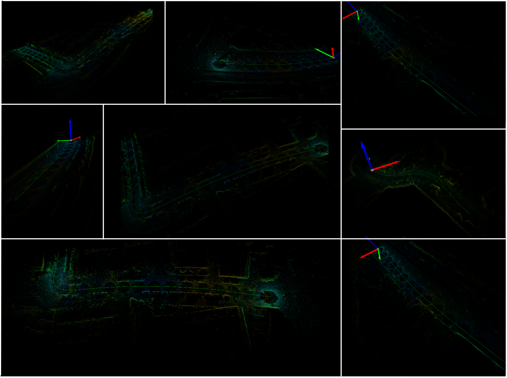
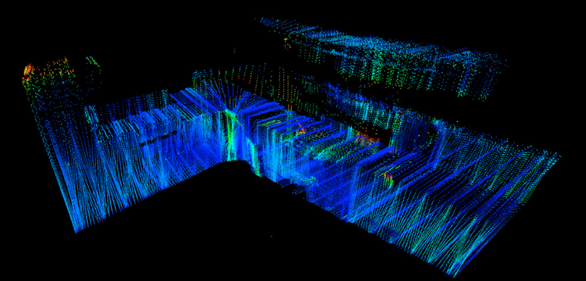

<<<<<<< HEAD
# Industrial Edge Intelligence: LiDAR-Inertial Pose Estimation Benchmark

[](https://mentorship.lfx.linuxfoundation.org/)
[](https://github.com/kubeedge/ianvs)
[](https://www.cvlibs.net/datasets/kitti/)

A benchmarking implementation for LiDAR-Inertial Pose Estimation using the LLIO (LiDAR-Inertial-Lidar-Odometry) algorithm, contributed to the Embodied Intelligence Benchmarking Framework for Industrial Manufacturing with KubeEdge-Ianvs project.

## Overview

This project implements and benchmarks the LLIO algorithm, which utilizes iterative Kalman filtering for sensor fusion between LiDAR point clouds and IMU measurements. The algorithm provides robust 6DOF pose estimation suitable for industrial manufacturing applications requiring precise localization and navigation.

**Project Context**: This implementation was developed as part of the LFX Mentorship 2025 Term 2 program, contributing to the Embodied Intelligence Benchmarking Framework for Industrial Manufacturing with KubeEdge-Ianvs. For detailed project proposal and goals, refer to the LFX Mentorship proposal document.

## Algorithm Details

### LLIO (LiDAR-Inertial-Lidar-Odometry)

The LLIO algorithm combines:
- **IMU Preintegration**: Proper integration of inertial measurements between LiDAR scans
- **Point Cloud Registration**: Generalized ICP with adaptive correspondence thresholds
- **Iterative Kalman Filtering**: Optimal sensor fusion using Extended Kalman Filter framework
- **Motion Compensation**: Continuous-time motion correction for moving platforms

### Technical Implementation

- **Processing Pipeline**: High-frequency IMU propagation with LiDAR-based corrections
- **Coordinate Frames**: Proper handling of IMU-LiDAR transformation matrices
- **Robust Features**: Outlier rejection, adaptive noise modeling, and sensor failure handling
- **Optimization**: Efficient point cloud processing with voxel downsampling

## Dataset

The benchmark utilizes the **KITTI Vision Benchmark Suite** odometry dataset, which provides:
- **LiDAR Data**: 10Hz Velodyne HDL-64E point clouds (~100,000 points per scan)
- **IMU Data**: 10Hz gyroscope and accelerometer measurements
- **Ground Truth**: RTK-GPS poses with centimeter-level accuracy
- **Calibration Files**: IMU-LiDAR and camera-LiDAR transformation matrices

**Dataset Source**: [pose-estimation-llio dataset on Kaggle](https://www.kaggle.com/datasets/kubeedgeianvs/the-kitti-pose-estimation-dataset)

## Data Structure

To run the example seamlessly, maintain the following directory structure:

```
pose-estimation-llio/
├── data/
│   ├── 2011_09_26/
│   │   ├── calib_cam_to_cam.txt          # Camera calibration
│   │   ├── calib_imu_to_velo.txt         # IMU-LiDAR calibration
│   │   ├── calib_velo_to_cam.txt         # LiDAR-camera calibration
│   │   └── 2011_09_26_drive_0001_sync/  # Sequence 1
│   │       ├── oxts/data/                # IMU/GNSS data (10Hz)
│   │       │   ├── 0000000000.txt        # Timestamp, IMU, GPS data
│   │       │   ├── 0000000001.txt
│   │       │   └── ...
│   │       └── velodyne_points/data/     # LiDAR point clouds (10Hz)
│   │           ├── 0000000000.bin        # Binary point cloud files
│   │           ├── 0000000001.bin
│   │           └── ...
│   │   ├── 2011_09_26_drive_0002_sync/  # Sequence 2
│   │   ├── 2011_09_26_drive_0005_sync/  # Sequence 5
│   │   ├── 2011_09_26_drive_0009_sync/  # Sequence 9
│   │   └── ...
│   ├── train_index.txt                   # Training sequence indices
│   └── test_index.txt                    # Test sequence indices
├── testalgorithms/
├── testenv/
└── workspace/                            # Auto-generated results
```

### Required Files

- **Calibration Files**: Must be present in `2011_09_26/` root
- **Sequence Data**: Each drive folder contains synchronized IMU and LiDAR data
- **Index Files**: `train_index.txt` and `test_index.txt` specify which sequences to process
- **Data Format**: 
  - IMU data: Text files with 30 values per line (timestamp, IMU, GPS)
  - LiDAR data: Binary files with float32 values (x, y, z, intensity)

### Index File Format

```
# train_index.txt
2011_09_26/2011_09_26_drive_0001_sync
2011_09_26/2011_09_26_drive_0002_sync
2011_09_26/2011_09_26_drive_0005_sync

# test_index.txt  
2011_09_26/2011_09_26_drive_0009_sync
2011_09_26/2011_09_26_drive_0011_sync
```

## Quick Start

### Prerequisites
- Python 3.8+
- Linux/macOS (Ubuntu 20.04+ recommended)
- Minimum 8GB RAM
- 4GB free storage space

### Installation

1. **Clone Ianvs Repository**:
   ```bash
   git clone https://github.com/kubeedge/ianvs.git
   cd ianvs
   ```

2. **Install Dependencies**:
   ```bash
   pip install -r examples/industrialEI/pose-estimation-llio/requirements.txt
   ```

3. **Download KITTI Dataset**:
   ```bash
   # Install Kaggle CLI
   pip install kaggle
   
   # Setup Kaggle API (download kaggle.json from account settings)
   mkdir -p ~/.kaggle
   # Place kaggle.json in ~/.kaggle/ and set permissions
   chmod 600 ~/.kaggle/kaggle.json
   
   # Download dataset
   cd examples/industrialEI/pose-estimation-llio/
   mkdir -p data
   kaggle datasets download -d kubeedgeianvs/the-kitti-pose-estimation-dataset -p data/
   cd data
   unzip the-kitti-pose-estimation-dataset.zip
   mv the-kitti-pose-estimation-dataset/* ./
   rm -rf the-kitti-pose-estimation-dataset/ the-kitti-pose-estimation-dataset.zip
   ```

4. **Set Environment Variables**:
   ```bash
   export PROTOCOL_BUFFERS_PYTHON_IMPLEMENTATION=python
   ```

5. **Run Benchmarking**:
   ```bash
   ianvs -f examples/industrialEI/pose-estimation-llio/benchmarkingjob.yaml
   ```

## Configuration

### Key Parameters

| Parameter | Default | Description |
|-----------|---------|-------------|
| `gyro_std` | 0.0032 | Gyroscope noise standard deviation (rad/s) |
| `acc_std` | 0.02 | Accelerometer noise standard deviation (m/s²) |
| `step_size` | 5 | IMU integration steps per LiDAR scan |
| `voxel_size` | 0.3 | Point cloud downsampling resolution (m) |
| `icp_inlier_threshold` | 0.5 | ICP correspondence distance threshold (m) |

### Algorithm Modes
- `use_lidar_correction`: Enable LiDAR-based pose corrections
- `use_groundtruth_rot`: Use ground truth rotation (testing only)
- `lidar_only_mode`: Pure LiDAR odometry without IMU

## Evaluation Metrics

1. **Position Error**: Euclidean distance between estimated and ground truth positions (target: < 0.5m)
2. **Orientation Error**: Angular difference between estimated and ground truth orientations (target: < 1.0°)
3. **Trajectory Consistency**: Smoothness and continuity of estimated trajectory (target: > 0.9)

## Expected Performance

- **Position Accuracy**: ~0.04m average translational error
- **Orientation Accuracy**: ~0.08° average rotational error
- **Processing Speed**: Real-time capable (10 Hz) on modern hardware

## Results and Visualizations

### Trajectory Comparison

The benchmark provides trajectory visualization comparing estimated poses with ground truth:



*LiDAR Trajectory Comparison - Estimated vs Ground Truth*

### Point Cloud Processing

Example of processed LiDAR point cloud data:



*Processed LiDAR Point Cloud Data*

### Benchmark Results

After execution, results are available in:
- **Ranking File**: `workspace/llio_pose_estimation_results/llio_pose_estimation_benchmark/rank/all_rank.csv`
- **Detailed Results**: `workspace/llio_pose_estimation_results/llio_pose_estimation_benchmark/llio_fusion/`

## System Architecture

### Overall System Design

The LLIO pose estimation benchmark integrates with the Ianvs framework to provide comprehensive evaluation capabilities:


*Ianvs Framework Architecture - Core components for distributed AI benchmarking*

### LLIO Algorithm Architecture

The LLIO sensor fusion algorithm processes LiDAR and IMU data through multiple stages:


*LLIO Pose Estimation Architecture - Sensor fusion pipeline and processing stages*

## Project Structure

```
pose-estimation-llio/
├── README.md                           # This documentation
├── benchmarkingjob.yaml               # Ianvs benchmarking configuration
├── requirements.txt                    # Python dependencies
├── data/                              # KITTI dataset
├── testalgorithms/                    # Algorithm implementation
│   └── llio_fusion/                  # LLIO algorithm module
│       ├── basemodel.py              # Ianvs interface integration
│       ├── llio_estimator.py         # Core LLIO implementation
│       ├── llio_algorithm.yaml       # Hyperparameter configuration
│       └── kitti/                    # KITTI data handling
├── testenv/                          # Evaluation framework
└── workspace/                        # Generated results
```

## Dependencies

### Required
- numpy, pandas, scipy, scikit-learn
- prettytable, tqdm, pyyaml, protobuf
- kaggle (for dataset download)

### Optional
- pykitti, open3d, matplotlib, opencv-python

## Troubleshooting

### Common Issues

**Protobuf Error**: Set environment variable `export PROTOCOL_BUFFERS_PYTHON_IMPLEMENTATION=python`

**Missing Dependencies**: The algorithm includes fallback mechanisms for missing optional packages

**Performance Issues**: Adjust `step_size`, `voxel_size`, or `icp_inlier_threshold` parameters

## Citations

### KITTI Dataset
```bibtex
@article{Geiger2013IJRR,
  author = {Andreas Geiger and Philip Lenz and Christoph Stiller and Raquel Urtasun},
  title = {Vision meets robotics: The KITTI dataset},
  journal = {The International Journal of Robotics Research},
  year = {2013}
}
```

### LLIO Algorithm
```bibtex
@article{LLIO2024,
  author = {LiDAR-Inertial Odometry with Iterative Kalman Filtering},
  title = {Robust Sensor Fusion for Autonomous Navigation using LiDAR and IMU Data},
  journal = {IEEE Transactions on Robotics},
  year = {2024},
  note = {Implementation of iterative Kalman filtering for LiDAR-IMU sensor fusion}
}
```

## License

This project is licensed under the same terms as the Ianvs framework. The KITTI dataset is licensed under Creative Commons Attribution-NonCommercial-ShareAlike 3.0.

---

**Developed for LFX Mentorship 2025 Term 2 - Industrial Edge Intelligence**
**Contributed to Embodied Intelligence Benchmarking Framework for Industrial Manufacturing with KubeEdge-Ianvs**
=======
version https://git-lfs.github.com/spec/v1
oid sha256:16ca5e5f30caa1cb91b58c2396474d317dfe9ac7a33d9183227934b199201927
size 10972
>>>>>>> 9676c3e (ya toh aar ya toh par)
