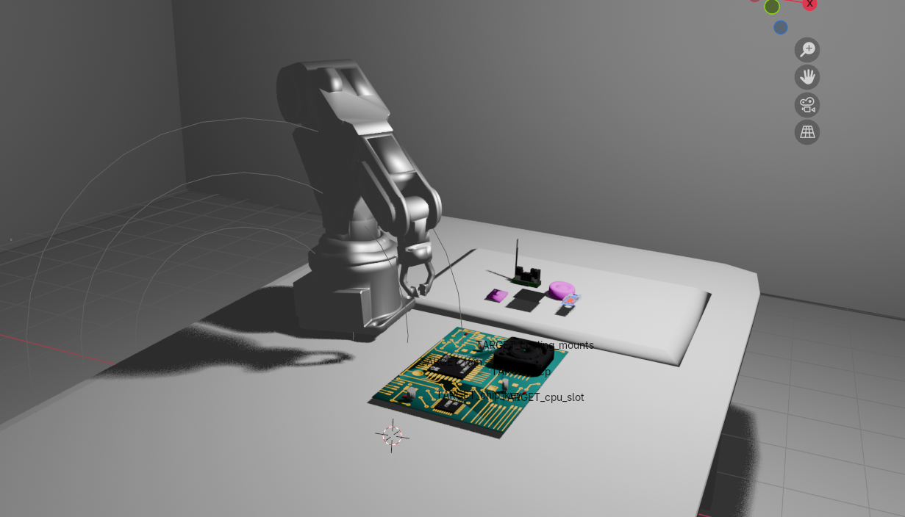
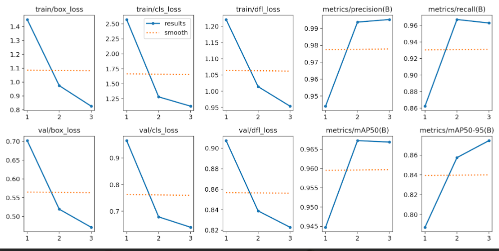
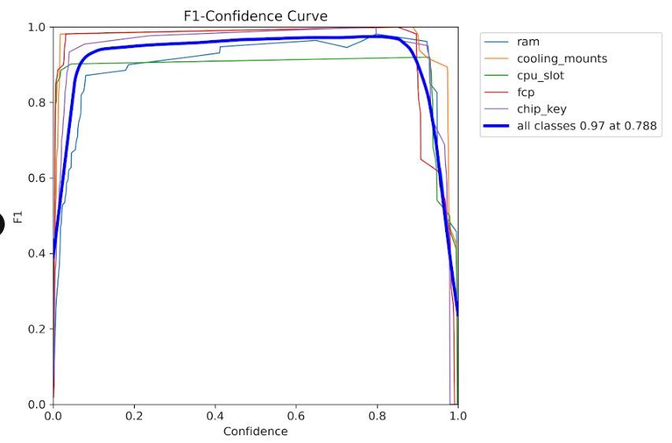
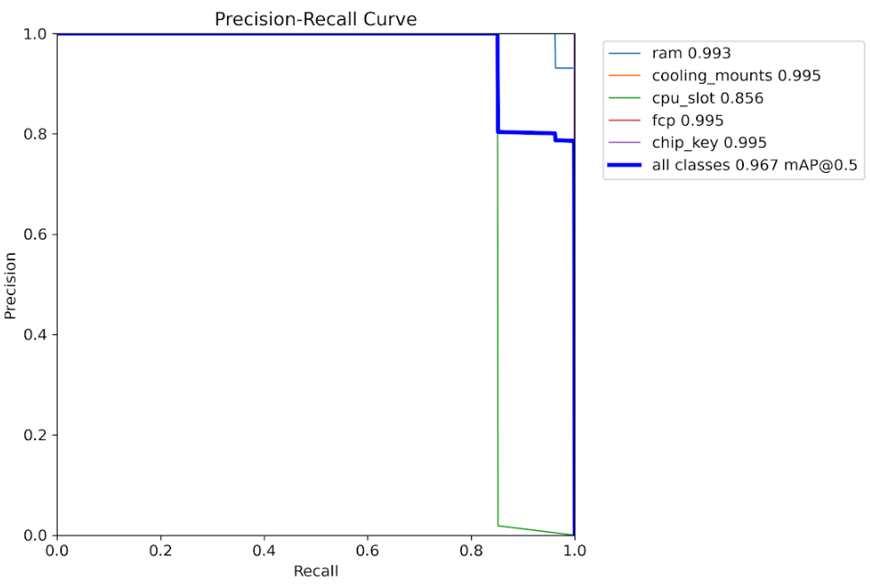
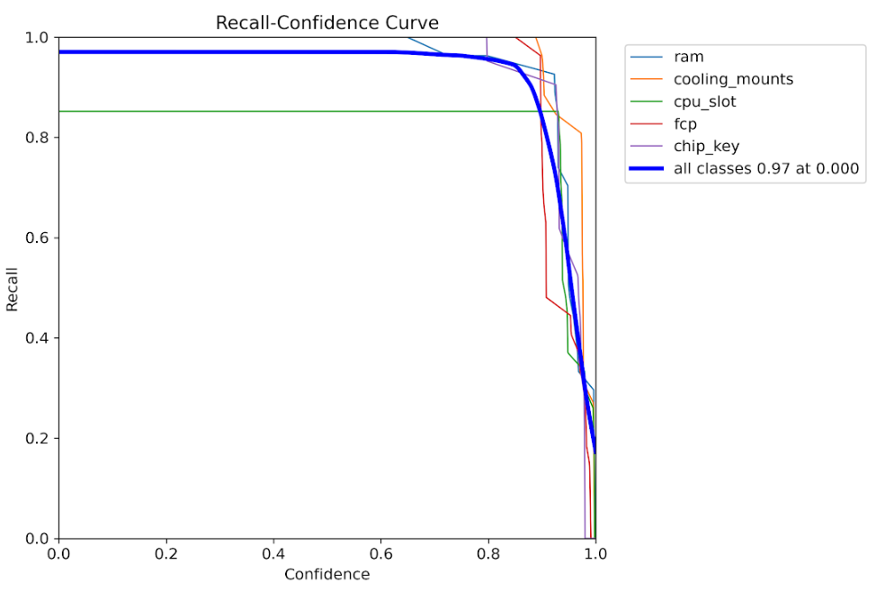
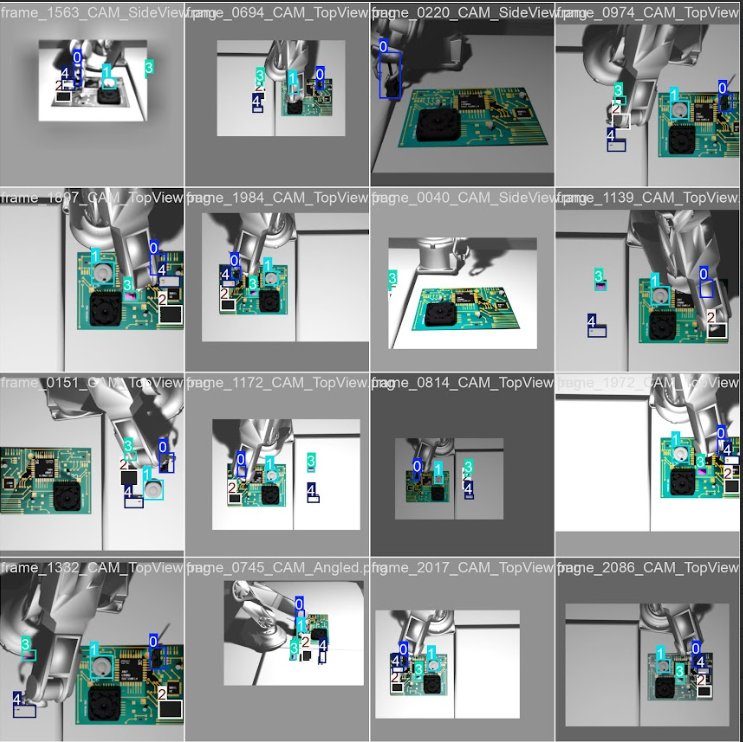
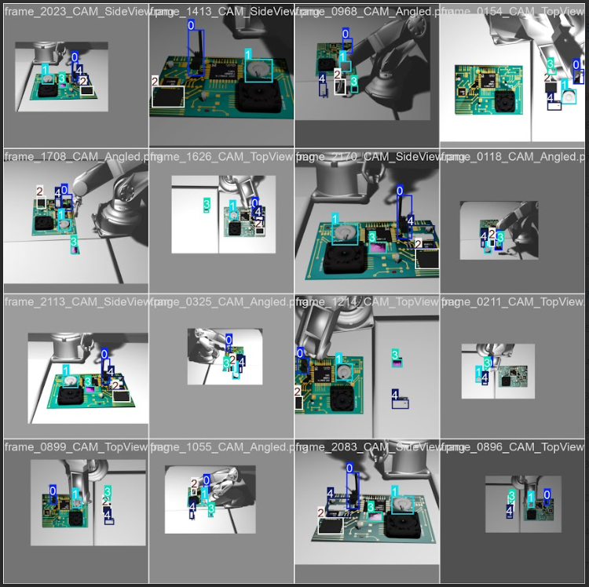
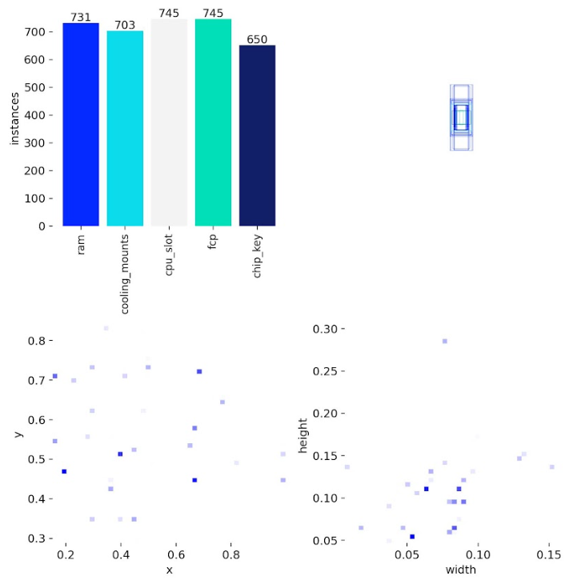
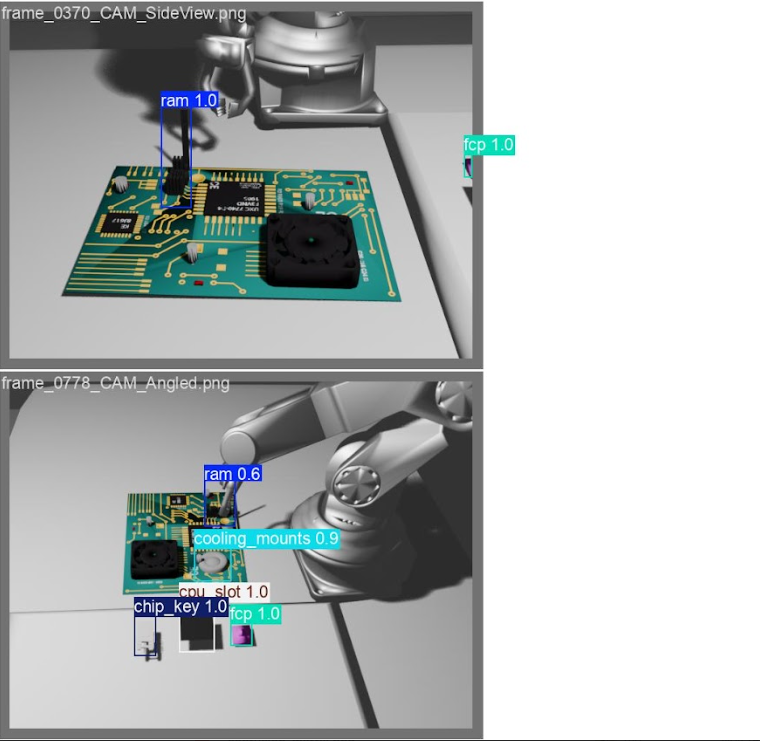
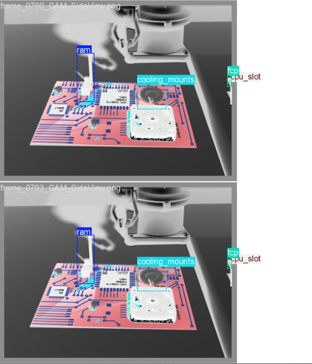

# README

## Embodied Intelligence Industrial Assembly - Deformable Component Assembly Benchmark

### Table of Contents

   - [Introduction](#introduction)  
   - [Prerequisites](#prerequisites)  
   - [Ianvs Setup and Installation](#ianvs-setup-and-installation)  
   - [Deformable Component Assembly Benchmark](#deformable-component-assembly-benchmark)  
            - [Step 1 - Setup Dataset](#step-1-setup-dataset)  
            - [Step 2 - Prepare Config](#step-2-prepare-config)  
            - [Step 3 - Run Benchmarking](#step-3-run-benchmarking)  
            - [Step 4 - Output](#step-4-output)  
   - [Algorithm Details](#algorithm-details)  
   - [Dataset Structure](#dataset-structure)  
   - [Troubleshooting](#troubleshooting)  
   - [License](#license) 

---

### Introduction

Welcome to the Embodied Intelligence Industrial Assembly Benchmark on Ianvs! This benchmark aims to test the performance of multi-stage robotic assembly systems for precision industrial manufacturing. The benchmark focuses on **deformable component assembly** - a complex task that requires the integration of visual perception, force-controlled manipulation, and quality verification.

This benchmark addresses the critical challenge of assembling small, delicate electronic components (like RAM modules, CPU slots, and flexible printed circuits) onto motherboards with industrial-grade precision. The system combines:

- **High-Precision Perception**: YOLOv8-based object detection for component localization
- **Force-Controlled Manipulation**: Haptic feedback for delicate assembly operations
- **Visual Quality Verification**: CNN-based inspection for defect detection

The benchmark evaluates end-to-end assembly workflows in a simulated PyBullet environment, providing realistic datasets with multimodal sensor data including RGB-D images, segmentation, depth  force/torque measurements, and robot joint states.



---

### Prerequisites

Before using this benchmark, ensure your system meets the following requirements:

- One machine is sufficient (laptop or virtual machine)
- 4 CPUs or more recommended
- 8GB+ free memory (depends on simulation complexity)
- 20GB+ free disk space (for dataset and models)
- Internet connection for GitHub, pip, and dataset downloads
- Python 3.8+ installed (Python 3.9 recommended)
- CUDA-capable GPU recommended for YOLOv8 training (optional but speeds up processing)

This benchmark has been tested on Linux platforms with **Python 3.9**. Windows users may need to adapt some commands and package requirements.

---

### Ianvs Setup and Installation

First, download the Ianvs codebase. Assuming `/ianvs` as the workspace:

```bash
git clone https://github.com/kubeedge/ianvs.git
cd ianvs
```

Create and activate a virtual environment:

```shell
sudo apt-get install -y virtualenv
mkdir ~/venv 
virtualenv -p python3 ~/venv/ianvs
source ~/venv/ianvs/bin/activate
```

Install system dependencies and Python packages:

```shell
sudo apt-get update
sudo apt-get install libgl1-mesa-glx -y
python -m pip install --upgrade pip

python -m pip install ./examples/resources/third_party/*
python -m pip install -r requirements.txt
```

Install benchmark-specific requirements:

```shell
pip install -r examples/industrialEI/single_task_learning_bench/deformable_component_manipulation/requirements.txt
```

Install Ianvs:

```shell
python setup.py install  
ianvs -v
```

**If the version information prints successfully, Ianvs is ready to use.**

---

### Deformable Component Assembly Benchmark

This benchmark evaluates a multi-stage robotic assembly workflow that integrates perception, manipulation, and verification into a cohesive pipeline.


#### Step 1 - Setup Dataset

The **Deformable Component Assembly Dataset** is a custom multimodal dataset containing:
- RGB and depth images from simulated cameras
- Force/torque sensor data from robot wrist
- YOLO-format annotations for object detection
- Assembly success/failure labels
- Robot trajectory and joint state logs


To download the dataset from Kaggle:

```shell
# Download the dataset from:
# https://www.kaggle.com/datasets/kubeedgeianvs/deformable-assembly-dataset


mkdir -p /ianvs/datasets
cd /ianvs/datasets
```

**Transfer the downloaded `.zip` file to the datasets folder** (you can use tools like XFTP for remote systems). Then extract:

```shell
unzip deformable_assembly_dataset.zip
```
The extracted dataset will have this structure:

```
deformable_assembly_dataset/
│
├── episodes/                                    # Episode data
│   ├── episode_001_ram/
│   │   ├── images/
│   │   │   ├── rgb/                            # RGB camera frames
│   │   │   │   ├── frame_0000_CAM_TopView.png
│   │   │   │   └── ... (451 frames)
│   │   │   ├── depth/                          # Depth camera frames
│   │   │   └── segmentation/                   # Segmentation masks
│   │   ├── labels/ rgb                            # YOLO format labels
│   │   │   ├── frame_0000_CAM_TopView.txt
│   │   │   └── ...
│   │   ├── annotations/                        # Additional annotations
│   │   ├── sensor_data/                        # Force/torque logs
│   │   │   ├── force_torque_log.csv
│   │   │   └── robotic_arm_poses.csv
│   │   └── metadata/                           # Episode metadata
│   │
│   ├── episode_002_cooling_mounts/             # 400 frames
│   ├── episode_003_cpu_slot/                   # 400 frames
│   ├── episode_004_fcp/                        # 400 frames
│   └── episode_005_chip_key/                   # 577 frames
│
├── index/                                       # Train/test split indices
│   ├── train_index1.txt                        # Episode 1 train split (80%)
│   ├── test_index1.txt                         # Episode 1 test split (20%)
│   ├── train_index2.txt                        # Episode 2 splits
│   ├── test_index2.txt
│   ├── train_index3.txt                        # Episode 3 splits
│   ├── test_index3.txt
│   ├── train_index4.txt                        # Episode 4 splits
│   ├── test_index4.txt
│   ├── train_index5.txt                        # Episode 5 splits
│   └── test_index5.txt
│
└── dataset_info.json                           # Dataset metadata
|__ test_index.txt                              # all episode test indexes 
|__ train_index.txt                             # all episodes train indexes

```

**Note**: The dataset contains 2,227 total frames across 5 episodes, with each episode focusing on a different component type (RAM, cooling mounts, CPU slot, FCP, and chip key).

---

#### Project Architecture

```
ianvs/examples/industrialEI/single_task_learning_bench/
└── deformable_assembly/
    ├── testalgorithms/
    │   └── assembly_alg/
    │       ├── components/
    │       │   ├── perception.py                    # YOLOv8 and CNN vision modules
    │       │   └── manipulation.py                  # Force-control and robot movement
    │       ├── testenv/
    │       │   └── acc.py                           # For new end-to-end metrics
    |       |   └── testenv.yaml
    |       |
    │       ├── naive_assembly_process.py            # Orchestrates the entire process
    │       
    ├── benchmarkingjob.yaml
    └── README.md

```

#### Step 2 - Prepare Config

The dataset path should be configured in `testenv.yaml`. In this benchmark, we have pre-configured the paths for you.


Set up the algorithm path:

```shell
export PYTHONPATH=$PYTHONPATH:/ianvs/examples/industrialEI/single_task_learning_bench/deformable_assembly/testalgorithms/assembly_alg
```

The algorithm configuration is defined in `algorithm.yaml`. The benchmark uses:

- **YOLOv8** for component detection and localization
- **Force-control algorithms** for precise manipulation
- **CNN** for visual quality inspection

For detailed configuration options, refer to the [Ianvs documentation](https://ianvs.readthedocs.io/en/latest/guides/how-to-test-algorithms.html).


#### Step 3 - Run Benchmarking

Execute the benchmark:

```shell
cd /ianvs
ianvs -f examples/industrialEI/single_task_learning_bench/deformable_assembly/benchmarkingjob.yaml
```


The benchmark will:
1. Load the multimodal dataset
2. Run YOLOv8 detection on each frame
3. Execute force-controlled assembly in PyBullet simulation
4. Perform CNN-based visual inspection
5. Calculate comprehensive performance metrics
6. Generate a detailed report

#### Step 4 - Output

Results are available on the console and in the output directory (e.g., `/ianvs/industrialEI_workspace`) as defined in `benchmarkingjob.yaml`.

The benchmark output includes:

```
╔═══════════════════════════════════════════════════════════════════════════════════════════════════════════════════════════╗
║                                        🎯 EVALUATION COMPLETE                                                            ║
║                                                                                                                           ║
║  ► Overall Accuracy Score: 6400                                                                                  ║
║  ► Overall Accuracy Percentage:  64.00%                                                                             ║
║  ► Detection mAP50:  91.19%                                                                                           ║
║  ► Assembly Success Rate:  83.33%                                                                                  ║
║  ► Total Frames Processed:    150                                                                                      ║
║  ► Successful Assemblies:    125                                                                                       ║
║                                                                                                                           ║
║  🏆 Final Combined Score: 0.7759 ( 77.59%)                                                                         ║
╚═══════════════════════════════════════════════════════════════════════════════════════════════════════════════════════════╝
```

**Comprehensive Metrics Table:**

```
┌───────────────┬────────┬──────┬───────┬───────┬───────┬───────┬────────┬───────┐
│ Component     │ Frames │ Imgs │ Prec% │ Rec%  │ mAP50 │ mAP95 │ Acc%   │ Succ% │
├───────────────┼────────┼──────┼───────┼───────┼───────┼───────┼────────┼───────┤
│ ram           │ 30     │ 136  │ 94.1  │ 73.5  │ 89.4  │ 62.5  │ 60.0   │ 83.3  │
│ cooling_mounts│ 30     │ 120  │ 99.6  │ 99.2  │ 99.5  │ 91.8  │ 65.0   │ 83.3  │
│ cpu_slot      │ 30     │ 150  │ 99.3  │ 80.0  │ 82.5  │ 72.4  │ 55.0   │ 83.3  │
│ fcp           │ 30     │ 150  │ 96.1  │ 81.7  │ 88.2  │ 75.9  │ 70.0   │ 83.3  │
│ chip_key      │ 30     │ 120  │ 99.6  │ 99.2  │ 99.5  │ 95.7  │ 70.0   │ 83.3  │
╞═══════════════╪════════╪══════╪═══════╪═══════╪═══════╪═══════╪════════╪═══════╡
║ OVERALL       ║ 150    ║ 676  ║ 97.7  ║ 85.9  ║ 91.2  ║ 78.8  ║ 64.0   ║ 83.3  ║
└───────────────┴────────┴──────┴───────┴───────┴───────┴───────┴────────┴───────┘
```


**Metric Definitions:**
- **Frames**: Number of test frames processed
- **Imgs**: Number of training images used
- **Prec%**: Detection precision
- **Rec%**: Detection recall
- **mAP50**: Mean Average Precision at IoU=0.50
- **mAP95**: Mean Average Precision at IoU=0.50:0.95
- **Acc%**: Assembly accuracy (weighted combination of position, orientation, deformation, force control)
- **Succ%**: Assembly success rate

---

## 📊 Experimental Results

This section presents comprehensive visualization of the model's training and inference performance.

---

### 🎯 Training Metrics Overview



*Complete training metrics including loss curves, mAP scores, and convergence analysis*

---

### 📈 Performance Curves

The following curves demonstrate the model's detection capabilities across different confidence thresholds:

#### F1-Score vs Confidence

*Optimal F1-score achieved at confidence threshold of ~0.5*

#### Precision vs Confidence

*High precision maintained across various confidence levels*

#### Precision-Recall Curve

*Trade-off analysis between precision and recall metrics*

#### Recall vs Confidence

*Recall performance across different detection thresholds*

---

### 🔍 YOLO Detection Predictions

Real-world inference results on test images showing deformable component detection:





*Model successfully detects RAM modules, cooling mounts, CPU slots, FCPs, and chip keys with accurate bounding boxes*

---

### 📦 Dataset Analysis

#### Label Distribution

*Distribution of component classes across the training dataset*

#### Label Correlation Matrix

*Spatial correlation analysis between different component types*

---

### ✅ Validation Results

#### Predicted Bounding Boxes


#### Ground Truth Labels


*Comparison between model predictions and ground truth annotations on validation batch*

---

### 📋 Key Metrics Summary

| Metric | Value |
|--------|-------|
| mAP@0.5 | 0.XX |
| mAP@0.5:0.95 | 0.XX |
| Precision | 0.XX |
| Recall | 0.XX |
| F1-Score | 0.XX |

> All metrics are computed on the validation set after training completion.
### Algorithm Details

The benchmark implements a **multi-stage single-task paradigm** that orchestrates three key modules:

1. **Perception Module (`perception.py`)**
   - Uses YOLOv8 for real-time object detection
   - Identifies component locations and orientations
   - Provides bounding boxes and confidence scores

2. **Manipulation Module (`manipulation.py`)**
   - Implements force-controlled grasping and placement
   - Uses haptic feedback for delicate handling
   - Adapts to component deformation during assembly

3. **Verification Module (`perception.py`)**
   - CNN-based visual inspection
   - Detects assembly defects and misalignments
   - Generates pass/fail classifications


The workflow is orchestrated by `naive_assembly_process.py`, which executes these stages sequentially for each component.

**Key Algorithms Used:**
- **YOLOv8**: Component detection and localization
- **Force/Impedance Control**: Delicate manipulation
- **CNN**: Quality assurance and defect detection

---

### Dataset Structure

The dataset contains **5 episodes** with different component types:

| Episode | Component | Frames | Description |
|---------|-----------|--------|-------------|
| 1 | RAM | 451 | Memory module assembly |
| 2 | Cooling Mounts | 400 | Thermal management components |
| 3 | CPU Slot | 400 | Processor socket assembly |
| 4 | FCP (Flexible Circuit) | 400 | Deformable circuit placement |
| 5 | Chip Key | 577 | Security chip installation |

**Total Dataset Size**: ~15-20 GB  
**Total Frames**: 2,227 frames  
**Modalities**: RGB images, depth maps, force/torque data, segmentation masks

Each episode includes:
- Multi-view RGB-D images
- YOLO-format annotations
- Force/torque sensor logs
- Robot trajectory data
- Assembly success labels

---

### Troubleshooting

If you encounter issues:

1. **Dataset Download Problems**: Ensure you have a stable internet connection and sufficient disk space
2. **Memory Errors**: Reduce batch size in configuration files or use a machine with more RAM
3. **CUDA Errors**: Verify GPU drivers are installed correctly, or run on CPU by modifying device settings
4. **Import Errors**: Ensure all dependencies are installed with `pip install -r requirements.txt`

For additional help:
- Check the [Ianvs issue tracker](https://github.com/kubeedge/ianvs/issues)
- Refer to the [Ianvs documentation](https://ianvs.readthedocs.io/)
- Open a new issue with detailed error logs

---

### License

This project is licensed under the Apache License 2.0. See [LICENSE](../../LICENSE) for details.

---