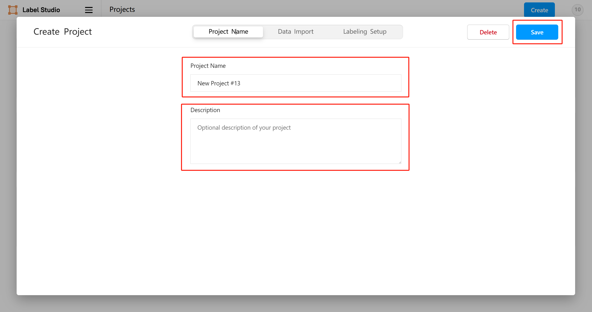
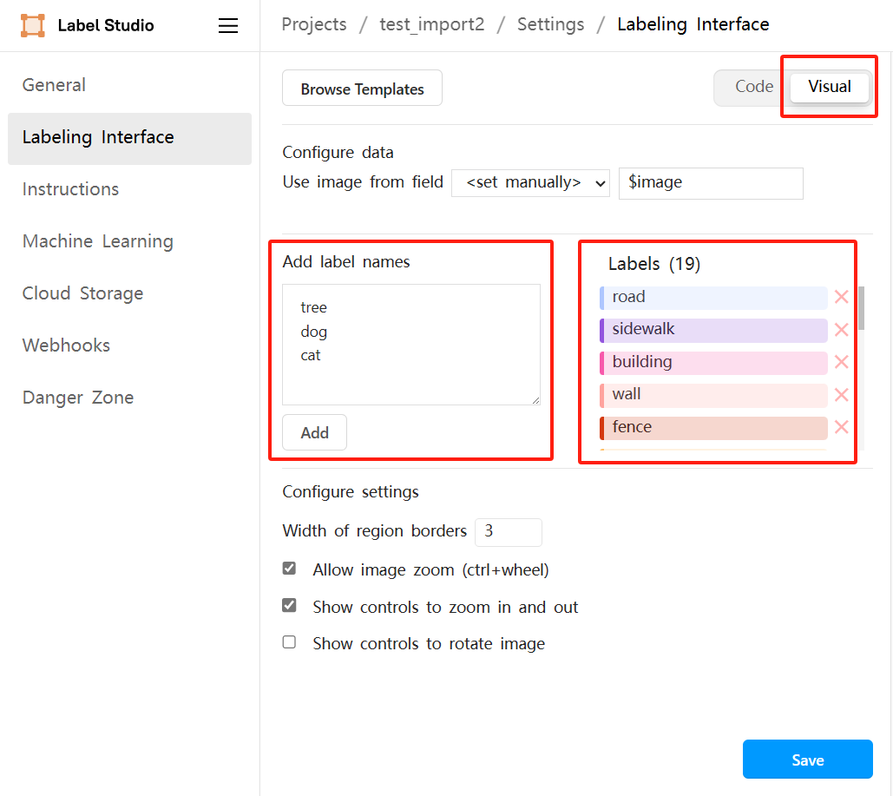
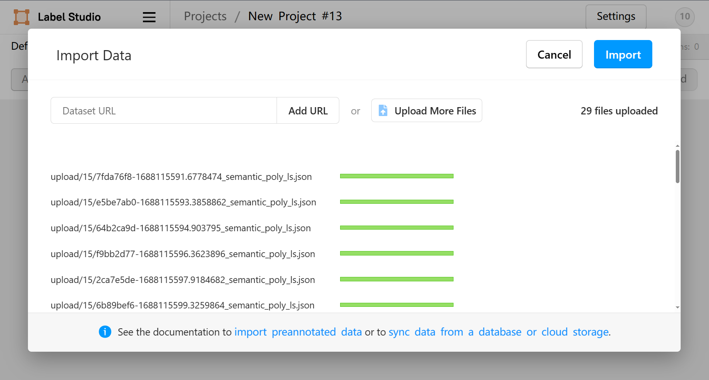
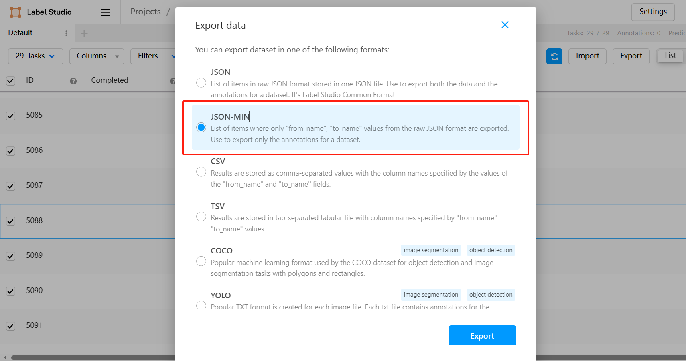

# Overview

This project aims to replicate the Segment Anything Model (SAM), a large model, based on the edge-cloud collaborative AI paradigm provided by KubeEdge's lifelong learning system framework. It attempts to integrate SAM and related algorithms, such as Semantic Segment Anything (SSA), with the Label Studio annotation tool to create an open-domain data annotation system. This system provides model-assisted annotation and allows correction and export of annotated results.

By embedding the SAM-based data annotation system within the lifelong learning framework, users can achieve rapid corner case annotation while retaining previously acquired knowledge. This enables training new models through a continuous process of training, annotation, and improving model performance, facilitating rapid adaptation to new tasks in different scenarios.

- [SAM](https://github.com/facebookresearch/segment-anything) is a powerful model capable of "segmenting anything," but it lacks the ability to generate semantic labels for segmented regions. SSA is an open framework developed by Fudan University that improves upon SAM by enabling the generation of labels for segmented regions.

- [Label Studio](https://labelstud.io) is an open-source data annotation tool that allows users to create custom annotation tasks. It facilitates the training and improvement of AI models through the data annotation process. Label Studio supports various structured data types, including text, images, and audio, making it highly scalable and integrable into existing workflows to accelerate data annotation and enhance annotation quality.

# Step 1：Environment Setup

First, you need to set up SSA:
```
git clone git@github.com:fudan-zvg/Semantic-Segment-Anything.git
cd Semantic-Segment-Anything
conda env create -f environment.yaml
conda activate ssa
python -m spacy download en_core_web_sm
# install segment-anything
cd ..
git clone git@github.com:facebookresearch/segment-anything.git
cd segment-anything; pip install -e .; cd ../Semantic-Segment-Anything
```

Additionally, you need to download the corresponding model files:
```
mkdir ckp && cd ckp
wget https://dl.fbaipublicfiles.com/segment_anything/sam_vit_h_4b8939.pth
cd ..
```

Install Label Studio:
```
pip install label-studio
```
# Step 2：Model-Assisted Annotation
## Preparation

Before feeding data into the model, ensure your dataset is structured as follows:

```
dataset
  ├── raw_data
  │   └── xxxxx.jpg ...
  └── ssa_output
```

Here, `dataset` is the root directory of the dataset, `raw_data` is the subdirectory for raw data, and `ssa_output` is where SSA model inference results will be stored.

For the dataset used in our industrial park test, the results using the original open-vocabulary model of SSA were not satisfactory. Therefore, we decided to use the pre-trained Segformer model on the cityscapes dataset. You can choose based on your specific requirements.

Hence, the categories for model-assisted pre-annotation will be identical to the categories in the cityscapes dataset. Specifically, the ID-label mapping is provided in `config/cityscapes_id2label.json`, as shown below:


```
{  
  "id2label": {  
    "0": "road",  
    "1": "sidewalk",  
    "2": "building",  
    "3": "wall",  
    "4": "fence",  
    "5": "pole",  
    "6": "traffic light",  
    "7": "traffic sign",  
    "8": "vegetation",  
    "9": "terrain",  
    "10": "sky",  
    "11": "person",  
    "12": "rider",  
    "13": "car",  
    "14": "truck",  
    "15": "bus",  
    "16": "train",  
    "17": "motorcycle",  
    "18": "bicycle"  
  }  
}
```

This JSON file is used in the result transformation sections in Step 2 and Step 4. If you need to modify labels, please update this file according to your needs.
## Model Inference

We use the SSA model for automatic annotation of images in the dataset. The results are saved to the specified path. Please follow the dataset structure mentioned in the previous section, and save the results in the ``dataset``/``ssa_output``directory.

1. You can automatically annotate the dataset using the inference script`main_ssa.py` provided by a pre-trained SSA model on a specific dataset:
```
python scripts/main_ssa.py --ckpt_path ./ckp/sam_vit_h_4b8939.pth --save_img --world_size 1 --dataset cityscapes --data_dir /path/to/data_dir --out_dir /path/to/out_dir
```

You only need to modify the following parameters:

- `--world_size` Specifies the number of nodes (i.e., the number of GPUs used).
- `--dataset` Specifies the dataset used for pre-training SSA. It offers three options: 'ade20k,' 'cityscapes,' and 'foggy_driving.' You can choose the one that suits your needs. In this document, 'cityscapes' is used.
- `--data_dir` Specifies the dataset path.
- `--out_dir` Specifies the path to save the results.

2. If you want to use the open-vocabulary SSA model to generate semantic segmentation results, you can use the provided inference script `main_ssa_engine.py` to perform automatic annotation on your dataset.

```
python scripts/main_ssa_engine.py --data_dir=data/<The name of your dataset> --out_dir=output --world_size=1 --save_img --sam --ckpt_path=ckp/sam_vit_h_4b8939.pth
```

The parameters to be modified are the same as those shown in 1., and thus not repeated here.
## Result Transformation

To import SSA model's prediction results into the annotation tool, we provide a conversion script that transforms the`SSA输出JSON`into`Label studio JSON`. The resulting conversion is automatically saved in the `ls_data` subdirectory under the root path of the `dataset`.

Run the following script in the terminal to convert the JSON output from the SSA model into a format supported by Label Studio:
```
python convert_ssa_to_ls.py --dataset_dir /path/to/dataset --config_path /path/to/id2label.json
```

- `--dataset_dir`  parameter specifies the absolute path to the dataset's root directory.
- `--config_path` parameter specifies the path to the configuration file that contains the ID-to-label mappings.

The segmentation label images suitable for training will be saved under the `train_ids` subdirectory within the root path of the `dataset`.
# Step3：Annotation System

## Service Configuration and Launch

Before starting Label Studio, set the following environment variables:

(For Windows systems, make sure to edit the environment variables in `Settings` under `System Properties`.)

```
export LABEL_STUDIO_LOCAL_FILES_SERVING_ENABLED=true
export LABEL_STUDIO_LOCAL_FILES_DOCUMENT_ROOT=/home/user(for windows: C:\\data\\media)
```

The first variable allows Label Studio to access a local directory for importing storage, and the second specifies the root directory Label Studio should use when accessing your local file directory.

You can start the annotation service from the command line:

```
label-studio start
```

Once it's loaded, Label Studio will automatically open in your web browser, or you can access it directly at http://localhost:8080/.

Start by clicking on `Create` in the upper right to create a project. Set the `Project Name` and then click the `Save` button to save the project.


In the project, click on`Settings`in the upper right to access the configuration interface. In`Settings`->`Labeling Interface`->`Code` configure the Label Studio task type and annotation categories.


We provide a template XML file as shown below, located in `config/labeling_interface_template.xml`. Please copy it to the corresponding location and click `Save` to save the configuration.

```
<View>
  <Header value="Select label and click the image to start"/>
  <Image name="image" value="$image" zoom="true" zoomControl="true" rotateControl="false"/>
  <PolygonLabels name="labels" toName="image" Opacity="0.5" strokeWidth="3">    
	  <Label value="road" background="#ADC6FF"/>
	  <Label value="sidewalk" background="#9254DE"/>
	  <Label value="building" background="#F759AB"/>
	  <Label value="wall" background="#FFA39E"/>
	  <Label value="fence" background="#D4380D"/>
	  <Label value="pole" background="#FFC069"/>
	  <Label value="traffic light" background="#AD8B00"/>
	  <Label value="traffic sign" background="#D3F261"/>
	  <Label value="vegetation" background="#389E0D"/>
	  <Label value="terrain" background="#5CDBD3"/>
	  <Label value="sky" background="#096DD9"/>
	  <Label value="person" background="#ADC6FF"/>
	  <Label value="rider" background="#9254DE"/>
	  <Label value="car" background="#F759AB"/>
	  <Label value="truck" background="#FFA39E"/>
	  <Label value="bus" background="#D4380D"/>
	  <Label value="train" background="#FFC069"/>
	  <Label value="motorcycle" background="#AD8B00"/>
	  <Label value="bicycle" background="#D3F261"/>
  </PolygonLabels>
</View>
```

其中`PolygonLabels` refers to labeling with externally enclosing polygons, and through this format, we can conveniently drag the polygon vertices to correct the annotations.

If you wish to modify specific labels, after saving the aforementioned configuration file, switch to the `visual` panel. You can add specific labels in the `Add label names` section or delete existing labels in the `Labels` section.



## Import Pre-Annotations

Click the`import`button, and you can import the pre-annotated JSON file. You can directly select the conversion result file from Step 2 (the file ending in _semantic_poly_ls.json).




click`import`to complete the import.
## Correct Pre-Annotations

After entering a specific image, you can click on a specific mask and drag the white vertices to modify the annotation result.


After making corrections, click `Submit` to submit the current annotation result.
# Step 4：Export and Conversion of Results

To export the annotated tasks, select all the tasks you've annotated, and click `Export` in the upper right corner. Label Studio supports exporting annotated results in various common formats. You can export the data as per your requirements.



If you need to use the annotated results for model training, we provide a conversion script for the `JSON-MIN` format. Please make sure to export the results in this format and save it directly under the `ls_data` subdirectory within the root path of the `dataset`.

Run the following script in the terminal to convert the JSON output from Label Studio into segmentation label images suitable for training:

```
python convert_ls_to_trainid.py --dataset_dir /path/to/dataset --ls_json_name ls_export.json --config_path /path/to/id2label.json
```

- `--dataset_dir` parameter specifies the absolute path to the dataset's root directory.
- `--ls_json_name` parameter specifies the name of the JSON-MIN file exported by Label Studio (adjust according to your actual situation).
- `--config_path` parameter specifies the path to the configuration file that contains the ID-to-label mappings.

The segmentation label images suitable for training will be saved under the `train_ids` subdirectory within the root path of the `dataset`.


Although it may appear all black, it is, in fact, a 16-bit PNG image where each pixel value corresponds to a label ID, a format typically used for training data in semantic segmentation models. The example below shows the pixel value ranges for some images.


Finally, your dataset will be structured as follows:

```
dataset
  ├── raw_data
  │   └── xxxxx.jpg ...
  ├── ssa_output 
  │   └── xxxxx_semantic.json ... │ xxxxx_semantic.png ... 
  ├── ls_data 
  │   ├── xxxxx_semantic_poly_ls.json ...
  │   └── ls_output.json 
  └── train_ids 
      └── xxxxx_TrainIds.png ...
```

This completes the entire annotation process. We have gone through all the steps; please enjoy it. 
Additionally, if you have any questions about using the annotation tool, you can refer to the [Label Studio documentation](https://labelstud.io/guide/)for more useful information not covered in this article.


# Future Work

The current annotation process still relies to some extent on manual intervention and adjustments, and it has not yet achieved fully end-to-end automation. However, we have plans to further optimize it to make it easier to deploy and manage.
