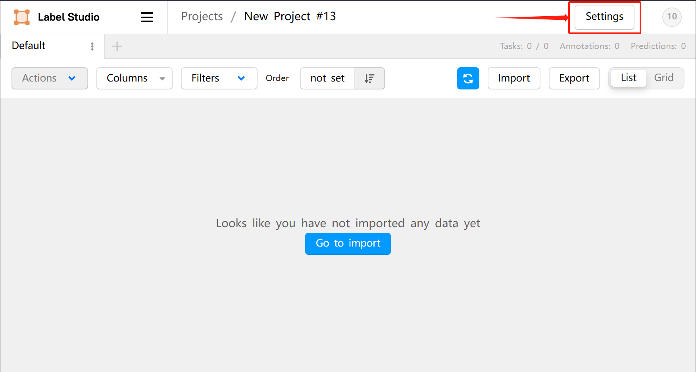
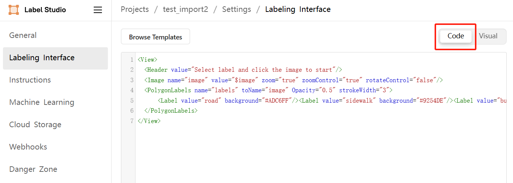
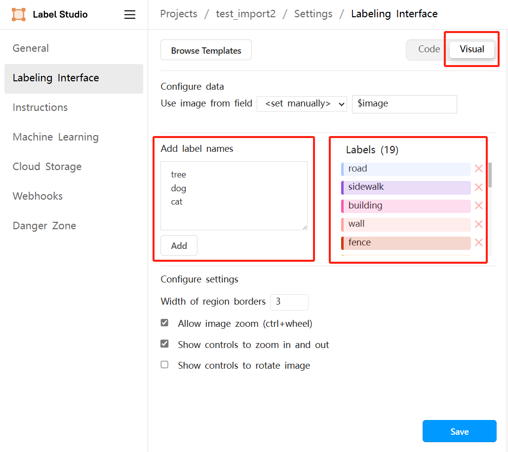
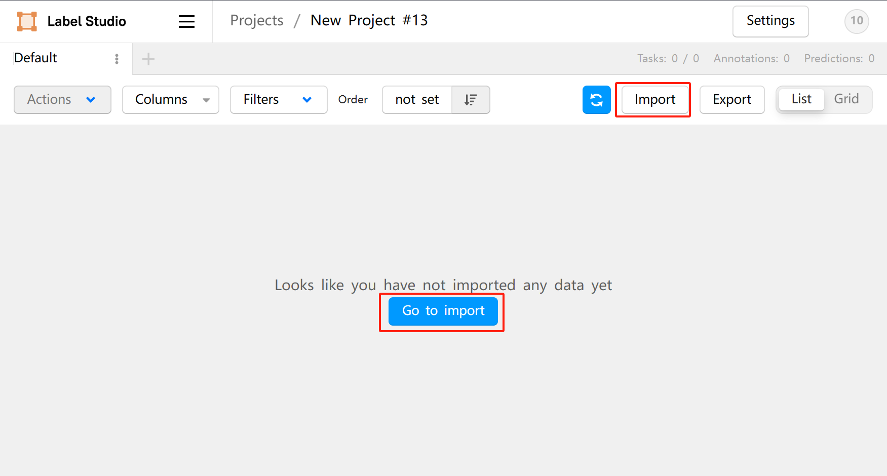
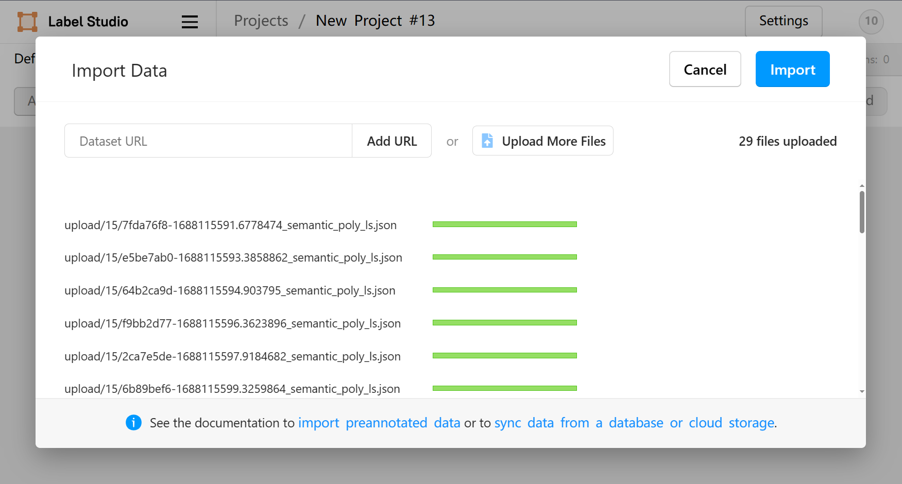
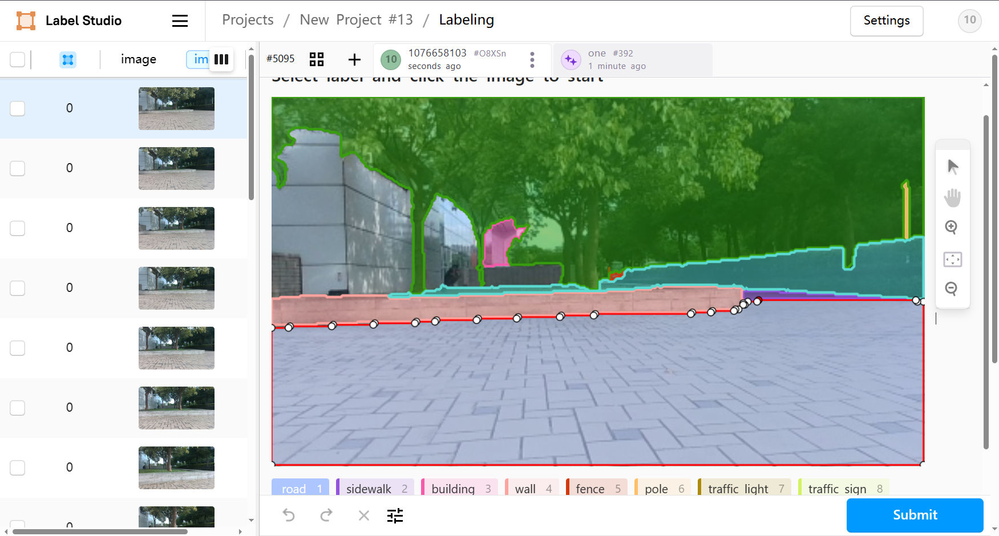
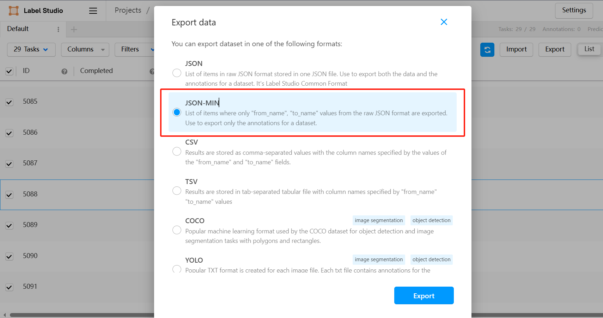
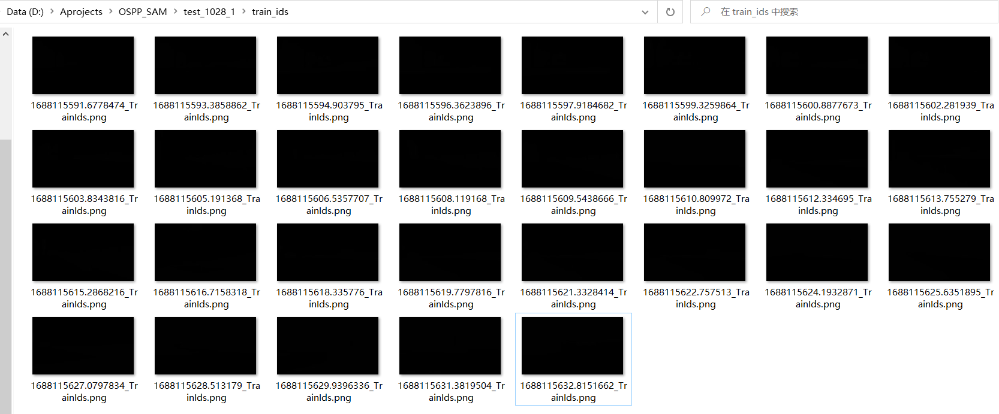
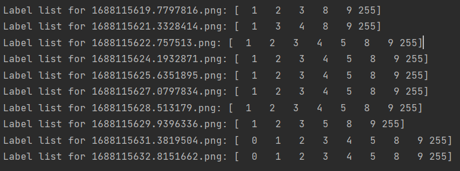

# 概述

该项目旨在基于KubeEdge的边云协同人工智能范式构建的终身学习系统框架复现Segment Anything Model(SAM)这一大模型，尝试将SAM及相关算法Semantic Segment Anything(SSA)与Label-studio标注工具相结合，集成开放域数据标注系统，以实现模型辅助标注功能，并能够对标注结果进行校正和导出。

通过将基于SAM及其算法的辅助数据标注系统嵌入到终身学习框架中，可以帮助用户实现快速corner case标注等，从而在保留旧知识的基础上训练新模型，通过不断的训练-标注-训练的过程提升模型性能，快速适应新场景下的任务。

- [SAM](https://github.com/facebookresearch/segment-anything)是由Met aAI提出的具备"分割一切"能力的模型，但它不具备为分割区域生成语义标签的能力；而[SSA](https://github.com/fudan-zvg/Semantic-Segment-Anything)则是由复旦大学基于SAM改进的语义分割一切模型，拥有为分割区域生成标签的能力。

- [Label Studio](https://labelstud.io)是一个开源的数据标注工具，它允许用户创建自定义标注任务，通过数据标注的过程来训练和改进AI模型。Label Studio支持包括文本、图像、音频在内的多种结构化数据类型，具有高度可扩展性，可集成到现有工作流程中，以加速数据标注和提高标注质量。

# Step 1：环境配置

首先，你需要构建起SSA:
```
git clone git@github.com:fudan-zvg/Semantic-Segment-Anything.git
cd Semantic-Segment-Anything
conda env create -f environment.yaml
conda activate ssa
python -m spacy download en_core_web_sm
# install segment-anything
cd ..
git clone git@github.com:facebookresearch/segment-anything.git
cd segment-anything; pip install -e .; cd ../Semantic-Segment-Anything
```

另外，你需要下载对应的模型文件：
```
mkdir ckp && cd ckp
wget https://dl.fbaipublicfiles.com/segment_anything/sam_vit_h_4b8939.pth
cd ..
```

安装Label-Studio: 
```
pip install label-studio
```
# Step 2：模型辅助标注
## 准备

在数据输入模型之前，请严格按照如下路径层级准备您自己的数据集：

```
dataset
  ├── raw_data
  │   └── xxxxx.jpg ...
  └── ssa_output
```

其中，`dataset`为数据集根目录，子目录`raw_data`为原始数据，`ssa_output`将存放SSA模型的推理结果。

鉴于我们测试的工业园区数据集上，使用 SSA 原始的 open-vocabulary 模型进行预测效果并不理想，因此我们决定采用 SSA 在 cityscapes 数据集上预训练的 segformer 模型。您可以根据您的特定需求进行选择。

故我们使用模型辅助预标注的类别将与cityscapes数据集的类别完全相同。具体而言，ID与标签的对应关系位于`config/cityscapes_id2label.json`中，如下所示：

```
{  
  "id2label": {  
    "0": "road",  
    "1": "sidewalk",  
    "2": "building",  
    "3": "wall",  
    "4": "fence",  
    "5": "pole",  
    "6": "traffic light",  
    "7": "traffic sign",  
    "8": "vegetation",  
    "9": "terrain",  
    "10": "sky",  
    "11": "person",  
    "12": "rider",  
    "13": "car",  
    "14": "truck",  
    "15": "bus",  
    "16": "train",  
    "17": "motorcycle",  
    "18": "bicycle"  
  }  
}
```

在 Step 2 和 Step 4 的结果转换部分中，均需调用此id标签对应关系JSON文件，如若您需要修改标签等，请注意根据实际需求来更改此文件。
## 模型推理

我们使用SSA模型以推理的方式来自动标注数据集中的图片，并将结果保存至指定路径，请按照前一节中所提到的数据集组成形式，将结果保存至``dataset``/``ssa_output``路径。

1. 您可通过在特定数据集上预训练过的SSA模型所提供的推理脚本`main_ssa.py`，来实现数据集的自动标注。
```
python scripts/main_ssa.py --ckpt_path ./ckp/sam_vit_h_4b8939.pth --save_img --world_size 1 --dataset cityscapes --data_dir /path/to/data_dir --out_dir /path/to/out_dir
```

您只需要修改如下参数：

- `--world_size` 参数指定使用节点的数量（即对应GPU的数目）
- `--dataset` 参数指定了SSA在预训练时所使用的数据集，共有'ade20k', 'cityscapes', 'foggy_driving'这三种选项，您可根据实际情况选用，本文所使用的为'cityscapes'
- `--data_dir` 参数指定了数据集路径
- `--out_dir` 参数指定了结果保存的路径

2. 若您想使用open-vocabulary的SSA模型来生成语义分割结果，您可以使用其提供的如下推理脚本`main_ssa_engine.py`来实现数据集的自动标注。

```
python scripts/main_ssa_engine.py --data_dir=data/<The name of your dataset> --out_dir=output --world_size=1 --save_img --sam --ckpt_path=ckp/sam_vit_h_4b8939.pth
```

对应要修改的参数与 1. 中所示相同，这里不再赘述。
## 结果转换

为将SSA模型的预测结果导入标注工具，我们提供了从`SSA输出JSON`到`Label studio JSON`的转换脚本，并将转换结果自动保存在根路径`dataset`的子目录`ls_data`目录下 。

在终端中输入运行如下脚本，即能将SSA模型输出的JSON转为Label Studio 支持导入的JSON格式。

```
python convert_ssa_to_ls.py --dataset_dir /path/to/dataset --config_path /path/to/id2label.json
```

- `--dataset_dir` 参数指定了数据集的根目录路径（需为绝对路径）。
- `--config_path` 参数指定了包含 ID 到标签映射的配置文件的路径。

最终，可供训练的分割标签图将会保存在根路径`dataset`的子目录`train_ids`之下。
# Step3：标注系统

## 服务配置与启动

在启动Label Studio之前，请设置好如下环境变量：
（若为windows系统，请务必在`设置`里的`系统属性`中编辑环境变量）

```
export LABEL_STUDIO_LOCAL_FILES_SERVING_ENABLED=true
export LABEL_STUDIO_LOCAL_FILES_DOCUMENT_ROOT=/home/user(for windows: C:\\data\\media)
```

前者代表允许 Label Studio 访问本地文件目录以导入存储，后者指定 Label Studio 在访问您的本地文件目录时要使用的根目录。

您可以直接在命令行中输入指令来启动标注服务

```
label-studio start
```

加载完毕后将会自动跳转至浏览器页面打开Label-Studio服务（或直接访问 http://localhost:8080/ ）

我们首先点击右上角的`Create`来创建一个项目，设定好`Project Name`后即可点击`Save`按钮保存项目。


进入项目，点击右上角的`Settings`按钮进入配置界面，我们需要在 `Settings`-`Labeling Interface`-`Code` 中配置label-studio的任务类型及标注类别信息。




我们提供了如下所示的模板XML文件，它保存在`config/labeling_interface_template.xml`，请将其复制到对应位置，并点击save保存。

```
<View>
  <Header value="Select label and click the image to start"/>
  <Image name="image" value="$image" zoom="true" zoomControl="true" rotateControl="false"/>
  <PolygonLabels name="labels" toName="image" Opacity="0.5" strokeWidth="3">    
	  <Label value="road" background="#ADC6FF"/>
	  <Label value="sidewalk" background="#9254DE"/>
	  <Label value="building" background="#F759AB"/>
	  <Label value="wall" background="#FFA39E"/>
	  <Label value="fence" background="#D4380D"/>
	  <Label value="pole" background="#FFC069"/>
	  <Label value="traffic light" background="#AD8B00"/>
	  <Label value="traffic sign" background="#D3F261"/>
	  <Label value="vegetation" background="#389E0D"/>
	  <Label value="terrain" background="#5CDBD3"/>
	  <Label value="sky" background="#096DD9"/>
	  <Label value="person" background="#ADC6FF"/>
	  <Label value="rider" background="#9254DE"/>
	  <Label value="car" background="#F759AB"/>
	  <Label value="truck" background="#FFA39E"/>
	  <Label value="bus" background="#D4380D"/>
	  <Label value="train" background="#FFC069"/>
	  <Label value="motorcycle" background="#AD8B00"/>
	  <Label value="bicycle" background="#D3F261"/>
  </PolygonLabels>
</View>
```

其中`PolygonLabels` 指外接多边形标注，通过此格式我们可以方便地拖动多边形顶点来修正标注。

如若想要修改具体标签，请在保存好上述配置文件后，切换到`visual`面板。您可以在`Add labels names`栏目中添加具体标签，也可以在`Labels`中删除已有的标签。




## 导入预标注

点击`import`按钮，我们能够导入预批注的JSON文件，我们可以直接选择 Step 2 中的转换结果文件（文件以_semantic_poly_ls.json结尾）。




点击`import`即可完成导入。
## 修正预标注

点击进入具体的图片后，我们可以点击具体的mask，拖动白色顶点修改标注结果



完成修正后即可点击`Submit`提交当前标注结果
# Step 4：结果导出与转换

选中标注完的所有Tasks，可在右上角点击`Export`来导出标注结果。Label Studio支持将标注结果导出为多种常见格式，您可按照您的需求来导出数据。



如果您需要将标注结果用于模型训练，我们提供了针对`JSON-MIN格式`的转换脚本，请您务必导出此格式的标注结果，并将其直接保存在根路径`dataset`的子目录`ls_data`目录下 。

在终端中输入运行如下脚本，即能将label studio输出的JSON转为可供训练的分割标签图。

```
python convert_ls_to_trainid.py --dataset_dir /path/to/dataset --ls_json_name ls_export.json --config_path /path/to/id2label.json
```

- `--dataset_dir` 参数指定了数据集的根目录路径（需为绝对路径）
- `--ls_json_name` 参数指定了 Label Studio 导出的JSON-MIN文件的名称（请根据实际情况调整）。
- `--config_path` 参数指定了包含 ID 到标签映射的配置文件的路径。

最终，可供训练的分割标签图将会保存在根路径`dataset`的子目录`train_ids`之下。



虽然看上去似乎是全黑的，但实际上它是一张16位PNG图片，其中每个像素值都对应标签ID值，这种格式通常用于语义分割模型的训练数据。下图示例显示了部分图片对应的像素值范围。



最后，整体而言你的数据集将会呈现如下形式：

```
dataset
  ├── raw_data
  │   └── xxxxx.jpg ...
  ├── ssa_output 
  │   └── xxxxx_semantic.json ... │ xxxxx_semantic.png ... 
  ├── ls_data 
  │   ├── xxxxx_semantic_poly_ls.json ...
  │   └── ls_output.json 
  └── train_ids 
      └── xxxxx_TrainIds.png ...
```

至此即为完整的标注流程，我们完成了所有步骤，请享受它。
此外，如您对标注工具的使用存在疑问，您可以通过 [Label Studio 文档](https://labelstud.io/guide/)来获取本文中没有提到的更多有用信息。

# 未来工作

目前的标注流程在一定程度上还是依赖于人工干预和调整，暂未实现完全端到端的自动化。然而，我们已经计划在这个基础上进行进一步的优化，从而使其更易于部署和管理。
