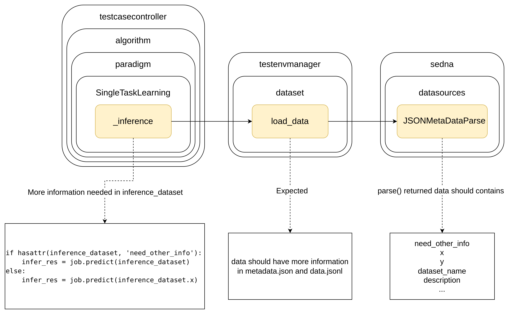

<<<<<<< HEAD
# Smart_coding BenchMark

## Introduction

This is the work for Domain-specific Large Model Benchmark:

Build a test suite for code large models, including test datasets, evaluation metrics, test environments, and usage guidelines.

The benchmark consists of two parts: comment data and issue data.

## Design

### Metadata Format

| Name | Field Name | Option | Description |
| --- | --- | --- | --- |
| Data Name | dataset |  Required | Name of the dataset |
| Data Description | description | Optional | Dataset description, such as usage scope, sample size, etc. |
| First-level Dimension | level_1_dim | Required | Should fill in "Single Modal" or "Multi-Modal" |
| Second-level Dimension | level_2_dim | Required | For "Single Modal", fill in "Text", "Image", or "Audio". For "Multi-Modal", fill in "Text-Image", "Text-Audio", "Image-Audio", or "Text-Image-Audio" |
| Third-level Dimension | level_3_dim | Optional | Should be filled if all samples in the dataset have the same third-level dimension. If filled, content should be based on the standards shown in the normative reference document |
| Fourth-level Dimension | level_4_dim | Optional | Should be filled if all samples in the dataset have the same third-level dimension. If filled, content should be based on the standards shown in the normative reference document |

metadata example:

```json
{
    "dataset": "Code_comment BenchMark",
    "description": "xxx",
    "level_1_dim": "single-modal",
    "level_2_dim": "text",
    "level_3_dim": "Q&A",
    "level_4_dim": "code_comment"
}
```

### Data format:

| name         |Option|information|
|--------------|---|---|
| prompt       |Optional|the background of the LLM testing|
| query        |Required|the testing question|
| response     |Required|the answer of the question|
| explanation  |Optional|the explanation of the answer|
| judge_prompt |Optional|the prompt of the judge model|
| level_1_dim  |Optional|single-modal or multi-modal|
| level_2_dim  |Optional|single-modal: text, image, video; multi-modal: text-image, text-video, text-image-video|
| level_3_dim  |Required|details|
| level_4_dim  |Required|details|

data example:

```json
{
    "prompt": "Please think step by step and answer the question.",
    "query": "Question：Here is a code function \"result = self.__custom_confs_rx.search(variable)\". Please comment this code or function.",
    "response": "Use regular expressions to match variable names to determine whether they match a specific configuration item format.",
    "judge_prompt": "xxx",
    "level_1_dim": "single-modal",
    "level_2_dim": "text",
    "level_3_dim": "knowledge Q&A",
    "level_4_dim": "code_comment"
}
```


## Change to Core Code



## Prepare Datasets

You can download dataset in 

```
dataset/smart_code
├── comments
│   ├── test_data
│   │   ├── data.jsonl
│   │   └── metadata.json
│   └── train_data
└── issue
    ├── test_data
    │   ├── data_full.jsonl
    │   ├── data.jsonl
    │   └── metadata.json
    └── train_data
```
Because the ianvs use itself does not require training, data.json in train_data here is a null value file

Therefore, do not add data to data.json in the train_data directory

**If you want to train ianvs or add data to the data.json file of the training dataset, please make the following changes**

Open corresponding file `examples/government/singletask_learning_bench/subjective/testenv/testenv.yaml`

Change `train_data` to `train_data_info` and its url to the corresponding `metadata.json` path


## Prepare Environment

You should change your sedna package like this: [sedna repo commit](https://github.com/IcyFeather233/sedna/commit/e13b82363c03dc771fca4922a24798554ca32a9f)

Or you can replace the file in `yourpath/anaconda3/envs/ianvs/lib/python3.x/site-packages/sedna` with `examples/resources/sedna-llm.zip`

## Run Ianvs

### Comment

`ianvs -f examples/smart_coding/smart_coding_learning_bench/comment/benchmarkingjob.yaml`

### Issue

`ianvs -f examples/smart_coding/smart_coding_learning_bench/issue/benchmarkingjob.yaml`
=======
version https://git-lfs.github.com/spec/v1
oid sha256:085160bf8055a0dd97f88a9529730633b69c28b111c7cdb2f7b28411710a4c41
size 4157
>>>>>>> 9676c3e (ya toh aar ya toh par)
