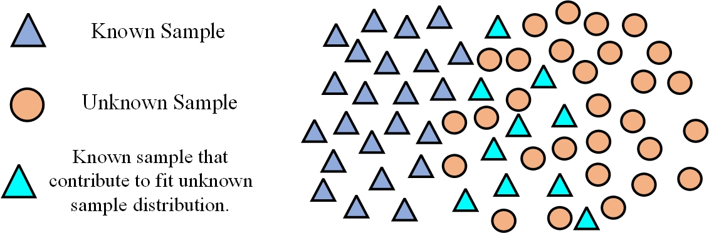
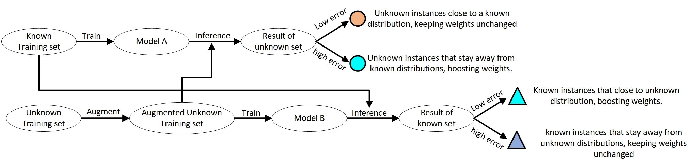
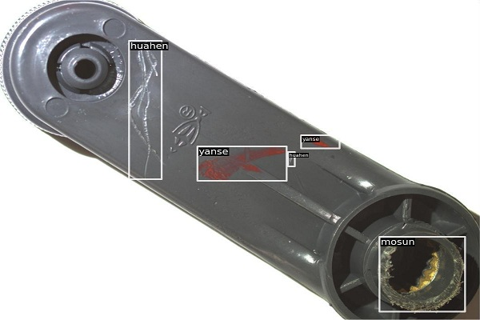

## About Industrial Defect Detection

Defects are an unwanted thing in manufacturing industry. There are many types of defect in manufacturing like blow
holes, pinholes, burr, shrinkage defects, mould material defects, pouring metal defects, metallurgical defects, etc. For
removing this defective product all industry have their defect detection department. But the main problem is this
inspection process is carried out manually. It is a very time-consuming process and due to human accuracy, this is not
100% accurate. This can because of the rejection of the whole order. So it creates a big loss in the company.

## About Method

Unknown tasks refer to samples outside the knowledge distribution of the task model, which can lead to severe performance degradation of a model. The instance-based method aims to identify the known training samples that contribute to fitting the unknown data distribution, and then boosting their weight in training, as shown in the below figures. It is a model-agnostic method since it manipulates the training data rather than changing the model architecture, holding considerable generality.



In this project, we present an instance-weighting method for defect detection based on active learning, significantly improving a detector's performance on unknown data. The workflow of the method is shown in the flowchart below



## About dataset

The industrial crank defect detection dataset consists of 627 images, which hold three types of defects: 'yanse', '
huahen', and 'mosun', and the image resolution is 4024 × 3036. Please follow  [this link](https://baidu.com) to download
the dataset and learn more about it. Additionally, below is an example figure from the dataset.



### Dataset splitting for unknown task processing

After unzipping dataset.zip, your folder format should look like below:

```
dataset
   ├─images
   └─jsons
       ├─known_train.json
       ├─NG_labeled.json
       └─NG_test.json
```

All images of this dataset are placed in the ```images``` folder, and the dataset splitting is based on JSON files
in ```jsons``` folder. In this project, we define an image defect detection Precision or Recall less than 0.9 as unknown
data. Unknown training set means unknown data that can be used for training.

## Install
First, you need to install the dependencies of Ianvs and Sedna, please follow the instructions
in [How to install Ianvs](https://github.com/kubeedge/ianvs/blob/main/docs/guides/how-to-install-ianvs.md). We are using
the MMDetection object detection framework in this project, which requires some essential dependencies to be installed. You
can install them manually one by one or use the ```pip install -r requirements.txt``` command directly in the terminal.
To avoid unpredictable errors, we strongly recommend creating a new Conda virtual environment before installing these
dependencies.

```
python==3.9.0
mmcv-full==1.7.1
mmdet==2.28.2
torch==1.13.0
torchvision==0.14.0
numpy==1.24.2
opencv_python==4.5.5.64
Pillow==9.4.0
```

## Config Setting

Key settings to run instance-weighting method for unknown task processing of defect detection.

### Testenv Setting

Configure the  ```known_dataset_url```, ```unknown_dataset_url```, ```image_folder_url```, and ```metrics```  properties
in ```testenv.yaml``` based on the location of your dataset folder like the below code block.

```
testenv:
  # dataset configuration
  dataset:
    train_url: "dataset/jsons/known_train.json"
    val_url: "dataset/jsons/known_train.json"
    test_url: "dataset/jsons/NG_test.json"
    known_dataset_url: "dataset/jsons/known_train.json"
    unknown_dataset_url: "dataset/jsons/NG_labeled.json"
    image_folder_url: "dataset/images"
 type;
  metrics:
    # metric name; string type;
    - name: "map"
      url: "examples/yaoba/singletask_learning_boost/testenv/map.py"
```

### Algorithm Setting

Configure the  `basemodel url`, `config url`, `resource_dir` and `work_dir url`  properties in `algorithm.yaml` based on the location of your project path like the below code block.

```
algorithm:
  initial_model_url: ""
  modules:
    - type: "basemodel"
      name: "FPN_ac_boost"
      url: "examples/yaoba/singletask_learning_boost/testalgorithms/basemodel.py"
      hyperparameters:
        - config:
            values:
              - "examples/yaoba/singletask_learning_boost/resource/FPN_model_config.py"
        - work_dir:
            values:
              - "examples/yaoba/singletask_learning_boost/work_dir"
         - resource_dir:
            values:
              - "examples/yaoba/singletask_learning_boost/resource"
```
### benchmarking Setting

Configure the  `basemodel url`, `config url`, `resource_dir` and `work_dir url`  properties in `benchmarkingjob.yaml` based on the location of your project path like the below code block.
```
  name: "benchmarkingjob"
  workspace: "examples/yaoba/singletask_learning_boost/workspace"
  testenv: "examples/yaoba/singletask_learning_boost/testenv/testenv.yaml"
  test_object:
    type: "algorithms"
    algorithms:
      - name: "mmlab-model"
        url: "examples/yaoba/singletask_learning_boost/testalgorithms/algorithm.yaml"
```

## Usage

We are now ready to run the instance-weighting method for unknown task processing on the industrial crank defect
detection dataset. execute the below command in your terminal:

```
python benchmarking.py -f examples/yaoba/singletask_learning_boost/benchmarkingjob.yaml
```

## Result

We present the reference results of mean average precision on unknown task test sets with and without the
instance-weighting method. It is worth noting that, even with a fixed random seed, the results may fluctuate each time
the program runs

|     Model     |  Method  | bs  |  lr  | AP50  | AP75  |
|:-------------:|:--------:|:---:|:----:|:-----:|-------|
| ResNet-50-FPN | baseline |  8  | 0.01 | 69.79 | 41.02 |
| ResNet-50-FPN | ac_boost |  8  | 0.01 | 71.79 | 41.99 |

## Endnote

In this project, we set the training batch size to 8 by default, which can result in GPU memory overflow. Users can
change this by adjusting the 'samples_per_gpu' parameter in both the 'base_config.py' and the "FPN_model_config.py"
files.

## License

MIT © Richard McRichface