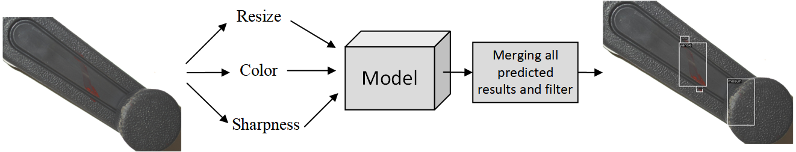
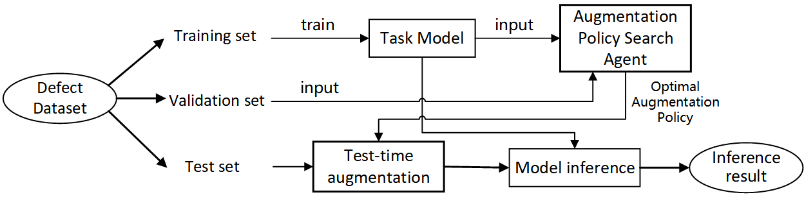
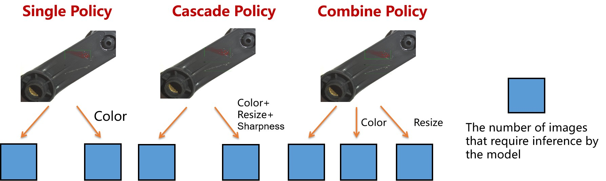
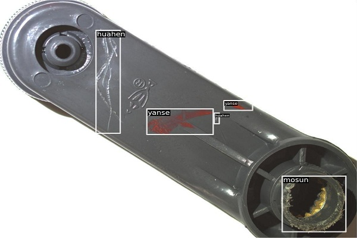

## About Industrial Defect Detection

Defects are an unwanted thing in manufacturing industry. There are many types of defect in manufacturing like blow
holes, pinholes, burr, shrinkage defects, mould material defects, pouring metal defects, metallurgical defects, etc. For
removing this defective product all industry have their defect detection department. But the main problem is this
inspection process is carried out manually. It is a very time-consuming process and due to human accuracy, this is not
100% accurate. This can because of the rejection of the whole order. So it creates a big loss in the company.

## About Method

Unknown tasks refer to samples outside the knowledge distribution of the task model, which can lead to severe performance degradation of a model. The TTA (Test-time Augmentation) method applies various augmentations to an image during the inference stage, generates multiple augmented images, and infers them alongside the original image. It then combines the inference results of all images to obtain improved performance compared to only inferring on the original image, as shown in below figure.



In this project, we present a policy search-based test-time augmentation method for unknown defect detection tasks. It first searches for the optimal augmentation policy on the validation set, and then applies these policies to improve the performance of unknown defect detection tasks during inference of the test set, as shown in below figure.



Three test-time augmentation schemes: single policy, cascade policy, and combined policy are proposed in this method. Their differences among them are shown in the following figure.



## About dataset

The industrial crank defect detection dataset consists of 627 images, which hold three types of defects: 'yanse', '
huahen', and 'mosun', and the image resolution is 4024 × 3036. Please follow  [this link](https://baidu.com) to download
the dataset and learn more about it. Additionally, below is an example figure from the dataset.



## Dataset splitting for unknown task processing
After unzipping dataset.zip, your folder format should look like below:

```
dataset
   ├─images
   └─jsons
        ├─test.json
        ├─train.json
        └─val.json
```

All images of this dataset are placed in the ```images``` folder, and the dataset splitting is based on JSON files
in ```jsons``` folder. In this project, we define an image defect detection Precision or Recall less than 0.9 as unknown
data. Unknown training set means unknown data that can be used for training.

## Install

First, you need to install the dependencies of Ianvs and Sedna, please follow the instructions
in [How to install Ianvs](https://github.com/kubeedge/ianvs/blob/main/docs/guides/how-to-install-ianvs.md). We are using
the MMDet object detection framework in this project, which requires some essential dependencies to be installed. You
can install them manually one by one or use the ```pip install -r requirements.txt``` command directly in the terminal.
To avoid unpredictable errors, we strongly recommend creating a new Conda virtual environment before installing these
dependencies.

```
python==3.9.0
mmcv-full==1.7.1
mmdet==2.28.2
torch==1.13.0
torchvision==0.14.0
numpy==1.24.2
opencv_python==4.5.5.64
Pillow==9.4.0
```

## Config Setting

Key settings to run policy search-based test-time augmentation method for unknown task processing of defect detection.

### Testenv Setting

Configure the  `train_url`, `val_url`, `test_url`, `image_folder_url`, and `metrics`  properties in `testenv.yaml` based on the location of
your dataset folder path like the below code block.

```
testenv:
  dataset:
    train_url: "datset/jsons/train.json"
    val_url: "datset/jsons/val.json"
    test_url: "datset/jsons/test.json"
    image_folder_url: "/media/huawei_YaoBa/Images"
 type;
  metrics:
    - name: "map"
      url: "examples/yaoba/singletask_learning_yolox_tta/testenv/map.py"
```

### Algorithm Setting

Configure the  `paradigm_type`, `initial_model_url`, `basemodel`, `config`, and `work_dir`  properties
in `algorithm.yaml` based on the location of your project path like the below code block.

```
algorithm:
  paradigm_type: "singletasklearning_tta"
  initial_model_url: "examples/yaoba/singletask_learning_yolox_tta/resource/epoch_300.pth"
  modules:
    - type: "basemodel"
      name: "mmlab"
      url: "examples/yaoba/singletask_learning_yolox_tta/testalgorithms/basemodel.py"
      hyperparameters:
        - config:
            values:
              - "examples/yaoba/singletask_learning_yolox_tta/resource/yolox_s_8x8_300e_yaoba.py"
        - work_dir:
            values:
              - "examples/yaoba/singletask_learning_yolox_tta/work_dir"
```

### Benchmarking Setting

Configure the  `workspace`, `testenv`, and `algorithms` properties in `benchmarkingjob.yaml` based on the location of
your project path like the below code block.

```
benchmarkingjob:
  name: "benchmarkingjob"
  workspace: "examples/yaoba/singletask_learning_yolox_tta/workspace"
  testenv: "examples/yaoba/singletask_learning_yolox_tta/testenv/testenv.yaml"
  test_object:
    type: "algorithms"
    algorithms:
      - name: "mmlab-model"
        url: "examples/yaoba/singletask_learning_yolox_tta/testalgorithms/algorithm.yaml"
```

## Usage

We are now ready to run the policy search-based test-time augmentation method for unknown task processing on the
industrial crank defect detection dataset. execute the below command in your terminal:

```
python benchmarking.py -f examples/yaoba/singletask_learning_yolox_tta/benchmarkingjob.yaml
```

## Result

We present reference results of mean Average Precision (mAP) on the test sets of unknown defect detection tasks for
policy search-based test-time augmentation method. Compared to the standard baseline, the maximum improvement achieved
by the top 5 single policies searched by this method is 2.2 mAP.

|    Model    |  Method  | Single policy | Val set AP50 | Test set AP50 |
|:-----------:|:--------:|:-------------:|:------------:|:-------------:|
| YOLOXs-300e | Baseline |     None      |     69.3     |     69.7      |
| YOLOXs-300e |   TTA    |    Resize     |    73.29     |     71.9      |
| YOLOXs-300e |   TTA    |     Flip      |    72.14     |     71.4      |
| YOLOXs-300e |   TTA    | AutoContrast  |    70.57     |     69.4      |
| YOLOXs-300e |   TTA    |   Sharpness   |    69.83     |     68.7      |
| YOLOXs-300e |   TTA    |  Brightness   |    69.51     |     69.7      |

Compared to the standard baseline, the maximum improvement achieved by the top 5 Cascade policies searched by this
method is 2.5 mAP.

|    Model    |  Method  |      Cascade policy      | Val set AP50 | Test set AP50 |
|:-----------:|:--------:|:------------------------:|:------------:|:-------------:|
| YOLOXs-300e | Baseline |           None           |     69.3     |     69.7      |
| YOLOXs-300e |   TTA    | Flip+AutoContrast+Resize |    73.68     |     70.7      |
| YOLOXs-300e |   TTA    | AutoContrast+Flip+Resize |    73.68     |     70.7      |
| YOLOXs-300e |   TTA    | AutoContrast+Resize+Flip |    73.64     |     70.1      |
| YOLOXs-300e |   TTA    |       Flip+Resize        |    73.6      |     70.8      |
| YOLOXs-300e |   TTA    |     Sharpness+Resize     |    73.58     |     72.2      |

## License

MIT © Richard McRichface_