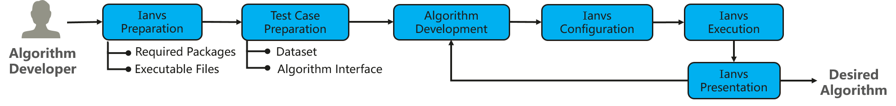
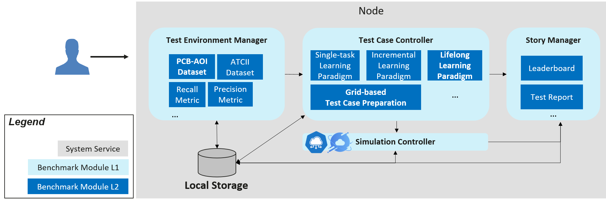

# Distributed Synergy AI Benchmarking
Edge computing emerges as a promising technical framework to overcome the challenges in cloud computing. In this AI era, AI applications are the most critical types of application on the edge. Driven by the increasing computation power of edge devices and the increasing amount of data generated from the edge, Edge-cloud synergy AI and distributed synergy AI techniques has received more and more attention for the sake of device, edge and cloud intelligence enhancement. 

Nevertheless, distributed synergy AI is at its initial stage. For the time being, the comprehensive evaluation standard is not yet available for scenarios with system with various AI paradigms on all three layers of edge computing. That limits the wide application of related techniques and hindering a prosperous ecosystem on distributed synergy AI. A comprehensive end-to-end distributed synergy AI benchmark suite is thus needed to measure and optimize the systems and applications.

## Motivation
### Goals
The distributed synergy AI benchmarking toolkits Ianvs aims to test the performance of distributed synergy AI solutions following recongized standards, in order to facilitate more efficient and effective development. Its scope includes:
- Provide end-to-end benchmarks across devices, edge nodes and cloud nodes based on typical distributed synergy AI paradigms and applications. 
    - Tools for Test Environment Management. For example, it would be neccessary to support the CRUD (Create, Read, Update and Delete) actions on test environments. Elements of such test environments include algorithm-wise and system-wise configuration 
    - Tools for Test-case Preparation. Typical examples include paradigm templates, simulation tools and hyper-parameter based preparation tools.
    - Tools for Benchmark Presentation, e.g., leaderboard and test report generation.  
- Establish comprehensive benchmarks and developed related applications via cooperation with other communities, which can include but not limitted to 
    - Dataset collection, re-organization and publication
    - Formalized Specifications, e.g., Standards 
    - Holding Competitions or
    - Maintaining Solution Leaderboards or Certification for commercial usage 

## Proposal

### User flow
The user flow for algorithm developer is as follows. 
1. Prepare Ianvs Executable File
1. Integrate 

### Architecture
The architectures and related concepts are shown in the below figure. Critical components include
- Test Environment Management: the CRUD of test environments serving for global usage
- Test Case Controller: control the runtime behavior of test cases like instance generization and vanish 
- Test Case Preparation: test case generization based on certain rules or constraints, e.g., the range of parameters 
- Story Management: the output management and presentation of test case, e.g., leaderboards
- Simulation Controller: control the simulation process of edge-cloud synergy AI, including the instance generization and vanish of simulation containers

### Detailed Modules and Instances

Quite a few terms exist in ianvs, which include the detialed modules and instances. To facilitate easier concept understanding,  

Benchmarking Job: job instance for individual benchmarking, which includes the components of ianvs

### Design Details of Modules

The proposal includes Test Environment Management, Test-case Preparation and Benchmark Presentation in the Distributed Synergy AI benchmarking toolkits, where
1. Test Environment Management supports the CRUD of Test environments, which include
    - Algorithm-wise configuration
        - Public datasets
        - Pre-processing algorithms
        - Feature enginneering algorithms
        - Post-processing algorithms like metric computation
    - System-wise configuration
        - Overall architeture
        - System constraint or budgets
            - End-to-end cross-node 
            - Per node
1. Test-case Preparation which include
    - Templates of common distributed synergy AI paradigms, which can help developer to prepare their test case without too much effort. Such paradigms include edge-cloud synergy joint inference, incremental learning, federated learning and lifelong learning. 
    - Simulation tools. Develop simulated test environments for test cases
    - Other test-case preparation tools. For instance, prepare test cases based on a given range of hyper-parameters. 
1. Benchmark Presentation which includes
    - Leaderboard generation
    - Test report generation

